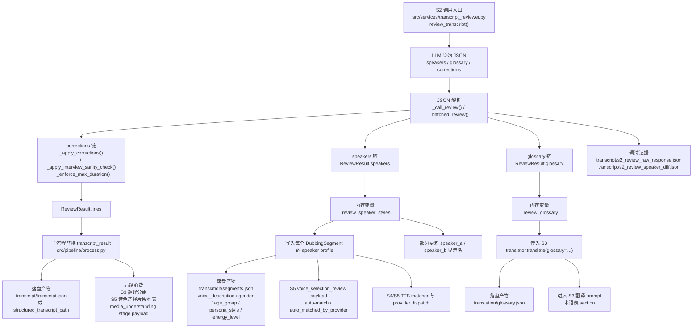
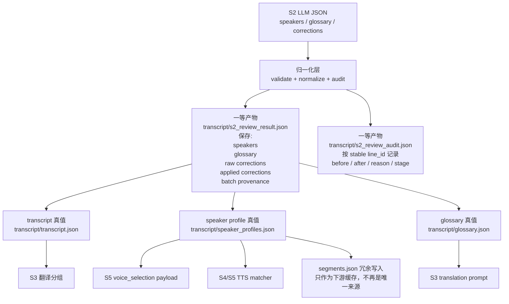

# S2 数据链与优化图

> 日期：2026-04-08
> 状态：现状梳理
> 目标：把 S2 阶段“大模型输出 JSON”到后续流程消费的真实数据链按文件和产物梳理清楚，便于后续做链路收口与优化

---

## 1. 范围

这份文档只讨论 S2 统一审校链路里，大模型返回 JSON 后发生的事情：

1. 返回了哪些字段
2. 代码如何处理这些字段
3. 生成了哪些中间数据和落盘产物
4. 后续哪些阶段在消费这些数据
5. 当前链路的主要断点在哪里
6. 最小化优化应从哪里下手

不在本文范围内：

- S2 prompt 本身的优劣比较
- TTS provider 定价
- 前端 review UI 设计
- V3 credits / gateway 迁移链路

---

## 2. S2 输出的真实结构

当前 S2 大模型返回的 JSON 在代码里只被当作 3 类顶层数据使用：

```json
{
  "speakers": {},
  "glossary": {},
  "corrections": []
}
```

解析发生在：

- `src/services/transcript_reviewer.py`
- `_call_review()`
- `_call_review_mimo_omni()`

代码位置：

- `src/services/transcript_reviewer.py:649`
- `src/services/transcript_reviewer.py:761`
- `src/services/transcript_reviewer.py:783`
- `src/services/transcript_reviewer.py:834`

最终返回给主流程的是：

- `ReviewResult.speakers`
- `ReviewResult.glossary`
- `ReviewResult.corrections_applied`
- `ReviewResult.lines`
- `ReviewResult.debug_artifacts`

定义在：

- `src/services/transcript_reviewer.py:230`

---

## 3. 总览图



---

## 4. 详细链路

### 4.1 `corrections` 链

`corrections` 是当前最直接影响后续流程真值的一条链。

主入口：

- `src/services/transcript_reviewer.py:1011`

支持 4 类 action：

1. `correct_speaker`
2. `merge`
3. `split`
4. `fix_text`

对应代码：

- `src/services/transcript_reviewer.py:1031`
- `src/services/transcript_reviewer.py:1052`
- `src/services/transcript_reviewer.py:1113`
- `src/services/transcript_reviewer.py:1162`

处理顺序：

1. 先应用 `_apply_corrections()`
2. 再应用 `_apply_interview_sanity_check()`
3. 最后做 `_enforce_max_duration()`
4. 重建 index

对应代码：

- `src/services/transcript_reviewer.py:590`
- `src/services/transcript_reviewer.py:600`
- `src/services/transcript_reviewer.py:604`
- `src/services/transcript_reviewer.py:608`

最终效果：

- 生成 `ReviewResult.lines`
- 在主流程里替换 `transcript_result`
- 落盘写回 transcript 真值

对应消费点：

- `src/pipeline/process.py:747`
- `src/pipeline/process.py:792`
- `src/pipeline/process.py:3218`

后续影响：

1. S3 翻译分组直接基于修正后的 transcript
2. S5 音色选择页每个 speaker 的片段列表直接基于修正后的 transcript
3. media_understanding stage payload 统计 speaker_ids 时也以修正后的 transcript 为准

---

### 4.2 `glossary` 链

`glossary` 不改 transcript，也不改 speaker，但会直接影响 S3 翻译 prompt。

主流程接收点：

- `src/pipeline/process.py:802`

使用方式：

1. 暂存到 `_review_glossary`
2. 传入 `GeminiTranslator.translate(glossary=...)`
3. 写入 `translation/glossary.json`
4. 拼入 S3 prompt 的 glossary section

对应代码：

- `src/pipeline/process.py:1025`
- `src/services/gemini/translator.py:227`
- `src/services/gemini/translator.py:261`
- `src/services/gemini/translator.py:821`

结论：

- `glossary` 当前主要是 S3 翻译约束数据
- 它不是独立的 S2 一等产物
- 在 S3 之前，它只是主流程里的内存变量

---

### 4.3 `speakers` 链

`speakers` 当前承担了两种不同职责：

1. 说话人姓名 / 身份信息
2. 配音与选音相关的 speaker profile 信息

#### A. 姓名与显示名

主流程只会在特定条件下，把 `speaker_a / speaker_b` 的 placeholder 名替换掉：

- `src/pipeline/process.py:766`

这意味着：

- `speaker_c+` 虽然 S2 可以返回，但主流程并没有对“所有 speaker 的姓名 map”做同等保存和传播

#### B. Speaker Profile

S2 的 `review_result.speakers` 会被整体暂存到：

- `_review_speaker_styles`
- `src/pipeline/process.py:803`

之后通过：

- `_apply_review_speaker_styles_to_segments()`
- `src/pipeline/process.py:2042`

写进每个 `DubbingSegment`，字段包括：

1. `voice_description`
2. `gender`
3. `age_group`
4. `persona_style`
5. `energy_level`

字段定义在：

- `src/services/gemini/translator.py:136`
- `src/services/gemini/translator.py:155`
- `src/services/gemini/translator.py:162`

这些 profile 字段后续会影响：

1. S5 `voice_selection_review` payload 里的 auto-match
   - `src/pipeline/process.py:1722`
2. `translation/segments.json` 的落盘内容
   - `src/pipeline/process.py:3243`
3. TTS matcher 和 provider dispatch
   - `src/services/tts/tts_generator.py:712`
   - `src/services/tts/tts_generator.py:733`

结论：

- `speakers` 不只是展示数据
- 它已经在驱动后续选音和 TTS 匹配逻辑

---

## 5. 当前真正落盘的产物

### 5.1 S2 / transcript 侧

当前能稳定落盘的产物：

1. `transcript/transcript.json` 或 `structured_transcript_path`
2. `transcript/s2_review_raw_response.json`
3. `transcript/s2_review_speaker_diff.json`

对应代码：

- `src/pipeline/process.py:3218`
- `src/services/transcript_reviewer.py:276`

### 5.2 S3 / translation 侧

后续由 S2 数据间接带出的产物：

1. `translation/glossary.json`
2. `translation/segments.json`

对应代码：

- `src/services/gemini/translator.py:261`
- `src/pipeline/process.py:3243`

### 5.3 当前没有成为一等产物的内容

以下内容现在没有在 S2 结束时直接落成稳定产物：

1. 归一化后的 `speakers`
2. 归一化后的 `glossary`
3. 原始 `corrections`
4. 校验后的 `applied corrections audit`

这些内容大多只是：

- 在 `ReviewResult` 里短暂存在
- 然后进入 `_review_glossary` / `_review_speaker_styles`
- 再通过后续阶段间接写入别的文件

---

## 6. 当前链路的主要断点

### 6.1 `glossary` / `speakers` 不是 S2 一等产物

问题：

- S2 输出了 `glossary` 和 `speakers`
- 但 S2 结束时没有立即把它们写成稳定、可审计的结构化文件
- 它们先存在主流程内存变量里，再被下游阶段消费

风险：

1. 缓存恢复时信息链容易断
2. 审计时很难直接回答“当时 S2 认定的 speaker profile / glossary 到底是什么”
3. 如果中间阶段失败或跳转，排查成本高

### 6.2 修正日志不是稳定 audit

当前 S2 打印修正日志用的是：

- `for orig, rev in zip(transcript_result.lines, review_result.lines)`
- `src/pipeline/process.py:782`

这意味着：

- 日志是按位置比对，不是按稳定 line id 比对
- 一旦出现 `merge` / `split` / `reindex`
- 日志就可能和真正的 correction target 对不上

这和你前面看到“日志说改 #7，但肉眼看到错的是别处”的症状高度相关。

### 6.3 batched reduce 过于粗糙

长 transcript 走 batched S2 时，当前 reduce 逻辑是：

1. `speakers` 只取第一批
2. `glossary.update(...)`
3. `all_corrections.extend(...)`

对应代码：

- `src/services/transcript_reviewer.py:952`
- `src/services/transcript_reviewer.py:954`
- `src/services/transcript_reviewer.py:955`

风险：

1. speaker profile 可能只代表第一批，不代表全片
2. glossary 冲突时后写覆盖前写，没有冲突记录
3. corrections 没有 batch provenance，审计困难

### 6.4 `speaker_c+` 姓名传播不完整

S2 prompt 和结果结构允许 `speaker_c+`，但主流程很多地方只显式对 `speaker_a / speaker_b` 做名字和显示名更新。

结果：

- transcript truth 已支持 N-speaker
- 但 speaker name truth 没有完整地作为通用 map 贯穿下游

### 6.5 speaker profile 的持久化时机偏晚

当前 speaker profile 真正稳定进入 `segments.json`，发生在：

- `_apply_review_speaker_styles_to_segments()`
- `_write_segments_snapshot()`

也就是说：

- 如果中间依赖这份 profile，但还没写进 segments
- 就只能依赖内存变量
- 丢了还要靠 `_recover_review_speaker_styles()` 重跑一遍 S2

对应代码：

- `src/pipeline/process.py:2042`
- `src/pipeline/process.py:2107`
- `src/pipeline/process.py:3243`

---

## 7. 优化图



---

## 8. 最小优化顺序

### 第一步：把 S2 结果正式落盘

新增：

1. `transcript/s2_review_result.json`
2. `transcript/glossary.json`
3. `transcript/speaker_profiles.json`

目标：

- 把 `glossary` / `speakers` 从内存变量提升成一等产物

### 第二步：引入稳定 audit

新增：

1. `stable line_id`
2. `transcript/s2_review_audit.json`

目标：

- 不再靠 `zip(old_lines, new_lines)` 打“位置日志”
- 而是按稳定 id 记录“哪条 line 被改、为什么改、改前改后是什么”

### 第三步：改 batched reduce

至少要做到：

1. `speakers` 可聚合
2. `glossary` 冲突有记录
3. `corrections` 带 batch provenance

### 第四步：完整保留 `speaker_c+` 名字和 profile map

目标：

- 不只更新 `speaker_a / speaker_b`
- 而是把所有 speaker 的 name/profile 作为通用 map 贯穿下游

### 第五步：把 speaker profile 提前持久化

目标：

- 不要等到 S3/S4 后才间接写入 `segments.json`
- 而是在 S2 结束时就明确落盘

---

## 9. 最终判断

当前 S2 的模型 JSON 已经在驱动 5 条真实后续链路：

1. transcript 真值
2. translation glossary
3. speaker profile
4. voice selection auto-match
5. TTS matcher / provider dispatch

所以 S2 不是一个“只做审校提示”的轻节点，而是一个已经在向后续多阶段提供事实的核心数据节点。

当前最大的问题不是“没有数据”，而是：

1. 中间产物不够一等
2. 审计链不稳定
3. batched reduce 太粗
4. multi-speaker 姓名传播不完整
5. speaker profile 持久化时机偏晚

如果后续要优化这条链，优先级不应该是“继续往 prompt 里塞更多规则”，而应该先把：

- `s2_review_result.json`
- `stable audit`
- `speaker_profiles/glossary first-class artifacts`

这三件事收口。

