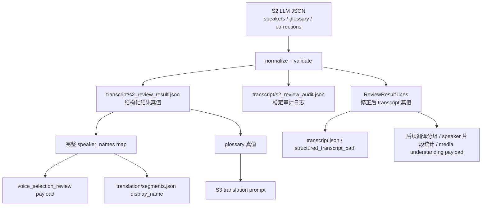

# S2 最小重构方案：结构化结果、一致审计与多说话人姓名保留
> 日期：2026-04-08
> 状态：提案
> 目标：在不影响后续项目流程的前提下，把 S2 从“只有最终 transcript 真值、缺少稳定中间产物与稳定审计”的节点，升级成“可追踪、可复盘、可保留 N-speaker 关键信息”的节点。

---

## 1. 方案边界

本方案**只做 3 件事**：

1. 新增 `transcript/s2_review_result.json`
2. 新增 `transcript/s2_review_audit.json`
3. 让 `speaker_c+` 的姓名信息在后续链路里不再丢失

本方案**明确不做**：

- 不改 S2 prompt 内容
- 不把 S2 拆成多次大模型调用
- 不改 Gateway / 前端协议
- 不改 TTS matcher 或 provider dispatch 规则
- 不引入数据库或 migration
- 不重写 `TranscriptLine` / `TranscriptResult` 的主数据模型

---

## 2. 当前问题

### 2.1 S2 结构化结果不是一等产物

当前 S2 大模型返回的结构化 JSON 只有：

```json
{
  "speakers": {},
  "glossary": {},
  "corrections": []
}
```

但当前落盘的主真值只有修正后的 transcript。`speakers` 与 `glossary` 主要先存在内存变量里，缺少稳定、可复查的中间结果文件。

### 2.2 现有 correction 日志不稳定

当前主流程里的 correction 日志主要依赖“旧 lines 与新 lines 按位置 zip 对比”。一旦发生 `merge` / `split` / reindex，这个日志就可能与真正被改动的片段不一致。

### 2.3 多说话人姓名信息传播不完整

虽然 S2 已经可以返回 `speaker_c+` 的姓名与 profile，但后续链路中仍有多处只显式处理 `speaker_a` / `speaker_b`。结果是：

- transcript 里保留了 `speaker_c+`
- 但名字信息在下游 payload / segments / review 面板中不一定能完整保留下来

---

## 3. 目标状态

S2 完成后，项目目录中至少稳定存在以下产物：

- `transcript/transcript.json` 或现有 `structured_transcript_path`
- `transcript/s2_review_raw_response.json`
- `transcript/s2_review_speaker_diff.json`
- `transcript/s2_review_result.json`
- `transcript/s2_review_audit.json`

其中：

- `s2_review_raw_response.json` 与 `s2_review_speaker_diff.json` 继续承担 debug 证据角色
- `s2_review_result.json` 成为 S2 结构化结果的一等产物
- `s2_review_audit.json` 成为 S2 应用动作的一等审计产物

---

## 4. 现状到目标的数据链



---

## 5. 设计细节

### 5.1 `s2_review_result.json`

建议路径：

- `transcript/s2_review_result.json`

建议字段：

```json
{
  "version": 1,
  "review_model": "gemini-2.5-pro",
  "has_audio": true,
  "speakers": {},
  "speaker_names": {},
  "glossary": {},
  "raw_corrections": [],
  "corrections_applied": [],
  "line_counts": {
    "original": 0,
    "after_corrections": 0,
    "after_sanity": 0,
    "final": 0
  },
  "artifacts": {
    "raw_response": "transcript/s2_review_raw_response.json",
    "speaker_diff": "transcript/s2_review_speaker_diff.json",
    "audit": "transcript/s2_review_audit.json"
  }
}
```

用途：

- 固定保存 S2 原始结构化结果
- 让 `speakers`、`glossary`、`raw_corrections` 不再只是短暂内存数据
- 为后续定位“模型想改什么、最终真正改了什么”提供统一入口

### 5.2 `s2_review_audit.json`

建议路径：

- `transcript/s2_review_audit.json`

目标：

- 替代“按位置 zip 对比”的脆弱日志
- 用稳定 `line_uid` 记录动作链

建议结构：

```json
{
  "version": 1,
  "original_lines": [],
  "events": [],
  "final_lines": []
}
```

其中：

- `original_lines`：S2 进入前的 line 快照
- `events`：按顺序记录每一次应用动作
- `final_lines`：S2 结束后的 line 快照

建议事件类型：

- `correct_speaker`
- `fix_text`
- `merge`
- `split`
- `sanity_check_flip`
- `reindex`

对 `merge` / `split` 建议明确记录：

- `source_line_uids`
- `result_line_uid` 或 `result_line_uids`

### 5.3 稳定 `line_uid`

本方案不修改主数据模型，只在 S2 内部生成 sidecar `line_uid`。

建议生成原则：

- 基于 `index + start_ms + end_ms + source_text` 的稳定组合
- 审计文件中记录该 uid
- 后续所有 audit 事件都引用 uid，而不是当前位置索引

这样可以避免：

- `merge` 后“到底哪条线被吞并”看不清
- `split` 后“原来的 #7 变成哪两条”无法回溯
- reindex 后日志与 UI 看到的片段编号不一致

### 5.4 `speaker_c+` 姓名全链保留

本方案不改 translator 主签名，而是在主流程里维护完整 `review_speaker_names`。

建议规则：

1. 先从 transcript 实际出现的 `speaker_id` 生成默认名
2. 再用 S2 `review_result.speakers[*].name` 覆盖
3. 后续统一使用这个完整 map，而不是只更新 `speaker_a` / `speaker_b`

建议至少覆盖 3 个出口：

- `voice_selection_review` payload 中的 `speaker_names`
- `translation/segments.json` 中各 segment 的 `display_name`
- 其他 review payload / 页面里展示说话人名称的地方

目标不是引入新的“姓名真值系统”，而是确保：

- `speaker_c+` 已经识别出的名字，不会在下游静默丢失

---

## 6. 建议改动文件

### 6.1 `src/services/transcript_reviewer.py`

职责：

- 写出 `s2_review_result.json`
- 写出 `s2_review_audit.json`
- 生成稳定 `line_uid`
- 记录 correction / sanity / reindex 事件

建议新增 helper：

- `_build_s2_review_result(...)`
- `_build_s2_review_audit(...)`
- `_make_line_uid(...)`

### 6.2 `src/pipeline/process.py`

职责：

- 引入完整 `review_speaker_names: dict[str, str]`
- 不再只处理 `speaker_a` / `speaker_b`
- 把完整 speaker name map 应用到：
  - cache restore 后的 segments
  - fresh translation 后的 segments
  - `voice_selection_review` payload

---

## 7. 实施顺序

建议按最小风险顺序推进：

1. 先落 `s2_review_result.json`
2. 再落 `s2_review_audit.json`
3. 最后做 `speaker_c+ names` 全链保留

原因：

- 第 1 步先把结构化结果固定下来，便于后面任何定位
- 第 2 步再解决“日志与最终结果不一致”的审计问题
- 第 3 步再补全多说话人名字传播，避免一次同时动 transcript 与下游展示逻辑

---

## 8. 验收标准

### 8.1 产物验收

S2 跑完后，项目 `transcript/` 目录中应存在：

- `s2_review_raw_response.json`
- `s2_review_speaker_diff.json`
- `s2_review_result.json`
- `s2_review_audit.json`

### 8.2 审计验收

当存在 `correct_speaker` / `merge` / `split` / sanity check 改动时：

- `s2_review_result.json` 能看到模型原始 `corrections`
- `s2_review_audit.json` 能看到真正被应用的动作及其 `line_uid`
- 可以明确区分：
  - 模型原始想改什么
  - deterministic post-pass 又改了什么
  - 最终 transcript 真值是什么

### 8.3 多说话人姓名验收

当 transcript 中存在 `speaker_c+`，且 S2 识别出名字时：

- `s2_review_result.json` 中保留该 speaker 的名字
- `voice_selection_review` payload 中保留该名字
- `translation/segments.json` 中对应 segment 的 `display_name` 保留该名字

---

## 9. 风险与控制

### 风险 1：审计文件过大

控制方式：

- 先只记录必要字段，不复制整段大型上下文
- 若后续证明确实过大，再考虑截断或分文件

### 风险 2：`line_uid` 生成不稳定

控制方式：

- uid 只用于单次 S2 审计，不承诺跨不同重跑保持永久一致
- 但在一次 S2 流程内部必须稳定、可引用

### 风险 3：`speaker_c+` 姓名覆盖影响旧链路

控制方式：

- 只在“已有该 speaker 且已有名字”的情况下覆盖 display name
- 不修改现有 `speaker_id`
- 不引入新的 speaker 归并逻辑

---

## 10. 结论

这是一份**只收口数据链、不改业务策略**的最小重构方案。

它解决的不是“模型为什么一定会犯错”，而是先把 S2 变成一个：

- 有一等结构化结果产物
- 有稳定可复盘审计
- 不会静默丢失 `speaker_c+` 姓名信息

的节点。

这样后续无论是继续排查 speaker misassignment，还是进一步瘦身 prompt、拆分任务、优化 batched reduce，都会有稳定证据链可依赖。
