# GitNexus Admin / Ops / Calibration 图

关联总图：`docs/graphs/GITNEXUS_PROJECT_GRAPH.md`

## 1. 范围

这张子图只看控制平面与运维诊断面，重点是：

- alignment / whisper / paid fallback settings
- Smart prompt model settings
- voice calibration control plane
- user voice quota、same-source match、Smart clone mirror 与 source metadata
- support admin、traffic analytics、cost management
- admin disk overview 与受控清理
- cleanup、R2 sweeper、R2 parity、observability
- Smart state、quality report、admin cost summary 与 terminal settlement 诊断

## 2. 主图

```mermaid
graph TD
    AdminUI["Admin / Ops UI"] --> Gateway["Gateway admin surfaces"]
    Gateway --> Settings["/api/admin/settings"]
    Gateway --> VoiceOps["voice calibration surfaces"]
    Gateway --> SupportAdmin["/api/admin/support/*"]
    Gateway --> Traffic["/api/admin/traffic"]
    Gateway --> Costs["credits observability / cost management"]
    Gateway --> AdminCost["/api/admin/jobs/{id}/cost"]
    Gateway --> AdminDisk["/api/admin/disk/*"]
    Gateway --> Cleanup["cleanup / purge / sweeper"]

    Settings --> AlignPolicy["force_dsp_alignment + paid_fallback"]
    Settings --> WhisperPolicy["whisper policy fields"]
    Settings --> PromptModels["prompt_models studio/express/smart"]
    PromptModels --> LLMRegistry["llm_registry mode defaults + admin override"]
    OpsEnv["INSTALL_WHISPER + .[whisper] + HF_HOME"] --> WhisperCap["runtime capability"]
    WhisperCap --> WhisperPolicy

    VoiceOps --> Manual["/user-voices/{voice_id}/calibrate-speed"]
    CloneFlow["voice clone success"] --> Hook["voice_calibration_hook.py"]
    ReviewApprove["voice-selection approve"] --> Preflight["voice_calibration_review_preflight.py"]
    ReviewMatch["voice-match / smart match"] --> MatchApi["internal /user-voices/match"]
    SmartClone["Smart clone success"] --> RegisterSmart["internal /user-voices/register-smart"]
    SmartQuota["Smart quota check"] --> QuotaApi["internal /user-voices/quota"]
    Manual --> Inflight["run_calibration_task + inflight dedupe"]
    Hook --> Inflight
    Preflight --> Inflight
    Inflight --> SpeedStore["update_user_voice_speed_calibration"]
    RegisterSmart --> SourceMeta["source metadata / sample metadata"]
    SourceMeta --> UserVoiceStore["UserVoice table"]
    MatchApi --> UserVoiceStore
    QuotaApi --> UserVoiceStore
    UserVoiceStore --> SourceIndexes["source_content_hash indexes"]

    MainLife["gateway/main.py lifespan"] --> Sweeper["r2_artifact_sweeper"]
    Sweeper --> Mirror["job_terminal_mirror"]
    Mirror --> SmartState["smart_state mirror"]
    Mirror --> Settle["credit/quota settle"]
    Settle --> Backfill["cost_summary_backfill.py"]
    Backfill --> CostFile["audit/smart_cost_summary.json"]
    CostFile --> AdminCost
    Sweeper --> Publisher["r2_publisher"]
    Cleanup --> Parity["r2_parity_ok + R2 HEAD"]
    Parity --> Publisher

    AdminDisk --> DiskOverview["filesystem / mount / categories"]
    DiskOverview --> Orphans["orphan_dirs"]
    DiskOverview --> Expired["expired_dirs"]
    DiskOverview --> Protected["protected_expired_dirs"]
    AdminDisk --> CleanupOrphans["cleanup-orphans by job_id"]
    AdminDisk --> CleanupExpired["cleanup-expired via project_cleanup"]
    CleanupOrphans --> SafeRoot["safe project root check"]
    CleanupExpired --> Cleanup

    Events["download.* / stream.* events"] --> R2Obs["scripts/r2_observability.py"]
    R2Obs --> AdminDecision["rollout / fallback diagnosis"]

    SupportAdmin --> Presence["presence / heartbeat / online threshold"]
    SupportAdmin --> Handoff["handoff / WeChat QR / ops email"]
    Traffic --> Categories["human / search / AI crawler / scanner"]
    Costs --> CostRows["LLM / TTS / voice_clone / smart policy / margin rows"]

    SmartState --> Costs
    Settle --> Costs
    AdminCost --> AdminUI
    AdminDisk --> AdminUI
    Categories --> AdminUI
    CostRows --> AdminUI
    AdminDecision --> AdminUI
```

## 3. 当前最重要的控制面变化

### 3.1 Admin disk 管理成为正式运维面

- `gateway/admin_disk_api.py` 暴露 `/api/admin/disk/overview`、`cleanup-orphans`、`cleanup-expired`。
- overview 汇总 filesystem capacity、mount info、orphan dirs、expired dirs、protected/admin expired dirs、failed dirs、active largest dirs、largest files。
- mutating endpoint 接收 job ids，不接收路径；路径重新从配置项目根派生，并复用 safe root 检查。
- `frontend-next/src/app/(app)/admin/disk/page.tsx` 提供容量卡片、目录表格、孤儿目录选择与清理按钮。

结论：磁盘释放从手工命令推进到 admin 控制平面，但没有放松路径安全约束。

### 3.2 Admin cost summary 是 Smart 成本审计入口

- `gateway/admin_cost_api.py` 暴露 `GET /api/admin/jobs/{job_id}/cost`。
- endpoint 只读 `audit/smart_cost_summary.json`，并要求 admin role。
- Workspace 不读取成本字段，用户侧只读 quality report。
- `frontend-next/src/app/(app)/admin/jobs/[id]/cost/page.tsx` 是管理员成本明细页。

结论：Smart 成本可观测性已上线，但安全域是 admin-only。

### 3.3 cost_summary backfill 接入 settlement 后处理

- pipeline terminal 时写 cost summary，但实际扣点和 MiniMax quota 使用量可能仍是 pending。
- `gateway/cost_summary_backfill.py` 在 Gateway settlement 后读 ledger entries，计算 net credits charged。
- quota_used 为 `None` 时不伪造 0，保留待查询语义。
- backfill failure 不阻断 mirror callback。

结论：成本摘要是“pipeline 先写，settlement 后补齐”的两阶段模型。

### 3.4 calibration 三入口 control plane 继续成立

- T0：`gateway/user_voice_api.py` 提供 `/user-voices/{voice_id}/calibrate-speed`
- T1：`gateway/voice_calibration_hook.py` 在 clone 成功后自动补齐 canonical models
- T2：`gateway/voice_calibration_review_preflight.py` 在 review submit 前补齐缺口
- Smart / editing / voice selection 的 clone 成功都会尽量进入同一套 calibration hook，而不是各自维护速度参数。

结论：voice speed calibration 仍是覆盖手动、clone、review 的正式控制平面。

### 3.5 UserVoice source metadata 成为复用与诊断主键

- `gateway/alembic/versions/028_user_voice_source_metadata.py` 给 `UserVoice` 增加 `source_job_id / source_type / source_ref / source_content_hash / source_upload_md5 / source_video_title / source_speaker_name / source_speaker_name_key / clone_sample_seconds / clone_sample_segment_ids / created_from` 等字段。
- `gateway/user_voice_service.py` 的 `match_user_voices(...)` 以同用户、同 `source_content_hash` 为前提，再按 `source_speaker_id` 或 `source_speaker_name_key` 判强/中/弱匹配。
- 强匹配才允许自动复用；弱匹配只作为候选信号，避免跨 speaker 误复用。
- 索引覆盖 `(user_id, source_content_hash, source_speaker_id)`、`(user_id, source_content_hash, source_speaker_name_key)`、`(user_id, source_ref)`。

结论：音色复用不是按 voice_id 猜测，而是以可审计的来源内容和 speaker metadata 为依据。

### 3.6 Smart clone 增加 UserVoice quota、match 与 mirror 入口

- `gateway/user_voice_api.py` 提供 internal quota endpoint 给 pipeline 查询剩余额度。
- `gateway/user_voice_api.py` 提供 internal match endpoint 给 pipeline 和人工审核/后编辑查询同源可复用音色。
- clone 成功后 pipeline 调 internal `register-smart` 将新 voice 写入 UserVoice。
- 若 mirror 失败，pipeline fail-closed handoff，避免下一次 quota 读到 stale used count。

结论：Smart clone 的 ops 诊断不能只看 provider 成功，还要看 Gateway UserVoice 是否复用、登记、索引和校准成功。

### 3.7 Smart prompt model 配置进入 admin settings

- `gateway/admin_settings.py` 管理 `prompt_models[mode][prompt_key]`，mode 覆盖 `studio / express / smart`。
- `src/services/llm_registry.py` 对 Smart 的 `pass1 / pass2 / pass3 / translate / rewrite / probe_translate` 默认指向 Gemini 3.1 Pro。
- pipeline 将 `translator._service_mode` 设置为 job service mode，让 registry 能按 Smart mode 解析模型。

结论：Smart 的 LLM 成本与质量诊断要同时看 admin setting、registry default、pipeline service mode 三处。

### 3.8 Smart state 进入 terminal mirror 与 settlement 诊断面

- `job_terminal_mirror.py` 在 terminal settle 前合并 upstream `smart_state`。
- `credits_service.py` 在 legacy terminal branch 前优先读取 `smart_state.credits_policy`。
- policy 不识别时会记录 warning 并回落，不静默吞掉。

结论：排查 Smart 扣费、退款、降级时，必须同时看 Job API JSON store、Gateway PG mirror、credit ledger 和 cost summary。

### 3.9 cleanup 仍可要求 R2 parity

- `AVT_CLEANUP_REQUIRES_R2_PARITY=true` 时，`project_cleanup.py` 会在删除项目目录前调用 `r2_parity_ok(...)`。
- `r2_parity_ok(...)` 检查 registry entry、generation、状态值、R2 HEAD。
- parity 失败会跳过整行，不 rmtree，也不 flip status。
- admin disk cleanup-expired 复用 `cleanup_expired_projects(...)`，因此仍受 parity 策略影响。

结论：磁盘释放策略已经和 R2 交付可靠性绑定。

### 3.10 alignment / whisper 控制面仍是两层

- 运行时 policy 由 `gateway/admin_settings.py` 暴露。
- 部署 capability 由 `pyproject.toml` 的 `.[whisper]`、`Dockerfile` 的 `INSTALL_WHISPER`、`docker-compose.yml` 的 `HF_HOME` 决定。

结论：管理员打开 whisper 开关不代表部署层一定具备可运行能力。

## 4. 关键证据

- `gateway/admin_disk_api.py`
  - disk overview
  - orphan cleanup
  - expired cleanup
  - safe root boundary
- `frontend-next/src/app/(app)/admin/disk/page.tsx`
  - admin disk UI
- `gateway/admin_cost_api.py`
  - admin-only Smart cost endpoint
- `frontend-next/src/app/(app)/admin/jobs/[id]/cost/page.tsx`
  - admin Smart cost UI
- `gateway/cost_summary_backfill.py`
  - post-settle cost summary update
- `gateway/user_voice_api.py`
  - manual calibration entry
  - internal quota endpoint
  - internal match endpoint
  - internal register-smart endpoint
- `gateway/user_voice_service.py`
  - same-source voice matching
  - source metadata normalization
- `gateway/alembic/versions/028_user_voice_source_metadata.py`
  - UserVoice source metadata schema and indexes
- `gateway/voice_calibration_hook.py`
  - clone-after auto-calibration
- `gateway/voice_calibration_review_preflight.py`
  - review-submit preflight
- `gateway/job_terminal_mirror.py`
  - smart_state mirror
  - terminal settle
- `gateway/credits_service.py`
  - Smart credits policy dispatcher
- `gateway/admin_settings.py`
  - prompt model settings
- `src/services/llm_registry.py`
  - mode-aware LLM defaults
- `gateway/project_cleanup.py`
  - cleanup parity gate
- `src/services/r2_publisher_lib/r2_parity.py`
  - registry + R2 HEAD check
- `scripts/r2_observability.py`
  - download / stream observability

## 5. 什么时候优先看这张图

- 想排查磁盘占用、孤儿目录、过期项目为什么没清
- 想改 admin disk API 或 UI
- 想排查 Smart 成本摘要、settlement backfill、admin cost page
- 想改 voice calibration 行为或入口
- 想排查 Smart prompt model 为什么选了某个模型
- 想排查 Smart clone quota / match / register-smart / UserVoice mirror
- 想排查 cleanup 为什么没有 purge 某个过期项目
- 想看 R2 fallback / redirect 的统计口径
