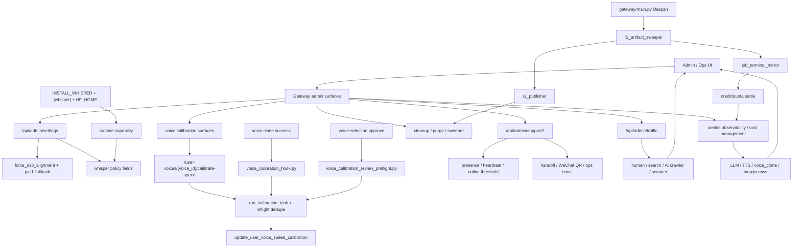

# GitNexus Admin / Ops / Calibration 图

关联总图：`docs/graphs/GITNEXUS_PROJECT_GRAPH.md`

## 1. 范围

这张子图只看控制平面与运维诊断面，重点是：

- alignment / whisper / paid fallback settings
- voice calibration control plane
- support admin、traffic analytics、cost management
- cleanup、R2 sweeper、runner 诊断

## 2. 主图

## 3. 当前最重要的控制面变化

### 3.1 calibration 已经形成三入口 control plane

- T0：`gateway/user_voice_api.py` 提供 `/user-voices/{voice_id}/calibrate-speed`
- T1：`gateway/voice_calibration_hook.py` 在 clone 成功后自动补齐 canonical models
- T2：`gateway/voice_calibration_review_preflight.py` 在 review submit 前补齐缺口

结论：voice speed calibration 已经不再是单点脚本，而是覆盖手动、clone、review 的正式控制平面。

### 3.2 手动校准与自动校准都走共享 inflight 语义

- 三条入口都汇入共享的 `run_calibration_task`
- `gateway/voice_calibration_inflight.py` 负责去重与并发协作
- `gateway/user_voice_service.py::update_user_voice_speed_calibration(...)` 明确保证并行写入 `chars_per_second_by_model` 时不丢更新

结论：多入口并发校准已经有统一的幂等与合并语义，而不是彼此覆盖。

### 3.3 clone-after calibration 现在是带环境开关的正式 sidecar

- `gateway/voice_calibration_hook.py` 只在 clone 成功后触发
- 当前 phase 1 针对 MiniMax canonical models：
  - `speech-2.8-turbo`
  - `speech-2.8-hd`
- `AVT_AUTO_CALIBRATE_AFTER_CLONE` 默认开启
- 失败静默，不阻断 clone 主流程

结论：clone 后自动校准是增益 sidecar，不是强耦合主路径。

### 3.4 review preflight 的职责是“提交前最后补齐”

- preflight 只看 job-level final model，不看 per-speaker `model_hint`
- 优先查 user voice，回退 voice catalog
- 总预算 50 秒，超时任务不取消
- 失败 never raise，review approve 始终继续代理

结论：T2 预热的目标是降低首轮运行时不确定性，而不是把审核提交变成阻塞式长任务。

### 3.5 ops 面现在还要管 R2 sweeper 与 terminal mirror

- `gateway/main.py` 启动和关闭 `r2_artifact_sweeper`
- `gateway/r2_artifact_sweeper.py` 负责 proactive publish、delta push、retry-after backoff
- `gateway/job_terminal_mirror.py` 负责 terminal state、`edit_generation`、ledger/quota settle 的镜像补偿

结论：Admin/Ops 面已经不只管设置和看板，也承担下载交付平面的后台一致性。

### 3.6 alignment / whisper 控制面仍是两层

- 运行时 policy 由 `gateway/admin_settings.py` 暴露
- 部署 capability 仍由：
  - `pyproject.toml` 的 `.[whisper]`
  - `Dockerfile` 的 `INSTALL_WHISPER`
  - `docker-compose.yml` 的 `HF_HOME`
 共同决定

结论：管理员把 whisper 开关拨到 `on`，不代表部署层一定具备可运行能力。

## 4. 关键证据

- `gateway/user_voice_api.py`
  - 手动校准入口
- `gateway/voice_calibration_hook.py`
  - clone-after auto-calibration
- `gateway/voice_calibration_review_preflight.py`
  - review-submit preflight
- `gateway/voice_calibration_inflight.py`
  - 去重 / 并发协调
- `gateway/user_voice_service.py`
  - calibration merge write
- `gateway/r2_artifact_sweeper.py`
  - sweeper 控制面
- `gateway/job_terminal_mirror.py`
  - terminal mirror / settle
- `gateway/admin_settings.py`
  - alignment / whisper settings

## 5. 什么时候优先看这张图

- 想改 voice calibration 行为或入口
- 想排查 clone 后为什么没自动校准
- 想排查 review submit 前为什么会先跑 calibration
- 想改 alignment / whisper admin settings
- 想排查 R2 proactive publish、terminal mirror、cleanup 这些后台运维链路
