# GitNexus Admin / Ops / Calibration 图

关联总图：`docs/graphs/GITNEXUS_PROJECT_GRAPH.md`

## 1. 范围

这张子图只看控制平面与运维诊断面，重点是：

- alignment / whisper / paid fallback settings
- Smart prompt model settings
- Smart voice candidate / clone / weak-match policy settings
- CosyVoice clone 灰度、GA、max voices、sample uploader 与 mainland worker health
- Express CosyVoice 自动克隆 admin 主开关、allowlist、reservation TTL、临时音色 cleanup 与手动 CLI
- Free tier feature flag、free voiceclone kill switch、daily quota ledger 与 launch-gate 诊断
- Anonymous Preview APF caps、claim switch、direct/chunked upload knobs 与匿名 TTL 诊断
- Smart Preview clone 主开关、600 点 reservation caps、strict reservation gate 与 sweeper
- Paddle / WeChat payment provider reconciliation、refund closure 与 fake payment guard
- rotating logs、process runner watchdog 与任务 terminal mirror 诊断
- MiMo v2.5 / MiMo TTS promotional pricing / provider usage capture 的成本诊断
- Smart analytics、report analysis 与 Phase 1b rollout flags
- CSRF same-origin guard、production startup guard 与 fake payment gate
- frontend polling governance
- voice calibration control plane
- user voice quota、same-source match、Smart clone mirror 与 source metadata
- support admin、traffic analytics、cost management
- admin disk overview 与受控清理
- admin disk resize hint 与 loopback resize helper
- admin pan backup dashboard / schedulers / cleanup
- cleanup、R2 sweeper、R2 parity、observability
- Smart state、quality report、admin cost summary 与 terminal settlement 诊断

## 2. 主图

```mermaid
graph TD
    AdminUI["Admin / Ops UI"] --> Gateway["Gateway admin surfaces"]
    Gateway --> Settings["/api/admin/settings"]
    Gateway --> VoiceOps["voice calibration surfaces"]
    Gateway --> SupportAdmin["/api/admin/support/*"]
    Gateway --> Traffic["/api/admin/traffic"]
    Gateway --> Costs["credits observability / cost management"]
    Gateway --> AdminCost["/api/admin/jobs/{id}/cost"]
    Gateway --> SmartAnalytics["/api/admin/smart-analytics/*"]
    Gateway --> MainlandWorkerAdmin["/api/admin/mainland-voice-worker/*"]
    Gateway --> AdminCosyVoice["/api/admin/cosyvoice/*"]
    Gateway --> AdminDisk["/api/admin/disk/*"]
    Gateway --> PanAdmin["/api/admin/pan/*"]
    Gateway --> Security["csrf + production safety"]
    Gateway --> Cleanup["cleanup / purge / sweeper"]

    Settings --> AlignPolicy["force_dsp_alignment + paid_fallback"]
    Settings --> WhisperPolicy["whisper policy fields"]
    Settings --> PromptModels["prompt_models studio/express/smart"]
    Settings --> SmartVoicePolicy["smart_auto_clone / reuse / auto_reuse_possible / pause_on_possible"]
    Settings --> CosyVoicePolicy["cosyvoice clone allowlist / GA / worker / max voices"]
    Settings --> ExpressPolicy["express auto-clone enabled / allowlist / caps / TTL"]
    Settings --> FreePolicy["free_tier_voiceclone_enabled kill switch"]
    Settings --> AnonymousPolicy["anonymous preview APF caps / claim switch"]
    Settings --> ChunkedPolicy["chunked upload limits / TTL / disk floor"]
    Settings --> SmartPreviewPolicy["smart preview clone caps / reservation strict gate"]
    Settings --> Phase1BFlags["phase1b report flags"]
    PromptModels --> LLMRegistry["llm_registry mode defaults + admin override"]
    SmartVoicePolicy --> SmartRuntime["process.py read_admin_setting"]
    CosyVoicePolicy --> CloneGate["/api/voice/cosyvoice/clone-gate"]
    ExpressPolicy --> ExpressAvailability["/api/me/express-auto-clone-availability"]
    ExpressPolicy --> ExpressReservation["express_clone_reservations"]
    AnonymousPolicy --> AnonymousPreview["anonymous preview admission / claim"]
    ChunkedPolicy --> ChunkedUpload["chunked upload service"]
    SmartPreviewPolicy --> SmartCloneReservation["smart_clone_reservations"]
    AdminCosyVoice --> ExpressCleanupStatus["temporary voice cleanup dry-run / execute status"]
    FreePolicy --> FreeQuotaLedger["free_service_daily_usage ledger"]
    FreePolicy --> FreePaidGuard["free voiceclone -> MiMo-only paid API guard"]
    MainlandWorkerAdmin --> WorkerHealth["status / healthz no secret leak"]
    WorkerHealth --> WorkerClient["build_mainland_voice_worker_client"]
    Phase1BFlags --> RuntimeFlags["services.runtime_flags"]
    OpsEnv["INSTALL_WHISPER + .[whisper] + HF_HOME"] --> WhisperCap["runtime capability"]
    WhisperCap --> WhisperPolicy

    VoiceOps --> Manual["/user-voices/{voice_id}/calibrate-speed"]
    VoiceCandidates["voice-candidates API"] --> MatchApi["internal /user-voices/candidates"]
    CloneFlow["voice clone success"] --> Hook["voice_calibration_hook.py"]
    ReviewApprove["voice-selection approve"] --> Preflight["voice_calibration_review_preflight.py"]
    ReviewMatch["voice-match / smart match"] --> LegacyMatch["internal /user-voices/match"]
    SmartClone["Smart clone success"] --> RegisterSmart["internal /user-voices/register-smart"]
    SmartQuota["Smart quota check"] --> QuotaApi["internal /user-voices/quota"]
    Manual --> Inflight["run_calibration_task + inflight dedupe"]
    Hook --> Inflight
    Preflight --> Inflight
    Inflight --> SpeedStore["update_user_voice_speed_calibration"]
    RegisterSmart --> SourceMeta["source metadata / sample metadata"]
    SourceMeta --> UserVoiceStore["UserVoice table"]
    MatchApi --> UserVoiceStore
    LegacyMatch --> UserVoiceStore
    QuotaApi --> UserVoiceStore
    UserVoiceStore --> SourceIndexes["source_content_hash indexes"]

    MainLife["gateway/main.py lifespan"] --> Sweeper["r2_artifact_sweeper"]
    MainLife --> Reconciler["background_task_reconciler"]
    MainLife --> PanSchedulers["pan scheduler loops"]
    MainLife --> ExpressReservationSweeper["express_reservation_sweeper"]
    MainLife --> ExpressVoiceCleanupSweeper["express_voice_cleanup_sweeper"]
    MainLife --> SmartCloneSweeper["smart_clone_reservation_sweeper"]
    ExpressReservationSweeper --> ExpressReservation
    ExpressVoiceCleanupSweeper --> ExpressCleanupStatus
    SmartCloneSweeper --> SmartCloneReservation
    Sweeper --> Mirror["job_terminal_mirror"]
    Mirror --> SmartState["smart_state mirror"]
    Mirror --> Settle["credit/quota settle"]
    Mirror --> SmartCloneSettle["smart preview clone settle"]
    SmartCloneSettle --> SmartCloneReservation
    Settle --> Backfill["cost_summary_backfill.py"]
    Backfill --> CostFile["audit/smart_cost_summary.json"]
    CostFile --> AdminCost
    Sweeper --> Publisher["r2_publisher"]
    Cleanup --> Parity["r2_parity_ok + R2 HEAD"]
    Parity --> Publisher

    AdminDisk --> DiskOverview["filesystem / mount / categories"]
    DiskOverview --> Orphans["orphan_dirs"]
    DiskOverview --> Expired["expired_dirs"]
    DiskOverview --> Protected["protected_expired_dirs"]
    AdminDisk --> CleanupOrphans["cleanup-orphans by job_id"]
    AdminDisk --> CleanupExpired["cleanup-expired via project_cleanup"]
    AdminDisk --> ResizeHint["resize_hint"]
    ResizeHint --> ResizeApi["POST /resize-filesystem"]
    ResizeApi --> ResizeHelper["disk_resize_helper.py loopback"]
    ResizeHelper --> Resize2fs["resize2fs guarded by token + confirm"]
    CleanupOrphans --> SafeRoot["safe project root check"]
    CleanupExpired --> Cleanup

    Events["download.* / stream.* events"] --> R2Obs["scripts/r2_observability.py"]
    R2Obs --> AdminDecision["rollout / fallback diagnosis"]

    SupportAdmin --> Presence["presence / heartbeat / online threshold"]
    SupportAdmin --> Handoff["handoff / WeChat QR / ops email"]
    Traffic --> Categories["human / search / AI crawler / scanner"]
    Costs --> CostRows["LLM / TTS / voice_clone / smart policy / margin rows"]
    Costs --> PaymentRecon["billing_reconciliation / refund closure"]
    CostCatalog["cost_management RMB-direct catalog"] --> Costs
    MiMoUsage["MiMo v2.5 provider usage + promotional TTS pricing"] --> CostCatalog
    FreeCost["free=0 debit truth + MiMo voiceclone cost visibility"] --> CostCatalog
    SmartAnalytics --> SmartSummary["summary / csv"]
    SmartAnalytics --> ReportAnalysis["job-reports summary / csv"]
    SmartAnalytics --> Phase1BFlags
    SmartSummary --> AdminUI
    ReportAnalysis --> AdminUI
    Security --> CSRFGuard["require_same_origin_state_change"]
    Security --> StartupGuard["validate_production_safety"]
    Security --> FakePaymentGate["fake payment dev/test default"]
    PollingGov["usePollingTask + visibility-aware admin heartbeat"] --> AdminUI
    PanAdmin --> PanStatus["status / quota / credentials"]
    PanAdmin --> PanBackups["backup list / manifest / restore / delete"]
    PanAdmin --> PanBatch["single + batch backup enqueue"]
    PanBatch --> PanTasks["BackgroundTask pan_*"]
    Reconciler --> PanTasks
    PanSchedulers --> PanTasks
    PanSchedulers --> PanCleanup["archive scanner / stale reaper / orphan cleanup"]
    PanCleanup --> R2Obs["pan.* observability"]

    SmartState --> Costs
    Settle --> Costs
    AdminCost --> AdminUI
    AdminDisk --> AdminUI
    PanAdmin --> AdminUI
    Categories --> AdminUI
    CostRows --> AdminUI
    AdminDecision --> AdminUI
```

## 3. 当前最重要的控制面变化

### 3.1 Admin disk 管理成为正式运维面

- `gateway/admin_disk_api.py` 暴露 `/api/admin/disk/overview`、`cleanup-orphans`、`cleanup-expired`。
- overview 汇总 filesystem capacity、mount info、orphan dirs、expired dirs、protected/admin expired dirs、failed dirs、active largest dirs、largest files。
- mutating endpoint 接收 job ids，不接收路径；路径重新从配置项目根派生，并复用 safe root 检查。
- `frontend-next/src/app/(app)/admin/disk/page.tsx` 提供容量卡片、目录表格、孤儿目录选择与清理按钮。

结论：磁盘释放从手工命令推进到 admin 控制平面，但没有放松路径安全约束。

### 3.2 Admin cost summary 是 Smart 成本审计入口

- `gateway/admin_cost_api.py` 暴露 `GET /api/admin/jobs/{job_id}/cost`。
- endpoint 只读 `audit/smart_cost_summary.json`，并要求 admin role。
- Workspace 不读取成本字段，用户侧只读 quality report。
- `frontend-next/src/app/(app)/admin/jobs/[id]/cost/page.tsx` 是管理员成本明细页。

结论：Smart 成本可观测性已上线，但安全域是 admin-only。

### 3.3 cost_summary backfill 接入 settlement 后处理

- pipeline terminal 时写 cost summary，但实际扣点和 MiniMax quota 使用量可能仍是 pending。
- `gateway/cost_summary_backfill.py` 在 Gateway settlement 后读 ledger entries，计算 net credits charged。
- quota_used 为 `None` 时不伪造 0，保留待查询语义。
- backfill failure 不阻断 mirror callback。

结论：成本摘要是“pipeline 先写，settlement 后补齐”的两阶段模型。

### 3.4 calibration 三入口 control plane 继续成立

- T0：`gateway/user_voice_api.py` 提供 `/user-voices/{voice_id}/calibrate-speed`
- T1：`gateway/voice_calibration_hook.py` 在 clone 成功后自动补齐 canonical models
- T2：`gateway/voice_calibration_review_preflight.py` 在 review submit 前补齐缺口
- Smart / editing / voice selection 的 clone 成功都会尽量进入同一套 calibration hook，而不是各自维护速度参数。

结论：voice speed calibration 仍是覆盖手动、clone、review 的正式控制平面。

### 3.5 Smart voice policy 进入 admin settings

- `gateway/admin_settings.py` 管理 `smart_auto_clone_enabled`、`smart_reuse_user_voice_enabled`、`smart_auto_reuse_on_possible_user_voice_match`、`smart_pause_on_possible_user_voice_match`。
- `frontend-next/src/app/(app)/admin/settings/page.tsx` 暴露四个开关，其中 P5 possible-match auto-reuse 默认开启，弱匹配确认默认关闭。
- P5 auto-reuse 优先于 pause：两个开关都打开时，possible match 自动复用 top candidate，不进入人工确认。
- pipeline 使用 app-side `services.admin_settings.read_admin_setting` 读取这些字段，避免 runtime 误用 Gateway-only settings loader。
- Gateway create path 的 Smart quota preflight 与 runtime 保持一致：只有 consent 允许克隆且 admin clone enabled 时才检查 clone quota。

结论：Smart 的“复用、possible-match 自动复用、克隆、弱匹配暂停”不再是硬编码策略，而是进入 admin 控制面。

### 3.6 UserVoice source metadata 成为复用与诊断主键

- `gateway/alembic/versions/028_user_voice_source_metadata.py` 给 `UserVoice` 增加 `source_job_id / source_type / source_ref / source_content_hash / source_upload_md5 / source_video_title / source_speaker_name / source_speaker_name_key / clone_sample_seconds / clone_sample_segment_ids / created_from` 等字段。
- `gateway/user_voice_service.py` 的 `match_user_voices(...)` 以同用户、同 `source_content_hash` 为前提，再按 `source_speaker_id` 或 `source_speaker_name_key` 判强/中/弱匹配。
- 强匹配才允许自动复用；弱匹配只作为候选信号，避免跨 speaker 误复用。
- 索引覆盖 `(user_id, source_content_hash, source_speaker_id)`、`(user_id, source_content_hash, source_speaker_name_key)`、`(user_id, source_ref)`。

结论：音色复用不是按 voice_id 猜测，而是以可审计的来源内容和 speaker metadata 为依据。

### 3.7 Smart clone 增加 UserVoice quota、candidate、match 与 mirror 入口

- `gateway/user_voice_api.py` 提供 internal quota endpoint 给 pipeline 查询剩余额度。
- `gateway/user_voice_api.py` 提供 internal match endpoint 给 pipeline 和人工审核/后编辑查询同源可复用音色。
- `gateway/user_voice_api.py` 还提供 internal candidates endpoint，输出 strong auto-reuse、requires-confirmation、cross-source named candidates。
- `gateway/voice_selection_api.py` 暴露 public `/job-api/jobs/{job_id}/voice-candidates` 给 Studio 和 post-edit UI。
- clone 成功后 pipeline 调 internal `register-smart` 将新 voice 写入 UserVoice。
- 若 mirror 失败，pipeline fail-closed handoff，避免下一次 quota 读到 stale used count。

结论：Smart clone 的 ops 诊断不能只看 provider 成功，还要看 Gateway UserVoice 是否复用、登记、索引和校准成功。

### 3.8 Smart prompt model 配置进入 admin settings

- `gateway/admin_settings.py` 管理 `prompt_models[mode][prompt_key]`，mode 覆盖 `studio / express / smart`。
- `src/services/llm_registry.py` 对 Smart 的 `pass1 / pass2 / pass3 / translate / rewrite / probe_translate` 默认指向 Gemini 3.1 Pro。
- pipeline 将 `translator._service_mode` 设置为 job service mode，让 registry 能按 Smart mode 解析模型。

结论：Smart 的 LLM 成本与质量诊断要同时看 admin setting、registry default、pipeline service mode 三处。

### 3.9 Smart state 进入 terminal mirror 与 settlement 诊断面

- `job_terminal_mirror.py` 在 terminal settle 前合并 upstream `smart_state`。
- `credits_service.py` 在 legacy terminal branch 前优先读取 `smart_state.credits_policy`。
- policy 不识别时会记录 warning 并回落，不静默吞掉。

结论：排查 Smart 扣费、退款、降级时，必须同时看 Job API JSON store、Gateway PG mirror、credit ledger 和 cost summary。

### 3.10 Admin disk resize 是受控运维动作

- `admin_disk_api.py` 在 overview 中返回 `resize_hint`，包括 feature flag、device、mount source、device/fs size、`resize2fs/tune2fs` availability、can/needs resize。
- `POST /api/admin/disk/resize-filesystem` 要求 admin、feature enabled、`can_resize=True`、`confirm=true`，并通过 `_resize_lock` 串行化。
- `disk_resize_helper.py` 独立进程绑定 loopback，要求 bearer token；只有它能看到 raw block device。
- Compose 将 `AVT_ADMIN_DISK_RESIZE_DEVICE` 只挂给 `disk-resize-helper`，Gateway 通过 `AVT_ADMIN_DISK_RESIZE_HELPER_URL/TOKEN` 调 helper。
- helper 只允许 ext4 `resize2fs`，通过 `tune2fs` 判断文件系统容量，支持 dry-run，执行失败会返回 before/after/output。

结论：一键扩容不是让 Gateway 容器直接拿裸设备，而是经过 helper、token、confirm、ext4、lock 的受控路径。

### 3.11 cleanup 仍可要求 R2 parity

- `AVT_CLEANUP_REQUIRES_R2_PARITY=true` 时，`project_cleanup.py` 会在删除项目目录前调用 `r2_parity_ok(...)`。
- `r2_parity_ok(...)` 检查 registry entry、generation、状态值、R2 HEAD。
- parity 失败会跳过整行，不 rmtree，也不 flip status。
- admin disk cleanup-expired 复用 `cleanup_expired_projects(...)`，因此仍受 parity 策略影响。

结论：磁盘释放策略已经和 R2 交付可靠性绑定。

### 3.12 cost catalog 改为 RMB-direct

- `gateway/cost_management.py` 的默认价格目录版本为 RMB-direct catalog。
- LLM rate 直接使用 `input_per_million_rmb / output_per_million_rmb / audio_input_per_million_rmb`，`usd_to_rmb` 只保留兼容旧 override。
- 当前成本目录按 2026-05-20 价格固化 Gemini 3.1 Pro：input ¥14.4/M、output ¥86.4/M、audio input ¥14.4/M，并新增 Gemini 3.5 Flash 价格项。
- 2026-05-21 后，Gemini 3.1 Flash Lite 使用 GA endpoint `gemini-3.1-flash-lite`，preview key 仅保留历史行兼容。

结论：成本管理面现在以人民币价格为主事实，减少汇率漂移。

### 3.13 alignment / whisper 控制面仍是两层

- 运行时 policy 由 `gateway/admin_settings.py` 暴露。
- 部署 capability 由 `pyproject.toml` 的 `.[whisper]`、`Dockerfile` 的 `INSTALL_WHISPER`、`docker-compose.yml` 的 `HF_HOME` 决定。

结论：管理员打开 whisper 开关不代表部署层一定具备可运行能力。

### 3.14 Pan backup 进入 admin 运维面

- `gateway/pan/admin_api.py` 暴露 `/api/admin/pan/status`、`/backups`、`/backups/{id}/manifest`、`/backups/batch`、`/restores`、credentials disconnect 和 backup soft-delete。
- `gateway/pan/auth.py` 负责 Baidu OAuth connect/callback、state token、token refresh，凭证加密存入 `PanCredentials`。
- `gateway/main.py` lifespan 会注册 pan scheduler，并在启动时先跑 `background_task_reconciler` 补启动 pending task。
- `frontend-next/src/app/(app)/admin/pan/dashboard/page.tsx` 与 `.../backups/page.tsx` 提供连接状态、quota、备份列表、manifest、恢复和删除操作。
- 项目列表与 admin jobs 页增加批量备份入口，后台仍由 `/api/admin/pan/backups/batch` 统一校验。

结论：Pan backup 是 admin 归档/恢复控制面，和 disk cleanup、R2 sweeper 一样属于运维工具链。

### 3.15 Smart analytics 和 report analysis 成为 admin 诊断面

- `gateway/admin_smart_analytics_api.py` 提供 `/summary`、`/csv`，按 Smart job 汇总状态、handoff reason、alignment metrics、edit events、quality/cost sidecar。
- `/job-reports-summary` 与 `/job-reports-csv` 汇总 Phase 1a/1b report sidecars，覆盖 translation quality、subtitle width、speaker evidence、voice sample scoring。
- `/phase1b-flags` 读取 env + admin settings，`POST /phase1b-flags` 写 admin overrides，支持不用重建容器就调整 shadow/behavior rollout。
- `frontend-next/src/app/(app)/admin/smart-analytics/page.tsx` 与 `/admin/report-analysis/page.tsx` 已加入 admin shell。

结论：Smart 诊断从单任务 cost page 推进到跨任务监控和 Phase 1b 质量开关控制。

### 3.16 CSRF 和生产安全成为 Gateway 横切运维项

- `gateway/csrf.py` 通过 `Origin/Referer/Host/SITE_URL/AVT_CORS_ORIGINS` 做 same-origin state-change guard，默认不信任 forwarded host。
- `gateway/main.py` 对 job proxy、upload、auth/account 写请求等加依赖，多数 Gateway routers 也在 APIRouter 层接入同一 guard。
- `gateway/startup_checks.py` 拒绝未知 `AVT_ENV`，生产环境要求 `AVT_AUTH_REQUIRED=true`。
- `gateway/payment_providers.py` 默认只在 dev/test 允许 fake payment，生产需显式 opt-in；`billing.py` 的 fake-pay disabled 分支返回 403 或 error redirect。

结论：排查 admin/write 403、生产启动失败或 fake-pay 不可用时，先看环境、Origin/Referer 与生产 safety guard。

### 3.17 前端 polling 治理进入运维面

- `frontend-next/src/lib/react/usePollingTask.ts` 在 hidden tab 可暂停轮询，并在 visibility 恢复后刷新。
- `useBackgroundTask.ts`、`NotificationBell.tsx`、support heartbeat 也接入 hidden/visible 语义，减少后台窗口持续打 Gateway。
- admin report/analytics 页面继续通过显式刷新和 CSV 导出拉取数据，不应通过高频隐式 polling 观察长窗口指标。

结论：看接口压力或“为什么刚才没刷新”时，需要区分 visibility-aware pause 与真实接口失败。

### 3.18 CosyVoice / mainland worker 进入 admin 运维面

- `gateway/admin_settings.py` 新增 CosyVoice clone 灰度字段：`cosyvoice_clone_worker_enabled`、默认 target model、allowlist、GA、max voices per user。
- `gateway/mainland_voice_worker.py` 暴露 `/api/admin/mainland-voice-worker/status` 与 `/healthz`，只返回 effective_enabled、url、key id、has secret 和 worker health，不泄露 HMAC secret。
- `gateway/startup_checks.py` 会在 worker config 不完整时降级 `mainland_voice_worker_enabled`，Gateway 启动不因 worker 缺失崩溃。
- `gateway/cosyvoice_clone/api.py` 的 clone-gate 将 admin policy、uploader backend、worker config readiness 合并为 runtime readiness，便于前端和运维定位是授权问题还是运行态问题。
- sample uploader 不能在 production clone path 中继续使用 `local_fs_stub`；worker enabled 但 uploader 未配置时 clone 在付费调用前 503。
- UserVoice 的 worker routing 字段和 `temporary_expires_at` 让 admin 排查 clone voice 生命周期、路由、worker request id 有数据库锚点。

结论：CosyVoice clone 的上线面不是单个按钮，而是 admin 灰度、uploader、worker health、UserVoice schema 和 TTS routing 的组合运维面。

### 3.19 Express CosyVoice control page 成为 canary 与 cleanup 运维入口

- `gateway/admin_settings.py` 增加 Express 自动克隆 9 字段：主开关、allowlist enabled、allowlist、主说话人比例/行数、样本秒数、target model、daily cap、active temp cap、reservation TTL。
- `/admin/cosyvoice` 聚合 CosyVoice worker/readiness、Express policy、reservation TTL 和临时音色 cleanup dry-run/execute 状态。
- `gateway/express_reservation_sweeper.py` 在 lifespan 中回收 expired reserved reservation，只动 DB 预约状态，不调 worker。
- `gateway/express_voice_cleanup_sweeper.py` 在 lifespan 中扫描到期临时音色，调 worker delete 后再 soft-delete `user_voices`。
- `gateway/cleanup_temp_voices_cli.py` 是手动运维入口，默认 dry-run；`--execute --reset-attempts` 前必须确认 worker 可用，避免复活 give-up 行后无法删除。

结论：Express auto-clone 的风险面已经从“代码路径”提升到 admin 可观测、可灰度、可手动介入的运维面。

### 3.20 MiMo v2.5 与真实 usage capture 进入成本诊断面

- `src/services/llm_registry.py` 保留 `mimo_omni` 逻辑名，但解析到 `mimo-v2.5`，并标记 deprecated，避免历史 admin settings 直接失效。
- `src/services/gemini/translator.py` 和 `src/services/transcript_reviewer.py` 解析 OpenAI-compatible usage，并写入 `UsageMeter.record_llm` 的 provider usage 字段。
- `src/services/tts/mimo_tts_provider.py` 默认 `mimo-v2.5-tts`，仍允许 `MIMO_TTS_MODEL` env 回退。
- `gateway/cost_management.py` 的 cost catalog 增加 MiMo v2.5 / v2.5-pro RMB 价格和 MiMo TTS limited-free promotional rate；cost UI 不把 promotional 0 误读成永久价格。

结论：排查 MiMo 成本时要看 provider usage 是否存在、logical model 是否迁移、TTS rate 是否是 promotional，而不是只看估算 tokens。

### 3.21 Free tier 运维面以开关、ledger 和 guard 为主

- `AVT_ENABLE_FREE_TIER` 是后端总开关，前端还需要 Next flag 露出入口；排查入口不可见要同时看 Gateway env 和 Next build args。
- `gateway/admin_settings.py::free_tier_voiceclone_enabled` 是免费档 voiceclone kill switch；关闭后 free tier 不失败，而是降级到 preset mapping。
- `free_service_daily_usage` 是每日免费名额诊断主表，重点看 user/date/status/expires_at/reason，而不是 credits ledger。
- `gateway/free_consent.py` 的硬门禁会在 quota reserve 前拒绝未确认语音权益的请求，403 不应通过放松 quota 解决。
- 免费档 paid API guard 应只允许 MiMo voiceclone 窄路径，fallback 必须回 MiMo preset。

结论：Free tier 的运维排查先看 feature flag、consent、daily ledger 和 paid API guard，再看普通 pipeline/TTS 错误。

### 3.22 Anonymous Preview / chunked upload 运维面以 APF 与磁盘水位为主

- `gateway/admin_settings.py` 暴露 anonymous preview max in-flight、max upload MB、max seconds、global/day、IP/device/source/mode caps 与 claim switch。
- chunked upload knobs 覆盖 max file MB、chunk MB、per-user active、per-user/global inflight GB、daily GB、disk floor、TTL 和 anonymous TTL。
- 匿名预览被拒时先看 APF admission、rate limiter、probe/compliance 和 chunked upload ready TTL，不应先放宽正式任务权益。
- chunked upload 是传输层，ready artifact 仍需要通过 intake/admission 才能创建 preview 或正式任务。

结论：匿名试用的稳定性和成本风险主要由 APF、chunked upload 配额和磁盘水位共同治理。

### 3.23 Smart Preview clone 运维面以 reservation 和 sweeper 为主

- `smart_preview_clone_enabled` 决定 public Smart Preview 是否可触发自动克隆。
- `smart_clone_requires_reservation` 开启后，任何 Smart MiniMax clone 都必须有有效 reservation。
- daily global cap、inflight cap、billing event idempotency 和 carryover single-use marker 共同保护 600 点 clone charge。
- terminal mirror 与 `smart_clone_reservation_sweeper` 负责 capture/release/expire 补偿，避免 provider 成功但 ledger 卡住。

结论：排查 Smart Preview 预览克隆问题时，先看 reservation row、terminal settle、sweeper 和 carryover，而不是只看 provider 调用。

### 3.24 Payment reconciliation 是多 provider 上线后的补偿面

- Paddle / WeChat provider 接入后，订单状态不再只来自同步 checkout 返回。
- `billing_reconciliation.py` 用 sweeper/补偿式逻辑修正 provider status、本地 payment/order state 与 ledger 的漂移。
- refund closure 要通过 Gateway 统一落账，不能由前端看到 provider 状态后自行推断权益。
- fake payment dev/test guard 仍是生产安全排查点。

结论：真实支付 provider 增多后，admin 排障应同时看 provider callback、reconciliation、ledger 和 fake-payment production guard。

## 4. 关键证据

- `gateway/admin_disk_api.py`
  - disk overview
  - orphan cleanup
  - expired cleanup
  - resize hint
  - resize-filesystem proxy
  - safe root boundary
- `gateway/disk_resize_helper.py`
  - loopback resize helper
  - token + confirm + resize lock
- `frontend-next/src/app/(app)/admin/disk/page.tsx`
  - admin disk UI
  - resize filesystem UI
- `gateway/admin_cost_api.py`
  - admin-only Smart cost endpoint
- `gateway/pan/admin_api.py`
  - admin Pan status / backups / restore / delete APIs
- `gateway/pan/auth.py`
  - Baidu OAuth and token refresh
- `gateway/pan/scheduler.py`
  - archive scanner / token refresh / orphan cleanup / stale reaper
- `gateway/background_task_reconciler.py`
  - startup pending task relaunch
- `frontend-next/src/app/(app)/admin/pan/dashboard/page.tsx`
  - admin pan dashboard
- `frontend-next/src/app/(app)/admin/pan/backups/page.tsx`
  - backup list / manifest / restore / delete UI
- `frontend-next/src/app/(app)/admin/jobs/[id]/cost/page.tsx`
  - admin Smart cost UI
- `gateway/admin_smart_analytics_api.py`
  - Smart summary / CSV
  - Phase 1a/1b report aggregation
  - Phase 1b flags API
- `gateway/mainland_voice_worker.py`
  - mainland worker status / healthz
  - client factory readiness
- `gateway/admin_cosyvoice_control_api.py`
  - CosyVoice / Express admin control surface
- `gateway/cosyvoice_clone/api.py`
  - clone-gate runtime readiness
  - explicit clone paid worker gate
- `gateway/express_reservation_service.py`
  - Express reservation cap state machine
- `gateway/express_reservation_sweeper.py`
  - reservation TTL sweeper
- `gateway/express_voice_cleanup_service.py`
  - temporary voice cleanup claim-lease state machine
- `gateway/cleanup_temp_voices_cli.py`
  - manual cleanup dry-run / execute CLI
- `frontend-next/src/app/(app)/admin/smart-analytics/page.tsx`
  - admin Smart analytics dashboard
- `frontend-next/src/app/(app)/admin/report-analysis/page.tsx`
  - report analysis dashboard
  - Phase 1b flag switches
- `gateway/cost_summary_backfill.py`
  - post-settle cost summary update
- `gateway/user_voice_api.py`
  - manual calibration entry
  - internal quota endpoint
  - internal match endpoint
  - internal candidates endpoint
  - internal register-smart endpoint
- `gateway/user_voice_service.py`
  - same-source voice matching
  - source metadata normalization
- `gateway/alembic/versions/028_user_voice_source_metadata.py`
  - UserVoice source metadata schema and indexes
- `gateway/voice_calibration_hook.py`
  - clone-after auto-calibration
- `gateway/voice_calibration_review_preflight.py`
  - review-submit preflight
- `gateway/job_terminal_mirror.py`
  - smart_state mirror
  - terminal settle
- `gateway/credits_service.py`
  - Smart credits policy dispatcher
- `gateway/admin_settings.py`
  - prompt model settings
  - Smart voice policy settings
  - CosyVoice clone rollout settings
  - free tier voiceclone kill switch
  - Phase 1b report rollout flags
- `gateway/free_consent.py`
  - free launch-gate voice-rights consent
- `gateway/free_service_quota.py`
  - free daily quota reserve / consume / release
- `gateway/anonymous_preview_api.py`
  - anonymous preview admin-visible lifecycle surface
- `gateway/anonymous_preview_chunked_api.py`
  - anonymous chunked upload path
- `gateway/chunked_upload_api.py`
  - chunked upload control API
- `gateway/chunked_upload_service.py`
  - TTL / disk floor / inflight enforcement
- `gateway/smart_clone_reservation_service.py`
  - Smart Preview clone reservation state machine
- `gateway/smart_clone_reservation_sweeper.py`
  - Smart clone reservation expiry sweeper
- `gateway/billing_reconciliation.py`
  - provider/payment state reconciliation
- `gateway/payment_provider_paddle.py`
  - Paddle provider integration
- `gateway/payment_provider_wechat.py`
  - WeChat provider integration
- `gateway/alembic/versions/034_free_service_daily_usage.py`
  - free daily quota ledger schema
- `gateway/alembic/versions/030_cosyvoice_clone_metadata.py`
  - UserVoice worker routing schema
- `gateway/alembic/versions/031_user_voice_temp_expiry.py`
  - temporary voice expiry schema
- `src/services/llm_registry.py`
  - mode-aware LLM defaults
- `src/services/runtime_flags.py`
  - env/admin flag resolver
- `gateway/cost_management.py`
  - RMB-direct provider cost catalog
  - MiMo v2.5 and promotional TTS pricing
- `src/services/gemini/translator.py`
  - OpenAI-compatible usage capture
- `src/services/transcript_reviewer.py`
  - MiMo audio/text usage capture
- `src/services/tts/mimo_tts_provider.py`
  - MiMo v2.5 TTS default
- `gateway/csrf.py`
  - same-origin state-change guard
- `gateway/startup_checks.py`
  - production safety validation
- `gateway/payment_providers.py`
  - fake payment production gate
- `frontend-next/src/lib/react/usePollingTask.ts`
  - visibility-aware polling governance
- `frontend-next/src/lib/react/useBackgroundTask.ts`
  - background task polling governance
- `gateway/project_cleanup.py`
  - cleanup parity gate
- `src/services/r2_publisher_lib/r2_parity.py`
  - registry + R2 HEAD check
- `scripts/r2_observability.py`
  - download / stream / pan observability

## 5. 什么时候优先看这张图

- 想排查磁盘占用、孤儿目录、过期项目为什么没清
- 想改 admin disk API 或 UI
- 想排查 Smart 成本摘要、settlement backfill、admin cost page
- 想改 voice calibration 行为或入口
- 想排查 Smart prompt model 为什么选了某个模型
- 想排查 Smart voice policy 为什么允许/禁止复用、克隆或弱匹配暂停
- 想排查 P5 possible-match 为什么自动复用或没有暂停
- 想排查 Smart clone quota / match / register-smart / UserVoice mirror
- 想排查 CosyVoice clone-gate、mainland worker health、sample uploader 或 worker secret 配置
- 想排查 Express 自动克隆 admin 开关、allowlist、reservation TTL、临时音色 cleanup、manual cleanup CLI
- 想排查 Free tier flag、voiceclone kill switch、free daily quota ledger、voice-rights consent 403
- 想排查 Anonymous Preview APF 限流、claim 开关、chunked upload TTL、磁盘水位或匿名上传失败
- 想排查 Smart Preview clone cap、600 点 reservation、carryover、sweeper 或 terminal settle
- 想排查 Paddle / WeChat 支付状态、refund closure、billing reconciliation 或 fake payment 生产门禁
- 想排查 MiMo v2.5、MiMo TTS promotional rate、真实 provider usage 与 admin cost 明细
- 想看 Smart analytics、report analysis、Phase 1b flags 为什么显示某个统计或开关状态
- 想排查 CSRF 403、生产启动 safety guard、fake payment 被禁用
- 想排查前端后台标签页为什么没有持续 polling 或恢复后才刷新
- 想排查 admin disk 为什么显示可以或不能扩容
- 想改 admin 网盘备份、恢复、Pan OAuth、auto archive、stale/orphan cleanup
- 想排查 cleanup 为什么没有 purge 某个过期项目
- 想看 R2 fallback / redirect 的统计口径
