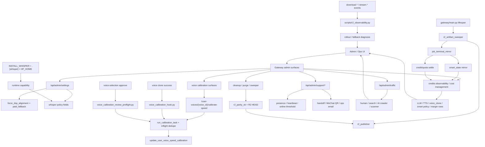

# GitNexus Admin / Ops / Calibration 图

关联总图：`docs/graphs/GITNEXUS_PROJECT_GRAPH.md`

## 1. 范围

这张子图只看控制平面与运维诊断面，重点是：

- alignment / whisper / paid fallback settings
- voice calibration control plane
- support admin、traffic analytics、cost management
- cleanup、R2 sweeper、R2 parity、observability
- Smart state 与 terminal settlement 诊断

## 2. 主图

## 3. 当前最重要的控制面变化

### 3.1 calibration 三入口 control plane 继续成立

- T0：`gateway/user_voice_api.py` 提供 `/user-voices/{voice_id}/calibrate-speed`
- T1：`gateway/voice_calibration_hook.py` 在 clone 成功后自动补齐 canonical models
- T2：`gateway/voice_calibration_review_preflight.py` 在 review submit 前补齐缺口

结论：voice speed calibration 仍是覆盖手动、clone、review 的正式控制平面。

### 3.2 Smart state 进入 terminal mirror 与 settlement 诊断面

- `job_terminal_mirror.py` 在 terminal settle 前合并 upstream `smart_state`。
- `credits_service.py` 在 legacy terminal branch 前优先读取 `smart_state.credits_policy`。
- policy 不识别时会记录 warning 并回落，不静默吞掉。

结论：排查 Smart 扣费、退款、降级时，必须同时看 Job API JSON store、Gateway PG mirror 和 credit ledger。

### 3.3 cleanup 现在可以要求 R2 parity

- `AVT_CLEANUP_REQUIRES_R2_PARITY=true` 时，`project_cleanup.py` 会在删除项目目录前调用 `r2_parity_ok(...)`。
- `r2_parity_ok(...)` 检查 registry entry、generation、状态值、R2 HEAD。
- parity 失败会跳过整行，不 rmtree，也不 flip status。

结论：磁盘释放策略已经和 R2 交付可靠性绑定。

### 3.4 R2 observability 进入 ops 工具链

- `scripts/r2_observability.py` 聚合 jobs dir 下的 `*.events.jsonl`。
- 覆盖 download 与 stream 两类事件。
- 输出可用于灰度判断，但 redirect 事件不是下载成功率。

结论：R2 rollout 现在有稳定统计脚本，不必依赖临时 grep。

### 3.5 email auth 对 ops 的影响是 provider 与 rate limits

- `EMAIL_AUTH_PROVIDER=fake/resend` 决定本地假邮件或真实邮件。
- email 发送速率由 settings 控制。
- fake provider 让本地开发和测试不依赖真实外部邮件服务。

结论：邮箱注册上线时要同时看 provider 配置、SMTP/Resend 能力、rate limit。

### 3.6 alignment / whisper 控制面仍是两层

- 运行时 policy 由 `gateway/admin_settings.py` 暴露。
- 部署 capability 由 `pyproject.toml` 的 `.[whisper]`、`Dockerfile` 的 `INSTALL_WHISPER`、`docker-compose.yml` 的 `HF_HOME` 决定。

结论：管理员打开 whisper 开关不代表部署层一定具备可运行能力。

## 4. 关键证据

- `gateway/user_voice_api.py`
  - 手动校准入口
- `gateway/voice_calibration_hook.py`
  - clone-after auto-calibration
- `gateway/voice_calibration_review_preflight.py`
  - review-submit preflight
- `gateway/job_terminal_mirror.py`
  - smart_state mirror
  - terminal settle
- `gateway/credits_service.py`
  - Smart credits policy dispatcher
- `gateway/project_cleanup.py`
  - cleanup parity gate
- `src/services/r2_publisher_lib/r2_parity.py`
  - registry + R2 HEAD check
- `scripts/r2_observability.py`
  - download / stream observability
- `gateway/auth_email.py`
  - email auth provider and rate limits

## 5. 什么时候优先看这张图

- 想改 voice calibration 行为或入口
- 想排查 Smart terminal settlement
- 想排查 cleanup 为什么没有 purge 某个过期项目
- 想看 R2 fallback / redirect 的统计口径
- 想改 email auth provider 或 rate limits
