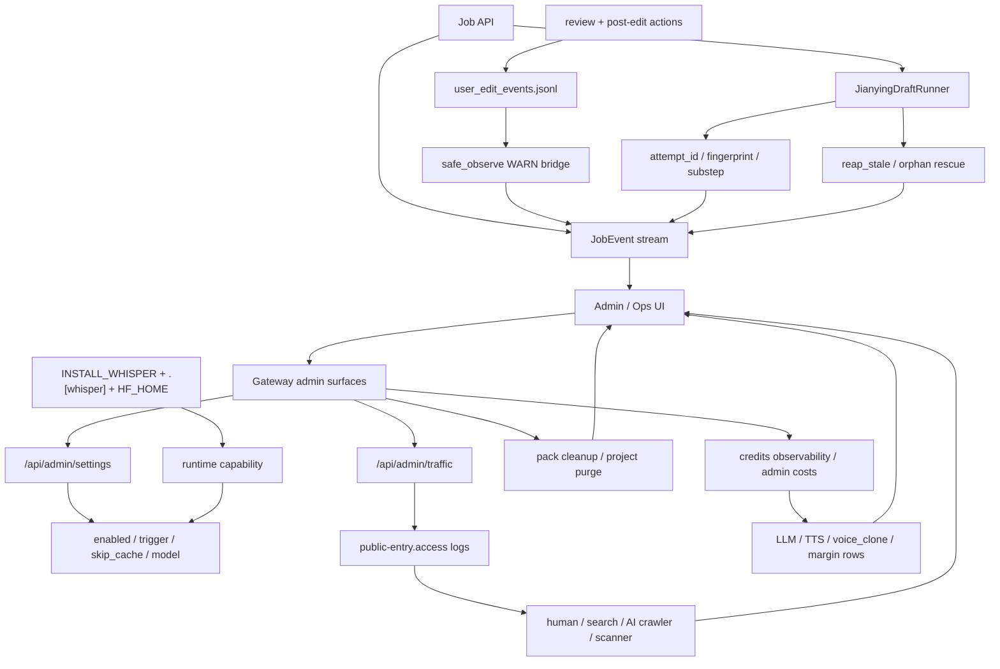

# GitNexus Admin / Ops / Calibration 图

关联总图：`docs/graphs/GITNEXUS_PROJECT_GRAPH.md`

## 1. 范围

这张子图只看控制平面与运维诊断面，重点是：

- admin settings 里的 whisper deliverable alignment 开关组
- whisper 的部署 capability 与缓存目录
- traffic analytics
- credits / cost management / cleanup
- Jianying runner orphan diagnosis
- `user-edit audit` 写失败时如何告警

## 2. 主图

## 3. 当前最重要的控制平面变化

### 3.1 whisper 现在是“两层控制”，不是单纯 admin 开关

- 运行时 policy 仍由 `gateway/admin_settings.py` 暴露：
  - `whisper_alignment_enabled`
  - `whisper_alignment_trigger`
  - `whisper_alignment_skip_cache`
  - `whisper_alignment_model`
- 部署 capability 则由：
  - `pyproject.toml` 的 `.[whisper]`
  - `Dockerfile` 的 `ARG INSTALL_WHISPER`
  - `docker-compose.yml` 的 `HF_HOME` 与持久模型缓存挂载

结论：管理员把开关打到 `on` 并不自动意味着节点具备运行 whisper 的能力，ops 还必须确保镜像和缓存层准备好。

### 3.2 traffic analytics 仍然是正式 admin surface

- `gateway/traffic_analytics.py` 是只读的 Caddy JSON access log parser
- 它输出的分类包括：
  - `likely_human_browser`
  - `search_engine`
  - `ai_crawler`
  - `automation_or_probe`
  - `scanner`
- `frontend-next/src/app/(app)/admin/traffic/page.tsx` 已经承接这套聚合结果

结论：运维面现在能直接看到“真实用户 / 搜索引擎 / AI crawler / 扫描器”分布，而不是只看原始日志。

### 3.3 admin 成本面已经扩成 `voice_clone` 与毛利读侧

- `gateway/cost_management.py` 的 `DEFAULT_PRICE_CATALOG` 新增 `minimax:voice_clone`
- 收费语义是“首次 T2A 使用 clone voice 时计一次 `rmb_per_clone = 9.9`”
- 前端 admin 成本页现在展示：
  - `voice_clone_cost_rmb`
  - `server_overhead_cost_rmb`
  - `margin_cost_rmb`
  - `gross_margin_pct`

结论：admin 控制面现在已经能直接回答“哪种工作流在亏钱、哪类 voice clone 在吃成本”。

### 3.4 Jianying runner 已经能给 ops 提供更细粒度诊断

- `jianying_draft_runner.py` 现在把 `attempt_id / fingerprint / substep` 持久化到 `JobRecord`
- stale rescue 结果会被发到 `JobEvent`
- fingerprint 还纳入了 `display_name` 与 whisper policy，因此 rename / policy 变化也会影响诊断语义

结论：ops 不再只能看到“running / failed”，而是能看到卡在哪个子步骤、是否命中 cache、是否因为 rename/policy 导致 cache miss。

### 3.5 cleanup 现在分成两条独立循环

- `gateway/main.py` 会恢复 stale background tasks
- 同文件还会周期性：
  - 清理过期 `materials_pack` zips
  - 清理过期 project records / `purged` 状态

结论：交付物 retention 和项目生命周期清理现在是正式的 Gateway 运维职责。

### 3.6 `user-edit audit` 仍然是 best-effort sidecar，但故障会桥接成 JobEvent 告警

- `user_edit_audit.py` 的 `safe_observe(...)` 会捕获 observer 失败
- 然后发一条 deduplicated `JobEvent(level=WARN)`，payload 带 `audit_write_failed`

结论：行为审计不会炸主路径，但坏了以后 ops 仍然能从 JobEvent 看出链路不完整。

## 4. 关键证据

- `gateway/admin_settings.py`
  - whisper policy fields
- `pyproject.toml`、`Dockerfile`、`docker-compose.yml`
  - `.[whisper]`
  - `INSTALL_WHISPER`
  - `HF_HOME`
- `frontend-next/src/app/(app)/admin/settings/page.tsx`
  - whisper settings UI
- `gateway/traffic_analytics.py`
  - Caddy log parser + traffic category model
- `frontend-next/src/app/(app)/admin/traffic/page.tsx`
  - admin traffic dashboard
- `gateway/cost_management.py`
  - `voice_clone` catalog
  - cost / margin rows
- `frontend-next/src/app/(app)/admin/costs/page.tsx`
  - admin cost dashboard
- `src/services/jobs/jianying_draft_runner.py`
  - substep / attempt_id / fingerprint / rescue
- `gateway/main.py`
  - cleanup loops
- `src/services/jobs/user_edit_audit.py`
  - WARN bridge

## 5. 什么情况下优先读这张图

- 想改 whisper admin settings 或部署开关
- 想理解 `skip_cache` 在 ops 侧到底意味着什么
- 想排查 crawler / scanner / human traffic 分布
- 想看 voice clone 成本与毛利读侧怎么进入 admin
- 想判断 runner orphan、audit 失败、cleanup 这几条告警线的边界
