# GitNexus Admin / Ops / Calibration 图

关联总图：`docs/graphs/GITNEXUS_PROJECT_GRAPH.md`

## 1. 范围

这张子图聚焦 Gateway 控制平面的 sidecar 轴线，重点是：

- admin pricing
- admin costs
- credits observability
- retention cleanup / purged 语义
- S2 monitor
- admin job logs / AI log analysis
- voice probe / calibration
- background tasks
- `job_intercept` 上的下载路由、显示名、TTL、quality tier 与镜像更新职责

其中前五项是 admin-only，后三项属于控制平面的运维化侧轴。

## 2. Admin / Ops / Calibration 主图

```mermaid
graph TD
    AdminPricing["AdminPricingPage"] --> AdminPricingAPI["admin pricing API"]
    AdminCosts["AdminCostManagementPage"] --> CostAPI["/api/admin/costs/*"]
    CreditsMonitor["CreditsMonitorPage"] --> CreditsAPI["/api/admin/credits/*"]
    S2Monitor["S2MonitorPage"] --> S2API["/api/admin/s2-stats*"]
    JobLogs["Admin job log tools"] --> LogAPI["/api/admin/jobs/{job_id}/logs + analysis"]
    VoiceLibrary["Voice library / probe / calibrate"] --> VoiceAPI["/gateway/user-voices/*"]
    ExportTasks["Workspace export tasks"] --> BgTaskAPI["/api/jobs/{job_id}/tasks*"]
    ProjectsOps["Project retention / purge sidecar"] --> Retention["project_cleanup.py + web_ui.cleanup"]
    Downloads["Download / rename / TTL / quality sidecar"] --> Intercept["job_intercept.py"]

    AdminPricingAPI --> PricingRuntime["pricing_runtime / plan_catalog"]
    CostAPI --> CostMgmt["cost_management.py"]
    CreditsAPI --> CreditsObs["credits_observability.py"]
    S2API --> S2Backend["s2_monitor_api.py"]
    LogAPI --> AdminJobMonitor["admin_job_monitor_api.py"]
    VoiceAPI --> Calibrator["voice_speed_calibrator.py"]
    BgTaskAPI --> BgQueue["background_task_queue.py"]
    Retention --> Purged["status='purged' / expires_at / admin-no-TTL"]
    Intercept --> DisplayName["display_name / filename / copy mirror"]
    Intercept --> StorageRoute["storage.event_log + backend_router bridge"]
    Intercept --> QualitySync["quality_tier / tts_model sync"]
    Intercept --> TTLSync["expires_at / post-edit TTL / merge guards"]

    BgQueue --> MaterialsPack["materials_pack executor"]
    BgQueue --> GenerateVideo["generate_video executor"]
    GenerateVideo --> RenderAsync["video_render_async.py"]
    RenderAsync --> Renderer["VideoRenderer"]

    PricingRuntime --> Truth["PricingPayload / PlanConfig truth"]
    CostMgmt --> Snapshot["Job.metering_snapshot + price catalog"]
    CreditsObs --> Ledger["credits buckets / cost metrics / outliers"]
    S2Backend --> S2Artifacts["S2 artifacts / attempts / summaries"]
    AdminJobMonitor --> JobAPI["Job API logs + result summary"]
    Calibrator --> SpeedCatalog["voice_speed_catalog.py"]
```

## 3. admin pricing 仍是发布面，不是真源

- `frontend-next/src/app/(app)/admin/pricing/page.tsx` 仍然通过：
  `getAdminPricing()`
  `savePricingDraft()`
  `publishPricing()`
- pricing 发布后的运行时读取仍回到：
  `gateway/main.py:lifespan -> get_runtime_pricing() -> PricingPayload`

结论：admin pricing 是受权限控制的发布面，不是独立真源。

## 4. admin costs 继续是正式只读能力

- `gateway/main.py` 显式 `include_router(cost_management_router)`
- `gateway/cost_management.py` 文件头明确声明：
  pipeline 写 usage facts
  Gateway 加载这些 facts
  应用 versioned price catalog
  返回可重算 estimates
- `frontend-next/src/app/(app)/admin/costs/page.tsx` 通过 `/api/admin/costs/jobs` 读取：
  总成本
  预估收入
  毛利 / 毛利率
  per-job LLM/TTS 细项

结论：admin costs 是基于 metering snapshot 的 read-only control-plane，而不是新的账本真源。

## 5. retention cleanup 现在有双层但分工明确的实现

### 5.1 Gateway 层

- `gateway/project_cleanup.py` 文件头明确说它拥有 authoritative DB transition
- 规则包括：
  terminal non-admin jobs 才能 purge
  admin jobs 永不过期
  unsafe path 只翻状态不删盘
  legacy row 可回退 `created_at + 7d`

### 5.2 Job API 层

- `src/services/web_ui/cleanup.py` 继续负责 JSON store / project dir 清理
- 它现在同样显式保护：
  `queued`
  `running`
  `waiting_for_review`
  `editing`
- 并共享 path whitelist guard

结论：现在是“Gateway 负责 DB lifecycle，Job API 负责 legacy disk cleanup”的双层保留期结构。

## 6. credits observability

- `frontend-next/src/app/(app)/admin/credits-monitor/page.tsx` 继续通过 admin 接口读取：
  `summary`
  `cost-metrics`
  `provider-breakdown`
  `outliers`
- `gateway/credits_observability.py` 仍然是 admin-only read surface

结论：credits monitor 是观测与核对，不是执行面。

## 7. S2 monitor 与 admin logs

### 7.1 S2 monitor

- `frontend-next/src/app/(app)/admin/s2-monitor/page.tsx` 调用：
  `fetchS2Stats(...)`
  `fetchJobDetail(jobId)`
- `gateway/s2_monitor_api.py` 聚合读取：
  `s2_review_result.json`
  `s2_pass1_result.json`
  `s2_pass2_result.json`
  `s2_pass3_result.json`

### 7.2 admin job logs / AI analysis

- `gateway/admin_job_monitor_api.py` 提供：
  `GET /api/admin/jobs/{job_id}/logs`
  以及 AI 日志裁剪与分析输入构造

结论：两者都是围绕运行产物做诊断的 sidecar。

## 8. job_intercept 现在也承接 TTL 与 merge guards

`gateway/job_intercept.py` 当前不只负责常规代理，还承担：

- 创建普通 job 时写入 `expires_at = now + 7d`
- admin job 不写 TTL
- merge `/job-api/jobs` 响应时，阻止 stale upstream JSON 复活 `purged` 行
- `copy_as_new` 时按同一 TTL 规则推导新副本 `expires_at`
- post-edit 入口按 `_post_edit_job_expires_at(job)` 阻止已过期任务继续编辑
- 下载、display_name、quality tier 同步等既有控制面职责

这说明 `job_intercept` 已经是 control-plane 的关键编排点，而不只是 proxy wrapper。

## 9. 这张图适合回答什么问题

- 哪些面是 admin-only，哪些只是控制平面的 sidecar
- admin pricing、admin costs、credits monitor、retention cleanup 分别站在什么层级
- 为什么 project cleanup 要拆成 Gateway DB cleanup + Job API disk cleanup 两层
- background tasks、download routing、TTL、quality sync、display_name 为什么不属于主 pipeline
- admin job 为什么“永不过期”
