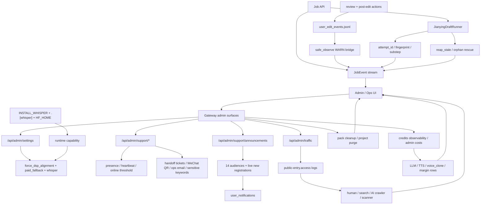

# GitNexus Admin / Ops / Calibration 图

关联总图：`docs/graphs/GITNEXUS_PROJECT_GRAPH.md`

## 1. 范围

这张子图只看控制平面与运维诊断面，重点是：

- alignment / whisper / paid fallback admin settings
- 客服管理与系统公告后台
- traffic analytics
- credits / cost management / cleanup
- Jianying runner orphan diagnosis
- `user-edit audit` 写失败时如何告警

## 2. 主图

## 3. 当前最重要的控制平面变化

### 3.1 alignment 控制面已经从 whisper 开到 `force_dsp` 与 paid fallback

- `gateway/admin_settings.py` 现在不仅有：
  - `whisper_alignment_enabled`
  - `whisper_alignment_trigger`
  - `whisper_alignment_skip_cache`
  - `whisper_alignment_model`
- 还新增：
  - `force_dsp_alignment`
- `src/services/alignment/aligner.py` 还会读取 `align_paid_fallback_max_concurrency`

结论：admin 控制面现在能直接影响“何时用 whisper、何时强制 DSP、付费 fallback 最多并发多少”。

### 3.2 whisper 仍然是“两层控制”，不是单纯 admin 开关

- 运行时 policy 由 `gateway/admin_settings.py` 暴露
- 部署 capability 则由：
  - `pyproject.toml` 的 `.[whisper]`
  - `Dockerfile` 的 `ARG INSTALL_WHISPER`
  - `docker-compose.yml` 的 `HF_HOME` 与持久模型缓存挂载

结论：管理员把开关打到 `on` 并不自动意味着节点具备运行 whisper 的能力，ops 还必须确保镜像和缓存层准备好。

### 3.3 客服后台已经成为正式 admin plane

- `gateway/main.py` 现在挂载了 `admin_support_router`
- `frontend-next/src/app/(app)/admin/support/page.tsx` 现在提供：
  - support 总开关
  - AI 模型 / token 价格 / 月预算
  - 敏感词
  - ops email
  - presence / online threshold
  - WeChat QR
  - handoff 工单面板

结论：admin 已经可以直接运维客服系统，而不只是看支持日志。

### 3.4 系统公告后台已经能做 audience fan-out 与 live onboarding

- `system_announcements_service.py` 声明了 14 类 audience
- 其中 `for_new_registrations` 是 live audience
- 后台支持 send / recall / stats，而 fan-out 结果以 `UserNotification` 进入用户通知中心

结论：运营触达已经进入正式控制面，不再是手工发消息或外部运营工具。

### 3.5 traffic analytics 与 cost management 仍然是独立控制面

- `gateway/traffic_analytics.py` 继续把访问流量分成 human / search / AI crawler / scanner
- `gateway/cost_management.py` 继续暴露：
  - `voice_clone_cost_rmb`
  - `server_overhead_cost_rmb`
  - `margin_cost_rmb`
  - `gross_margin_pct`

结论：增长诊断与成本控制仍然是 Gateway admin plane 的两条独立轴。

### 3.6 Jianying runner 与 cleanup 告警线继续收敛

- `jianying_draft_runner.py` 持续暴露 `attempt_id / fingerprint / substep`
- stale rescue 结果仍会发到 `JobEvent`
- `gateway/main.py` 仍负责：
  - stale background tasks recovery
  - 过期 `materials_pack` 清理
  - 过期 project records / `purged` 清理

结论：运维面已经能同时看任务 orphan、交付清理、项目保留期与 runner 子步骤。

## 4. 关键证据

- `gateway/admin_settings.py`
  - `force_dsp_alignment`
  - whisper policy fields
- `src/services/alignment/aligner.py`
  - paid fallback max concurrency
- `pyproject.toml`、`Dockerfile`、`docker-compose.yml`
  - `.[whisper]`
  - `INSTALL_WHISPER`
  - `HF_HOME`
- `gateway/admin_support_api.py`
  - admin support surfaces
- `frontend-next/src/app/(app)/admin/support/page.tsx`
  - support admin dashboard
- `gateway/system_announcements_service.py`
  - audience / send / recall / live dispatch
- `gateway/traffic_analytics.py`
  - Caddy log parser + traffic category model
- `gateway/cost_management.py`
  - voice clone / margin read model
- `src/services/jobs/jianying_draft_runner.py`
  - substep / attempt_id / fingerprint / rescue
- `gateway/main.py`
  - router composition
  - cleanup loops
- `src/services/jobs/user_edit_audit.py`
  - WARN bridge

## 5. 什么情况下优先读这张图

- 想改 alignment / whisper admin settings 或部署开关
- 想改客服后台、presence、handoff、系统公告后台
- 想排查 crawler / scanner / human traffic 分布
- 想看 voice clone 成本与毛利读侧怎么进入 admin
- 想判断 runner orphan、audit 失败、cleanup 这几条告警线的边界
