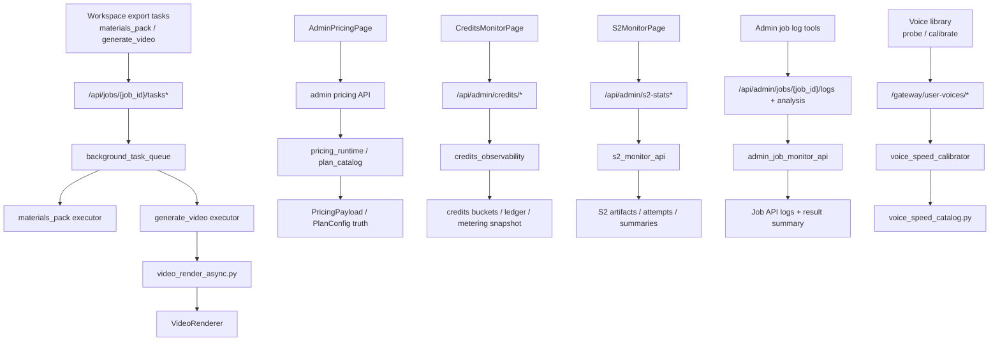

# GitNexus Admin / Ops / Calibration 图

关联总图：`docs/graphs/GITNEXUS_PROJECT_GRAPH.md`

## 1. 范围

这张子图聚焦 Gateway 控制平面的 sidecar 轴线，重点是：

- admin pricing
- credits observability
- S2 monitor
- admin job logs / AI log analysis
- voice probe / calibration
- 背景导出任务控制面

其中前四项是 admin-only，后两项属于控制平面的运维化侧轴。

## 2. Admin / Ops / Calibration 主图

## 3. admin pricing

- `frontend-next/src/app/(app)/admin/pricing/page.tsx` 仍然通过：
  `getAdminPricing()`
  `savePricingDraft()`
  `publishPricing()`
- pricing 发布后的运行时读取仍回到：
  `gateway/main.py:lifespan -> get_runtime_pricing() -> PricingPayload`

结论：admin pricing 是受权限控制的发布面，不是独立真源。

## 4. credits observability

- `frontend-next/src/app/(app)/admin/credits-monitor/page.tsx` 通过 `adminFetch()` 访问：
  `/summary`
  `/cost-metrics`
  `/provider-breakdown`
  `/outliers`
- `gateway/credits_observability.py` 文件头明确写明这是：
  `admin-only read surfaces`
  `does NOT gate job execution, modify data, or replace V2 truth`

结论：credits monitor 是观测与核对，不是执行面。

## 5. S2 monitor 与 admin logs

### 5.1 S2 monitor

- `frontend-next/src/app/(app)/admin/s2-monitor/page.tsx` 调用：
  `fetchS2Stats(...)`
  `fetchJobDetail(jobId)`
- `gateway/s2_monitor_api.py` 聚合读取：
  `s2_review_result.json`
  `s2_pass1_result.json`
  `s2_pass2_result.json`
  `s2_pass3_result.json`
  `s2_*_attempt*.json`

### 5.2 admin job logs / AI analysis

- `gateway/admin_job_monitor_api.py` 提供：
  `GET /api/admin/jobs/{job_id}/logs`
  以及 AI 日志裁剪与分析输入构造
- 它通过 `httpx` 读取 Job API 的 `/jobs/{job_id}/logs`

结论：两者都是“围绕运行产物做诊断”的 sidecar，不属于主 pipeline 内核。

## 6. voice calibration

- `frontend-next/src/lib/api/voiceLibrary.ts` 继续提供：
  `probeVoice()`
  `calibrateVoiceSpeed()`
- `gateway/voice_speed_calibrator.py` 仍然是可复用单声线校准模块
- `src/services/tts/voice_speed_catalog.py` 仍然优先消费已校准 `chars_per_second`

这条闭环没有变，但它已经成为稳定的控制平面能力，而不是临时脚本。

## 7. 背景导出任务控制面

### 7.1 Gateway API

`gateway/background_task_api.py` 当前提供：

- `POST /api/jobs/{job_id}/tasks`
- `GET /api/jobs/{job_id}/tasks/{task_id}`
- `GET /api/jobs/{job_id}/tasks/latest`
- `GET /api/jobs/{job_id}/tasks/{task_id}/download`

任务类型当前只有两类：

- `materials_pack`
- `generate_video`

### 7.2 Queue 语义

`gateway/background_task_queue.py` 明确说明：

- `params_fingerprint` 用于 dedupe
- `params_fingerprint` 同时用于 latest state restore

这意味着控制面关心的不是“有没有任务”，而是“这个 job 在这组参数下的最新任务身份”。

### 7.3 generate_video 执行面

- `src/services/jobs/video_render_async.py` 将状态写入 `publish/render_status.json`
- 它内部调用 `VideoRenderer().render(..., progress_callback=...)`
- `VideoRenderer` 现在提供进度回调、ambient 混音、poster 生成

结论：background export 已经从“前端按钮行为”提升为 Gateway 管理的标准 sidecar 能力。

## 8. 这张图适合回答什么问题

- 哪些面是 admin-only，哪些只是控制平面的 sidecar
- admin pricing、credits monitor、S2 monitor 分别站在什么层级
- background tasks 和主 pipeline 的边界在哪里
- voice calibration 为什么应该归到控制平面，而不是塞进主流程
