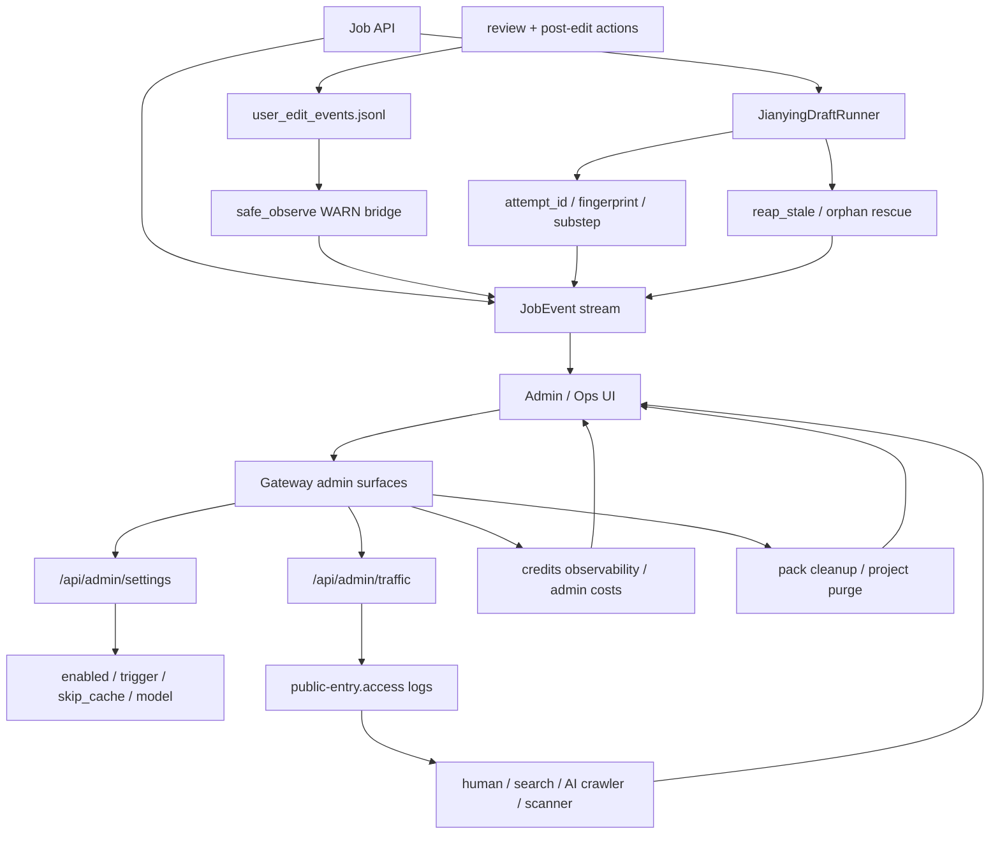

# GitNexus Admin / Ops / Calibration 图

关联总图：`docs/graphs/GITNEXUS_PROJECT_GRAPH.md`

## 1. 范围

这张子图只看控制平面与运维诊断面，重点是：

- admin settings 里的 whisper deliverable alignment 开关组
- traffic analytics
- credits / costs / cleanup
- Jianying runner orphan diagnosis
- `user-edit audit` 写失败时如何告警

## 2. 主图

## 3. 当前最重要的控制平面变化

### 3.1 admin settings 已经是 whisper deliverable alignment 的运行时控制面

- `gateway/admin_settings.py` 现在直接暴露：
  - `whisper_alignment_enabled`
  - `whisper_alignment_trigger`
  - `whisper_alignment_skip_cache`
  - `whisper_alignment_model`
- 前端 `admin/settings/page.tsx` 也已经有对应表单与说明文案

结论：whisper 何时跑、用什么模型、是否每次强制 fresh，现在都在 admin control plane 上可操作。

### 3.2 traffic analytics 已经是正式 admin surface

- `gateway/traffic_analytics.py` 是只读的 Caddy JSON access log parser
- 它输出的分类包括：
  - `likely_human_browser`
  - `search_engine`
  - `ai_crawler`
  - `automation_or_probe`
  - `scanner`
- `frontend-next/src/app/(app)/admin/traffic/page.tsx` 已经承接这套聚合结果

结论：运维面现在能直接看到“真实用户 / 搜索引擎 / AI crawler / 扫描器”分布，而不是只看原始日志。

### 3.3 Jianying runner 已经能给 ops 提供更细粒度诊断

- `jianying_draft_runner.py` 现在把 `attempt_id / fingerprint / substep` 持久化到 `JobRecord`
- stale rescue 结果会被发到 `JobEvent`

结论：ops 不再只能看到“running / failed”，而是能看到卡在哪个子步骤、是否命中 cache、是否被 stale rescue。

### 3.4 cleanup 现在分成两条独立循环

- `gateway/main.py` 会恢复 stale background tasks
- 同文件还会周期性：
  - 清理过期 `materials_pack` zips
  - 清理过期 project records / `purged` 状态

结论：交付物 retention 和项目生命周期清理现在是正式的 Gateway 运维职责。

### 3.5 `user-edit audit` 仍然是 best-effort sidecar，但故障会桥接成 JobEvent 告警

- `user_edit_audit.py` 的 `safe_observe(...)` 会捕获 observer 失败
- 然后发一条 deduplicated `JobEvent(level=WARN)`，payload 带 `audit_write_failed`

结论：行为审计不会炸主路径，但坏了以后 ops 仍然能从 JobEvent 看出链路不完整。

## 4. 关键证据

- `gateway/admin_settings.py`
  - whisper policy fields
- `frontend-next/src/app/(app)/admin/settings/page.tsx`
  - whisper settings UI
- `gateway/traffic_analytics.py`
  - Caddy log parser + traffic category model
- `frontend-next/src/app/(app)/admin/traffic/page.tsx`
  - admin traffic dashboard
- `src/services/jobs/jianying_draft_runner.py`
  - substep / attempt_id / fingerprint / rescue
- `gateway/main.py`
  - cleanup loops
- `src/services/jobs/user_edit_audit.py`
  - WARN bridge

## 5. 什么情况下优先读这张图

- 想改 whisper admin settings
- 想理解 `skip_cache` 在 ops 侧到底意味着什么
- 想排查 crawler / scanner / human traffic 分布
- 想判断 runner orphan、audit 失败、cleanup 这几条告警线的边界
