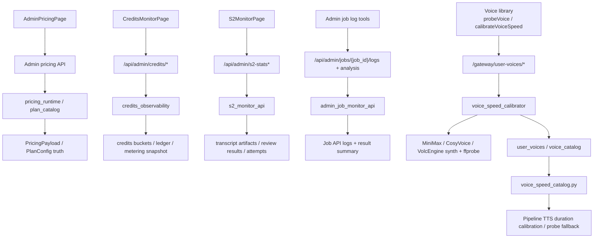

# GitNexus Admin / Ops / Calibration 图

关联总图：`docs/graphs/GITNEXUS_PROJECT_GRAPH.md`

## 1. 范围

这张子图聚焦新增的管理、运维和校准轴线，重点是：

- admin pricing
- credits observability
- S2 monitor
- admin job logs / AI log analysis
- voice probe / voice speed calibration

## 2. Admin / Ops / Calibration 主图

## 3. admin pricing

- `frontend-next/src/app/(app)/admin/pricing/page.tsx` 调用：
  `getAdminPricing()`
  `savePricingDraft()`
  `publishPricing()`
- GitNexus process 当前能直接识别：
  `AdminPricingPage -> ForbiddenError`
- pricing 发布后的运行时读取仍回到：
  `gateway/main.py:lifespan -> get_runtime_pricing() -> PricingPayload`

结论：admin pricing 是受权限控制的运维发布面，不是独立真源。

## 4. credits observability

- `frontend-next/src/app/(app)/admin/credits-monitor/page.tsx` 通过 `adminFetch()` 访问：
  `/summary`
  `/cost-metrics`
  `/provider-breakdown`
  `/outliers`
- `gateway/credits_observability.py` 文件头明确说明这是：
  `admin-only read surfaces`
  `does NOT gate job execution, modify data, or replace V2 truth`
- 该模块直接汇总：
  `CreditsBucket`
  `CreditsLedger`
  `Job.metering_snapshot`

这条链是“观测与核对”，不是“执行与决策”。

## 5. S2 monitor 与日志分析

### 5.1 S2 monitor

- `frontend-next/src/app/(app)/admin/s2-monitor/page.tsx` 调用：
  `fetchS2Stats(days, limit, offset, serviceMode, reviewModel)`
  `fetchJobDetail(jobId)`
- `gateway/s2_monitor_api.py` 通过项目目录读取：
  `s2_review_result.json`
  `s2_pass1_result.json`
  `s2_pass2_result.json`
  `s2_pass3_result.json`
  `s2_*_attempt*.json`

结论：S2 monitor 主要读取已落盘的审核产物做聚合与异常定位，不进入主执行面。

### 5.2 admin job logs / AI analysis

- `gateway/admin_job_monitor_api.py` 提供：
  `GET /api/admin/jobs/{job_id}/logs`
  以及面向 AI 的日志裁剪与分析输入构建
- 该模块通过 `httpx` 调用 Job API 的 `/jobs/{job_id}/logs`

这条链是“面向维护者的旁路可观测性”，而不是 pipeline 内核的一部分。

## 6. voice probe / calibration

### 6.1 前端入口

- `frontend-next/src/lib/api/voiceLibrary.ts` 当前 voice library 的真源是 `/gateway/user-voices`
- 同文件暴露：
  `probeVoice(voiceId, ...)`
  `calibrateVoiceSpeed(voiceId)`
- `calibrateVoiceSpeed()` 会调用：
  `POST /gateway/user-voices/{id}/calibrate-speed`

### 6.2 Gateway 校准器

- `gateway/voice_speed_calibrator.py` 文件头明确写明它从批量脚本中抽出，复用于：
  批量脚本写 `voice_catalog`
  单个 endpoint 写 `user_voices`
- 该模块只负责：
  synth + ffprobe -> 得到 cps
  不直接碰数据库
- 这样 caller 可以自行决定写入 `voice_catalog`、`user_voices` 或只做一次性探测

### 6.3 pipeline 消费端

- `src/services/tts/voice_speed_catalog.py` 优先从 Gateway 读取已校准 `chars_per_second`
- 当系统 voice catalog 或 user voice 都没有条目时，caller 才 fallback 到 probe-TTS

所以 calibration 已经形成一条闭环：

- UI 触发显式校准
- Gateway 跑标准文本 synth + ffprobe
- 校准结果写入 voice store
- pipeline 下次优先消费已校准 cps

## 7. 这张图适合回答什么问题

- admin pricing、credits monitor、S2 monitor 分别服务什么，不该混到哪里
- 哪些 admin 面只是观测与发布，哪些会影响 runtime truth
- voice calibration 为什么要单独成轴，而不是埋在 pipeline 里
- pipeline 何时使用预校准速度，何时 fallback 到 probe
