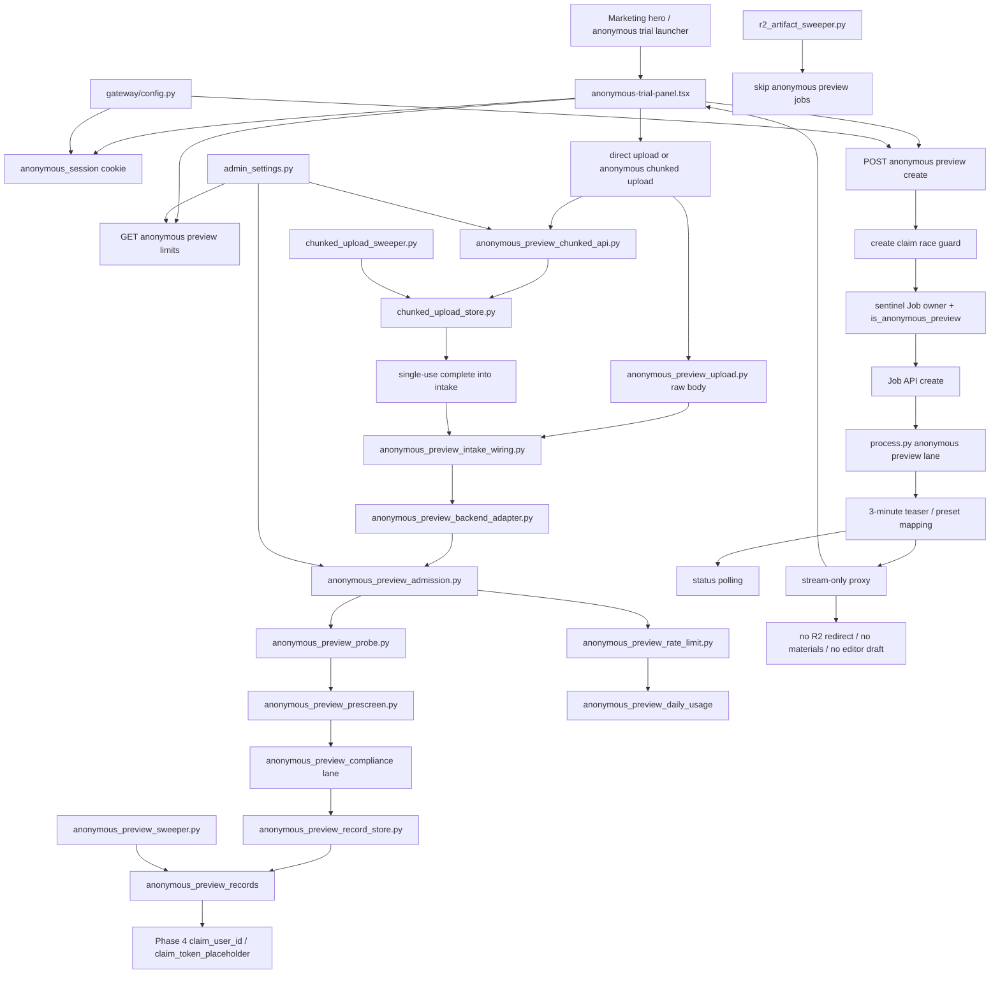

# GitNexus Anonymous Preview / Chunked Upload 图

关联总图：`docs/graphs/GITNEXUS_PROJECT_GRAPH.md`

## 1. 范围

这张子图看的是“未登录用户如何从营销页进入匿名预览，以及 direct / chunked upload 如何进入 APF intake”，重点是：

- marketing anonymous trial launcher / panel
- anonymous session cookie
- APF limits、admission、rate limit、probe、prescreen、compliance
- direct binary upload 与 anonymous chunked upload
- `anonymous_preview_records` / `anonymous_preview_daily_usage`
- sentinel Job row 与 `is_anonymous_preview`
- preview create/status/stream
- stream-only teaser 与 R2/download 边界
- APF sweeper、chunked upload sweeper、storage health
- Phase 4 user claim placeholder

## 2. 主图

## 3. 当前核心认知

### 3.1 Anonymous Preview 是未登录试用 lane，不是完整任务

- Gateway 通过 `enable_anonymous_preview`、admin `anonymous_free_preview_enabled` 和 APF limits 控制入口。
- `anonymous_preview_records` 记录 preview id、source、probe、status、job id 和 claim placeholder。
- create 阶段写 sentinel Job row，并带 `is_anonymous_preview=True`。
- pipeline 看到 `anonymous_preview` 后走严格 preview lane，Pass3 会跳过，voice strategy 受限为 preset mapping。

结论：匿名预览是 marketing funnel 的 teaser lane，不能替代登录后的正式 paid/free job。

### 3.2 direct upload 和 anonymous chunked upload 都必须进入 intake/admission

- direct upload 先经过 body size / MIME / session / peek 限制，再进入 intake。
- anonymous chunked upload 复用 chunked store 状态机，但完成后是一次性消费进入 intake，不保留 registered-user ready claim 语义。
- APF admission 同时看 max upload、max seconds、global/IP/device/source daily cap 和 storage health。
- probe/prescreen/compliance 在 preview create 前尽量 fail closed，保护未登录流量成本。

结论：上传通道只是传输差异；真正的业务 gate 仍是 APF intake/admission。

### 3.3 stream-only 是交付边界

- anonymous preview stream 通过 Gateway local proxy 返回 teaser，不走 R2 redirect。
- `r2_artifact_sweeper.py` 明确跳过 anonymous preview jobs。
- preview 不产生 materials pack、editor draft zip、clean audio 或完整下载 key。
- `claim_user_id` / `claim_token_placeholder` 仍是 Phase 4 留行，不应在当前图谱中当作已上线登录后认领。

结论：匿名预览交付面只有 teaser stream，不能把 placeholder 字段解释成完整用户认领功能。

### 3.4 Sweeper 是匿名流量的成本刹车

- `anonymous_preview_sweeper.py` 清理 blocked / expired record、媒体文件、过期 session 和旧 daily usage。
- `chunked_upload_sweeper.py` 清理 expired part dirs、orphan dirs、unclaimed ready files。
- registered-user chunked upload 有 ready/claim 闭环；anonymous chunked upload 是单次 intake 消费。

结论：APF 的可靠性不只在 create path，还依赖匿名 preview 和 chunked upload 两套 TTL 清理。

## 4. 关键证据

- `frontend-next/src/components/marketing/anonymous-trial-launcher.tsx`
  - marketing entry
- `frontend-next/src/components/marketing/anonymous-trial-panel.tsx`
  - upload / create / polling / stream UI
- `frontend-next/src/lib/api/anonymousPreview.ts`
  - frontend anonymous preview API client
- `gateway/anonymous_session.py`
  - anonymous session cookie dependencies
- `gateway/anonymous_preview_api.py`
  - limits / status / stream / create router
- `gateway/anonymous_preview_upload.py`
  - direct upload body path
- `gateway/anonymous_preview_chunked_api.py`
  - anonymous chunked upload path
- `gateway/chunked_upload_store.py`
  - registered-user chunked upload state machine and claim lifecycle
- `gateway/chunked_upload_sweeper.py`
  - chunked upload TTL cleanup
- `gateway/anonymous_preview_intake_wiring.py`
  - Gateway wiring into pure intake contract
- `src/services/anonymous_preview_intake.py`
  - pure intake contract
- `src/services/anonymous_preview_backend_adapter.py`
  - adapter between Gateway facts and intake contract
- `src/services/anonymous_preview_admission.py`
  - APF admission policy
- `src/services/anonymous_preview_rate_limit.py`
  - rate-limit counter wrapper
- `gateway/anonymous_preview_probe.py`
  - ffprobe / teaser destination helper
- `gateway/anonymous_preview_prescreen.py`
  - filename/content prescreen
- `gateway/anonymous_preview_record_store.py`
  - preview record persistence
- `gateway/anonymous_preview_quota.py`
  - daily usage counters
- `gateway/anonymous_preview_sweeper.py`
  - preview TTL cleanup
- `gateway/alembic/versions/035_anonymous_preview.py`
  - schema for anonymous preview records / daily usage / Job marker
- `src/pipeline/process.py`
  - anonymous preview marker handling
- `src/services/r2_publisher_lib/downloadable_keys.py`
  - anonymous/free artifact boundary
- `gateway/r2_artifact_sweeper.py`
  - skip anonymous preview jobs

## 5. 什么时候优先读这张图

- 想改 marketing 匿名试用入口
- 想排查 anonymous preview upload / create / status / stream
- 想排查 APF limits、daily quota、rate limit、probe、prescreen、compliance
- 想改 direct upload 或 anonymous chunked upload
- 想排查 chunked upload ready / claim / sweeper 生命周期
- 想确认为什么匿名预览没有 R2、materials pack、editor draft 或完整下载
- 想确认 `claim_user_id` / `claim_token_placeholder` 仍只是 Phase 4 placeholder
