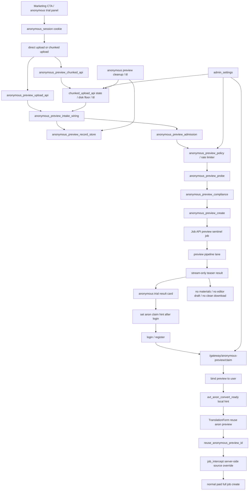

# GitNexus Anonymous Preview Funnel 图

关联总图：`docs/graphs/GITNEXUS_PROJECT_GRAPH.md`

## 1. 范围

这张子图看的是“未登录用户如何从营销页试用匿名预览，并在登录后把预览转成完整任务”，重点是：

- marketing anonymous trial panel
- anonymous session cookie 与 preview id
- direct upload / chunked upload 两条上传通道
- admission、quota、rate limit、probe 与 compliance preflight
- anonymous preview sentinel job 与 stream-only teaser
- post-login claim 与 convert-to-full
- `reuse_anonymous_preview_id` 服务端复用源文件
- admin APF / chunked upload / claim / smart preview clone 开关
- TTL cleanup 与 R2/download 边界

## 2. 主图

## 3. 当前核心认知

### 3.1 匿名预览是拉新试用，不是匿名完整任务

- 匿名用户只得到 teaser / stream-only 预览结果。
- preview id 不是凭证，所有敏感动作仍要靠匿名 session、登录 session 与服务端 ownership 判断。
- 预览结果不暴露 materials pack、clean audio、剪映草稿或完整下载面。
- 登录后的完整任务仍进入普通付费 create flow，不能把匿名预览直接升级成已付费任务。

结论：匿名预览属于营销漏斗入口，不应绕开正式任务、权益和下载边界。

### 3.2 direct upload 与 chunked upload 是传输层选择

- 小文件可走 direct anonymous preview upload。
- 大文件或不稳定网络可走 chunked upload，受 per-user / anonymous / global inflight、daily GB、disk floor、TTL 等限制。
- chunked upload 的 ready artifact 仍要进入 intake/admission，不直接创建 Job。
- admin chunked upload knobs 用来控风险，不改变业务权益。

结论：chunked upload 解决上传可靠性和磁盘压力，不是新的存储真源。

### 3.3 admission 在创建预览前集中拦截风险

- APF limits 覆盖 in-flight、上传大小、秒数、global/day、IP/device/source/mode 维度。
- probe 与 compliance 在预览任务前尽量 early reject，避免未登录流量放大后端成本。
- `anonymous_preview_claim_enabled` 与 `smart_preview_clone_enabled` 都是 admin-controlled rollout gate。

结论：匿名预览的成本闸应尽量前移到 Gateway/admission，而不是等 pipeline 失败。

### 3.4 claim 与 convert-to-full 是两步

- `claim` 只把匿名预览绑定到登录用户，方便后续继续使用。
- 前端只保存非敏感 hint，例如 preview id 与 24h 过期时间。
- `TranslationForm` 提交 `reuse_anonymous_preview_id` 后，由 Gateway/Job API 服务端复用源文件；前端不能自行拼接源路径。
- D7 转完整时自动克隆相关 lanes 被 neutralize，完整任务仍按显式模式和用户选择执行。

结论：claim 是 ownership 绑定，convert 是正式任务创建，两者不能合并成前端本地状态切换。

## 4. 关键证据

- `frontend-next/src/components/marketing/anonymous-trial-panel.tsx`
  - anonymous trial UI
  - retry failed preview with same preview id
  - post-login claim hint
- `frontend-next/src/lib/api/claim.ts`
  - `/gateway/anonymous-preview/claim`
  - `avt_anon_convert_ready` non-sensitive local hint
- `frontend-next/src/components/workspace/TranslationForm.tsx`
  - reads anon convert hint
  - submits `reuse_anonymous_preview_id`
- `gateway/anonymous_preview_api.py`
  - preview claim / create / status API
- `gateway/anonymous_preview_chunked_api.py`
  - anonymous chunked upload API
- `gateway/anonymous_preview_intake_wiring.py`
  - intake bridge from upload to preview create
- `gateway/anonymous_preview_policy.py`
  - anonymous preview gates and mode policy
- `gateway/admin_settings.py`
  - APF limits
  - claim switch
  - smart preview clone switch
  - chunked upload settings
- `src/services/anonymous_preview_admission.py`
  - preview admission checks
- `src/services/anonymous_preview_rate_limit.py`
  - per-IP / per-device / per-source limits
- `src/services/anonymous_preview_probe.py`
  - media probe preflight
- `src/services/anonymous_preview_compliance.py`
  - compliance preflight
- `src/services/anonymous_preview_record_store.py`
  - preview record persistence
- `gateway/job_intercept.py`
  - server-side reuse of anonymous preview source

## 5. 什么时候优先读这张图

- 想改营销页匿名试用入口
- 想排查匿名预览为什么被 APF / quota / rate limit 拒绝
- 想改匿名 direct upload 或 chunked upload
- 想排查未登录预览为什么没有完整下载或剪映草稿
- 想改登录后 claim、convert-to-full、`reuse_anonymous_preview_id`
- 想确认匿名预览不会绕过正式付费任务、权益和下载边界
