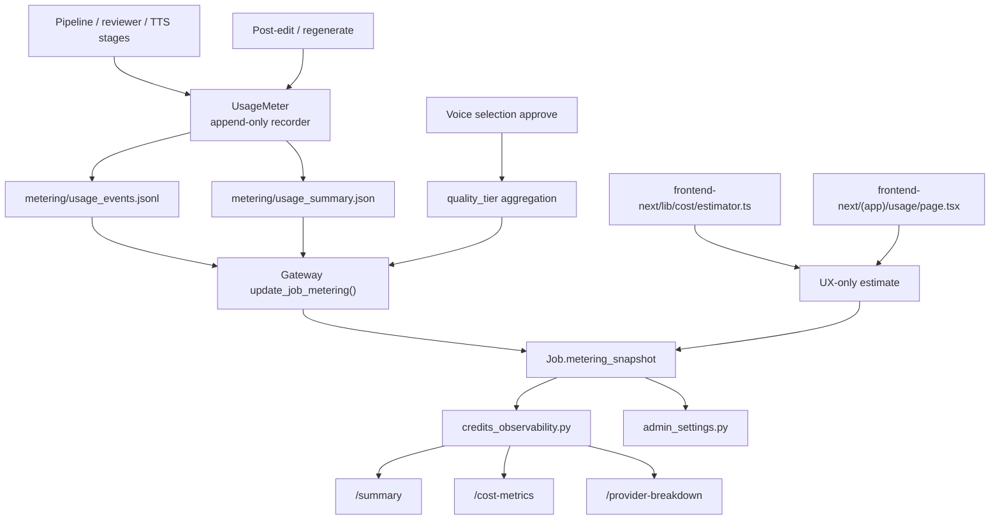

# GitNexus 基准 / 质量 / 成本图

关联总图：`docs/graphs/GITNEXUS_PROJECT_GRAPH.md`

## 1. 范围

这张子图只看 metering、质量档位与成本观测 sidecar，重点是：

- pipeline / reviewer / TTS 如何记录 usage event
- `UsageMeter` 如何落盘为 append-only job sidecar
- Gateway 如何把 metering 字段写回 `Job.metering_snapshot`
- admin / observability 如何读取 `summary`、`cost-metrics`、`provider-breakdown`
- 预估器、展示页与真实结算真源之间的边界

不展开支付扣费、主 workflow 阶段或下载路由的实现细节。

## 2. 主图

## 3. 核心证据链

### 3.1 UsageMeter 是 append-only sidecar，不是主流程成败条件

- `src/services/usage_meter.py` 头部常量已经区分：
  `first_tts`
  `probe_tts`
  `post_tts_resynth`
  `post_edit_resynth`
  `interactive_preview`
- `UsageMeter` 注释明确说明：
  这是 append-only per-job LLM/TTS usage recorder
  recording failures 是 warning，不是 pipeline failures
- 事件和摘要落盘位置是：
  `metering/usage_events.jsonl`
  `metering/usage_summary.json`

结论：metering 是围绕 job 的 sidecar 账本，不应阻塞主 workflow。

### 3.2 质量档位与 metering snapshot 由 Gateway 汇总回写

- `gateway/job_intercept.py` 的 `update_job_metering()` 暴露 `POST /job-api/jobs/{job_id}/metering`
- 同函数负责把 pipeline 传回来的 metering 字段 merge 到 `Job.metering_snapshot`
- 语音审核审批路径也会聚合并写回 `quality_tier`
- `gateway/models.py` 已经为 `Job.metering_snapshot` 预留结构化字段承载这些快照

结论：真实的 job 级 metering / quality snapshot 真源在 Gateway DB，而不是前端页面或本地估算器。

### 3.3 admin / observability 当前是主要消费面

- `gateway/credits_observability.py` 文件头就写明它提供 shadow credits / metering 观测接口
- 同文件当前暴露：
  `GET /api/admin/credits/summary`
  `GET /api/admin/credits/cost-metrics`
  `GET /api/admin/credits/provider-breakdown`
- 这些接口直接围绕 `Job.metering_snapshot`、bucket coverage、provider 统计和质量/成本分布做读取

结论：当前可操作的质量/成本观测面主要在 admin / observability，而不是普通 workspace 页面。

### 3.4 前端存在展示和预估，但不是真结算

- `frontend-next/src/app/(app)/usage/page.tsx` 当前仍是“此功能正在开发中”的占位页
- `frontend-next/src/lib/cost/estimator.ts` 只是按时长、模型与音色克隆需求做粗粒度预估
- 这类估算可以服务 UX、销售或自检，但不能替代 Gateway 里的 metering snapshot、credits service 或 provider 结算真源

结论：预估与真结算必须严格分层。

## 4. 当前边界

- metering / quality / cost 当前已经值得单独成图。
- 这条轴线仍是 sidecar，不应误画成 pipeline 主阶段。
- 用户侧 `usage` 产品面还没有真正落地，当前重点仍是 admin 观测、benchmark 和成本诊断。

## 5. 这张图适合回答什么问题

- usage event 是在哪一层记录的，失败会不会打断主流程
- job 级 metering snapshot 和 quality tier 到底谁负责回写
- `cost-metrics`、`provider-breakdown`、`summary` 这些 admin 观测口从哪里读
- 为什么 `cost estimator` 和用户可见页面不能被当成结算真源
