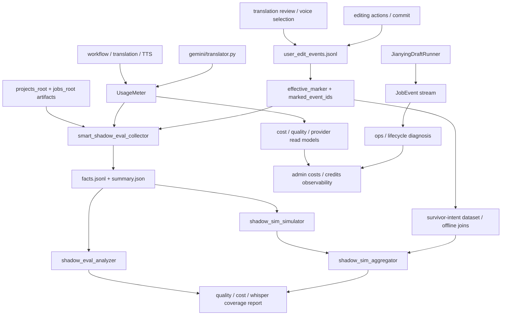

# GitNexus Benchmark / Quality / Cost 图

关联总图：`docs/graphs/GITNEXUS_PROJECT_GRAPH.md`

## 1. 范围

这张子图看的是“哪些 sidecar 数据用来做成本、质量、行为分析”，重点是：

- `UsageMeter`
- attempt-level LLM / TTS audit
- `user_edit_events.jsonl`
- `effective_marker.marked_event_ids`
- `smart_shadow_eval / smart_shadow_sim`
- `JobEvent` 生命周期流

## 2. 主图

## 3. 现在的核心认知

### 3.1 sidecar 已经分成三条，不再混在一起

- `JobEvent`
  - 生命周期 / 状态变化 / 控制面诊断
- `UsageMeter`
  - LLM / TTS / voice clone 计量与成本
- `user_edit_events.jsonl`
  - 用户行为 / 编辑动作 / effective markers

结论：这三条 sink 有意分工，不再尝试让一条日志同时承担三类职责。

### 3.2 `UsageMeter` 已进入 attempt-level LLM 记录，并与 admin 成本读侧直接连通

- `usage_meter.py` 的 `record_llm(...)` 支持：
  - `attempt_label`
  - `success`
  - `error`
  - `extra` 结构化字段
- `translator.py` 在 fallback / retry 路径上开始记录：
  - `duration_ms`
  - `fallback_from`
  - `fallback_to`
  - `error_class`
  - `error_code`
  - `fallback_policy_source`
- `gateway/cost_management.py` 会把这些计量聚合成 per-job 成本 / 毛利读侧，并新增 `voice_clone` 成本行

结论：metering 不再只是“总共多少 token / chars”，而是开始携带失败、回退、尝试级别的质量证据，并直接进入 admin 成本面。

### 3.3 `effective_marker.marked_event_ids` 现在是行为归因主键

- `user_edit_audit.py` 仍然采用 append-only JSONL
- `effective` 通过追加 `effective_marker` 表示，不回写历史
- marker 里的 `marked_event_ids` 表示最终存活到提交结果的 prior intent 事件集合
- 最近修复已经围绕“collector two-pass reads marked_event_ids from effective_marker events”与 survivor logic 展开

结论：行为分析不再只能看“用户做过什么”，还能看“哪些动作真的进入了最终产物”。

### 3.4 `smart_shadow_eval / sim` 已经形成稳定离线分析面

- `smart_shadow_eval_collector.py`
  - stdlib-only、read-only
  - 收集 `review_state`、`editor_segments`、`subtitle_cues`、`usage_events.jsonl`、`user_edit_events.jsonl`
- `smart_shadow_eval_analyzer.py`
  - 生成 `report.md`
  - 报告真实 whisper coverage、speaker 分布、subtitle drift、cost / margin / risk
- `smart_shadow_sim_simulator.py`
  - 对 `eligibility_gate`、`voice_sample_selection`、`translation_review_auto_approval`、`tts_duration_repair_policy`、`subtitle_sync_policy` 做离线决策
  - 明确把 length-overflow 信号视为 soft signal，不直接触发动作
- `smart_shadow_sim_aggregator.py`
  - 汇总 stage diff、unevaluable rate、retry estimation、P2 readiness、user edit observations

结论：仓库现在已经具备不依赖线上付费调用的影子评估闭环。

### 3.5 audit 写失败不会影响主路径

- `safe_observe(...)` 把 observer 失败降级成 WARN JobEvent
- dedup window 防止同一类失败刷屏

结论：行为采样是可观测性增强，不是阻断业务的强事务。

## 4. 关键证据

- `src/services/usage_meter.py`
  - `record_llm(...)` 的 attempt-level 结构
- `src/services/gemini/translator.py`
  - fallback / retry / duration / error 分类写入 metering
- `gateway/cost_management.py`
  - voice clone / margin read model
- `src/services/jobs/user_edit_audit.py`
  - append-only JSONL
  - `effective_marker`
  - `marked_event_ids`
  - `safe_observe(...)`
- `src/services/jobs/service.py`
  - review / post-edit 行为审计 emitters
  - survivor marker emit path
- `scripts/smart_shadow_eval_collector.py`
  - facts collection
- `scripts/smart_shadow_eval_analyzer.py`
  - report generation
- `scripts/smart_shadow_sim_simulator.py`
  - stage decisions
- `scripts/smart_shadow_sim_aggregator.py`
  - aggregate verdict / P2 readiness

## 5. 什么时候优先读这张图

- 想做 LLM / TTS / voice clone 成本或失败率分析
- 想做用户修改行为数据集，尤其是 survivor-intent join
- 想理解 `smart_shadow_eval / sim` 的输入、输出与边界
- 想判断某个事件该进 `JobEvent`、`UsageMeter` 还是 `user_edit_events.jsonl`
