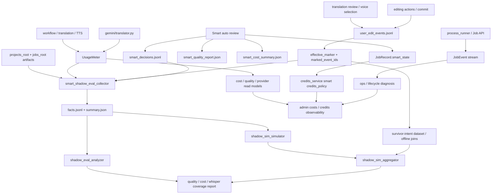

# GitNexus Benchmark / Quality / Cost 图

关联总图：`docs/graphs/GITNEXUS_PROJECT_GRAPH.md`

## 1. 范围

这张子图看的是“哪些 sidecar 数据用来做成本、质量、行为分析”，重点是：

- `UsageMeter`
- attempt-level LLM / TTS audit
- Smart sidecar trio
- `user_edit_events.jsonl`
- `effective_marker.marked_event_ids`
- `smart_shadow_eval / smart_shadow_sim`
- Smart credits policy 与 terminal settlement

## 2. 主图

## 3. 当前核心认知

### 3.1 sidecar 现在分成四条，不再混在一起

- `JobEvent`
  - 生命周期 / 状态变化 / 控制面诊断
- `UsageMeter`
  - LLM / TTS / voice clone 计量与成本
- `user_edit_events.jsonl`
  - 用户行为 / 编辑动作 / effective markers
- Smart sidecar
  - `smart_decisions.jsonl`
  - `smart_quality_report.json`
  - `smart_cost_summary.json`

结论：系统行为、用户行为、资源计量、Smart 决策审计各自有独立 sink。

### 3.2 Smart decisions 是系统行为记录，不是用户行为

- `sidecar_emitter.py` 明确不写 `user_edit_events.jsonl`。
- `smart_decisions.jsonl` 与 user edit audit 同在 `audit/` 目录，便于 admin tooling 统一采集。
- sidecar emit 失败不阻断主流程，调用方应记录 WARN JobEvent。

结论：Smart 审核数据可用于质量分析，但不能当作用户编辑意图。

### 3.3 `UsageMeter` 继续承接 attempt-level 成本证据

- `usage_meter.py` 支持 `attempt_label / success / error / extra`。
- translator / TTS / fallback 路径都可以把失败、回退、duration、provider 信息带入 usage events。
- admin 成本读侧继续聚合 LLM / TTS / voice clone / margin。

结论：成本面不只是 token/char 总量，而是带尝试级失败与回退证据。

### 3.4 Smart credits policy 进入 terminal settlement

- `settle_job_credit_ledger(...)` 会先看 `smart_state.credits_policy`。
- `refund_full`、`capture_full`、`capture_actual_cost_capped_at_studio_price` 是当前 dispatcher 分支。
- clone refund 与 partial capture 当前仍是 stub，日志会显式报警。

结论：Smart 的结算策略有审计入口，但部分真实财务动作仍需后续实现。

### 3.5 `effective_marker.marked_event_ids` 仍是行为归因主键

- `user_edit_audit.py` 采用 append-only JSONL。
- `effective_marker` 表示最终存活的 prior intent。
- `marked_event_ids` 让离线分析区分“用户做过什么”和“最终产物采纳了什么”。

结论：用户行为分析仍以 survivor-intent join 为核心。

### 3.6 `smart_shadow_eval / sim` 是离线验证闭环

- collector 汇总 review state、editor segments、subtitle cues、usage events、user edit events、Smart decisions。
- simulator 对 eligibility、voice sample、translation auto approval、TTS duration repair、subtitle sync policy 做离线决策。
- aggregator 汇总 stage diff、unevaluable rate、retry estimation、R2 readiness、user edit observations。

结论：Smart 上线前后的质量/成本判断可以在离线 sidecar 上完成，不需要引入线上付费评估调用。

## 4. 关键证据

- `src/services/smart/sidecar_emitter.py`
  - Smart sidecar trio
  - failure semantics
- `src/services/usage_meter.py`
  - attempt-level usage
- `gateway/credits_service.py`
  - Smart credits policy dispatcher
- `src/services/jobs/user_edit_audit.py`
  - append-only user audit
  - effective marker
- `scripts/smart_shadow_eval_collector.py`
  - facts collection
- `scripts/smart_shadow_eval_analyzer.py`
  - report generation
- `scripts/smart_shadow_sim_simulator.py`
  - stage decisions
- `scripts/smart_shadow_sim_aggregator.py`
  - aggregate verdict / readiness

## 5. 什么时候优先读这张图

- 想做 LLM / TTS / voice clone 成本或失败率分析
- 想做 Smart 自动审核质量分析
- 想改 Smart sidecar、quality report、cost summary
- 想改 Smart credits policy 或 terminal settlement
- 想做用户修改行为数据集，尤其是 survivor-intent join
