# GitNexus Benchmark / Quality / Cost 图

关联总图：`docs/graphs/GITNEXUS_PROJECT_GRAPH.md`

## 1. 范围

这张子图看的是“哪些 sidecar 数据用来做成本、质量、行为分析”，重点是：

- `UsageMeter`
- attempt-level LLM / TTS audit
- provider/model 维度 TTS 与 post-edit re-synthesis 计量
- voice clone / voice reuse / voice candidate rejection 计量
- CosyVoice mainland worker billed chars 与 worker request id
- RMB-direct provider/model cost catalog
- OpenAI-compatible provider usage capture，尤其是 MiMo v2.5 text/audio tokens
- MiMo TTS v2.5 limited-free promotional pricing
- MiMo voiceclone usage/cost visibility for free tier
- free=0 debit truth 与免费档 artifact/watermark observability
- Smart Preview 600 点 clone reservation、preview minute release 与 full-job carryover offset
- Paddle / WeChat provider status、refund closure 与 billing reconciliation 观测
- Smart sidecar trio
- Smart handoff quality report synthesis
- Smart admin-only cost summary 与 settlement backfill
- Smart analytics summary / CSV
- Smart voice auto-reuse quality metrics
- Phase 1a/1b reports and report-analysis flags
- `user_edit_events.jsonl`
- `effective_marker.marked_event_ids`
- `smart_shadow_eval / smart_shadow_sim`
- Smart credits policy 与 terminal settlement
- pan.* event observability

## 2. 主图

```mermaid
graph TD
    Workflow["workflow / translation / TTS"] --> Usage["UsageMeter"]
    Translator["gemini/translator.py"] --> Usage
    Translator --> OpenAIUsage["OpenAI-compatible usage normalizer"]
    TranscriptReviewer["transcript_reviewer MiMo text/audio"] --> OpenAIUsage
    OpenAIUsage --> Usage
    VoiceClone["Smart / manual voice clone"] --> Usage
    CosyWorker["CosyVoice mainland worker TTS"] --> Usage
    CosyWorker --> WorkerBilled["worker billed_chars + request_id"]
    MiMoTTS["MiMo v2.5 TTS provider"] --> Usage
    FreeVoiceClone["Free tier MiMo voiceclone"] --> Usage
    FreeWatermark["free watermark / restricted artifacts"] --> JobEvents
    VoiceReuse["same-source UserVoice reuse"] --> Usage
    VoiceReject["possible UserVoice candidate rejected"] --> Usage
    PostEditResynth["post-edit re-synthesis"] --> Usage
    Review["translation review / voice selection"] --> UserAudit["user_edit_events.jsonl"]
    PostEdit["editing actions / commit"] --> UserAudit
    Runner["process_runner / Job API"] --> JobEvents["JobEvent stream"]
    PanExec["pan backup / restore / cleanup"] --> PanEvents["pan.* event_log"]

    Smart["Smart auto review"] --> SmartDecision["smart_decisions.jsonl"]
    Smart --> SmartQuality["smart_quality_report.json"]
    Smart --> SmartCost["smart_cost_summary.json"]
    Smart --> SmartState["JobRecord.smart_state"]
    SmartPreview["Smart Preview clone"] --> SmartPreviewReservation["600-credit reservation"]
    SmartPreviewReservation --> SmartPreviewOffset["carryover offset into full job"]
    SmartPreviewOffset --> Settlement
    Smart --> RetryStats["retry_summary / budget_exhausted events"]
    Smart --> SmartAnalytics["admin_smart_analytics summary/csv"]
    SmartDecision --> ReuseQuality["voice_reuse_quality"]

    SmartDecision --> Synth["quality_report_synthesizer.py"]
    Synth --> UserQuality["Job API smart-quality-report"]
    SmartQuality --> UserQuality
    SmartCost --> AdminCost["admin_cost_api"]
    SmartAnalytics --> Admin["admin costs / credits observability"]
    ReuseQuality --> SmartAnalytics

    Workflow --> ReportSidecars["reports/*.json/jsonl"]
    ReportSidecars --> TranslationQuality["translation_quality_report"]
    ReportSidecars --> SubtitleWidth["subtitle_width_report"]
    ReportSidecars --> SpeakerEvidence["speaker_evidence.jsonl"]
    ReportSidecars --> VoiceSampleScoring["voice sample scoring shadow"]
    TranslationQuality --> ReportAnalysis["phase1b_report_summary"]
    SubtitleWidth --> ReportAnalysis
    SpeakerEvidence --> ReportAnalysis
    VoiceSampleScoring --> ReportAnalysis
    ReportAnalysis --> Admin
    ReportAnalysis --> PhaseFlags["phase1b flags"]

    SmartState --> Settlement["credits_service smart credits_policy"]
    PaymentProviders["Paddle / WeChat providers"] --> BillingRecon["billing_reconciliation"]
    BillingRecon --> Settlement
    Settlement --> Backfill["cost_summary_backfill.py"]
    Backfill --> SmartCost

    Usage --> ProviderModel["tts provider/model breakdown"]
    Usage --> VoiceMetrics["voice_clone / voice_reuse / candidate_rejected metrics"]
    Usage --> PostEditMetrics["post_edit_resynth metrics"]
    CostCatalog["gateway cost_management RMB-direct catalog"] --> CostRead["cost / quality / provider read models"]
    MiMoCatalog["MiMo v2.5 + promotional TTS catalog rows"] --> CostCatalog
    FreeCatalog["free=0 debit truth"] --> CostCatalog
    SmartPreviewReservation --> CostRead
    ProviderModel --> CostRead["cost / quality / provider read models"]
    VoiceMetrics --> CostRead
    PostEditMetrics --> CostRead
    UserAudit --> Marker["effective_marker + marked_event_ids"]
    Marker --> Behavior["survivor-intent dataset / offline joins"]
    JobEvents --> Lifecycle["ops / lifecycle diagnosis"]
    PanEvents --> Lifecycle
    PanEvents --> PanObs["r2_observability pan group"]

    Artifacts["projects_root + jobs_root artifacts"] --> Collector["smart_shadow_eval_collector"]
    Usage --> Collector
    Marker --> Collector
    SmartDecision --> Collector
    Collector --> Facts["facts.jsonl + summary.json"]
    Facts --> Analyzer["shadow_eval_analyzer"]
    Facts --> Simulator["shadow_sim_simulator"]
    Simulator --> Aggregator["shadow_sim_aggregator"]

    CostRead --> Admin["admin costs / credits observability"]
    AdminCost --> Admin
    Settlement --> Admin
    Behavior --> Aggregator
    Lifecycle --> Admin
    Analyzer --> Reports["quality / cost / whisper coverage report"]
    Aggregator --> Reports
    PanObs --> Reports
```

## 3. 当前核心认知

### 3.1 sidecar 现在分成四条，不再混在一起

- `JobEvent`：生命周期 / 状态变化 / 控制面诊断
- `UsageMeter`：LLM / TTS / voice clone / voice reuse / post-edit resynth 计量与成本
- `user_edit_events.jsonl`：用户行为 / 编辑动作 / effective markers
- Smart sidecar：`smart_decisions.jsonl`、`smart_quality_report.json`、`smart_cost_summary.json`
- Phase 1a/1b report sidecars：`reports/translation_quality_report.json`、`subtitle_width_report.json`、`speaker_evidence.jsonl`、voice sample scoring shadow manifest

结论：系统行为、用户行为、资源计量、Smart 决策审计各自有独立 sink。

### 3.2 Smart decisions 是系统行为记录，不是用户行为

- `sidecar_emitter.py` 明确不写 `user_edit_events.jsonl`。
- `smart_decisions.jsonl` 与 user edit audit 同在 `audit/` 目录，便于 admin tooling 统一采集。
- sidecar emit 失败不阻断主流程，调用方记录 warning。
- handoff、budget exhausted、clone/preset、speaker gate、translation review 都应有对应 decision 事件。

结论：Smart 审核数据可用于质量分析，但不能当作用户编辑意图。

### 3.3 quality report 是用户可见质量解释

- happy-path Smart terminal 写 `audit/smart_quality_report.json`。
- 报告包含 `speaker_summary`、`voice_decisions`、`translation_review`、`retry_summary`、`handoff_history`。
- `retry_summary` 不再是纯占位，会从 Smart retry/budget 数据聚合。
- 如果 job 早期 handoff 且没有 quality report，`quality_report_synthesizer.py` 会从 JSONL 合成 schema_version=1 的最小报告。

结论：用户质量解释面能覆盖完成和转人工两类终态。

### 3.4 cost summary 是 admin-only 成本审计

- pipeline 写 `audit/smart_cost_summary.json`，其中包含 `cost_breakdown_internal_only`。
- Gateway admin endpoint 原样返回该文件，但只在 admin 路径下开放。
- Workspace 前端类型不包含 cost summary，避免用户可见面泄漏成本字段。

结论：Smart 成本数据有正式 sidecar，但不属于用户产品解释面。

### 3.5 settlement 后 backfill 补齐实际财务字段

- terminal cost summary 写入时，实际 credits charged 和 MiniMax quota usage 可能未知。
- `cost_summary_backfill.py` 从 credit ledger entries 计算净扣点。
- quota_used 可为 `None`，系统保留未知值，不伪造 0。
- backfill 使用原子写，失败返回 False，不阻断 terminal mirror。

结论：成本报告是两阶段事实，pipeline 负责初始审计，Gateway settlement 负责财务补齐。

### 3.6 `UsageMeter` 继续承接 attempt-level 成本证据

- `usage_meter.py` 支持 `attempt_label / success / error / extra`。
- translator / TTS / fallback 路径都可以把失败、回退、duration、provider 信息带入 usage events。
- Smart terminal cost summary 会读取 usage meter 形成处理分钟数和内部成本指标。
- summary 现在按 `provider_model` 输出 TTS 字符数和调用次数，避免只看 provider 粗粒度。

结论：成本面不只是 token/char 总量，而是带尝试级失败与回退证据。

### 3.7 voice clone / reuse / candidate rejection 成本语义分离

- `record_voice_clone(...)` 支持 `clone_count`、`billable` 和 `extra`，可以区分 provider 调用、成功调用、可计费克隆数。
- `record_voice_reuse(...)` 记录 `model=voice_reuse`、`clone_count=0`、`billable=False`，并写入 `billing_policy="reuse_existing_user_voice_no_clone_charge"`。
- `record_voice_candidate_rejected(...)` 记录 `model=voice_candidate_rejected`、`billable=False`、`clone_count=0`，用于审计“系统给过个人音色候选，但用户选择了别的音色”。
- Smart 自动克隆成功后现在也会写入 `UsageMeter`，避免 admin margin 只看到复用而漏掉 pipeline 内真实发生的 auto clone 成本。
- summary 输出 `voice_clone_call_count`、`voice_clone_success_call_count`、`voice_clone_billable_count`、`voice_clone_count_by_provider`、`voice_clone_source_audio_seconds`。

结论：复用已有个人音色不会被误算成新克隆，拒绝候选不会被误算成克隆，真实发生的 Smart auto clone 也能进入成本面。

### 3.8 post-edit re-synthesis 有独立成本桶

- `TTS_BUCKET_POST_EDIT_RESYNTH` 将后编辑重合成从主流程 TTS 中拆出来。
- summary 输出 `post_edit_resynth_*` 指标，便于分析编辑阶段产生的追加成本。
- 该桶服务成本归因，不替代 `editing_audio_sync_required` 这类提交前正确性 gate。

结论：后编辑带来的 TTS 追加调用可以被独立追踪，不污染主流水线成本。

### 3.9 provider/model 成本目录改为 RMB-direct 事实

- `gateway/cost_management.py` 默认 catalog 以人民币字段作为主要事实。
- LLM 成本字段使用 `input_per_million_rmb / output_per_million_rmb / audio_input_per_million_rmb`，`usd_to_rmb` 只作为旧目录兼容 fallback。
- 当前成本目录把 Gemini 3.1 Pro official ≤200K tier 固化为 input ¥14.4/M、output ¥86.4/M、audio input ¥14.4/M。
- Gemini 3.5 Flash 也进入 RMB-direct catalog，作为 admin 可选但非默认的 Smart 模型候选。
- Gemini 3.1 Flash Lite 迁移到 GA `gemini-3.1-flash-lite`，preview key 保留同价历史兼容。

结论：admin 成本分析现在优先读 RMB-direct 目录，汇率字段不再是新目录的主路径。

### 3.10 Smart analytics 是跨任务质量 / 成本聚合层

- `gateway/admin_smart_analytics_api.py` 读取 Smart jobs、alignment report、handoff reasons、edit events、quality report 和 cost summary，生成 `/summary`。
- `/csv` 输出 job-level rows，适合分析 P5 possible-match auto-reuse 是否减少 handoff、Smart 成本是否与 fixed price 匹配。
- `frontend-next/src/app/(app)/admin/smart-analytics/page.tsx` 是 admin-facing dashboard，侧重趋势、分布、reason 和成本摘要，不替代单任务 sidecar。

结论：单任务 Smart sidecar 解释“为什么”，Smart analytics 解释“整体表现是否值得继续推进策略”。

### 3.11 Phase 1a/1b report analysis 是 shadow-first 质量推进面

- `translation_quality_report.json` 检测中文译文中 Latin-only / Latin-dominant 等 wrong-script 风险，当前 shadow flag 下只写报告。
- `subtitle_width_report.json` 与 `subtitle_quality_report.json` 从 output dispatcher 产生，帮助发现字幕宽度和 cue 质量问题。
- `speaker_evidence.jsonl` 记录 transcript reviewer 对 speaker snapshot 的 changed/uncertain evidence。
- voice sample scoring shadow manifest 标记 `shadow_only=True`，只评估候选样本，不改变实际 clone sample。
- `src/services/phase1b_report_summary.py` 汇总这些 report，生成 recommendations；`/phase1b-flags` 把 shadow/behavior flag 暴露给 admin。

结论：Phase 1b 的行为开关必须先看 report coverage 和 recommendation，不应直接把 shadow 检测改成硬 gate。

### 3.12 pan.* events 进入运维观测

- `gateway/storage/event_log.py` 允许 `pan.backup.started/succeeded/failed`、`pan.restore.started/succeeded/failed`、`pan.token_revoked`、`pan.residue_cleanup.completed`。
- `scripts/r2_observability.py` 将 pan event group 汇总为备份、恢复、token 和 residue cleanup 维度。
- Pan 事件用于判断归档/恢复健康度，不应和普通 download redirect 成功率混算。

结论：网盘备份的质量/可靠性分析已经有独立事件面。

### 3.13 Smart credits policy 进入 terminal settlement

- `settle_job_credit_ledger(...)` 会先看 `smart_state.credits_policy`。
- `refund_full`、`capture_full`、`capture_actual_cost_capped_at_studio_price` 是当前 dispatcher 分支。
- `smart_consent.py` 当前拒绝 `fail_and_refund`，因为 actual-cost-capped settlement 路径仍需谨慎验证。
- clone refund 与 partial capture 当前仍需谨慎对待，日志会显式报警或保留后续实现空间。

结论：Smart 的结算策略有审计入口，但真实财务动作必须以 Gateway ledger 为准。

### 3.14 `effective_marker.marked_event_ids` 仍是行为归因主键

- `user_edit_audit.py` 采用 append-only JSONL。
- `effective_marker` 表示最终存活的 prior intent。
- `marked_event_ids` 让离线分析区分“用户做过什么”和“最终产物采纳了什么”。

结论：用户行为分析仍以 survivor-intent join 为核心。

### 3.15 `smart_shadow_eval / sim` 是离线验证闭环

- collector 汇总 review state、editor segments、subtitle cues、usage events、user edit events、Smart decisions。
- simulator 对 eligibility、voice sample、translation auto approval、TTS duration repair、subtitle sync policy 做离线决策。
- aggregator 汇总 stage diff、unevaluable rate、retry estimation、R2 readiness、user edit observations。

结论：Smart 上线前后的质量/成本判断可以在离线 sidecar 上完成，不需要引入线上付费评估调用。

### 3.16 CosyVoice worker 成本以 worker 回包为准

- `src/services/tts/tts_generator.py` 在 `_generate_one_cosyvoice_via_worker` 中保留 worker 返回的 `billed_chars`，不使用本地估算覆盖。
- CosyVoice clone endpoint 会返回并记录 `worker_request_id`，`user_voices.clone_worker_request_id` 是后续支持和成本追踪的主锚点。
- worker route 不允许 fallback 到 legacy CosyVoice/default voice，否则成本、音色和区域约束都会同时失真。
- `src/services/tts/segment_regenerate.py` 对 worker 段落禁用 final retry loop，避免单个编辑段落失败时产生多次付费 worker 调用。

结论：国内 worker 的成本证据来自 worker response 与 request id，而不是普通 TTS 字符估算。

### 3.17 Smart voice auto-reuse quality 进入跨任务指标

- `gateway/admin_smart_analytics_api.py` 从 decisions 中提取 `strong / strong_named / possible_auto` 复用命中。
- 聚合逻辑会读取后续人工 edit events，计算复用后是否被用户改掉。
- `/admin/smart-analytics` 的 voice reuse Tab 只展示后端 summary，不在前端重算。

结论：自动复用的价值不只看节省 clone 成本，还要看复用后是否稳定通过用户修改。

### 3.18 MiMo v2.5 成本面从估算升级到 provider usage 优先

- `src/services/llm_registry.py` 中 `mimo_omni` 仍保留逻辑名，但 `api_model_id` 指向 `mimo-v2.5`，避免历史配置直接断裂。
- `src/services/gemini/translator.py` 的 OpenAI-compatible path 会解析 provider 返回的 usage，优先写入 `UsageMeter.record_llm`。
- `src/services/transcript_reviewer.py` 的 MiMo 音频/文本路径通过 `usage_sink` 把 input、cached、audio input、output tokens 传入 usage event。
- `gateway/cost_management.py` 读取 usage events 时优先用 provider usage；缺失时才回退旧估算，并在 warnings 中保留差异。
- `src/services/tts/mimo_tts_provider.py` 默认模型升级为 `mimo-v2.5-tts`，cost catalog 把 MiMo TTS limited-free 作为 `rate_status=promotional`，不是永久免费价格。

结论：MiMo 成本分析现在要区分 provider-reported tokens、估算 fallback 和 promotional TTS rate，不能只看字符或旧 `mimo_omni` 名称。

### 3.19 Free tier 成本分析要同时看 0 价格与真实资源消耗

- `gateway/credits_service.py` 和 pricing snapshot 保持 free=0 的用户侧 debit truth。
- `src/services/tts/mimo_tts_provider.py::synthesize_voiceclone` 是免费档可能发生真实资源消耗的主路径，不能因为用户价为 0 就在 admin 成本面忽略。
- `tests/test_free_tier_paid_api_guard.py` 固定 free voiceclone fallback 只能回 MiMo preset，避免成本归因被其他 provider 污染。
- `src/services/r2_publisher_lib/downloadable_keys.py` 将 free artifact 面限制到水印视频和 poster；质量/成本分析不能把缺失 materials/editor draft 当成发布失败。
- `src/utils/free_watermark.py` 和 `video_renderer.py` 的 watermark 行为会导致视频重编码，分析 free 任务耗时时应区别 paid copy path。

结论：free=0 是用户计价事实，不等于内部零成本；admin 成本与质量分析要保留 MiMo voiceclone、水印重编码和受限 artifact 的上下文。

### 3.20 Smart Preview 成本要拆分 clone reservation 与完整任务分钟费

- Smart Preview 触发 MiniMax clone 时，核心财务证据是 `smart_clone_reservations` 的 600 点 reservation/capture/release/expire。
- preview teaser 不应按完整 Smart 分钟价计费，terminal settle 需要释放 preview minute reservation。
- 转完整后，carryover marker 对 full job 的 clone charge 做单次 offset，避免预览和完整任务重复扣 600 点。
- 成本分析要同时看 reservation row、billing event、credit ledger、terminal mirror 和 cost summary，而不是只看 provider 调用是否成功。

结论：Smart Preview 的成本口径是“预览 clone 成本 + 完整任务 offset”，不能和完整 Smart fixed price 混算。

### 3.21 Payment reconciliation 是财务观测数据源

- Paddle / WeChat provider status 可能异步到达，checkout 返回、callback、ledger 和订单状态可能短暂不一致。
- `billing_reconciliation.py` 是补偿式状态收敛入口，适合分析支付漂移、refund closure 和重复通知。
- fake payment 的 dev/test guard 不应进入真实支付成功率或退款率统计。

结论：真实支付分析要把 provider events、reconciliation 结果和 Gateway ledger 连接起来看。

## 4. 关键证据

- `src/services/smart/sidecar_emitter.py`
  - Smart sidecar trio
  - failure semantics
- `src/services/smart/quality_report_synthesizer.py`
  - handoff report synthesis
- `src/pipeline/process.py`
  - quality report emit
  - cost summary emit
  - retry summary aggregation
  - budget exhausted decision events
- `src/services/usage_meter.py`
  - attempt-level usage
  - voice clone / voice reuse / voice candidate rejected metrics
  - provider/model TTS summary
  - post-edit re-synthesis bucket
- `src/services/gemini/translator.py`
  - OpenAI-compatible usage normalization and LLM metering
- `src/services/transcript_reviewer.py`
  - MiMo text/audio usage sink
- `src/services/llm_registry.py`
  - `mimo_omni` to `mimo-v2.5` migration
- `src/services/tts/mimo_tts_provider.py`
  - MiMo v2.5 TTS default and env override
  - MiMo voiceclone primitive
- `src/services/tts/tts_generator.py`
  - mainland worker TTS billed chars preservation
- `src/services/tts/segment_regenerate.py`
  - worker segment retry guard
- `gateway/cosyvoice_clone/api.py`
  - worker_request_id and target_model echo audit
- `gateway/alembic/versions/030_cosyvoice_clone_metadata.py`
  - clone worker request id schema
- `gateway/cost_management.py`
  - RMB-direct provider/model cost catalog
  - backward-compatible USD conversion fallback
  - Gemini 3.5 Flash and Gemini 3.1 Flash Lite GA pricing
  - MiMo v2.5 / v2.5-pro and promotional MiMo TTS pricing
- `gateway/credits_service.py`
  - free=0 debit truth
- `gateway/smart_clone_reservation_service.py`
  - Smart Preview 600-credit reservation and billing event
- `gateway/smart_clone_reservation_sweeper.py`
  - Smart clone reservation expiry compensation
- `gateway/alembic/versions/039_smart_clone_carryover.py`
  - single-use carryover marker
- `gateway/billing_reconciliation.py`
  - payment status reconciliation
- `gateway/payment_provider_paddle.py`
  - Paddle provider status source
- `gateway/payment_provider_wechat.py`
  - WeChat provider status source
- `src/services/r2_publisher_lib/downloadable_keys.py`
  - free restricted artifact keys
- `src/utils/free_watermark.py`
  - free watermark policy
- `gateway/admin_smart_analytics_api.py`
  - Smart analytics summary / CSV
  - Phase 1a/1b report analysis endpoints
  - Phase 1b flag read/update API
  - voice auto-reuse quality metrics
- `src/services/phase1b_report_summary.py`
  - report sidecar aggregation and recommendations
- `src/services/translation_quality.py`
  - translation script shadow report
- `src/modules/subtitles/quality.py`
  - subtitle width report
- `src/services/speaker_evidence.py`
  - speaker evidence JSONL
- `src/services/voice/sample_extractor.py`
  - voice sample scoring shadow manifest
- `src/services/runtime_flags.py`
  - env/admin flag resolver
- `gateway/job_intercept.py`
  - voice reuse event recording
  - rejected personal-voice candidate audit
- `gateway/voice_selection_api.py`
  - manual voice clone usage recording
- `gateway/smart_consent.py`
  - budget exhaustion policy guard
- `gateway/admin_cost_api.py`
  - admin-only cost endpoint
- `gateway/cost_summary_backfill.py`
  - post-settle backfill
- `gateway/credits_service.py`
  - Smart credits policy dispatcher
- `src/services/jobs/user_edit_audit.py`
  - append-only user audit
  - effective marker
- `scripts/smart_shadow_eval_collector.py`
  - facts collection
- `scripts/smart_shadow_eval_analyzer.py`
  - report generation
- `scripts/smart_shadow_sim_simulator.py`
  - stage decisions
- `scripts/smart_shadow_sim_aggregator.py`
  - aggregate verdict / readiness
- `gateway/storage/event_log.py`
  - pan.* event vocabulary
- `scripts/r2_observability.py`
  - pan group observability

## 5. 什么时候优先读这张图

- 想做 LLM / TTS / voice clone / voice reuse / voice candidate rejection / post-edit resynth 成本或失败率分析
- 想做 Smart 自动审核质量分析
- 想改 Smart sidecar、quality report、cost summary
- 想改 provider/model RMB 成本目录或 admin 成本读模型
- 想排查 MiMo v2.5 provider usage、MiMo TTS promotional rate 或 `mimo_omni` 迁移后的成本归因
- 想排查 free=0 价格、MiMo voiceclone 内部消耗、水印重编码或 free artifact 限制
- 想排查 Smart Preview 600 点 reservation、preview minute release、full-job carryover offset 或重复扣点
- 想排查 Paddle / WeChat 支付漂移、refund closure 或 billing reconciliation
- 想看 Smart analytics summary / CSV 的指标来源
- 想排查 CosyVoice worker billed chars、worker_request_id 或 clone/TTS 成本归因
- 想评估 Smart 自动复用后是否被人工修改
- 想看 Phase 1a/1b report analysis、translation quality、subtitle width、speaker evidence、voice sample scoring 的数据口径
- 想决定某个 Phase 1b shadow flag 能否升级为行为 gate
- 想看 pan backup / restore / token / residue cleanup 的事件观测口径
- 想改 Smart quality report 的 handoff 合成逻辑
- 想改 admin-only 成本暴露或 settlement backfill
- 想改 Smart credits policy 或 terminal settlement
- 想做用户修改行为数据集，尤其是 survivor-intent join
