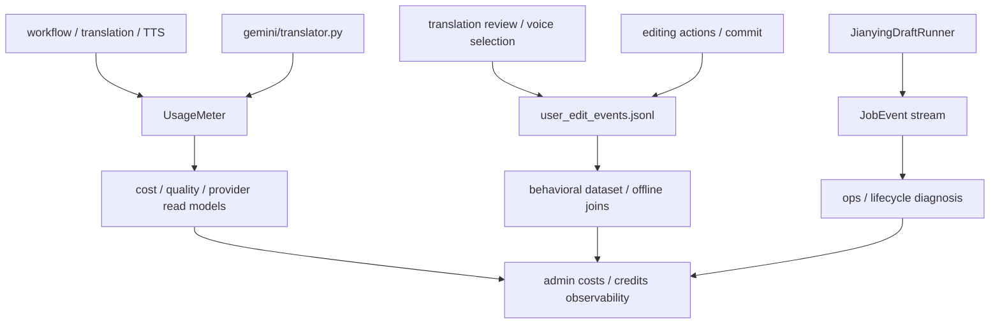

# GitNexus Benchmark / Quality / Cost 图

关联总图：`docs/graphs/GITNEXUS_PROJECT_GRAPH.md`

## 1. 范围

这张子图看的是“哪些 sidecar 数据用来做成本、质量、行为分析”，重点是：

- `UsageMeter`
- attempt-level LLM audit
- `user_edit_events.jsonl`
- `JobEvent` 生命周期流

## 2. 主图

## 3. 现在的核心认知

### 3.1 sidecar 已经分成三条，不再混在一起

- `JobEvent`
  - 生命周期 / 状态变化 / 控制面诊断
- `UsageMeter`
  - LLM / TTS 计量与成本
- `user_edit_events.jsonl`
  - 用户行为 / 编辑动作 / effective markers

结论：这三条 sink 有意分工，不再尝试让一条日志同时承担三类职责。

### 3.2 `UsageMeter` 已进入 attempt-level LLM 记录

- `usage_meter.py` 的 `record_llm(...)` 支持：
  - `attempt_label`
  - `success`
  - `error`
  - `extra` 结构化字段
- `translator.py` 在 fallback / retry 路径上开始记录：
  - `duration_ms`
  - `fallback_from`
  - `fallback_to`
  - `error_class`
  - `error_code`
  - `fallback_policy_source`

结论：metering 不再只是“总共多少 token / chars”，而是开始携带失败、回退、尝试级别的质量证据。

### 3.3 `user_edit audit` 是 append-only behavioral sink

- 写入位置：`{project_dir}/audit/user_edit_events.jsonl`
- `effective` 通过追加 `effective_marker` 表示，不回写历史
- `copy_as_new` 不复制 `audit/` 目录

结论：行为数据可以被离线拼 lineage，但主项目目录里的行为历史保持 append-only 和 job-local。

### 3.4 audit 写失败不会影响主路径

- `safe_observe(...)` 把 observer 失败降级成 WARN JobEvent
- dedup window 防止同一类失败刷屏

结论：行为采样是可观测性增强，不是阻断业务的强事务。

## 4. 关键证据

- `src/services/usage_meter.py`
  - `record_llm(...)` 的 attempt-level 结构
- `src/services/gemini/translator.py`
  - fallback / retry / duration / error 分类写入 metering
- `src/services/jobs/user_edit_audit.py`
  - append-only JSONL
  - `effective_marker`
  - `safe_observe(...)`
- `src/services/jobs/service.py`
  - review / post-edit 行为审计 emitters

## 5. 什么时候优先读这张图

- 想做 LLM / TTS 成本或失败率分析
- 想做用户修改行为数据集
- 想判断某个事件该进 `JobEvent`、`UsageMeter` 还是 `user_edit_events.jsonl`
