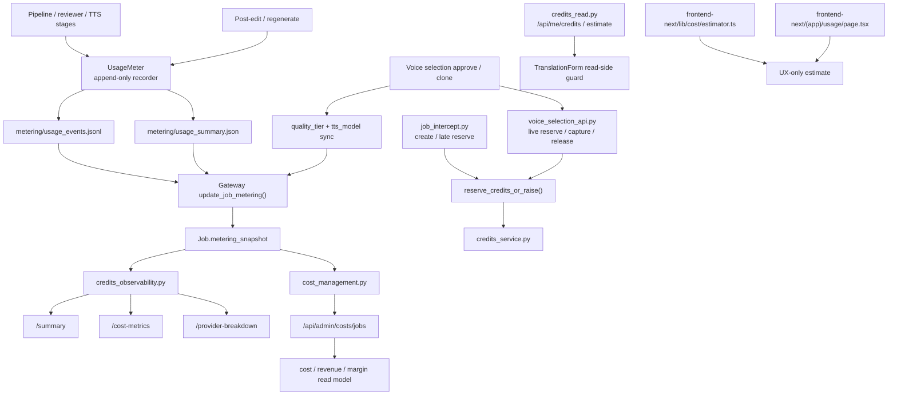

# GitNexus 基准 / 质量 / 成本图

关联总图：`docs/graphs/GITNEXUS_PROJECT_GRAPH.md`

## 1. 范围

这张子图只看 metering、质量档位与成本观测 sidecar，重点是：

- pipeline / reviewer / TTS 如何记录 usage event
- `UsageMeter` 如何落盘为 append-only job sidecar
- Gateway 如何把 metering 字段写回 `Job.metering_snapshot`
- quality tier、live reserve/capture/release 如何进入 ledger
- credits read / estimate / live guard 如何分层
- admin cost management / observability 如何把这些事实变成可读指标

不展开支付扣费、主 workflow 阶段或下载路由的实现细节。

## 2. 主图

## 3. 核心证据链

### 3.1 UsageMeter 仍是 append-only sidecar，不是主流程成败条件

- `src/services/usage_meter.py` 继续把事件写入：
  `metering/usage_events.jsonl`
  `metering/usage_summary.json`
- 失败仍是 warning，不是 pipeline failure

结论：metering 账本仍然围绕 job sidecar，而不是主流程事务本身。

### 3.2 metering snapshot 与 quality tier 仍由 Gateway 汇总回写

- `gateway/job_intercept.py:update_job_metering()` 继续 merge pipeline metering 到 `Job.metering_snapshot`
- `review/voice-selection/approve` 拦截路径继续把聚合后的 `quality_tier + tts_model` 写回 snapshot

结论：job 级 metering / quality snapshot 真源仍在 Gateway DB。

### 3.3 新增的关键变化是 live reserve guard

- `gateway/credits_service.py` 新增 `reserve_credits_or_raise(...)`
- 它与 `shadow_reserve()` 共用 bucket priority / ledger shape，但不足时直接抛 `InsufficientCreditsError`
- 这意味着“能不能开始”与“怎么记账”现在分成了：
  read-side estimate / balance
  live reserve guard
  settle / observe

结论：credits 这条轴线已经从单纯 shadow accounting 进化成“部分入口 live gate + 全局 observability”结构。

### 3.4 job create 和 clone 都已经接到 live reserve

#### job create

- `gateway/job_intercept.py` 在创建任务时，如果已知时长，会先 `reserve_credits_or_raise()`
- 若时长晚到，则在后续 `update_source_metadata` 路径做 late reserve
- 若 late reserve 失败，job 会被标成 failed

#### voice clone

- `gateway/voice_selection_api.py` clone 路径也改成 `reserve_credits_or_raise()`
- 不足时直接返回 402，并携带 `required_credits / available_credits`
- 成功后做 capture；中途失败则 release

结论：live reserve 已经覆盖到最关键的两类付费动作。

### 3.5 credits_read.py 现在是前端 guard 的读侧来源

- `gateway/credits_read.py` 提供：
  `GET /api/me/credits`
  `GET /api/me/credits-ledger`
  `GET /api/credits/estimate`
- `frontend-next/src/components/workspace/TranslationForm.tsx` 现在会读取：
  当前余额
  express/studio 各档位单分钟点数
  并发占用情况

结论：读侧 guard 已经前移到创建任务表单，但它仍然只是“读”，不是 live reserve 本身。

### 3.6 credits_service 仍是扣点规则与 settle 契约中心

- `gateway/credits_service.py` 继续集中维护：
  debit rates
  grant amounts
  bucket priority
  reserve / capture / release
- 这些规则优先从 runtime pricing 派生，失败时回退 frozen 常量
- `shadow_capture()` / `shadow_release()` 仍然保证 reserve 最终必须被 settle

结论：规则中心仍在 Gateway，不在前端，也不在 admin cost view。

### 3.7 admin cost management 与 observability 继续站在快照之上

- `gateway/cost_management.py` 继续用 versioned price catalog 读取 pipeline facts 并生成成本 / 收入 / 毛利 read model
- `gateway/credits_observability.py` 继续提供：
  `summary`
  `cost-metrics`
  `provider-breakdown`

结论：admin costs 与 observability 都依赖 snapshot / ledger，但两者都不是真正的 settle 写侧。

### 3.8 前端仍存在纯展示/预估层

- `frontend-next/src/lib/cost/estimator.ts` 仍是粗粒度 UX 预估
- `frontend-next/src/app/(app)/usage/page.tsx` 仍是占位页

结论：估算与真结算依旧严格分层。

## 4. 当前边界

- metering / quality / cost 当前已经值得单独成图。
- 这条轴线仍是 sidecar，不应误画成 pipeline 主阶段。
- create job 和 voice clone 已经是 live gate，但 admin costs 仍是 read model。
- `credits_read` 与 `cost estimator` 都只是读侧 / 预估侧，不是真结算。

## 5. 这张图适合回答什么问题

- usage event 是在哪一层记录的，失败会不会打断主流程
- job create / voice clone 为什么都已经接入 live reserve
- `GET /api/me/credits`、`GET /api/credits/estimate`、`reserve_credits_or_raise()` 三者分别负责什么
- `/api/admin/costs/jobs`、`cost-metrics`、`provider-breakdown` 这些 admin 口分别从哪里读
- 为什么 `cost estimator`、`usage` 占位页和 admin cost view 都不能被当成结算真源
