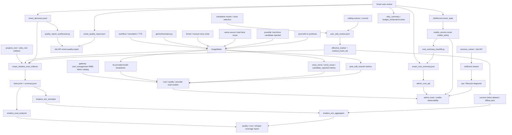

# GitNexus Benchmark / Quality / Cost 图

关联总图：`docs/graphs/GITNEXUS_PROJECT_GRAPH.md`

## 1. 范围

这张子图看的是“哪些 sidecar 数据用来做成本、质量、行为分析”，重点是：

- `UsageMeter`
- attempt-level LLM / TTS audit
- provider/model 维度 TTS 与 post-edit re-synthesis 计量
- voice clone / voice reuse / voice candidate rejection 计量
- RMB-direct provider/model cost catalog
- Smart sidecar trio
- Smart handoff quality report synthesis
- Smart admin-only cost summary 与 settlement backfill
- `user_edit_events.jsonl`
- `effective_marker.marked_event_ids`
- `smart_shadow_eval / smart_shadow_sim`
- Smart credits policy 与 terminal settlement

## 2. 主图

## 3. 当前核心认知

### 3.1 sidecar 现在分成四条，不再混在一起

- `JobEvent`：生命周期 / 状态变化 / 控制面诊断
- `UsageMeter`：LLM / TTS / voice clone / voice reuse / post-edit resynth 计量与成本
- `user_edit_events.jsonl`：用户行为 / 编辑动作 / effective markers
- Smart sidecar：`smart_decisions.jsonl`、`smart_quality_report.json`、`smart_cost_summary.json`

结论：系统行为、用户行为、资源计量、Smart 决策审计各自有独立 sink。

### 3.2 Smart decisions 是系统行为记录，不是用户行为

- `sidecar_emitter.py` 明确不写 `user_edit_events.jsonl`。
- `smart_decisions.jsonl` 与 user edit audit 同在 `audit/` 目录，便于 admin tooling 统一采集。
- sidecar emit 失败不阻断主流程，调用方记录 warning。
- handoff、budget exhausted、clone/preset、speaker gate、translation review 都应有对应 decision 事件。

结论：Smart 审核数据可用于质量分析，但不能当作用户编辑意图。

### 3.3 quality report 是用户可见质量解释

- happy-path Smart terminal 写 `audit/smart_quality_report.json`。
- 报告包含 `speaker_summary`、`voice_decisions`、`translation_review`、`retry_summary`、`handoff_history`。
- `retry_summary` 不再是纯占位，会从 Smart retry/budget 数据聚合。
- 如果 job 早期 handoff 且没有 quality report，`quality_report_synthesizer.py` 会从 JSONL 合成 schema_version=1 的最小报告。

结论：用户质量解释面能覆盖完成和转人工两类终态。

### 3.4 cost summary 是 admin-only 成本审计

- pipeline 写 `audit/smart_cost_summary.json`，其中包含 `cost_breakdown_internal_only`。
- Gateway admin endpoint 原样返回该文件，但只在 admin 路径下开放。
- Workspace 前端类型不包含 cost summary，避免用户可见面泄漏成本字段。

结论：Smart 成本数据有正式 sidecar，但不属于用户产品解释面。

### 3.5 settlement 后 backfill 补齐实际财务字段

- terminal cost summary 写入时，实际 credits charged 和 MiniMax quota usage 可能未知。
- `cost_summary_backfill.py` 从 credit ledger entries 计算净扣点。
- quota_used 可为 `None`，系统保留未知值，不伪造 0。
- backfill 使用原子写，失败返回 False，不阻断 terminal mirror。

结论：成本报告是两阶段事实，pipeline 负责初始审计，Gateway settlement 负责财务补齐。

### 3.6 `UsageMeter` 继续承接 attempt-level 成本证据

- `usage_meter.py` 支持 `attempt_label / success / error / extra`。
- translator / TTS / fallback 路径都可以把失败、回退、duration、provider 信息带入 usage events。
- Smart terminal cost summary 会读取 usage meter 形成处理分钟数和内部成本指标。
- summary 现在按 `provider_model` 输出 TTS 字符数和调用次数，避免只看 provider 粗粒度。

结论：成本面不只是 token/char 总量，而是带尝试级失败与回退证据。

### 3.7 voice clone / reuse / candidate rejection 成本语义分离

- `record_voice_clone(...)` 支持 `clone_count`、`billable` 和 `extra`，可以区分 provider 调用、成功调用、可计费克隆数。
- `record_voice_reuse(...)` 记录 `model=voice_reuse`、`clone_count=0`、`billable=False`，并写入 `billing_policy="reuse_existing_user_voice_no_clone_charge"`。
- `record_voice_candidate_rejected(...)` 记录 `model=voice_candidate_rejected`、`billable=False`、`clone_count=0`，用于审计“系统给过个人音色候选，但用户选择了别的音色”。
- Smart 自动克隆成功后现在也会写入 `UsageMeter`，避免 admin margin 只看到复用而漏掉 pipeline 内真实发生的 auto clone 成本。
- summary 输出 `voice_clone_call_count`、`voice_clone_success_call_count`、`voice_clone_billable_count`、`voice_clone_count_by_provider`、`voice_clone_source_audio_seconds`。

结论：复用已有个人音色不会被误算成新克隆，拒绝候选不会被误算成克隆，真实发生的 Smart auto clone 也能进入成本面。

### 3.8 post-edit re-synthesis 有独立成本桶

- `TTS_BUCKET_POST_EDIT_RESYNTH` 将后编辑重合成从主流程 TTS 中拆出来。
- summary 输出 `post_edit_resynth_*` 指标，便于分析编辑阶段产生的追加成本。
- 该桶服务成本归因，不替代 `editing_audio_sync_required` 这类提交前正确性 gate。

结论：后编辑带来的 TTS 追加调用可以被独立追踪，不污染主流水线成本。

### 3.9 provider/model 成本目录改为 RMB-direct 事实

- `gateway/cost_management.py` 默认 catalog version 为 `2026-05-18-rmb-direct-pricing`，以人民币字段作为主要事实。
- LLM 成本字段使用 `input_per_million_rmb / output_per_million_rmb / audio_input_per_million_rmb`，`usd_to_rmb` 只作为旧目录兼容 fallback。
- Gemini 3.1 Pro official ≤200K tier 直接记录人民币单价与音频 token 速率，避免 admin 成本页再依赖美元汇率换算。

结论：admin 成本分析现在优先读 RMB-direct 目录，汇率字段不再是新目录的主路径。

### 3.10 Smart credits policy 进入 terminal settlement

- `settle_job_credit_ledger(...)` 会先看 `smart_state.credits_policy`。
- `refund_full`、`capture_full`、`capture_actual_cost_capped_at_studio_price` 是当前 dispatcher 分支。
- `smart_consent.py` 当前拒绝 `fail_and_refund`，因为 actual-cost-capped settlement 路径仍需谨慎验证。
- clone refund 与 partial capture 当前仍需谨慎对待，日志会显式报警或保留后续实现空间。

结论：Smart 的结算策略有审计入口，但真实财务动作必须以 Gateway ledger 为准。

### 3.11 `effective_marker.marked_event_ids` 仍是行为归因主键

- `user_edit_audit.py` 采用 append-only JSONL。
- `effective_marker` 表示最终存活的 prior intent。
- `marked_event_ids` 让离线分析区分“用户做过什么”和“最终产物采纳了什么”。

结论：用户行为分析仍以 survivor-intent join 为核心。

### 3.12 `smart_shadow_eval / sim` 是离线验证闭环

- collector 汇总 review state、editor segments、subtitle cues、usage events、user edit events、Smart decisions。
- simulator 对 eligibility、voice sample、translation auto approval、TTS duration repair、subtitle sync policy 做离线决策。
- aggregator 汇总 stage diff、unevaluable rate、retry estimation、R2 readiness、user edit observations。

结论：Smart 上线前后的质量/成本判断可以在离线 sidecar 上完成，不需要引入线上付费评估调用。

## 4. 关键证据

- `src/services/smart/sidecar_emitter.py`
  - Smart sidecar trio
  - failure semantics
- `src/services/smart/quality_report_synthesizer.py`
  - handoff report synthesis
- `src/pipeline/process.py`
  - quality report emit
  - cost summary emit
  - retry summary aggregation
  - budget exhausted decision events
- `src/services/usage_meter.py`
  - attempt-level usage
  - voice clone / voice reuse / voice candidate rejected metrics
  - provider/model TTS summary
  - post-edit re-synthesis bucket
- `gateway/cost_management.py`
  - RMB-direct provider/model cost catalog
  - backward-compatible USD conversion fallback
- `gateway/job_intercept.py`
  - voice reuse event recording
  - rejected personal-voice candidate audit
- `gateway/voice_selection_api.py`
  - manual voice clone usage recording
- `gateway/smart_consent.py`
  - budget exhaustion policy guard
- `gateway/admin_cost_api.py`
  - admin-only cost endpoint
- `gateway/cost_summary_backfill.py`
  - post-settle backfill
- `gateway/credits_service.py`
  - Smart credits policy dispatcher
- `src/services/jobs/user_edit_audit.py`
  - append-only user audit
  - effective marker
- `scripts/smart_shadow_eval_collector.py`
  - facts collection
- `scripts/smart_shadow_eval_analyzer.py`
  - report generation
- `scripts/smart_shadow_sim_simulator.py`
  - stage decisions
- `scripts/smart_shadow_sim_aggregator.py`
  - aggregate verdict / readiness

## 5. 什么时候优先读这张图

- 想做 LLM / TTS / voice clone / voice reuse / voice candidate rejection / post-edit resynth 成本或失败率分析
- 想做 Smart 自动审核质量分析
- 想改 Smart sidecar、quality report、cost summary
- 想改 provider/model RMB 成本目录或 admin 成本读模型
- 想改 Smart quality report 的 handoff 合成逻辑
- 想改 admin-only 成本暴露或 settlement backfill
- 想改 Smart credits policy 或 terminal settlement
- 想做用户修改行为数据集，尤其是 survivor-intent join
