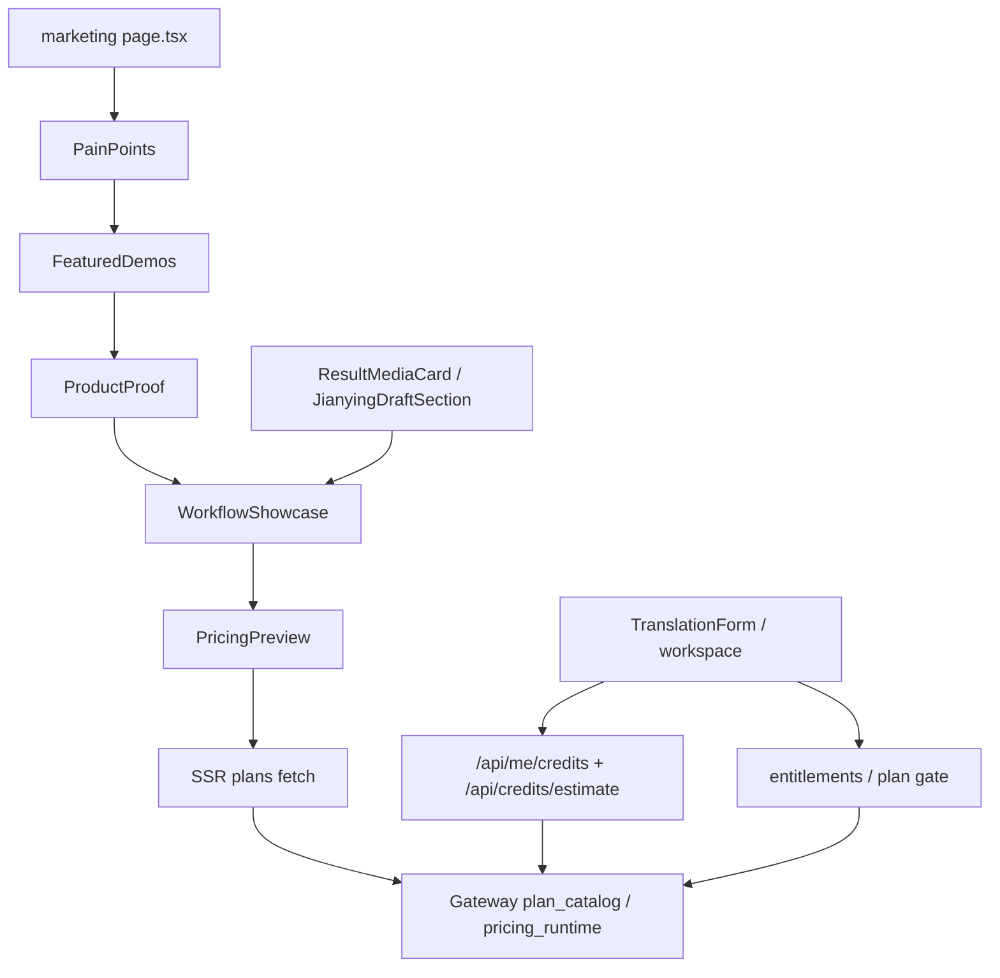

# GitNexus 商业化图

关联总图：`docs/graphs/GITNEXUS_PROJECT_GRAPH.md`

## 1. 范围

这张子图看的是“用户为什么买、前端如何承诺、哪些事实必须继续由 Gateway 持有”，重点是：

- marketing 前门 narrative / proof
- pricing / trial SSR 真源
- workspace credit read-side guard
- Studio 与剪映草稿承诺的边界

## 2. 主图

## 3. 这轮最重要的商业化变化

### 3.1 marketing 前门已经把“导出剪映草稿”写成明确承诺

- `frontend-next/src/components/marketing/workflow-showcase.tsx`
  - 第 4 步明确写了“下载结果，或直接导出剪映草稿”
- `frontend-next/src/components/marketing/product-proof.tsx`
  - 结果页截图与说明继续承担“这是可交付工作台，而不是一次性玩具”的证明
- `frontend-next/src/app/(marketing)/page.tsx`
  - narrative 继续是 `PainPoints -> FeaturedDemos -> ProductProof -> WorkflowShowcase -> PricingPreview`

结论：前门承诺已经从“生成中文配音结果”升级成“可以继续导出到本地剪映工作流”。

### 3.2 套餐 / 试用 / service-mode gate 仍由 Gateway 掌握

- `gateway/plan_catalog.py` 仍是 plan / trial / pricing 的中心真源
- `job_intercept.py` 继续根据 plan gate 计算 `service_mode`、provider、质量层等策略
- 剪映草稿只对 `studio` 任务开放，这个 gate 也落在后端

结论：前端可以承诺“Studio 可导出剪映草稿”，但不能自己发明谁有资格看到这个能力。

### 3.3 workspace 读侧 guard 已稳定成商业化前置面

- `TranslationForm` 继续消费：
  - `/api/me/credits`
  - `/api/credits/estimate`
- 这条链负责余额展示、分钟预估、并发与套餐限制的前置提醒

结论：商业化链路现在分成两段：
- 读侧 guard 在前端提前解释门槛
- 真正的 plan / credit / service-mode 决策仍在 Gateway

### 3.4 “剪映草稿”是产品承诺，不是另一套计费真源

- `JianyingDraftSection` 在结果页上是 Studio-only 能力
- 但价格、试用、套餐事实仍从 Gateway 的 plan / runtime 层来
- 没有前端自带第二套餐餐逻辑去决定谁能导出草稿

结论：导出剪映草稿是前门 proof 和 Studio 价值主张的一部分，但不是独立的商业真源。

## 4. 关键证据

- `frontend-next/src/app/(marketing)/page.tsx`
  - narrative 顺序以 proof 和 workflow 为主
- `frontend-next/src/components/marketing/workflow-showcase.tsx`
  - 第 4 步明确写“导出剪映草稿”
- `frontend-next/src/components/marketing/product-proof.tsx`
  - 结果页与可下载交付物是 proof 核心
- `gateway/plan_catalog.py`
  - plan / price / trial 仍由 Gateway 持有

## 5. 什么时候优先读这张图

- 想改首页文案、CTA、proof 顺序
- 想判断“导出剪映草稿”应该写在什么位置、由谁兜底
- 想改套餐事实、试用规则、workspace credits 读侧 guard
