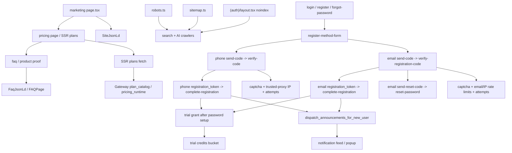

# GitNexus 商业化图

关联总图：`docs/graphs/GITNEXUS_PROJECT_GRAPH.md`

## 1. 范围

这张子图看的是“用户怎么理解套餐与试用、如何完成注册、以及商业事实如何保持 Gateway 真源”，重点是：

- pricing / trial 真源
- phone auth 前门
- email auth 前门
- trial 发放边界
- 新注册用户 onboarding 公告
- SEO 与 auth noindex 边界

## 2. 主图

## 3. 当前最重要的商业化变化

### 3.1 套餐 / 试用 / 定价真源仍然在 Gateway

- `gateway/pricing_runtime.py`、`gateway/pricing_admin.py`、`gateway/billing.py` 仍是套餐、试用、计费事实核心。
- frontend 继续消费 Gateway fact，不自建第二套 plan truth。

结论：auth 扩展没有改变商业事实真源。

### 3.2 phone auth 仍是完整生命周期流

- `POST /auth/phone/send-code`
- `POST /auth/phone/verify-code`
- `POST /auth/phone/complete-registration`
- `POST /auth/phone/reset-password`

核心边界仍然是：验证码通过不等于注册完成，trial 只在 `complete-registration` 成功后发放。

### 3.3 email auth 已经并入同一注册模型

- `gateway/auth_email.py` 挂载在 `/auth/email`。
- registration 分两步：
  - `verify-registration-code` 产出 registration token
  - `complete-registration` 设置密码、创建用户、创建 session
- reset 分两步：
  - `send-reset-code`
  - `reset-password`
- `EmailVerificationChallenge` 负责持久化 code hash、attempts、expiry、consumed state。

结论：email auth 与 phone auth 保持同样的“验证通过后再完成注册”边界。

### 3.4 email provider 默认 fake，真实邮件是可替换 provider

- `settings.email_auth_provider` 默认可走 fake/mock/stub。
- `resend` provider 通过 `notifications.send_email(...)` 发送邮件。
- 测试可通过 `peek_last_fake_email_code(...)` 取 fake code。

结论：本地与测试路径不强依赖真实邮件服务。

### 3.5 risk control 分成 captcha、IP、email 三层

- email 发送入口也调用 captcha。
- email 发送有 per-email 短窗口、per-email 小时窗口、per-IP 小时窗口。
- wrong-code attempt 继续由 challenge 侧计数，超过上限会 consume challenge。

结论：邮箱注册不是单纯多一个表单，而是有独立风控预算。

### 3.6 新注册用户仍进入 live announcement 生命周期

- phone complete registration 和 email complete registration 都会接入新用户生命周期。
- 系统公告以 `UserNotification` 进入 bell / popup feed。

结论：onboarding 入口从 phone 扩展到 phone + email，但下游运营触达统一。

## 4. 关键证据

- `gateway/auth_email.py`
  - registration code
  - registration token
  - complete registration
  - password reset
  - fake/resend provider
- `gateway/alembic/versions/026_email_auth.py`
  - email verification challenge schema
- `frontend-next/src/components/auth/email-register-form.tsx`
  - email register UI
- `frontend-next/src/components/auth/register-method-form.tsx`
  - phone/email method selection
- `gateway/auth_phone.py`
  - phone auth lifecycle
- `gateway/risk_control.py`
  - captcha / IP boundary
- `gateway/system_announcements_service.py`
  - new registration announcements

## 5. 什么时候优先读这张图

- 想改 pricing / trial / billing truth
- 想改 phone 或 email 注册登录
- 想改验证码、captcha、rate limit、registration token
- 想把新注册用户接入公告或其他 onboarding 触点
- 想确认 robots / sitemap / auth noindex 的边界
