# GitNexus 商业化图

关联总图：`docs/graphs/GITNEXUS_PROJECT_GRAPH.md`

## 1. 范围

这张子图看的是“用户怎么理解套餐与试用、如何完成注册、如何选择服务模式，以及商业事实如何保持 Gateway 真源”，重点是：

- pricing / trial 真源
- phone auth 前门
- email auth 前门
- Smart service mode 入口与固定价
- Smart Preview 入口、3 分钟 teaser、600 点 clone reservation 与转完整抵扣
- Smart consent schema、预算耗尽策略与固定价承诺边界
- Smart kill switch、pricing consistency 与 `fail_and_refund` deferred blocker
- Smart voice policy、possible-match 自动复用、弱匹配暂停提示与候选音色确认边界
- Smart 全自动产品承诺
- CosyVoice clone 的用户显式付费触发、allowlist/GA gate 与 worker runtime gate
- Express CosyVoice 自动克隆的 availability、consent、admin allowlist、reservation cap 与临时音色 cleanup
- Free tier 的 feature flag、voice-rights consent、free=0 pricing、daily quota 与交付限制
- 匿名预览试用、claim、convert-to-full 与正式付费任务边界
- Paddle MoR、WeChat Native、refund closure、billing reconciliation
- entitlements 与 allowed service modes
- trial 发放边界
- fake payment production gate
- CSRF same-origin guard for auth / billing / account state changes
- privacy / terms pages for third-party platform review
- 新注册用户 onboarding 公告
- SEO 与 auth noindex 边界

## 2. 主图

```mermaid
graph TD
    Home["marketing page.tsx"] --> Pricing["pricing page / SSR plans"]
    Pricing --> FAQ["faq / product proof"]
    FAQ --> FaqLd["FaqJsonLd / FAQPage"]
    Home --> SiteLd["SiteJsonLd"]
    Home --> Legal["privacy / terms pages"]
    Home --> AnonymousTrial["anonymous trial panel"]
    AnonymousTrial --> AnonymousPreview["anonymous preview create/status"]
    AnonymousPreview --> AnonymousClaim["post-login claim"]
    AnonymousClaim --> AnonConvert["reuse_anonymous_preview_id full create"]

    Robots["robots.ts"] --> Crawlers["search + AI crawlers"]
    Sitemap["sitemap.ts"] --> Crawlers
    AuthNoindex["(auth)/layout.tsx noindex"] --> Crawlers

    Pricing --> PlansSSR["SSR plans fetch"]
    PlansSSR --> GatewayPlans["Gateway plan_catalog / pricing_runtime"]

    AuthPages["login / register / forgot-password"] --> Method["register-method-form"]
    Method --> PhoneFlow["phone send-code -> verify-code"]
    Method --> EmailFlow["email send-code -> verify-registration-code"]
    AuthPages --> CSRF["CSRF same-origin state-change guard"]

    PhoneFlow --> PhoneComplete["phone registration_token -> complete-registration"]
    EmailFlow --> EmailComplete["email registration_token -> complete-registration"]
    EmailFlow --> EmailReset["email send-reset-code -> reset-password"]

    PhoneComplete --> TrialGrant["trial grant after password setup"]
    EmailComplete --> TrialGrant
    TrialGrant --> Credits["trial credits bucket"]

    PhoneFlow --> Risk["captcha + trusted-proxy IP + attempts"]
    EmailFlow --> EmailRisk["captcha + email/IP rate limits + attempts"]

    Workspace["TranslationForm"] --> Entitlements["GET entitlements"]
    Workspace --> SmartPreview["Smart preview confirm/result"]
    Entitlements --> AllowedModes["allowed_service_modes"]
    Entitlements --> SmartKill["Smart kill switch env + admin"]
    SmartKill --> AllowedModes
    AllowedModes --> Express["express"]
    AllowedModes --> Studio["studio"]
    AllowedModes --> Smart["smart"]
    AllowedModes --> Free["free"]
    Express --> ExpressAutoAvail["Express auto-clone availability"]
    ExpressAutoAvail --> ExpressConsent["express_consent checkbox"]
    ExpressConsent --> Submit
    Submit --> ExpressConsentValidator["Gateway express_consent.py validator"]
    ExpressConsentValidator --> ExpressReservation["atomic reservation cap gate"]
    ExpressReservation --> ExpressTempVoice["temporary voice + cleanup obligation"]
    Free --> FreeConsent["free_consent voice_rights_confirmed"]
    FreeConsent --> FreeQuota["free daily quota reserve"]
    FreeQuota --> FreeZeroPrice["free=0 debit truth"]
    FreeZeroPrice --> Submit
    Workspace --> Estimate["getCreditsEstimate"]
    Estimate --> SmartPrice["smart standard fixed user price"]
    Workspace --> SmartPricingMeta["getVoiceSelectionPricing metadata"]
    SmartPricingMeta --> WeakMatchWarning["smart_pause_warning_enabled notice"]
    Smart --> FullAuto["full-auto product promise"]
    SmartPreview --> SmartPreviewReservation["600-credit smart clone reservation"]
    SmartPreviewReservation --> SmartPreviewTeaser["3-min stream-only teaser"]
    SmartPreviewTeaser --> SmartPreviewConvert["reuse_preview_job_id convert full"]
    SmartPreviewConvert --> Submit
    Smart --> Consent["smart_consent payload"]
    Consent --> Submit["submitTranslationJob"]
    Submit --> ConsentValidator["Gateway smart_consent.py validator"]
    Submit --> Policy["compute_job_policy smart"]
    Submit --> VoiceQuotaPreflight["voice library quota preflight"]
    ConsentValidator --> BudgetPolicy["on_budget_exhausted degraded_delivery_with_report only"]
    Policy --> SmartLocked["MiniMax + HD + requires_review + clone enabled"]
    AdminVoicePolicy["admin Smart voice policy"] --> WeakMatchWarning
    AdminVoicePolicy --> PossibleAutoReuse["P5 auto-reuse possible-match top candidate"]
    AdminVoicePolicy --> VoiceQuotaPreflight
    ConsentValidator --> VoiceQuotaPreflight

    Workspace --> CosyCloneUI["CosyVoice clone UI"]
    CosyCloneUI --> CloneGate["/api/voice/cosyvoice/clone-gate"]
    CloneGate --> CloneConsent["CosyVoice consent modal"]
    CloneConsent --> ClonePost["POST /api/voice/cosyvoice/clone"]
    ClonePost --> WorkerRuntime["uploader + mainland worker runtime gate"]
    AdminExpressPolicy["admin Express CosyVoice policy"] --> ExpressAutoAvail
    AdminExpressPolicy --> ExpressReservation

    Billing["billing / checkout"] --> PaymentProviders["payment_providers"]
    PaymentProviders --> Paddle["Paddle MoR provider"]
    PaymentProviders --> WeChat["WeChat Native provider"]
    PaymentProviders --> FakeGate["fake payment dev/test default"]
    Billing --> Reconciliation["billing_reconciliation sweeper"]
    Reconciliation --> RefundClosure["refund closure / status compensation"]
    FakeGate --> ProdSafety["AVT_ENV production safety"]
    Billing --> CSRF

    GatewayPlans --> Entitlements
    GatewayPlans --> Estimate
    GatewayPlans --> Policy
    GatewayPlans --> ConsentValidator
    GatewayPlans --> SmartPreviewReservation
    AnonConvert --> Submit

    PhoneComplete --> NewUserAnn["dispatch_announcements_for_new_user"]
    EmailComplete --> NewUserAnn
    NewUserAnn --> UserNotif["notification feed / popup"]
```

## 3. 当前最重要的商业化变化

### 3.1 套餐 / 试用 / 定价真源仍然在 Gateway

- `gateway/plan_catalog.py`、`gateway/pricing_runtime.py`、`gateway/pricing_admin.py`、`gateway/billing.py` 仍是套餐、试用、计费事实核心。
- `gateway/entitlements.py` 输出 allowed service modes、并发限制、trial / free quota 等前端可消费事实。
- frontend 继续消费 Gateway fact，不自建第二套 plan truth。

结论：Smart 入口上线没有改变商业事实真源。

### 3.2 Smart 作为可售服务模式进入 TranslationForm

- `TranslationForm.tsx` 的 `serviceMode` 支持 `express / studio / smart`。
- Smart 卡片只有当 `entitlements.limits.allowed_service_modes` 包含 `smart` 才可点击。
- 不可用时展示“升级解锁”或“即将开放”，不把权限判断写死在 UI。
- Smart 文案强调固定价、AI 自动审核翻译、按需克隆主说话人音色、不额外扣点。
- 如果 admin 开启“弱个人音色匹配需确认”，`TranslationForm` 会在 Smart 创建前展示暂停提示；默认 P5 `smart_auto_reuse_on_possible_user_voice_match=True` 时，possible-match 优先自动复用 top candidate，不触发该暂停。
- Gateway `compute_job_policy("smart")` 现在强制 Smart 使用 MiniMax、`speech-2.8-hd`、`requires_review=True`、`voice_clone_enabled=True`，防止因 admin Express/Studio 配置漂移而改变用户购买语义。

结论：Smart 的商业入口已经正式进入 workspace 创建任务流，但可用性仍由 Gateway 控制。

### 3.3 Smart fixed price 通过 credits estimate 读取

- 前端调用 `getCreditsEstimate(1, "smart", "standard")` 获取每分钟估算。
- Smart 当前面向用户展示固定价，内部仍保留 `quality_tier=standard` 兼容二维定价表。
- pipeline 内部的 retry、clone、TTS 调用被产品文案归入固定价，不在前端拆成第二套成本规则。
- voice reuse 与 rejected candidate 会记录为非 billable 使用事件；clone 是否发生属于内部执行事实，不改变用户侧 fixed price。
- P5 possible-match auto-reuse 使用已有 UserVoice，不发起 paid clone，不改变用户侧 fixed price。
- 2026-05-20 后，Smart translation review 的旧严格检查只做 audit metrics，不再要求用户确认；这与“智能版全部自动完成”的产品承诺保持一致。

结论：用户侧价格来自 Gateway estimate，内部成本只进入 admin cost summary。

### 3.4 Smart consent 是商业与合规边界

- 前端提交 Smart job 时携带 `smart_consent`。
- Gateway 在创建任务前校验 Smart consent 必须包含 `auto_voice_clone / auto_retranslate / auto_retts / auto_multimodal_verification / no_extra_charge_without_confirmation / on_budget_exhausted`。
- `on_budget_exhausted` 当前只允许 `degraded_delivery_with_report`；`fail_and_refund` 因实际成本封顶结算路径仍是 stub，被显式拒绝。
- pipeline 只有在 `smart_consent.auto_voice_clone is True` 时才复用同源个人音色或抽样、查询 quota、调用 clone provider。
- pipeline 还会读取 admin Smart voice policy：`smart_auto_clone_enabled`、`smart_reuse_user_voice_enabled`、`smart_auto_reuse_on_possible_user_voice_match`、`smart_pause_on_possible_user_voice_match` 决定复用、克隆、possible-match 自动复用和弱匹配暂停是否进入自动路径。
- consent 不满足时走 preset / handoff 逻辑，不暗中调用真实 clone。

结论：Smart 自动克隆不是单纯技术开关，而是“用户授权 + admin policy”共同约束的商业与合规边界。

### 3.5 Smart voice library quota 是售前安全阀

- Gateway create path 会对非 admin Smart job 进行个人音色库 quota 安全水位预检，但前提是 `smart_consent.auto_voice_clone` 和 admin `smart_auto_clone_enabled` 同时为真。
- 预检命中时返回 `smart_voice_library_at_safety_water_mark`，避免用户付费后才在 pipeline 内被克隆容量拦住。
- admin 路径跳过该预检，方便运维和验证；runtime 仍保留 fail-closed quota check。

结论：商业入口不仅看权益是否允许 Smart，还要在确实可能发生自动克隆时提前避免明显无法完成的承诺。

### 3.6 候选音色优先不会改变固定价承诺

- Studio / Post-edit 的候选音色入口会把强匹配个人音色作为“不扣点”复用选项，把弱匹配个人音色作为“需要确认”的候选。
- 跨源唯一同名候选可提升为 `strong_named`，自动复用而不扣 clone 点。
- Smart P5 默认把 possible-match top candidate 自动复用；只有关闭 auto-reuse 且开启 pause 时，才把 `smart_offered_candidates` 写入审核态。
- 用户若在人工确认中选择其他音色，Gateway 记录非 billable rejected-candidate audit。
- 这些候选、确认、拒绝事件服务于体验与审计，不形成新的用户侧计费规则。

结论：候选优先是降低重复克隆和误匹配风险的产品机制，不是前端新增一套价格体系。

### 3.7 payment / CSRF / production guard 是商业化上线边界

- `gateway/payment_providers.py::is_fake_payment_enabled()` 默认只允许 dev/test 使用 fake provider；生产必须显式 opt-in。
- `gateway/billing.py` 的 fake-pay JSON/browser 两条路径共用 `_run_fake_payment(...)`，fake disabled 时返回 403 或 redirect error。
- `gateway/startup_checks.py::validate_production_safety(...)` 要求生产环境启用 auth，Compose 默认 `AVT_ENV=production`。
- auth、account、billing、job create/delete 等 session-authenticated state changes 受 `require_same_origin_state_change` 保护。

结论：商业化进入生产时，不能依赖 fake payment 或无同源保护的 session 写请求。

### 3.8 privacy / terms 是第三方平台审核依赖

- `frontend-next/src/app/(marketing)/privacy/page.tsx` 和 `terms/page.tsx` 已补齐，用于 Baidu 开放平台审核和基础合规展示。
- 网盘备份仍是 admin-only 能力，商业化真源不迁移到 Baidu Pan；普通用户价格、试用、权益仍由 Gateway 控制。

结论：法律页面服务外部平台审核与用户信任，不改变 plan / entitlement source-of-truth。

### 3.9 phone auth 仍是完整生命周期流

- `POST /auth/phone/send-code`
- `POST /auth/phone/verify-code`
- `POST /auth/phone/complete-registration`
- `POST /auth/phone/reset-password`

核心边界仍然是：验证码通过不等于注册完成，trial 只在 `complete-registration` 成功后发放。

### 3.10 email auth 已经并入同一注册模型

- `gateway/auth_email.py` 挂载在 `/auth/email`。
- registration 分两步：`verify-registration-code` 产出 registration token，`complete-registration` 设置密码、创建用户、创建 session。
- reset 分两步：`send-reset-code` 和 `reset-password`。
- `EmailVerificationChallenge` 负责持久化 code hash、attempts、expiry、consumed state。

结论：email auth 与 phone auth 保持同样的“验证通过后再完成注册”边界。

### 3.11 新注册用户仍进入 live announcement 生命周期

- phone complete registration 和 email complete registration 都会接入新用户生命周期。
- 系统公告以 `UserNotification` 进入 bell / popup feed。

结论：onboarding 入口从 phone 扩展到 phone + email，但下游运营触达统一。

### 3.12 Smart kill switch 是商业化上线门

- `gateway/config.py` 提供 env 层 kill switch，`gateway/admin_settings.py` 提供 runtime toggle。
- `gateway/entitlements.py` 会从 allowed service modes 中移除 `smart`，admin 用户也不能自动绕过。
- `gateway/job_intercept.py` 在 Smart consent 校验前先检查 kill switch，避免关闭后仍进入 Smart 创建路径。
- pricing consistency 守住 Smart fixed price，`smart.standard=100` 不应在前端或本地 fallback 变成第二套真源。
- `fail_and_refund` 仍在 consent validator 中显式阻断，直到完整结算链路完成。

结论：Smart 商业化不是“有入口就卖”，必须能统一停用、统一定价、统一拒绝未完成预算策略。

### 3.13 CosyVoice clone 是用户显式触发的付费能力

- `GET /api/voice/cosyvoice/clone-gate` 只读展示层 gate，合并 allowlist/GA、worker enabled、uploader backend、worker config readiness。
- `POST /api/voice/cosyvoice/clone` 必须由用户通过 clone modal + consent modal 显式触发，不从 review/edit fallback 静默发起。
- clone 前检查 max voices per user、sample/source_segments 输入、sample uploader、worker config；任一失败都在付费 worker 调用前 fail-closed。
- CosyVoice clone 成功写入 `user_voices` 的 worker routing 和 request id，后续 TTS 必须按该路由走国内 worker。

结论：CosyVoice clone 的商业边界是“用户知情 + Gateway gate + worker runtime ready”，不是普通后台补救逻辑。

### 3.14 Express auto-clone 是“用户同意 + admin gate + reservation”的受控自动化

- `GET /api/me/express-auto-clone-availability` 根据 admin 主开关、allowlist、当前用户身份与配额事实决定是否展示自动克隆选项。
- `express_cosyvoice_auto_clone_enabled=False` 时 Express 行为保持原状；allowlist 开启时只允许 admin 或 allowlist 用户，allowlist 关闭时不再限制用户集合。
- 前端提交的 `express_consent` 需要 Gateway server-confirmed，pipeline 无 consent 时不会构造 worker client。
- `express_clone_reservations` 承担并发安全成本闸，daily cap 和 active temp cap 都把 active reservations 算进去。
- 自动克隆成功后生成 `is_temporary=true` 的个人音色，必须有 `temporary_expires_at`，到期后由 cleanup sweeper/CLI 调 worker delete 再 soft-delete。
- Express 自动克隆失败回预设音色，不改变用户侧 Express 任务交付承诺，也不引入新的前端计价模型。

结论：Express auto-clone 是受控 canary 能力，不是绕过“付费 API 必须用户知情”的隐藏 fallback。

### 3.15 Free tier 是独立商业档位，价格为 0 但边界更硬

- `AVT_ENABLE_FREE_TIER` 关闭时，Gateway 对 `service_mode=free` 返回 `free_disabled`，不会静默降级到 Express。
- Entitlements 只在 backend flag 开启时暴露 `free`；前端入口还需要 Next flag 显示。
- `free_consent.voice_rights_confirmed=true` 是免费 MiMo voiceclone 的硬合规门禁，Gateway 只转发 server-confirmed consent。
- `free_service_daily_usage` 是专用日配额 ledger，reserve/consume/release/expire 在 create flow 内完成，不复用付费 credits quota。
- pricing/debit 事实保留 `free=0`，但内部 MiMo voiceclone/水印/下载限制仍是商业边界，不允许前端自建第二套免费规则。
- 免费档只交付水印视频与 poster，不能暴露 paid modes 的 materials pack、clean audio 或 editor draft。

结论：Free tier 是拉新漏斗，不是“无约束的免费 Express”；它的 consent、quota、voiceclone、duration、watermark 和 artifact 限制都是商业事实的一部分。

### 3.16 Anonymous Preview 是未登录拉新漏斗，不是匿名付费替身

- 匿名预览通过 marketing trial panel 进入 Gateway anonymous preview create/status，而不是直接创建普通 paid job。
- APF admission、rate limit、probe 和 compliance 在预览任务前保护成本与合规边界。
- 登录后的 claim 只绑定 ownership；真正转完整还要通过 `reuse_anonymous_preview_id` 进入正式 create flow。
- 匿名 preview 只提供 stream-only teaser，不开放 materials、clean audio、editor draft 或完整下载。

结论：匿名预览降低首次试用门槛，但商业边界仍在登录后的正式任务创建和权益判断中。

### 3.17 Smart Preview 的 600 点 clone 语义独立于完整 Smart 固定价

- Smart Preview 可展示 3 分钟 teaser，但如果触发 MiniMax clone，需要先通过 600 点 reservation。
- reservation capture/release/expire 由 Gateway ledger 和 sweeper 补偿，不由前端自行判断。
- 转完整通过 `reuse_preview_job_id` 和 carryover marker 抵扣一次 clone charge，避免用户先预览后购买时重复扣 600 点。
- Smart Preview 不提供完整任务的后编辑、剪映草稿、materials pack 或 clean artifact。

结论：Smart Preview 是购买前决策产品，收费核心是受 reservation 保护的 clone 成本，而不是完整 Smart 任务的低价入口。

### 3.18 Paddle / WeChat / reconciliation 扩展支付面但不扩展事实源

- `gateway/payment_provider_paddle.py` 与 `gateway/payment_provider_wechat.py` 承接 provider-specific checkout / callback / native pay 逻辑。
- `gateway/billing_reconciliation.py` 用补偿式扫描修正 provider 状态、订单状态和本地 billing 状态的漂移。
- refund closure 仍应通过 Gateway billing/ledger 状态落地，不能让前端或 provider callback 成为唯一真源。
- fake payment 生产门禁继续存在，真实支付上线不代表 dev fake path 可以进 production。

结论：多 provider 是接入层扩展，套餐、权益、支付状态和 ledger 仍由 Gateway 统一裁决。

## 4. 关键证据

- `gateway/plan_catalog.py`
  - plan definitions
  - allowed service modes
- `gateway/entitlements.py`
  - entitlement response
  - Smart kill switch allowed modes
  - Express auto-clone availability
  - Free allowed service mode
- `gateway/credits_service.py`
  - estimate and debit rates
- `gateway/job_intercept.py`
  - Smart compute_job_policy
  - Smart create-job quota safety water mark
  - consent + admin clone gate for quota preflight
  - candidate rejection audit
- `gateway/smart_consent.py`
  - Smart consent schema and allowed budget policy
  - `fail_and_refund` deferred blocker
- `gateway/express_consent.py`
  - Express consent schema and server confirmation
- `gateway/free_consent.py`
  - Free voice-rights consent schema and server confirmation
- `gateway/free_service_quota.py`
  - Free daily quota reserve / consume / release
- `gateway/anonymous_preview_api.py`
  - anonymous preview create / status / claim
- `gateway/anonymous_preview_chunked_api.py`
  - anonymous chunked upload path
- `gateway/smart_clone_reservation_service.py`
  - Smart Preview 600 credit reservation
- `gateway/smart_clone_reservation_sweeper.py`
  - expired reservation cleanup
- `gateway/payment_provider_paddle.py`
  - Paddle MoR provider
- `gateway/payment_provider_wechat.py`
  - WeChat Native provider
- `gateway/billing_reconciliation.py`
  - payment status reconciliation
- `gateway/admin_settings.py`
  - Smart voice policy settings
  - Express CosyVoice auto-clone policy settings
  - Free voiceclone kill switch
- `gateway/express_reservation_service.py`
  - Express atomic reservation cap gate
- `gateway/express_voice_cleanup_service.py`
  - temporary voice cleanup state machine
- `gateway/cosyvoice_clone/api.py`
  - CosyVoice clone-gate and explicit clone
- `gateway/mainland_voice_worker.py`
  - worker config readiness and health
- `gateway/payment_providers.py`
  - fake payment production gate
- `gateway/billing.py`
  - fake-pay disabled behavior
- `gateway/csrf.py`
  - same-origin state-change guard
- `gateway/startup_checks.py`
  - production auth guard
- `gateway/voice_selection_api.py`
  - candidate-first voice options
- `frontend-next/src/components/workspace/TranslationForm.tsx`
  - Smart mode card
  - entitlement gate
  - Smart fixed price estimate
  - Smart weak-match pause warning
- `frontend-next/src/app/(marketing)/privacy/page.tsx`
  - privacy page for platform review
- `frontend-next/src/app/(marketing)/terms/page.tsx`
  - terms page for platform review
- `src/services/smart/auto_translation_review.py`
  - Smart full-auto translation audit metrics
- `tests/test_smart_entry_wiring.py`
  - Smart consent and Gateway whitelist guards
- `gateway/auth_email.py`
  - registration code
  - registration token
  - complete registration
  - password reset
  - fake/resend provider
- `gateway/alembic/versions/026_email_auth.py`
  - email verification challenge schema
- `frontend-next/src/components/auth/email-register-form.tsx`
  - email register UI
- `frontend-next/src/components/auth/register-method-form.tsx`
  - phone/email method selection
- `gateway/auth_phone.py`
  - phone auth lifecycle
- `gateway/system_announcements_service.py`
  - new registration announcements

## 5. 什么时候优先读这张图

- 想改 pricing / trial / billing truth
- 想改 Smart 可售入口、Smart Preview、固定价、allowed service modes
- 想改匿名预览、claim、convert-to-full、anonymous preview 限流或 stream-only 边界
- 想改 Express auto-clone availability、consent、allowlist、reservation cap 或临时音色 cleanup
- 想改 Free tier 入口、free=0 pricing、voice-rights consent、daily quota 或免费交付限制
- 想改 Paddle、WeChat、refund closure 或 billing reconciliation
- 想改 Smart consent、预算耗尽策略、admin voice policy、possible-match auto-reuse、voice library quota 预检
- 想排查 Smart 为什么被 kill switch 下线、为什么 `fail_and_refund` 被拒
- 想排查 CosyVoice clone 为什么不可用、为什么必须用户显式触发
- 想改候选音色确认、弱匹配暂停提示、非计费候选拒绝审计
- 想改 fake payment、生产支付门禁、CSRF 同源保护
- 想确认 Smart 全自动产品承诺与 translation review audit-only 的边界
- 想改 privacy / terms 等平台审核页面
- 想改 phone 或 email 注册登录
- 想改验证码、captcha、rate limit、registration token
- 想把新注册用户接入公告或其他 onboarding 触点
- 想确认 robots / sitemap / auth noindex 的边界
