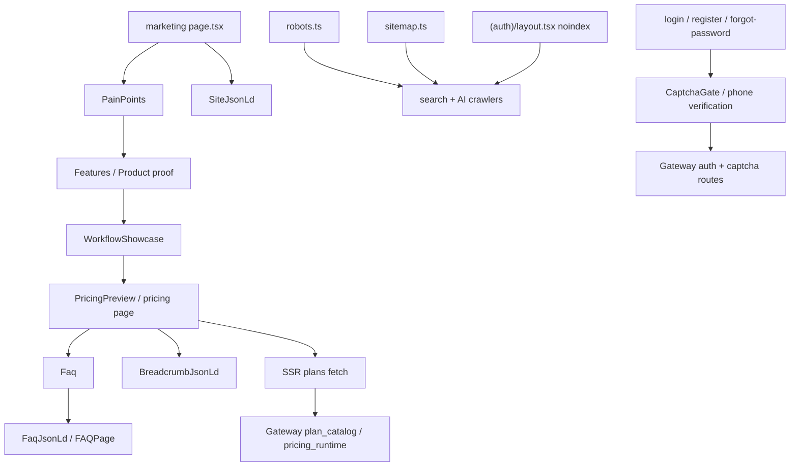

# GitNexus 商业化图

关联总图：`docs/graphs/GITNEXUS_PROJECT_GRAPH.md`

## 1. 范围

这张子图看的是“用户为什么买、前门怎么承诺、公开入口怎样被搜索引擎和 AI crawler 理解”，重点是：

- marketing narrative / proof
- pricing / trial SSR 真源
- FAQ JSON-LD / robots / sitemap / auth noindex
- 剪映草稿承诺与 auth/captcha 前门

## 2. 主图

## 3. 这轮最重要的商业化变化

### 3.1 marketing 前门继续明确承诺“导出剪映草稿”

- `workflow-showcase.tsx` 的第 4 步仍然明确写着：
  - 下载配音视频 / 音频 / 字幕 / 素材包
  - 或直接导出剪映草稿继续精剪
- `features.tsx`、`faq.tsx`、`tool-comparison.tsx` 也都继续把“剪映草稿工程”放在公开承诺里

结论：剪映草稿已经是营销前门的明确产品承诺，不是后台隐藏能力。

### 3.2 FAQ 仍然是可见内容 + 可引用结构化内容两层

- `faq.tsx` 继续内联 `FaqJsonLd`
- FAQ 文案里已经把可下载交付物写全：视频、音频、字幕、翻译文本、素材包、剪映草稿工程

结论：FAQ 既给用户看，也给搜索引擎和 AI crawler 提供结构化 Q&A 语义。

### 3.3 套餐 / 试用 / 定价真源仍然由 Gateway 掌握

- `pricing` 页面继续走 SSR plans fetch
- 真正的 plan / trial / pricing facts 仍然在 `Gateway plan_catalog / pricing_runtime`

结论：这一轮虽然前门和 auth 有变化，但 plan truth 边界没有漂移到前端。

### 3.4 auth 前门已经明确接入 captcha 语义

- `(auth)/auth/login/page.tsx` 继续提供手机号验证码登录
- `(auth)/auth/register/page.tsx`、`forgot-password/page.tsx` 都已经接入 `CaptchaGate`
- `gateway/main.py` 继续挂载 `captcha_router`

结论：公开前门现在不仅有营销承诺，也有更完整的 captcha-backed auth 入口控制。

### 3.5 `auth` 仍然被明确排除在公开 SEO 面之外

- `(auth)/layout.tsx` 继续统一下发 `robots: { index: false, follow: false }`
- `robots.ts` 与 `sitemap.ts` 只让公开 marketing surface 被抓取

结论：公开营销面与受限 auth 面的边界仍然清晰。

## 4. 关键证据

- `frontend-next/src/components/marketing/workflow-showcase.tsx`
  - 第 4 步继续承诺导出剪映草稿
- `frontend-next/src/components/marketing/faq.tsx`
  - FAQ 文案 + `FaqJsonLd`
- `frontend-next/src/app/(marketing)/pricing/page.tsx`
  - SSR plans fetch
- `frontend-next/src/app/(auth)/layout.tsx`
  - `noindex`
- `frontend-next/src/app/(auth)/auth/login/page.tsx`
- `frontend-next/src/app/(auth)/auth/register/page.tsx`
- `frontend-next/src/app/(auth)/auth/forgot-password/page.tsx`
  - captcha / phone verification flows
- `gateway/main.py`
  - `captcha_router`

## 5. 什么情况下优先读这张图

- 想改首页 / 定价页 narrative
- 想同步“剪映草稿承诺”在 marketing、FAQ、对比表里的表述
- 想改 auth/captcha 前门，但不想碰 plan truth 边界
- 想确认 robots / sitemap / auth noindex 的边界
