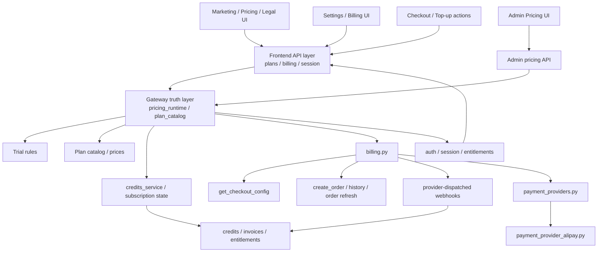

# GitNexus 商业化图

关联总图：`docs/graphs/GITNEXUS_PROJECT_GRAPH.md`

## 1. 范围

这张子图只看商业化相关链路，重点是：

- 营销页、定价页、法律页、settings billing center
- Gateway 侧的 pricing runtime、plan catalog、trial、credits、payment
- provider abstraction 与 Alipay live path
- 前端如何消费商业事实，而不是重定义商业事实

不展开主流程内部实现，只保留与计费、套餐、权益相关的连接点。

## 2. 商业化主图

## 3. 真源边界

### 3.1 runtime pricing 仍从 Gateway 启动时装载

- `gateway/main.py:lifespan` 在启动时调用 `get_runtime_pricing(force_reload=True)`
- `gateway/pricing_runtime.py` 使用 `PricingPayload` 承载 runtime pricing，并在缺失时回退到默认 payload
- `gateway/plan_catalog.py` 从 `get_runtime_pricing()` 继续读取 `plans` 与 `trial`

这条链说明套餐、试用规则、价格快照都应继续以 Gateway 为真源。

### 3.2 前端必须读 provider availability，而不是自己猜

- `gateway/billing.py:get_checkout_config()` 明确声明“Gateway owns provider availability”
- 该接口返回：
  `default_provider`
  `providers[]`
  `operational`
- 优先顺序当前是：
  `alipay -> wechatpay -> stripe -> fake`

因此前端不能通过 env、常量或 UI 顺序去推断支付渠道是否可用。

## 4. Billing center 已经成形

`frontend-next/src/app/(app)/settings/billing/page.tsx` 当前组合了：

- `SubscriptionSummary`
- `CreditsSummary`
- `CheckoutCard`
- `OrderHistory`

它承担的是“展示和触发”职责，不应成为定价、渠道可用性或 entitlement 的事实源。

## 5. Provider abstraction 与 Alipay live path

### 5.1 provider abstraction

- `gateway/billing.py` 文件头已经明确：
  provider-specific logic 走 adapter
  `_process_payment_event` 保持 provider-agnostic
  payment 只修改 entitlements，不触碰 job snapshot
- `gateway/payment_providers.py` 当前注册：
  `fake`
  `alipay`
  `wechatpay`
  `stripe`

### 5.2 Alipay

- `gateway/payment_provider_alipay.py` 支持：
  `alipay.trade.wap.pay`
  `alipay.trade.page.pay`
- 同文件也负责：
  notify payload 验证
  query payload 验证
  `alipay.trade.query`

结论：Alipay 现在不是单点硬编码，而是 provider registry 中的 live adapter。

## 6. 法律与信任面

当前营销面已经显式包含：

- `frontend-next/src/app/(marketing)/privacy/page.tsx`
- `frontend-next/src/app/(marketing)/refund/page.tsx`
- `frontend-next/src/app/(marketing)/terms/page.tsx`

这意味着商业化图不应只画定价卡片和 checkout，还要把法律页当成面向用户的 trust surface。

## 7. 当前商业化边界

从当前代码组织看，商业化仍然是 staged v2 migration，而不是 big-bang rewrite：

- 真源仍是 `pricing_runtime -> plan_catalog -> billing / credits / entitlements`
- 前端承担展示、结账、会话与状态刷新
- admin pricing 是发布面，不是第二套 pricing 系统

任何让前端重新定义 plan / price / entitlement truth 的改动，都应被视为架构漂移。

## 8. 这张图适合回答什么问题

- 套餐、试用、价格和 credits 费率究竟谁是最终真源
- 前端该读哪里来决定 provider 是否可用
- Alipay、fake pay、webhook settlement 现在分别在什么层
- 为什么法律页与 settings billing center 也应该算商业化图的一部分
