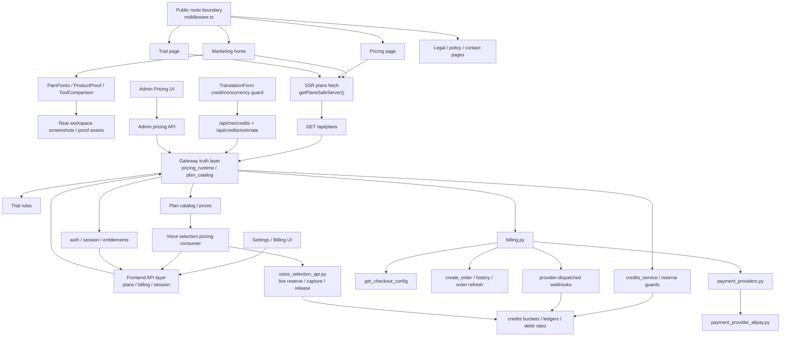

# GitNexus 商业化图

关联总图：`docs/graphs/GITNEXUS_PROJECT_GRAPH.md`

## 1. 范围

这张子图只看商业化相关链路，重点是：

- 营销首页 narrative / proof、定价页、试用页、法律页、contact、settings billing center
- Gateway 侧的 pricing runtime、plan catalog、trial、credits、payment
- workspace 创建任务前的 credits 可读 guard
- provider abstraction、provider availability 与 Alipay live path
- voice clone cost / quality tier / live reserve 如何继续消费 Gateway 真源

不展开主流程内部实现，只保留与计费、套餐、权益和转化相关的连接点。

## 2. 商业化主图

## 3. marketing 前门仍然是 SSR + narrative/proof 组合面

### 3.1 首页 narrative 已经稳定

- `frontend-next/src/app/(marketing)/page.tsx` 当前首页顺序仍是：
  `Hero -> PainPoints -> ProductProof -> WorkflowShowcase -> Features -> SuitedScenarios -> ToolComparison -> TrustBanner -> PricingPreview -> Faq -> FinalCta`
- `ProductProof` 继续使用真实 workspace 截图证明：
  创建任务
  项目结果与下载
  翻译复核
  三引擎音色选择

### 3.2 pricing / trial 仍从 Gateway 真源 SSR 注入

- `pricing` / `trial` 继续通过 `getPlansSafeServer() -> /api/plans` 把数字事实放进 initial HTML
- `get-plans.ts` 仍然是前端学习 plan / pricing / trial runtime facts 的唯一受支持路径

结论：marketing 前门继续承担“叙事 + 真实产品证明 + Gateway 事实注入”三重职责。

## 4. workspace 创建任务前现在也有 credits 可读 guard

- `frontend-next/src/components/workspace/TranslationForm.tsx` 现在会读取：
  `getMyCredits()`
  `getCreditsEstimate(1, "express", "standard")`
  `getCreditsEstimate(1, "studio", "standard" | "high" | "flagship")`
- 同一个表单会同时显示：
  当前可用点数
  express / studio 基础费率
  studio 高级 / 旗舰档位费率
  并发占用 guard
- 这些接口来自 `gateway/credits_read.py`：
  `GET /api/me/credits`
  `GET /api/me/credits-ledger`
  `GET /api/credits/estimate`

结论：商业化真源现在不只在 marketing 和 billing center，也显式延伸到了 workspace 创建任务前的读侧 guard。

## 5. public route 与 provider availability 都不能由前端自己猜

- `frontend-next/src/middleware.ts` 继续把这些路径保留为 public exact paths：
  `/`
  `/pricing`
  `/trial`
  `/auth`
  `/terms`
  `/privacy`
  `/refund`
  `/contact`
- `gateway/billing.py:get_checkout_config()` 继续声明“Gateway owns provider availability”

因此前端不能通过 env、常量或 UI 顺序去推断支付渠道是否可用。

## 6. Billing center、job create、voice clone 现在分别站在不同层

### 6.1 Billing center

`frontend-next/src/app/(app)/settings/billing/page.tsx` 继续组合：

- `SubscriptionSummary`
- `CreditsSummary`
- `CheckoutCard`
- `OrderHistory`

它承担的是展示与触发职责，不是事实源。

### 6.2 Job create

- `gateway/job_intercept.py` 在创建任务时，如果已知时长，会先 `reserve_credits_or_raise()`
- 不足时直接返回 structured 402 / error response，并补偿取消上游任务

### 6.3 Voice clone

- `gateway/voice_selection_api.py` clone 路径也改为 `reserve_credits_or_raise()`
- 不足时直接返回 402，并携带 `required_credits / available_credits`
- clone 成功后再做 capture，失败则 release

结论：商业化图里现在要区分“读侧 guard”“创建任务 live reserve”“clone live reserve”这三类消费面。

## 7. Provider abstraction 与 Alipay live path

### 7.1 provider abstraction

- `gateway/billing.py` 继续保持 provider-agnostic settlement 语义
- `gateway/payment_providers.py` 当前注册：
  `fake`
  `alipay`
  `wechatpay`
  `stripe`

### 7.2 Alipay

- `gateway/payment_provider_alipay.py` 继续支持：
  `alipay.trade.wap.pay`
  `alipay.trade.page.pay`
  `alipay.trade.query`
  notify / query 验签

结论：Alipay 仍然是 provider registry 中的 live adapter。

## 8. 当前商业化边界

从当前代码组织看，商业化仍然是 staged v2 migration，而不是 big-bang rewrite：

- 真源仍是 `pricing_runtime -> plan_catalog -> billing / credits / entitlements`
- 前端承担 SSR 展示、转化叙事、读侧 guard、结账、会话与状态刷新
- live reserve 发生在 Gateway，不在前端
- `cost estimator`、marketing copy、proof 截图都不能升级成结算事实源

任何让前端重新定义 plan / price / entitlement truth 的改动，都应被视为架构漂移。

## 9. 这张图适合回答什么问题

- 为什么 workspace 创建任务前现在也属于商业化消费面
- `GET /api/me/credits` 与 `GET /api/credits/estimate` 分别解决什么问题
- job create 和 voice clone 为什么都已经变成 live reserve guard
- 真实产品截图为什么仍属于商业化架构的一部分
- 套餐、试用、价格和 clone credits 究竟谁是最终真源
