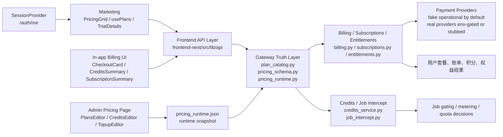

# GitNexus 商业化图

关联总图：`docs/graphs/GITNEXUS_PROJECT_GRAPH.md`

## 1. 范围

这张子图只看商业化相关链路，重点是：

1. 营销页和账单页如何消费套餐事实。
2. Gateway 如何作为计划、试用、定价、权益的真源。
3. 当前支付接入为什么仍然保持“默认安全、可替换、可本地运行”。

## 2. GitNexus 聚类焦点

| 聚类 | 符号数 | 代表成员 |
| --- | ---: | --- |
| Gateway | 242 | `gateway/plan_catalog.py`、`pricing_schema.py`、`billing.py`、`models.py` |
| Api | 156 | `frontend-next/src/lib/api/client.ts`、`voiceSelection.ts`、`reviews.ts` |
| Marketing | 12 | `pricing-grid.tsx`、`trial-details.tsx`、`use-plans.ts`、`session-provider.tsx` |
| Billing | 17 | `checkout-card.tsx`、`subscription-summary.tsx`、`get-credits.ts` |
| Pricing | 10 | `frontend-next/src/app/(app)/admin/pricing/page.tsx` |

## 3. 商业化图

## 4. Gateway 真源证据

`gateway/plan_catalog.py` 的模块说明直接写明：

1. 这里是 plan / pricing / entitlement facts 的中心真源。
2. `billing.py` 和 `job_intercept.py` 都从这里消费。
3. 前端通过公开的 `/api/plans` 消费，而不是本地硬编码。

这和当前项目规则完全一致：前端负责展示与消费事实，不负责重新定义事实。

## 5. GitNexus 证据链

### 5.1 Gateway 启动时装载运行时定价

GitNexus process：`Lifespan → PricingPayload`

1. `gateway/main.py:lifespan`
2. `gateway/pricing_runtime.py:get_runtime_pricing`
3. `_load_from_file`
4. `gateway/pricing_schema.py:build_default_pricing_payload`
5. `gateway/pricing_schema.py:PricingPayload`

这说明 Gateway 启动时就会把 runtime pricing 装进来，运行时事实优先于静态快照。

### 5.2 Job 列表拦截会读取当前套餐事实

GitNexus process：`Intercept_list_jobs → PlanConfig`

1. `gateway/job_intercept.py:intercept_list_jobs`
2. `gateway/credits_service.py:estimate_credits`
3. `_get_runtime_debit_rates`
4. `gateway/pricing_runtime.py:get_runtime_pricing`
5. `_load_from_file`
6. `gateway/pricing_schema.py:build_default_pricing_payload`
7. `gateway/pricing_schema.py:PlanConfig`

这说明 Job 相关的额度、估算、拦截逻辑并不是独立维护一套规则，而是直接回到 runtime pricing 真源。

### 5.3 积分影子扣减同样回到套餐配置

GitNexus process：`Shadow_capture → PlanConfig`

1. `gateway/credits_service.py:shadow_capture`
2. `_pick_buckets_by_priority`
3. `_get_runtime_bucket_priority`
4. `gateway/pricing_runtime.py:get_runtime_pricing`
5. `_load_from_file`
6. `gateway/pricing_schema.py:build_default_pricing_payload`
7. `gateway/pricing_schema.py:PlanConfig`

## 6. 前端消费事实证据

前端营销页 `frontend-next/src/components/marketing/pricing-grid.tsx` 明确写了两条重要约束：

1. 价格、分钟数、并发数都来自 `GET /api/plans`。
2. API 不可用时显示空/错误状态，而不是本地兜底一个价格表。

账单页 `frontend-next/src/components/billing/checkout-card.tsx` 也明确写了：

1. 可买套餐来自 `/api/plans`。
2. 默认支付渠道来自 `/api/billing/checkout-config`。
3. 所有数值事实都来自 Gateway，前端不硬编码。

## 7. 当前商业化边界

从代码和 GitNexus 图谱一起看，当前阶段的商业化边界是：

1. 套餐、试用、积分、权益真相在 Gateway。
2. 前端以营销页、账单页、管理页的形式消费这些事实。
3. 支付抽象已经建立，但默认仍以 `FakeProvider` 为安全主路径。
4. 真实支付渠道保持 env-gated 或 stub，不进入默认本地主路径。

这也符合仓库规则：`main.py` 和 `pytest` 必须能在干净本地环境运行。
