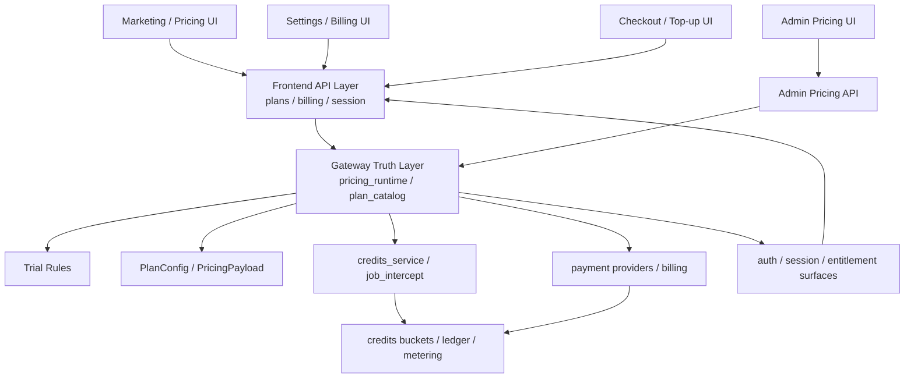

# GitNexus 商业化图

关联总图：`docs/graphs/GITNEXUS_PROJECT_GRAPH.md`

## 1. 范围

这张子图只看商业化相关链路，重点是：

- 营销页、定价页、设置页、结账页
- Gateway 侧的 pricing runtime、plan catalog、trial、credits、payment
- 前端如何消费商业事实，而不是重定义商业事实

不展开主流程内部实现，只保留与计费、套餐、权益相关的连接点。

## 2. 商业化主图

## 3. 真源边界

### 3.1 runtime pricing 从 Gateway 启动时装载

- `gateway/main.py:lifespan` 在启动时调用 `get_runtime_pricing(force_reload=True)`。
- `gateway/pricing_runtime.py` 使用 `PricingPayload` 承载 runtime pricing，并在缺失时回退到 `build_default_pricing_payload()`。
- `gateway/plan_catalog.py` 从 `get_runtime_pricing()` 继续读取 `plans` 与 `trial`。

这条链说明套餐、试用规则、价格快照都应继续以 Gateway 为真源。

### 3.2 credits 估算和捕获依赖同一套 runtime pricing

- `gateway/credits_service.py` 中 `_get_runtime_debit_rates()`、`estimate_credits()`、`shadow_capture()` 都依赖 `get_runtime_pricing()`。
- `gateway/job_intercept.py` 在拦截 job 创建和状态流转时调用 `estimate_credits()`。
- GitNexus process 给出的直接链路是：
  `Shadow_capture -> PlanConfig`
  `Intercept_list_jobs -> PlanConfig`

因此 credits 估算也不能漂移到前端本地常量。

## 4. 前端消费方式

### 4.1 营销与结账面只消费数值

- `frontend-next/src/components/marketing/pricing-grid.tsx` 的注释明确要求价格事实来自 `/api/plans`。
- `frontend-next/src/components/billing/checkout-card.tsx` 的注释明确要求 numeric facts 来自 Gateway。
- `frontend-next/src/components/providers/session-provider.tsx` 与 settings/billing 页面承担的是会话和展示职责，不应成为定价事实源。

### 4.2 admin pricing 是发布面，不是另一个真源

- `frontend-next/src/app/(app)/admin/pricing/page.tsx` 调用 `getAdminPricing()`、`savePricingDraft()`、`publishPricing()`。
- GitNexus process 也识别出：
  `AdminPricingPage -> ForbiddenError`

这说明 admin pricing 是受权限控制的发布入口，但运行时事实仍回到 `pricing_runtime.py`。

## 5. 当前商业化边界

从当前代码组织看，商业化是 staged v2 migration，而不是 big-bang rewrite：

- `Billing` 聚类已经扩大到 51 个符号，说明套餐、积分、支付、设置页的连接面明显增多。
- 但逻辑主轴仍然围绕 `pricing_runtime -> plan_catalog -> credits_service -> payment`。
- 尚未演化成“前端自持套餐定义 + 独立 entitlement engine”的结构。

## 6. 这张图适合回答什么问题

- 套餐、试用、价格和 credits 费率究竟谁是最终真源
- 营销页和结账页应该读哪里，而不是自己写死什么
- admin pricing 为什么是发布入口而不是第二套 pricing 系统
- settings / session / billing 改造时哪些事实不能漂移出 Gateway
