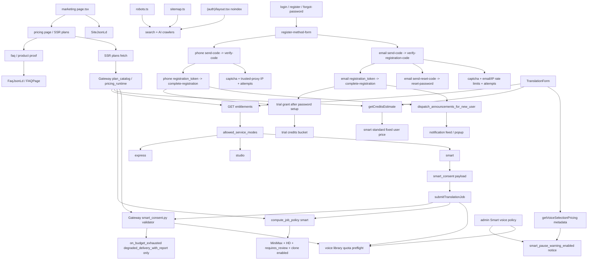

# GitNexus 商业化图

关联总图：`docs/graphs/GITNEXUS_PROJECT_GRAPH.md`

## 1. 范围

这张子图看的是“用户怎么理解套餐与试用、如何完成注册、如何选择服务模式，以及商业事实如何保持 Gateway 真源”，重点是：

- pricing / trial 真源
- phone auth 前门
- email auth 前门
- Smart service mode 入口与固定价
- Smart consent schema、预算耗尽策略与固定价承诺边界
- Smart voice policy、弱匹配暂停提示与候选音色确认边界
- entitlements 与 allowed service modes
- trial 发放边界
- 新注册用户 onboarding 公告
- SEO 与 auth noindex 边界

## 2. 主图

## 3. 当前最重要的商业化变化

### 3.1 套餐 / 试用 / 定价真源仍然在 Gateway

- `gateway/plan_catalog.py`、`gateway/pricing_runtime.py`、`gateway/pricing_admin.py`、`gateway/billing.py` 仍是套餐、试用、计费事实核心。
- `gateway/entitlements.py` 输出 allowed service modes、并发限制、trial / free quota 等前端可消费事实。
- frontend 继续消费 Gateway fact，不自建第二套 plan truth。

结论：Smart 入口上线没有改变商业事实真源。

### 3.2 Smart 作为可售服务模式进入 TranslationForm

- `TranslationForm.tsx` 的 `serviceMode` 支持 `express / studio / smart`。
- Smart 卡片只有当 `entitlements.limits.allowed_service_modes` 包含 `smart` 才可点击。
- 不可用时展示“升级解锁”或“即将开放”，不把权限判断写死在 UI。
- Smart 文案强调固定价、AI 自动审核翻译、按需克隆主说话人音色、不额外扣点。
- 如果 admin 开启“弱个人音色匹配需确认”，`TranslationForm` 会在 Smart 创建前展示暂停提示，避免用户把固定价误读成完全无人值守承诺。
- Gateway `compute_job_policy("smart")` 现在强制 Smart 使用 MiniMax、`speech-2.8-hd`、`requires_review=True`、`voice_clone_enabled=True`，防止因 admin Express/Studio 配置漂移而改变用户购买语义。

结论：Smart 的商业入口已经正式进入 workspace 创建任务流，但可用性仍由 Gateway 控制。

### 3.3 Smart fixed price 通过 credits estimate 读取

- 前端调用 `getCreditsEstimate(1, "smart", "standard")` 获取每分钟估算。
- Smart 当前面向用户展示固定价，内部仍保留 `quality_tier=standard` 兼容二维定价表。
- pipeline 内部的 retry、clone、TTS 调用被产品文案归入固定价，不在前端拆成第二套成本规则。
- voice reuse 与 rejected candidate 会记录为非 billable 使用事件；clone 是否发生属于内部执行事实，不改变用户侧 fixed price。

结论：用户侧价格来自 Gateway estimate，内部成本只进入 admin cost summary。

### 3.4 Smart consent 是商业与合规边界

- 前端提交 Smart job 时携带 `smart_consent`。
- Gateway 在创建任务前校验 Smart consent 必须包含 `auto_voice_clone / auto_retranslate / auto_retts / auto_multimodal_verification / no_extra_charge_without_confirmation / on_budget_exhausted`。
- `on_budget_exhausted` 当前只允许 `degraded_delivery_with_report`；`fail_and_refund` 因实际成本封顶结算路径仍是 stub，被显式拒绝。
- pipeline 只有在 `smart_consent.auto_voice_clone is True` 时才复用同源个人音色或抽样、查询 quota、调用 clone provider。
- pipeline 还会读取 admin Smart voice policy：`smart_auto_clone_enabled`、`smart_reuse_user_voice_enabled`、`smart_pause_on_possible_user_voice_match` 决定复用、克隆和弱匹配暂停是否进入自动路径。
- consent 不满足时走 preset / handoff 逻辑，不暗中调用真实 clone。

结论：Smart 自动克隆不是单纯技术开关，而是“用户授权 + admin policy”共同约束的商业与合规边界。

### 3.5 Smart voice library quota 是售前安全阀

- Gateway create path 会对非 admin Smart job 进行个人音色库 quota 安全水位预检，但前提是 `smart_consent.auto_voice_clone` 和 admin `smart_auto_clone_enabled` 同时为真。
- 预检命中时返回 `smart_voice_library_at_safety_water_mark`，避免用户付费后才在 pipeline 内被克隆容量拦住。
- admin 路径跳过该预检，方便运维和验证；runtime 仍保留 fail-closed quota check。

结论：商业入口不仅看权益是否允许 Smart，还要在确实可能发生自动克隆时提前避免明显无法完成的承诺。

### 3.6 候选音色优先不会改变固定价承诺

- Studio / Post-edit 的候选音色入口会把强匹配个人音色作为“不扣点”复用选项，把弱匹配个人音色作为“需要确认”的候选。
- Smart 弱匹配暂停时会把 `smart_offered_candidates` 写入审核态；用户若选择其他音色，Gateway 记录非 billable rejected-candidate audit。
- 这些候选、确认、拒绝事件服务于体验与审计，不形成新的用户侧计费规则。

结论：候选优先是降低重复克隆和误匹配风险的产品机制，不是前端新增一套价格体系。

### 3.7 phone auth 仍是完整生命周期流

- `POST /auth/phone/send-code`
- `POST /auth/phone/verify-code`
- `POST /auth/phone/complete-registration`
- `POST /auth/phone/reset-password`

核心边界仍然是：验证码通过不等于注册完成，trial 只在 `complete-registration` 成功后发放。

### 3.8 email auth 已经并入同一注册模型

- `gateway/auth_email.py` 挂载在 `/auth/email`。
- registration 分两步：`verify-registration-code` 产出 registration token，`complete-registration` 设置密码、创建用户、创建 session。
- reset 分两步：`send-reset-code` 和 `reset-password`。
- `EmailVerificationChallenge` 负责持久化 code hash、attempts、expiry、consumed state。

结论：email auth 与 phone auth 保持同样的“验证通过后再完成注册”边界。

### 3.9 新注册用户仍进入 live announcement 生命周期

- phone complete registration 和 email complete registration 都会接入新用户生命周期。
- 系统公告以 `UserNotification` 进入 bell / popup feed。

结论：onboarding 入口从 phone 扩展到 phone + email，但下游运营触达统一。

## 4. 关键证据

- `gateway/plan_catalog.py`
  - plan definitions
  - allowed service modes
- `gateway/entitlements.py`
  - entitlement response
- `gateway/credits_service.py`
  - estimate and debit rates
- `gateway/job_intercept.py`
  - Smart compute_job_policy
  - Smart create-job quota safety water mark
  - consent + admin clone gate for quota preflight
  - candidate rejection audit
- `gateway/smart_consent.py`
  - Smart consent schema and allowed budget policy
- `gateway/admin_settings.py`
  - Smart voice policy settings
- `gateway/voice_selection_api.py`
  - candidate-first voice options
- `frontend-next/src/components/workspace/TranslationForm.tsx`
  - Smart mode card
  - entitlement gate
  - Smart fixed price estimate
  - Smart weak-match pause warning
- `tests/test_smart_entry_wiring.py`
  - Smart consent and Gateway whitelist guards
- `gateway/auth_email.py`
  - registration code
  - registration token
  - complete registration
  - password reset
  - fake/resend provider
- `gateway/alembic/versions/026_email_auth.py`
  - email verification challenge schema
- `frontend-next/src/components/auth/email-register-form.tsx`
  - email register UI
- `frontend-next/src/components/auth/register-method-form.tsx`
  - phone/email method selection
- `gateway/auth_phone.py`
  - phone auth lifecycle
- `gateway/system_announcements_service.py`
  - new registration announcements

## 5. 什么时候优先读这张图

- 想改 pricing / trial / billing truth
- 想改 Smart 可售入口、固定价、allowed service modes
- 想改 Smart consent、预算耗尽策略、admin voice policy、voice library quota 预检
- 想改候选音色确认、弱匹配暂停提示、非计费候选拒绝审计
- 想改 phone 或 email 注册登录
- 想改验证码、captcha、rate limit、registration token
- 想把新注册用户接入公告或其他 onboarding 触点
- 想确认 robots / sitemap / auth noindex 的边界
