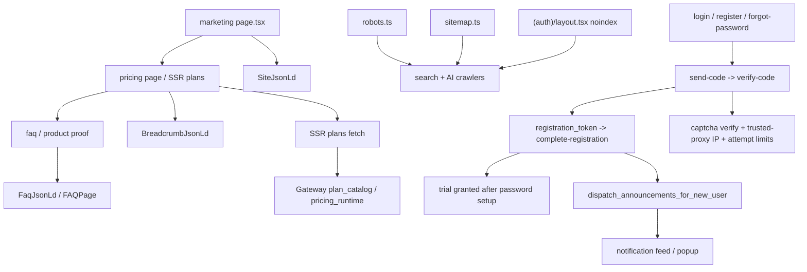

# GitNexus 商业化图

关联总图：`docs/graphs/GITNEXUS_PROJECT_GRAPH.md`

## 1. 范围

这张子图看的是“用户怎么理解套餐与试用、如何完成注册、以及新注册用户如何进入生命周期运营面”，重点是：

- pricing / trial 真源
- 手机号 auth 前门
- trial 发放边界
- 新注册用户 onboarding 公告
- SEO 与 auth noindex 边界

## 2. 主图

## 3. 这轮最重要的商业化变化

### 3.1 套餐 / 试用 / 定价真源仍然由 Gateway 掌握

- 这一轮虽然 auth 与 support 改动很大，但 pricing 真源边界没有漂移到前端
- `gateway/pricing_runtime.py`、`gateway/pricing_admin.py`、`gateway/billing.py` 仍然是套餐、试用、计费事实的核心后端面

结论：前端继续消费套餐与试用事实，不自建第二套商业真源。

### 3.2 手机号 auth 已经变成统一前门，而不是零散验证码接口

- `gateway/auth_phone.py` 当前公开流是：
  - `POST /auth/phone/send-code`
  - `POST /auth/phone/verify-code`
  - `POST /auth/phone/complete-registration`
  - `POST /auth/phone/reset-password`
- 核心规则已经写死在模块头：
  - 验证码通过 != 注册成功
  - 新用户必须先设密码
  - trial 只在 `complete-registration` 成功后发放

结论：手机号 auth 已经是一条完整生命周期流，不再只是“发个验证码再看后面怎么接”。

### 3.3 captcha pre-verify pass-token 已被删除，auth 前门改成直接校验

- `auth_phone.py` 明确注释：旧的 `/auth/captcha/pre-verify + pass_token` 是 dead code，已经删掉
- 现在 `send_code_endpoint` 直接调用 `risk_control.verify_captcha(captcha_token)`

结论：公开 auth 前门的风控链已经更直接，也避免了旧单次 token 语义导致的重复提交失败。

### 3.4 IP 风控与 wrong-code attempt 现在有正式边界

- `_client_ip()` 只在 socket peer 属于 trusted proxy allowlist 时才信任 `CF-Connecting-IP` / `X-Forwarded-For`
- `MAX_VERIFY_ATTEMPTS = 3`
- 旧的“第一次输错就烧掉 challenge”逻辑已经被替换

结论：auth 前门现在不仅能发验证码，还正式建模了 trusted proxy 和验证码猜测成本。

### 3.5 新注册用户已经进入 live announcement 生命周期

- `system_announcements_service.py` 新增 `audience_kind="for_new_registrations"`
- `auth_phone.py` 在 `complete-registration` 成功后调用 `dispatch_announcements_for_new_user(...)`
- 这类公告会以 `UserNotification` 形式落到 bell / popup feed

结论：注册成功后的用户已经被系统公告平面接住，onboarding 不再只有“注册完就结束”。

### 3.6 `auth` 仍然被明确排除在公开 SEO 面之外

- `(auth)/layout.tsx` 继续统一下发 `robots: { index: false, follow: false }`
- `robots.ts` 与 `sitemap.ts` 只让公开 marketing surface 被抓取

结论：公开营销面与受限 auth 面的边界仍然清晰。

## 4. 关键证据

- `gateway/auth_phone.py`
  - `send-code / verify-code / complete-registration / reset-password`
  - trial grant boundary
  - trusted proxy IP
  - wrong-code attempts
- `gateway/risk_control.py`
  - captcha / phone normalization / rate-limit 边界
- `gateway/system_announcements_service.py`
  - `for_new_registrations`
  - `dispatch_announcements_for_new_user`
- `gateway/pricing_runtime.py`
- `gateway/pricing_admin.py`
- `gateway/billing.py`
  - 商业真源仍在 Gateway
- `frontend-next/src/app/(auth)/layout.tsx`
  - `noindex`

## 5. 什么情况下优先读这张图

- 想改 pricing / trial / billing truth，但不想把真源漂移到前端
- 想改手机号登录注册、trial 发放、captcha / risk 前门
- 想把新注册用户接入公告或其他 onboarding 触点
- 想确认 robots / sitemap / auth noindex 的边界
