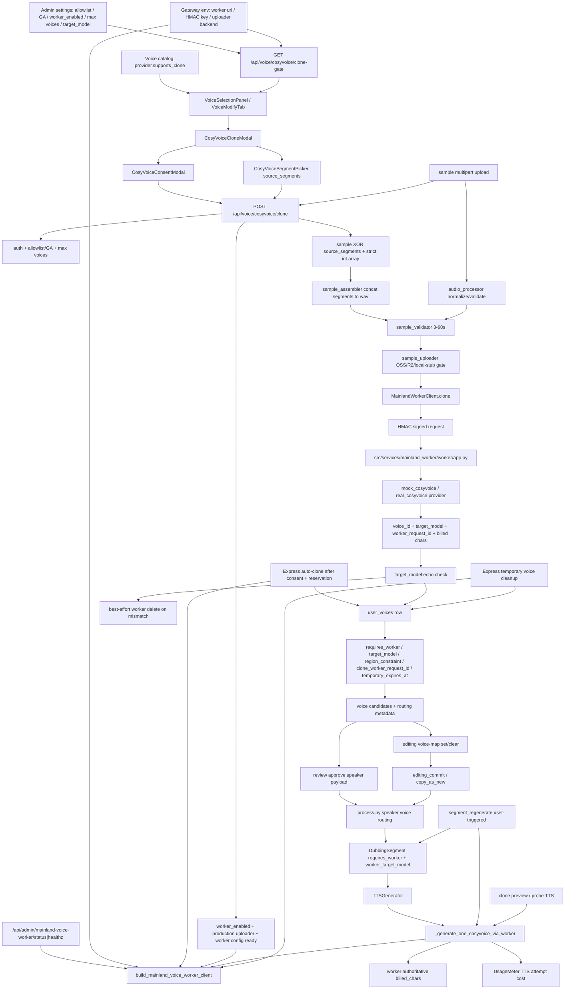

# GitNexus CosyVoice / Mainland Worker 图

生成时间：`2026-05-29`

## 1. 范围

这张子图聚焦 CosyVoice 克隆、国内 worker、用户显式克隆入口、worker 路由传播、Express 自动克隆共用的 worker 边界、以及相关付费 API 安全边界。Express 的 consent/reservation/cleanup 细节拆到 `GITNEXUS_EXPRESS_COSYVOICE_AUTO_CLONE_GRAPH.md`。

适合先看这张图的任务：

- 修改 `gateway/cosyvoice_clone/*`、`gateway/mainland_voice_worker.py` 或 `src/services/mainland_worker/*`。
- 排查 `/api/voice/cosyvoice/clone-gate`、`POST /api/voice/cosyvoice/clone`、worker HMAC、OSS/R2 sample upload、target model echo mismatch。
- 修改 Studio/Editing 音色选择、CosyVoice clone modal、source segment picker、preview route。
- 排查 `requires_worker / worker_target_model / clone_worker_request_id` 没有传到 TTS 或 edit/copy-as-new 后丢失。
- 判断 Express 自动克隆成功后为什么没有走 CosyVoice worker TTS，或临时音色入库字段是否自洽。

## 2. 主图

## 3. 当前核心认知

### 3.1 clone-gate 是展示层门禁，不是付费调用

- `GET /api/voice/cosyvoice/clone-gate` 只返回当前用户是否能看到 CosyVoice 克隆入口、默认模型、最大音色数、runtime readiness 和不可用原因。
- gate 的授权逻辑与 `POST /clone` 共用 `_resolve_clone_gate`，避免前端显示“可克隆”但提交时被另一套授权规则拒绝。
- `runtime_ready` 同时看 `cosyvoice_clone_worker_enabled`、sample uploader 是否 production-ready、以及 mainland worker config 是否完整。
- gate 不构造真实 worker client，不上传样本，不触发付费 provider。

### 3.2 `POST /clone` 是唯一用户显式付费克隆入口

- 前端必须通过 `CosyVoiceConsentModal` 明确确认授权，提交到 `POST /api/voice/cosyvoice/clone`。
- 输入必须在 `sample` multipart 和 `source_segments` 二选一；`source_segments` 是严格 JSON array of int，且必须带 `source_job_id`。
- `source_segments` 路径先从任务 transcript 组装样本，再走同一套 sample validator；空数组、非法 JSON、非 int 都在读样本或上传前 fail-closed。
- max voices per user 在 worker.clone 之前检查，避免灰度用户反复触发付费克隆。

### 3.3 sample uploader 和 worker config 都是付费前置 gate

- worker enabled 但 uploader 仍为 `local_fs_stub` 时，`POST /clone` 直接 503，不转码、不上传、不调 worker。
- OSS/R2/local-stub 的选择集中在 `gateway/cosyvoice_clone/sample_uploader.py`，clone endpoint 只消费上传结果。
- `build_mainland_voice_worker_client` 缺 url/key_id/secret 时返回 `None`，调用方必须显式降级为 503，不允许默认绕去海外或其他付费 provider。

### 3.4 国内 worker 是 HMAC RPC 边界

- Gateway 只暴露 admin status/healthz，不把 worker 路由暴露给普通用户。
- `MainlandWorkerClient` 对 `/cosyvoice/clone`、`/cosyvoice/synthesize-batch`、`DELETE /cosyvoice/voices/{voice_id}` 做 HMAC 签名。
- worker app 的 `/healthz` 不验签，用于容器和 Nginx 健康检查；CosyVoice 业务路由全部验签。
- provider 层分 `mock_cosyvoice` 和 `real_cosyvoice`，测试默认走 mock/stub，避免本地路径引入真实付费调用。

### 3.5 user_voices 成为 worker 路由事实表

- migration 030 给 `user_voices` 增加 `region_constraint`、`requires_worker`、`target_model`、`worker_provider`、`worker_region`、`clone_worker_request_id` 等审计字段。
- migration 031 增加 `temporary_expires_at`，用于临时音色过期治理；active 判断仍应以 `is_active` 为准。
- CosyVoice clone 成功写入 `created_from="cosyvoice_clone_endpoint"`，并固化 `requires_worker=True` 与 `target_model`。
- worker 返回的 `target_model` 必须与请求一致；不一致时触发 bounded best-effort delete，并把 `worker_request_id` 留给运维 reconcile。

### 3.6 worker routing 必须随 speaker / segment / edit 传播

- approve 路径通过 `gateway/job_intercept.py` 和 `gateway/user_voice_service.py` 把 clone voice 的 `requires_worker / worker_target_model` 注入 speaker payload。
- `process.py` 读取 speaker routing，写到 `DubbingSegment`；`requires_worker=True` 时强制 provider 为 `cosyvoice`。
- editing voice-map、editing commit、copy-as-new 都要保留 worker routing；选择非 worker voice 时必须清掉 stale routing。
- `segments.json` 中的 `requires_worker / worker_target_model` 是后续 regenerate 和交付重跑的关键证据，不能只存在于 UI 状态。

### 3.7 worker TTS 不能静默 fallback

- `TTSGenerator._generate_one_cosyvoice_via_worker` 要求 `voice_id` 和 `worker_target_model` 非空，否则直接失败。
- `requires_worker=True` 的段落不走 legacy CosyVoice 海外 endpoint，也不允许 worker 失败后静默改用默认音色。
- worker 返回的 billed chars 是 authoritative，普通字符估算不能覆盖 worker billing。
- `segment_regenerate.py` 对 worker 段落禁止 final retry loop，避免单段失败被放大成多次付费 worker 调用。

### 3.8 前端防线是“能力 AND 运行态 gate”

- `VoiceSelectionPanel` 和 `VoiceModifyTab` 同时看 provider `supports_clone` 与 clone-gate `can_access_clone`，两者都满足才展示 CosyVoice 克隆入口。
- `CosyVoiceSegmentPicker` 只负责选择已有任务段落，不直接提交 clone；提交仍集中在 `submitCosyvoiceClone`。
- `frontend-next/next.config.ts` 已收窄 dev rewrite，避免 `/api/voice/cosyvoice/*` 在本地开发时被 blanket proxy 到生产，导致 session 与付费 clone 路由漂移。

### 3.9 Express 自动克隆共用 worker，但商业/成本 gate 在另一条子图

- Express 自动克隆不是 `POST /api/voice/cosyvoice/clone` 的替代入口，而是 `process.py -> services.express.pipeline_clients -> services.express.auto_clone` 的 pipeline 内路径。
- Express 成功后仍写 `user_voices` worker routing 事实，后续 TTS 与用户显式 clone 共享国内 worker dispatch。
- Express 的预约、cap、同意、临时音色 cleanup 由 `GITNEXUS_EXPRESS_COSYVOICE_AUTO_CLONE_GRAPH.md` 记录；本图只保留 worker RPC 与路由事实边界。

## 4. 关键证据

| 主题 | 证据文件 |
| --- | --- |
| Gateway clone API | `gateway/cosyvoice_clone/api.py` |
| Sample 处理 | `gateway/cosyvoice_clone/audio_processor.py`, `gateway/cosyvoice_clone/sample_assembler.py`, `gateway/cosyvoice_clone/sample_validator.py`, `gateway/cosyvoice_clone/sample_uploader.py` |
| Worker Gateway 接入 | `gateway/mainland_voice_worker.py`, `gateway/config.py`, `gateway/startup_checks.py` |
| Worker client/app | `src/services/mainland_worker/client.py`, `src/services/mainland_worker/worker/app.py`, `src/services/mainland_worker/hmac_auth.py` |
| Provider 边界 | `src/services/mainland_worker/worker/providers/mock_cosyvoice.py`, `src/services/mainland_worker/worker/providers/real_cosyvoice.py` |
| UserVoice schema | `gateway/models.py`, `gateway/alembic/versions/030_cosyvoice_clone_metadata.py`, `gateway/alembic/versions/031_user_voice_temp_expiry.py` |
| Express auto-clone | `src/services/express/auto_clone.py`, `src/services/express/pipeline_clients.py`, `gateway/express_reservation_service.py`, `gateway/express_voice_cleanup_service.py` |
| 路由传播 | `gateway/user_voice_service.py`, `gateway/voice_selection_api.py`, `src/pipeline/process.py`, `src/services/jobs/editing_voice_map.py`, `src/services/jobs/editing_commit.py`, `src/services/jobs/copy_service.py` |
| TTS worker dispatch | `src/services/tts/tts_generator.py`, `src/services/tts/segment_regenerate.py` |
| 前端入口 | `frontend-next/src/components/voice-clone/*`, `frontend-next/src/lib/api/cosyvoiceClone.ts`, `frontend-next/src/components/workspace/VoiceSelectionPanel.tsx`, `frontend-next/src/app/(app)/workspace/[jobId]/edit/VoiceModifyTab.tsx` |
| 回归守卫 | `tests/test_cosyvoice_clone_api.py`, `tests/test_cosyvoice_clone_gate_api.py`, `tests/test_mainland_worker_*`, `tests/test_phase4_1_*`, `tests/test_phase42_*` |

## 5. 什么时候优先读这张图

- CosyVoice clone UI 看得见但提交 403/503。
- clone-gate 显示 ready，但 `POST /clone` 返回 `worker_disabled`、`uploader_unavailable`、`worker_target_model_mismatch`。
- 用户选择了克隆音色，但正式 TTS、preview、segment regenerate 或 copy-as-new 后没有走国内 worker。
- Express 自动克隆已经生成临时音色，但 worker routing 或 target_model 没有进入段落 TTS。
- `user_voices` 里有 `requires_worker=True`，但 `segments.json` 没有 `worker_target_model`。
- worker TTS 费用、billed chars、request id 或 provider audit 对不上。
