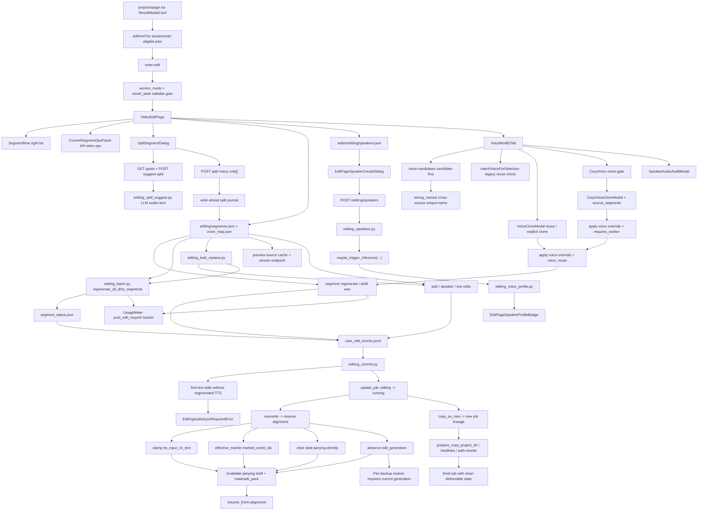

# GitNexus 编辑 / 后处理图

关联总图：`docs/graphs/GITNEXUS_PROJECT_GRAPH.md`

## 1. 范围

这张子图聚焦 `editing` 状态下的修改、重生成、speaker 生命周期、提交与 lineage 行为，重点是：

- editing speakers registry
- edit page left-video / ops-panel / segment-row redesign
- speaker voice profile inference
- multi-cut split 与 write-ahead journal
- user-explicit LLM suggest-split
- bulk replace 批量文本替换
- `preview-source` cache 与 stream endpoint
- single segment re-TTS 与 batch re-TTS
- `overwrite / copy_as_new`
- `editing_audio_sync_required`
- Smart job 是否允许进入 editing
- Smart/Studio 项目列表“修改”入口
- editing 内音色复用、显式 clone、审听与 post-edit re-synthesis 计量
- CosyVoice clone gate、source_segments、worker routing 在 editing 中的保留和清除
- `edit_generation` 与 Pan backup/restore 的当前代约束
- editing 写请求经 Gateway Job API proxy 时受 CSRF same-origin guard

## 2. 主图

## 3. 当前最大的变化

### 3.1 Smart job 进入 editing 需要二级状态门

- `src/services/jobs/api.py` 现在允许 `service_mode in {studio, smart}` 的任务进入 editing。
- 如果 `record.service_mode == "smart"`，还必须通过 `is_editable_smart_state(...)`。
- Smart 只有 `completed` 或 `downgraded_to_studio` 可编辑。
- `frontend-next/src/app/(app)/projects/page.tsx` 的 `EDITABLE_SERVICE_MODES` 同时包含 `studio` 和 `smart`，符合状态门的任务会在结果卡片上显示 edit href。

结论：Smart 审计身份可以保留，但 in-flight / refunded Smart job 不能进入 post-edit。

### 3.2 Editing 音色修改复用主审核组件

- `VoiceModifyTab.tsx` 复用 `VoiceCloneModal` 和 `SpeakerAudioAuditModal`，避免编辑页自建第二套 clone / 审听逻辑。
- modal 打开时同样查询 `voice-match`，可直接复用同源 UserVoice；需要新 clone 时仍要求用户显式点击。
- `VoiceModifyTab.tsx` 也调用 `voice-candidates`，按强匹配、可能匹配、其他个人音色分组展示，和 Studio voice selection 保持一致；跨源唯一同名候选可作为 `strong_named` 强复用候选出现。
- approve payload 可以带 `voice_reuse`，让 Gateway 区分复用已有音色与新克隆。
- clone 不是进入编辑页后的自动动作，仍受 clone lock、source metadata、calibration hook 约束。
- CosyVoice clone 入口会先读 `/api/voice/cosyvoice/clone-gate`，并与 provider `supports_clone` 做 AND；gate 失败只隐藏/禁用入口，不触发付费 worker。
- `CosyVoiceCloneModal` 支持上传 sample 或从当前任务选择 `source_segments`，提交前必须经过 consent modal。

结论：后编辑音色修改已经接回主审核流的复用/克隆安全边界，不做后台自动克隆。

### 3.2.1 Editing 写操作受 Gateway CSRF guard 保护

- editing 相关 POST/PATCH/DELETE 多数经 `/job-api/jobs/{job_id}/{subpath:path}` 代理到 Job API。
- `gateway/main.py` 给该 catch-all 加 `require_same_origin_state_change`，因此 split、regenerate、commit、speaker write 等浏览器发起的状态变更需要合法 Origin/Referer。
- CSRF 不改变 editing 的业务 gate：`editing_audio_sync_required`、lineage、generation、clone lock 仍由原业务代码判定。

结论：排查 editing 403 时要先分清是同源保护失败，还是编辑态业务约束失败。

### 3.3 编辑页已经拆成左视频操作面 + 右段落列表

- `SegmentRow.tsx` 承接右侧每个 segment 的展示、说话人选择、状态按钮、draft TTS inline panel。
- `CurrentSegmentOpsPanel.tsx` 承接左侧当前段的完整操作面，handlers 与 `SegmentRow` 共用，不维护第二套业务逻辑。
- `SplitSegmentDialog.tsx` 从行内 split UI 独立出来，统一处理切点、speaker assignment、智能建议和提交。

结论：编辑页结构从单页内联组件推进到可测试、可替换的三个明确组件。

### 3.4 editing speaker 仍然是独立实体

- `editing_speakers.py` 把编辑态 speakers 持久化到 `editor/editing/speakers.json`。
- 创建 speaker 通过 `file_lock(editing_speakers_path(project_dir))` 保护。
- 前端通过 `/editing/speakers` 读写，并通过 retry-profile 重新触发 profile 推断。

结论：editing speaker 是编辑态正式模型，不是临时 UI 字段。

### 3.5 split-many 是正式分割内核

- `split_editing_segment_many(...)` 支持一个 segment 的 1..N 个 cuts，输出 N+1 个新 segment。
- cuts 必须在 `source_index` 和 `cn_index` 上严格单调，且不能产生空片段。
- backend 用 write-ahead journal 保护 `segments.json / segment_status.json / voice_map.json` 三文件一致性。
- 读 `segments / status / voice_map` 时会先 reconcile journal，处理中断态 A/B/C。
- 分割后新段标记为 `text_dirty`，父段 draft wav 会被清理，旧 voice override 会迁移到新段。

结论：多切点分割已经是编辑态数据模型的一部分，不能当作纯前端操作。

### 3.6 智能切点是用户显式触发的付费 LLM 功能

- `editing_split_suggest.py` 使用单段 audio clip + source/CN 文本 + video title 调 Gemini multimodal。
- 入口是 `POST /jobs/{id}/segments/{sid}/suggest-split`，前端按钮为“智能识别说话人切点”。
- per-segment cap = 1，per-job cap = `MAX(MIN(0.2 × N, anomaly_count), 5)`；前端通过 `GET /suggest-split-quota` 显示剩余额度。
- LLM 返回 `at_text`，后端再精确映射到 `source_index`，无法定位时降级为 `needs_split=false`。
- 该能力不自动 fallback、不批量调用、不从异常兜底路径触发。

结论：智能切点是显式用户操作，不是后台自动修复。

### 3.7 batch re-TTS 只扫 dirty segment

- `src/services/jobs/editing_batch.py` 扫描 `segment_status.json`。
- 触发状态是 `text_dirty / voice_dirty / tts_failed`。
- `tts_loading` 和 `tts_dirty` 不会被批量覆盖。
- 单段失败不会中断整批，结果返回 succeeded/failed segment 列表。

结论：批量重合成是用户编辑后的显式处理面，不会自动覆盖用户尚未接受的 draft。

### 3.8 bulk replace 是文本批处理，不自动完成音频同步

- `src/services/jobs/editing_bulk_replace.py` 将批量文本替换纳入 editing operation，而不是让前端直接改最终产物。
- 替换命中的 segment 仍应进入 dirty / audio sync 路径，后续需要 regenerate 或 batch re-TTS。
- bulk replace 不能绕过 `editing_audio_sync_required`，也不能让 overwrite/copy-as-new 在音频未同步时提交。

结论：bulk replace 提升文本编辑效率，但仍受 post-edit 的音频同步和 commit hard gate 约束。

### 3.9 preview-source cache 继续作为独立回放侧路

- `POST /jobs/{jobId}/segments/{segmentId}/preview-source`
- `GET /job-api/jobs/{jobId}/segments/{segmentId}/preview-source-audio`
- 缓存落在 `editor/editing/preview_cache/{segment_id}.wav`

结论：编辑页继续区分“试听 draft TTS”和“回放原始分段音频”。

### 3.10 commit 仍然有 text/audio sync hard gate

- `_find_text_edits_without_tts(project_dir)` 检测文本改动但没有重新合成音频的 segment。
- 命中时抛 `EditingAudioSyncRequiredError`。
- 这条 gate 不替代 lineage / revision 冲突检查。

结论：post-edit text/audio sync 是提交硬约束。

### 3.11 overwrite 仍会主动退休旧交付物身份

- overwrite 会清空旧 `jianying_draft_attempt_id / substep / fingerprint`。
- 网关侧会调用 `invalidate_materials_pack_for_job(...)`。
- `edit_generation` 推进后，R2 交付也切到新的 generation key 空间。
- Pan 归档记录使用 `BackupRecord.job_edit_generation` 绑定备份代际，restore 只接受与当前 `Job.edit_generation` 匹配的已上传备份。

结论：post-edit 后旧草稿、旧打包物、旧 R2 generation 都被视作 stale。

### 3.12 post-edit re-synthesis 有单独 usage bucket

- `UsageMeter` 增加 `TTS_BUCKET_POST_EDIT_RESYNTH`。
- post-edit 单段或批量重合成可以与主流程 TTS 分开统计 provider/model、字符数、调用次数和失败。
- 该数据进入成本/质量分析，但不改变 editing commit 的 text/audio sync 硬门。

结论：后编辑重合成已经具备成本归因入口，避免与主流水线 TTS 混算。

### 3.13 CosyVoice worker routing 是 editing voice-map 的一部分

- `src/services/jobs/editing_voice_map.py` 在 set voice override 时可写 `requires_worker=True` 与 `worker_target_model`。
- `src/services/jobs/editing_commit.py` 会把 worker routing 写进 baseline `editor/segments.json`，这是后续 pipeline 重跑 TTS 的输入事实。
- `src/services/jobs/copy_service.py` 在 `copy_as_new` 时保留 worker routing；选择非 worker 音色时会清除 stale `requires_worker / worker_target_model`。
- `VoiceModifyTab.tsx` 对 clone voice preview 和后续 regenerate 复用同一套 routing，避免 UI 看到 CosyVoice clone voice，但正式 TTS 走 legacy endpoint。

结论：post-edit 的音色修改不能只改 `voice_id`；CosyVoice clone voice 必须连同 worker routing 一起提交、持久化、复制或清除。

## 4. 关键证据

- `src/services/jobs/api.py`
  - Smart editable gate
  - editing endpoints
- `src/services/smart/state.py`
  - `is_editable_smart_state(...)`
- `frontend-next/src/app/(app)/projects/page.tsx`
  - Studio/Smart edit eligibility
- `frontend-next/src/app/(app)/workspace/[jobId]/edit/VoiceModifyTab.tsx`
  - Voice modify candidate-first reuse / clone entry
  - CosyVoice clone-gate and worker routing
- `frontend-next/src/components/voice-clone/CosyVoiceCloneModal.tsx`
  - explicit CosyVoice clone entry
- `frontend-next/src/components/voice-clone/CosyVoiceSegmentPicker.tsx`
  - source_segments picker
- `frontend-next/src/app/(app)/workspace/[jobId]/edit/SplitSegmentDialog.tsx`
  - multi-cut split UI
  - explicit LLM suggest-split button
- `frontend-next/src/components/workspace/edit/SegmentRow.tsx`
  - right-side segment row
- `frontend-next/src/components/workspace/edit/CurrentSegmentOpsPanel.tsx`
  - active segment operation panel
- `frontend-next/src/components/workspace/VoiceSelectionPanel.tsx`
  - shared `VoiceCloneModal`
  - shared `SpeakerAudioAuditModal`
- `frontend-next/src/lib/api/editing.ts`
  - suggest-split API
  - split-many API
  - bulk replace API
- `src/services/jobs/editing_segments.py`
  - `split_editing_segment_many`
  - split journal reconcile
- `src/services/jobs/editing_split_suggest.py`
  - LLM-backed split suggestion
- `src/services/jobs/editing_batch.py`
  - dirty segment batch regenerate
- `src/services/jobs/editing_bulk_replace.py`
  - bulk text replace
  - dirty segment marking
- `src/services/jobs/editing_speakers.py`
  - speakers registry
- `src/services/jobs/editing_voice_profile.py`
  - fire-and-forget inference
- `src/services/jobs/editing_commit.py`
  - sync hard gate
  - overwrite claim
  - stale deliverable invalidation
  - worker routing persistence
- `src/services/jobs/editing_voice_map.py`
  - voice-map worker routing metadata
- `src/services/jobs/copy_service.py`
  - copy_as_new routing preservation
- `src/services/usage_meter.py`
  - post-edit re-synthesis bucket
- `gateway/models.py`
  - `Job.edit_generation`
  - `BackupRecord.job_edit_generation`
- `gateway/pan/restore_executor.py`
  - restore generation guard
- `gateway/main.py`
  - CSRF-protected Job API subresource proxy

## 5. 什么时候优先看这张图

- 想改 Smart job 是否能进入 editing
- 想改项目列表是否展示“修改”入口
- 想改 editing 中音色复用、clone、审听入口
- 想排查 CosyVoice clone voice 在 editing regenerate / commit / copy_as_new 后为什么没有走国内 worker
- 想改编辑页布局、段落行、左侧当前段操作面
- 想改 bulk replace 或批量替换后的 dirty/audio sync 规则
- 想改 split-many、智能切点、切点拖动或 source/cn index 规则
- 想改批量 re-TTS 或 segment status
- 想改 editing speakers 创建、profile 推断、retry-profile
- 想判断为什么某次 commit 报 `editing_audio_sync_required`
- 想改 post-edit 后交付物失效策略
- 想改 post-edit、归档备份、恢复之间的 generation 一致性约束
- 想排查 editing split/regenerate/commit 写请求为什么被 CSRF 拦截
