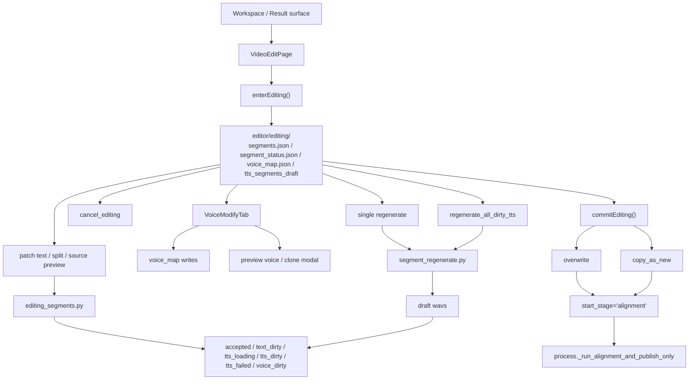

# GitNexus 编辑后处理图

关联总图：`docs/graphs/GITNEXUS_PROJECT_GRAPH.md`

## 1. 范围

这张子图聚焦 Studio 成功任务进入修改流程后的整条链路，重点是：

- `VideoEditPage`
- `VoiceModifyTab`
- `editor/editing/` 工作区
- 单段 / 批量 re-TTS
- `overwrite / copy_as_new`
- `alignment-only resume`

## 2. 编辑后处理主图

## 3. 双端 feature gate

- 前端：`frontend-next/src/app/(app)/workspace/[jobId]/edit/page.tsx` 以 `NEXT_PUBLIC_ENABLE_POST_EDIT === "1"` 作为入口 gate
- 后端：editing 相关端点仍受 `AVT_ENABLE_POST_EDIT` 保护

因此，post-edit 不是默认全开路径，而是显式启用的 Studio 能力。

## 4. VideoEditPage 是新的统一入口

`frontend-next/src/app/(app)/workspace/[jobId]/edit/page.tsx` 当前直接导入并使用：

- `enterEditing`
- `getEditingSegments`
- `getVoiceMap`
- `regenerateAllDirtyTts`
- `splitEditingSegment`
- `commitEditing`

同一个页面还会：

- 从 `voice_selection_review` payload 读取 speaker display names
- 在任务尚未处于 editing 时先调用 `enterEditing(jobId)`
- 对 `copy_as_new` 传递 `copy_display_name`

这说明 post-edit 已经有稳定的一页式前端表面，而不是零散 mutation 按钮。

## 5. editing buffer 的状态模型

### 5.1 editing 目录是唯一可变工作区

`src/services/jobs/editing.py` 定义了基础状态迁移：

- `enter_editing(record, store)`：`succeeded -> editing`
- `cancel_editing(record, store)`：`editing -> succeeded`
- 会写 `editing_touched_at`
- 会发出：
  `editing.entered`
  `editing.cancelled`

### 5.2 segment 状态机

`src/services/jobs/editing_segments.py` 当前显式维护：

- `accepted`
- `text_dirty`
- `tts_loading`
- `tts_dirty`
- `tts_failed`
- `voice_dirty`

并且会在存在 `tts_segments_draft/{sid}.wav` 时给前端补：

- `draft_wav_duration_ms`

这使编辑态不只是“文本有没有变”，而是能表达音频草稿与语音覆盖的真实状态。

## 6. VoiceModifyTab 的语义

`frontend-next/src/app/(app)/workspace/[jobId]/edit/VoiceModifyTab.tsx` 当前的关键语义是：

- 复用 `voice_selection_review` payload 的说话人与候选音色信息
- 写入 editing 期的 `voice_map`
- 支持试听
- 支持显式点击触发克隆音色
- 支持“应用到此说话人”
- 支持“恢复原音色”

同时它明确区分：

- 改音色只写 `voice_map`
- 不会立即自动重合成
- 用户需要后续手动触发 re-TTS

这保证“改音色”和“重合成”仍是两个清晰步骤。

## 7. regenerate 的边界

`src/services/tts/segment_regenerate.py` 明确规定：

- 只能从 user-initiated editing path 调用
- 重试同一个 provider
- 不会在失败时 silent fallback 到别的 provider

这与仓库里“付费 API 必须用户显式触发”的约束保持一致。

## 8. commit 两种策略

### 8.1 overwrite

`src/services/jobs/editing_commit.py` 中的 `overwrite` 会：

- 把 editing buffer 提升到 baseline
- 清理并重置 alignment / publish 相关状态
- 以 `start_stage='alignment'` 重新提交 runner

### 8.2 copy_as_new

同文件中的 `copy_as_new` 会：

- 准备新的 `job_id / project_dir`
- 保留源 editing 状态直到新任务 accept 成功
- 返回：
  `new_job_id`
  `new_project_dir`
  `new_display_name`

两者都不是重跑完整主流程，而是围绕 alignment / publish 的再生成路径。

## 9. 这张图适合回答什么问题

- post-edit 现在的单一前端入口是什么
- 编辑态的真实工作区和状态机是什么
- 改音色、re-TTS、commit 之间怎么分层
- `overwrite` 和 `copy_as_new` 分别如何并回主流程
