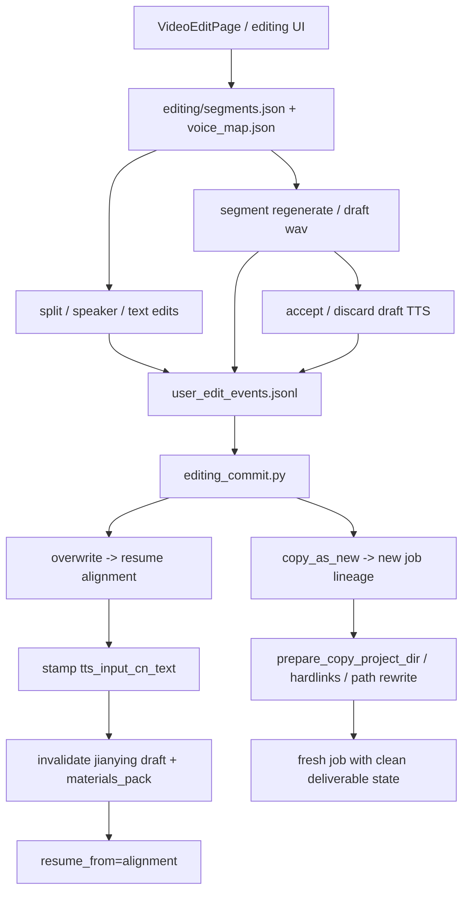

# GitNexus 编辑 / 后处理图

关联总图：`docs/graphs/GITNEXUS_PROJECT_GRAPH.md`

## 1. 范围

这张子图聚焦 `editing` 状态下的修改、重生成、提交与 lineage 行为，重点是：

- `overwrite`
- `copy_as_new`
- `tts_input_cn_text` 如何在 commit 时成为正式状态字段
- commit 后对 Jianying draft 与 `materials_pack` 的失效影响

## 2. 主图

## 3. 当前最重要的变化

### 3.1 commit 已经成为 `tts_input_cn_text` 的唯一原子 stamp 点

- `editing_commit.py` 会对所有被 promoted 的 draft wav 对应 segment 执行：
  - `seg["tts_input_cn_text"] = seg["cn_text"]`
- 没有 promoted draft 的 segment 会保留原有 `tts_input_cn_text`

结论：系统现在能在 commit 边界上精确区分“哪些中文文本已经重新合成进音频，哪些还没有”。

### 3.2 overwrite commit 会同时失效两类交付副产物

- Job API 层：
  - `_invalidate_jianying_draft_on_commit(...)`
  - 重置 `jianying_draft_*`
  - 删除 `{project_dir}/jianying/`
- Gateway 层：
  - `job_intercept.py` 调用 `invalidate_materials_pack_for_job(...)`

结论：post-edit 后旧剪映草稿和旧素材包都被明确视为 stale。

### 3.3 `copy_as_new` 继承的是基线与 lineage，不继承交付状态

- `copy_service.py` 会：
  - hardlink baseline audio / media artifacts
  - 复制并 rewrite 绝对路径 JSON
  - 只把 alignment / publish 等后段阶段 reset 为 `PENDING`
- 新 job 的 Jianying draft 状态从空白开始

结论：`copy_as_new` 继承的是“可复用输入与祖先关系”，不是“把父 job 的交付物状态照搬过去”。

### 3.4 audit sidecar 继续挂在编辑动作上，但不复制历史文件

- `service.py` 继续通过 `safe_observe(...)` 发行为审计
- `user_edit_events.jsonl` 是 append-only
- `copy_as_new` 不复制 `audit/` 目录，离线分析依赖 `root_job_id` / `copy_of_job_id`

结论：lineage 承接的是血缘，而不是把原审计日志原样复制一份。

## 4. 关键证据

- `src/services/jobs/editing_commit.py`
  - `tts_input_cn_text` stamp
  - `_invalidate_jianying_draft_on_commit(...)`
- `gateway/job_intercept.py`
  - `invalidate_materials_pack_for_job(...)`
- `src/services/jobs/copy_service.py`
  - hardlinks
  - path rewrite
  - stage pruning
- `src/services/jobs/user_edit_audit.py`
  - append-only audit sink

## 5. 什么情况下优先读这张图

- 想改 `overwrite / copy_as_new`
- 想判断为什么某些 segment 被视为 drift、某些不被视为 drift
- 想改 post-edit 后交付物失效策略
- 想给编辑流程增加新的审计事件
