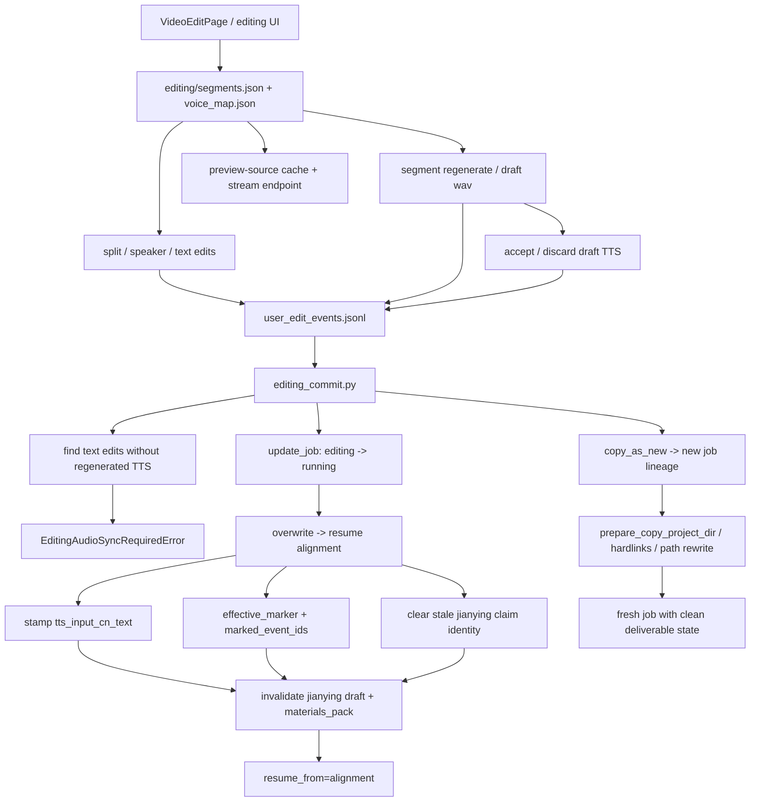

# GitNexus 编辑 / 后处理图

关联总图：`docs/graphs/GITNEXUS_PROJECT_GRAPH.md`

## 1. 范围

这张子图聚焦 `editing` 状态下的修改、重生成、提交与 lineage 行为，重点是：

- `overwrite`
- `copy_as_new`
- `editing_audio_sync_required` 如何把 text/audio sync 变成 commit hard gate
- `tts_input_cn_text` 与 `effective_marker.marked_event_ids` 如何在 commit 时变成正式状态字段
- preview-source cache 如何服务编辑 UI
- commit 后对 Jianying draft 与 `materials_pack` 的失效影响

## 2. 主图

## 3. 当前最重要的变化

### 3.1 commit 现在有真实的 text/audio sync hard gate

- `editing_commit.py` 新增 `EditingAudioSyncRequiredError(EditingConflictError)`
- `_find_text_edits_without_tts(project_dir)` 命中的 segment，会在 commit 时直接触发 `editing_audio_sync_required`
- 这条 gate 只针对“文本改了但没有相应 regenerated TTS”的情况，不会替代既有的 lineage / revision 冲突检查

结论：post-edit text/audio sync 已经从“看得见 drift”升级为“不同步就不能提交”。

### 3.2 overwrite 现在先原子 claim，再做 FS prep 与 runner.start

- `editing_commit.py` 现在通过 `store.update_job(...)` 先把记录从 `editing` 翻到 `running`
- 然后再做：
  - `apply_editing`
  - `rm_editing_dir`
  - `prune_state`
  - `runner.start`
- rollback 也走 `update_job(...)`，避免和并发 cancel / admin 改动互相覆盖

结论：overwrite 的状态迁移已经从“脚本式步骤串”升级成带 claim 语义的状态机。

### 3.3 commit 仍然是 `tts_input_cn_text` 的唯一原子 stamp 点

- `editing_commit.py` 会对所有被 promoted 的 draft wav 对应 segment 执行：
  - `seg["tts_input_cn_text"] = seg["cn_text"]`
- 没有 promoted draft 的 segment 会保留原有 `tts_input_cn_text`

结论：系统现在能在 commit 边界上精确区分“哪些中文文本已经重新合成进音频，哪些还没有”。

### 3.4 `effective_marker.marked_event_ids` 仍然是 commit 结果的行为归因锚点

- `service.py` 在 post-edit commit 成功后会计算 `compute_post_edit_marked_event_ids(...)`
- 然后通过 `_emit_user_edit_event(... effective_marker ...)` 追加一个 marker 事件
- `marked_event_ids` 表示最终存活到 `editor/segments.json` 的 prior intent 事件集合，而不是所有历史编辑事件

结论：离线分析现在能把“用户做过什么”与“最终真的提交了什么”精确区分开。

### 3.5 overwrite invalidation 现在会清空 stale Jianying claim identity

- overwrite 不只是重置 `jianying_draft_status / zip_path / user_root`
- 还会清空：
  - `jianying_draft_attempt_id`
  - `jianying_draft_substep`
  - `jianying_draft_fingerprint`
- Gateway 侧仍会调用 `invalidate_materials_pack_for_job(...)`

结论：post-edit 后旧剪映草稿和旧素材包都被明确视为 stale，而且旧 worker 的 claim identity 也被一并退休。

### 3.6 editing UI 新增了 preview-source cache 侧路

- `editing_segments.py` 现在提供 `cache_preview_source_wav(...)`
- `api.py` 增加了对 `preview_cache_path(...)` 的 GET stream 路径
- 语义是把原始段音频缓存到 `editor/editing/preview_cache/{segment_id}.wav`，避免编辑 UI 每次都重新切片

结论：编辑侧已经开始显式区分“生成试听 draft WAV”和“回放原始段音频”两条路径。

## 4. 关键证据

- `src/services/jobs/editing_commit.py`
  - `EditingAudioSyncRequiredError`
  - `_find_text_edits_without_tts(...)`
  - `update_job(...)` claim / rollback
  - `tts_input_cn_text` stamp
  - stale claim identity retirement
- `src/services/jobs/service.py`
  - `compute_post_edit_marked_event_ids(...)`
  - `_emit_user_edit_event(...)`
- `gateway/job_intercept.py`
  - `invalidate_materials_pack_for_job(...)`
- `src/services/jobs/editing_segments.py`
  - `cache_preview_source_wav(...)`
  - `preview_cache_path(...)`
- `src/services/jobs/api.py`
  - preview-source stream endpoint
- `src/services/jobs/copy_service.py`
  - hardlinks
  - path rewrite
  - stage pruning

## 5. 什么情况下优先读这张图

- 想改 `overwrite / copy_as_new`
- 想判断为什么某次 commit 会报 `editing_audio_sync_required`
- 想理解 preview-source cache 和 draft TTS 试听为什么是两条不同路径
- 想改 post-edit 后交付物失效策略
- 想给编辑流程增加新的审计事件或 survivor 归因逻辑
