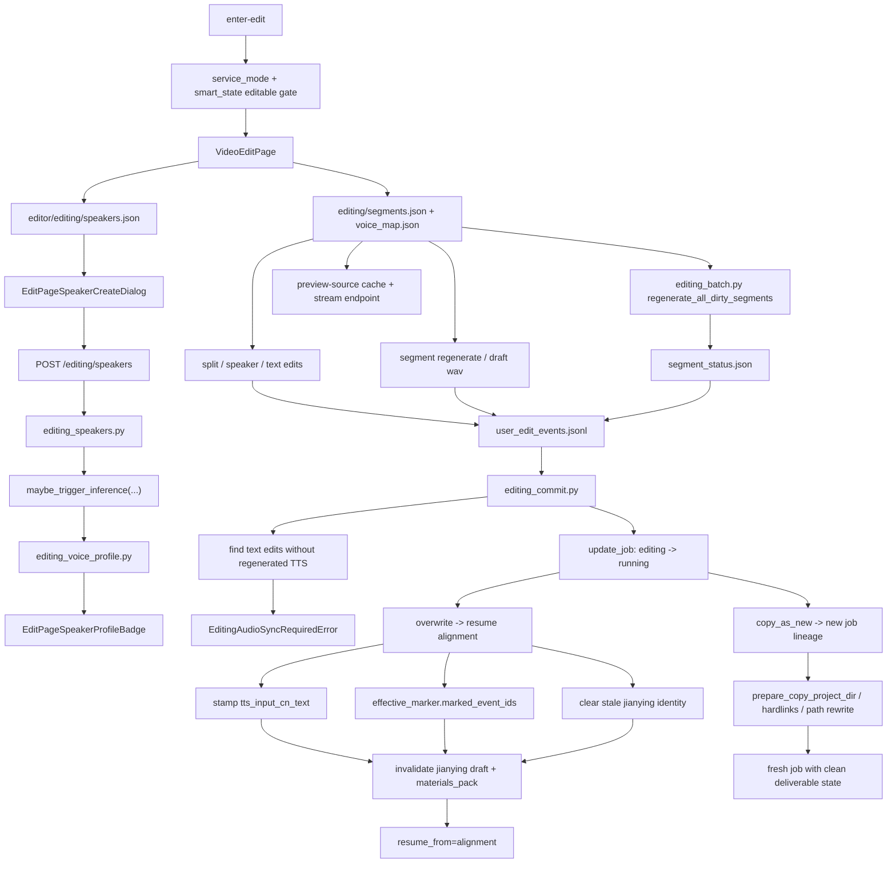

# GitNexus 编辑 / 后处理图

关联总图：`docs/graphs/GITNEXUS_PROJECT_GRAPH.md`

## 1. 范围

这张子图聚焦 `editing` 状态下的修改、重生成、speaker 生命周期、提交与 lineage 行为，重点是：

- editing speakers registry
- speaker voice profile inference
- `preview-source` cache 与 stream endpoint
- single segment re-TTS 与 batch re-TTS
- `overwrite / copy_as_new`
- `editing_audio_sync_required`
- Smart job 是否允许进入 editing

## 2. 主图

## 3. 当前最大的变化

### 3.1 Smart job 进入 editing 需要二级状态门

- `src/services/jobs/api.py` 现在允许 `service_mode in {studio, smart}` 的任务进入 editing。
- 如果 `record.service_mode == "smart"`，还必须通过 `is_editable_smart_state(...)`。
- Smart 只有 `completed` 或 `downgraded_to_studio` 可编辑。

结论：Smart 审计身份可以保留，但 in-flight / refunded Smart job 不能进入 post-edit。

### 3.2 editing speaker 仍然是独立实体

- `editing_speakers.py` 把编辑态 speakers 持久化到 `editor/editing/speakers.json`。
- 创建 speaker 通过 `file_lock(editing_speakers_path(project_dir))` 保护。
- 前端通过 `/editing/speakers` 读写，并通过 retry-profile 重新触发 profile 推断。

结论：editing speaker 是编辑态正式模型，不是临时 UI 字段。

### 3.3 batch re-TTS 只扫 dirty segment

- `src/services/jobs/editing_batch.py` 扫描 `segment_status.json`。
- 触发状态是 `text_dirty / voice_dirty / tts_failed`。
- `tts_loading` 和 `tts_dirty` 不会被批量覆盖。
- 单段失败不会中断整批，结果返回 succeeded/failed segment 列表。

结论：批量重合成是用户编辑后的显式处理面，不会自动覆盖用户尚未接受的 draft。

### 3.4 preview-source cache 继续作为独立回放侧路

- `POST /jobs/{jobId}/segments/{segmentId}/preview-source`
- `GET /job-api/jobs/{jobId}/segments/{segmentId}/preview-source-audio`
- 缓存落在 `editor/editing/preview_cache/{segment_id}.wav`

结论：编辑页继续区分“试听 draft TTS”和“回放原始分段音频”。

### 3.5 commit 仍然有 text/audio sync hard gate

- `_find_text_edits_without_tts(project_dir)` 检测文本改动但没有重新合成音频的 segment。
- 命中时抛 `EditingAudioSyncRequiredError`。
- 这条 gate 不替代 lineage / revision 冲突检查。

结论：post-edit text/audio sync 是提交硬约束。

### 3.6 overwrite 仍会主动退休旧交付物身份

- overwrite 会清空旧 `jianying_draft_attempt_id / substep / fingerprint`。
- 网关侧会调用 `invalidate_materials_pack_for_job(...)`。
- `edit_generation` 推进后，R2 交付也切到新的 generation key 空间。

结论：post-edit 后旧草稿、旧打包物、旧 R2 generation 都被视作 stale。

## 4. 关键证据

- `src/services/jobs/api.py`
  - Smart editable gate
  - editing endpoints
- `src/services/smart/state.py`
  - `is_editable_smart_state(...)`
- `src/services/jobs/editing_batch.py`
  - dirty segment batch regenerate
- `src/services/jobs/editing_speakers.py`
  - speakers registry
- `src/services/jobs/editing_voice_profile.py`
  - fire-and-forget inference
- `src/services/jobs/editing_commit.py`
  - sync hard gate
  - overwrite claim
  - stale deliverable invalidation

## 5. 什么时候优先看这张图

- 想改 Smart job 是否能进入 editing
- 想改批量 re-TTS 或 segment status
- 想改 editing speakers 创建、profile 推断、retry-profile
- 想判断为什么某次 commit 报 `editing_audio_sync_required`
- 想改 post-edit 后交付物失效策略
