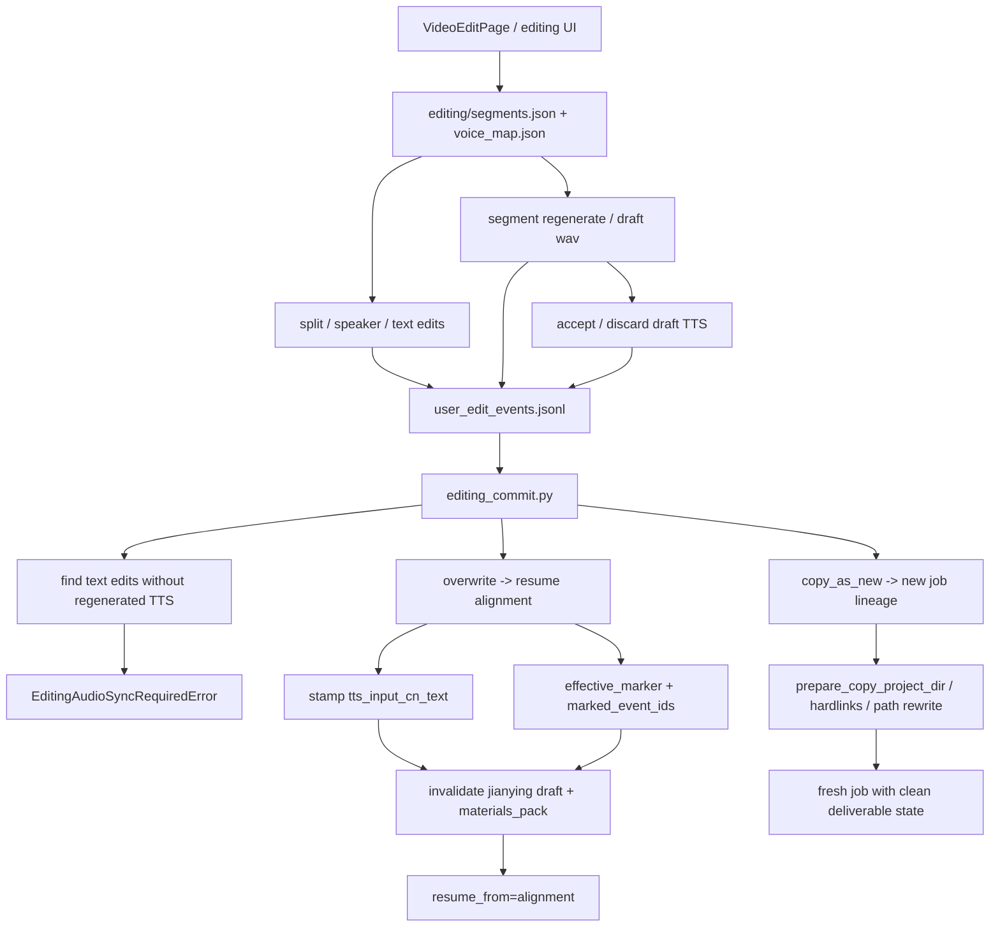

# GitNexus 编辑 / 后处理图

关联总图：`docs/graphs/GITNEXUS_PROJECT_GRAPH.md`

## 1. 范围

这张子图聚焦 `editing` 状态下的修改、重生成、提交与 lineage 行为，重点是：

- `overwrite`
- `copy_as_new`
- `editing_audio_sync_required` 如何把 text/audio sync 变成 commit hard gate
- `tts_input_cn_text` 与 `effective_marker.marked_event_ids` 如何在 commit 时变成正式状态字段
- commit 后对 Jianying draft 与 `materials_pack` 的失效影响

## 2. 主图

## 3. 当前最重要的变化

### 3.1 commit 现在有真实的 text/audio sync hard gate

- `editing_commit.py` 新增 `EditingAudioSyncRequiredError(EditingConflictError)`
- `_find_text_edits_without_tts(project_dir)` 命中的 segment，会在 commit 时直接触发 `editing_audio_sync_required`
- 这条 gate 只针对“文本改了但没有相应 regenerated TTS”的情况，不会替代既有的 lineage / revision 冲突检查

结论：post-edit text/audio sync 已经从“看得见 drift”升级为“不同步就不能提交”。

### 3.2 commit 仍然是 `tts_input_cn_text` 的唯一原子 stamp 点

- `editing_commit.py` 会对所有被 promoted 的 draft wav 对应 segment 执行：
  - `seg["tts_input_cn_text"] = seg["cn_text"]`
- 没有 promoted draft 的 segment 会保留原有 `tts_input_cn_text`

结论：系统现在能在 commit 边界上精确区分“哪些中文文本已经重新合成进音频，哪些还没有”。

### 3.3 `effective_marker.marked_event_ids` 已成为 commit 结果的行为归因锚点

- `service.py` 在 post-edit commit 成功后会计算 `compute_post_edit_marked_event_ids(...)`
- 然后通过 `_emit_user_edit_event(... effective_marker ...)` 追加一个 marker 事件
- `marked_event_ids` 表示最终存活到 `editor/segments.json` 的 prior intent 事件集合，而不是所有历史编辑事件

结论：离线分析现在能把“用户做过什么”与“最终真的提交了什么”精确区分开。

### 3.4 overwrite commit 会同时失效两类交付副产物

- Job API 层：
  - `_invalidate_jianying_draft_on_commit(...)`
  - 重置 `jianying_draft_*`
  - 删除 `{project_dir}/jianying/`
- Gateway 层：
  - `job_intercept.py` 调用 `invalidate_materials_pack_for_job(...)`

结论：post-edit 后旧剪映草稿和旧素材包都被明确视为 stale。

### 3.5 `copy_as_new` 继承的是基线与 lineage，不继承交付状态与行为日志文件

- `copy_service.py` 会：
  - hardlink baseline audio / media artifacts
  - 复制并 rewrite 绝对路径 JSON
  - 只把 alignment / publish 等后段阶段 reset 为 `PENDING`
- 新 job 的 Jianying draft 状态从空白开始
- `copy_as_new` 不复制 `audit/` 目录，离线分析依赖 `root_job_id / copy_of_job_id`

结论：`copy_as_new` 继承的是“可复用输入与祖先关系”，不是“把父 job 的交付状态和行为日志照搬过去”。

## 4. 关键证据

- `src/services/jobs/editing_commit.py`
  - `EditingAudioSyncRequiredError`
  - `_find_text_edits_without_tts(...)`
  - `tts_input_cn_text` stamp
  - `_invalidate_jianying_draft_on_commit(...)`
- `src/services/jobs/service.py`
  - `compute_post_edit_marked_event_ids(...)`
  - `_emit_user_edit_event(...)`
- `gateway/job_intercept.py`
  - `invalidate_materials_pack_for_job(...)`
- `src/services/jobs/copy_service.py`
  - hardlinks
  - path rewrite
  - stage pruning
- `src/services/jobs/user_edit_audit.py`
  - append-only audit sink
  - `effective_marker`

## 5. 什么情况下优先读这张图

- 想改 `overwrite / copy_as_new`
- 想判断为什么某次 commit 会报 `editing_audio_sync_required`
- 想判断为什么某些 segment 被视为 drift、某些不被视为 drift
- 想改 post-edit 后交付物失效策略
- 想给编辑流程增加新的审计事件或 survivor 归因逻辑
