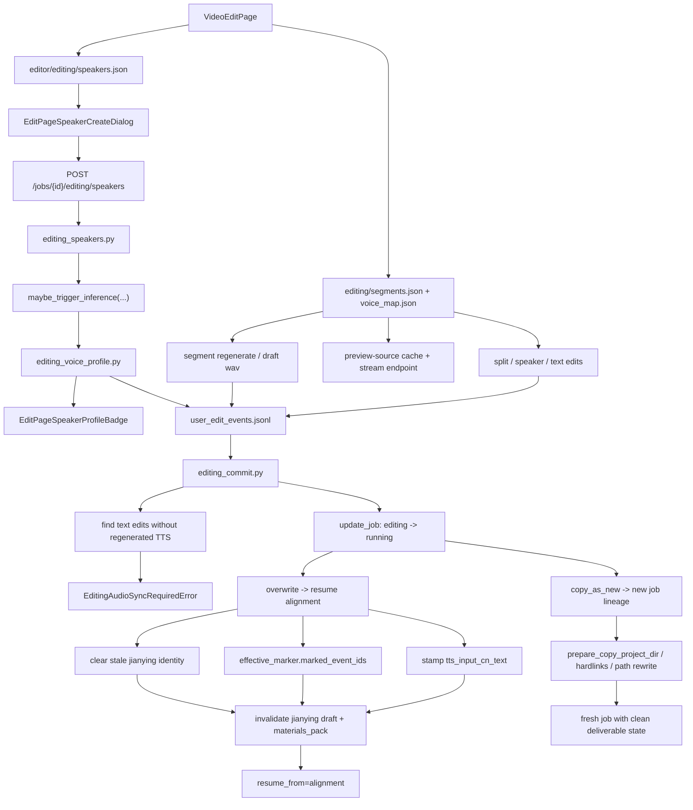

# GitNexus 编辑 / 后处理图

关联总图：`docs/graphs/GITNEXUS_PROJECT_GRAPH.md`

## 1. 范围

这张子图聚焦 `editing` 状态下的修改、重生成、speaker 生命周期、提交与 lineage 行为，重点是：

- editing speakers registry
- speaker voice profile inference
- `preview-source` cache 与 stream endpoint
- `overwrite / copy_as_new`
- `editing_audio_sync_required`
- commit 后对 Jianying draft 与 `materials_pack` 的失效影响

## 2. 主图

## 3. 当前最大的变化

### 3.1 editing speaker 已经是独立实体

- `src/services/jobs/editing_speakers.py` 把编辑态 speakers 单独持久化到 `editor/editing/speakers.json`
- 创建 speaker 通过 `file_lock(editing_speakers_path(project_dir))` 保护
- `frontend-next/src/lib/api/editing.ts` 暴露了：
  - `GET /jobs/{id}/editing/speakers`
  - `POST /jobs/{id}/editing/speakers`
  - `POST /jobs/{id}/editing/speakers/{speakerId}/retry-profile`

结论：editing speaker 不再是临时 UI 状态，而是编辑态下的正式写侧模型。

### 3.2 新 speaker 首次绑定 segment 会触发 voice profile inference

- `src/services/jobs/editing_voice_profile.py` 明确是 fire-and-forget 推断器
- 当新 speaker 第一次被 segment 引用时，会从 `pending_segments` 进入 `inferring`
- 推断完成后把 `profile_status / profile_error / profile` 写回 `speakers.json`
- `frontend-next/src/app/(app)/workspace/[jobId]/edit/page.tsx` 会在存在 `inferring` speaker 时轮询
- `EditPageSpeakerProfileBadge.tsx` 把状态和结果显式展示给用户

结论：speaker profile 已经变成 editing 流里的异步 sidecar，而不是一次性同步填表。

### 3.3 preview-source cache 已经形成独立回放侧路

- `frontend-next/src/lib/api/editing.ts` 暴露：
  - `POST /jobs/{jobId}/segments/{segmentId}/preview-source`
  - `GET /job-api/jobs/{jobId}/segments/{segmentId}/preview-source-audio`
- `src/services/jobs/editing_segments.py` 负责 `cache_preview_source_wav(...)`
- 语义是把原始 segment 音频缓存到 `editor/editing/preview_cache/{segment_id}.wav`

结论：编辑页现在明确区分“试听 draft TTS”和“回放原始分段音频”两条路径。

### 3.4 commit 仍然有真实的 text/audio sync hard gate

- `editing_commit.py` 继续通过 `_find_text_edits_without_tts(project_dir)` 检测 drift
- 命中时直接抛 `EditingAudioSyncRequiredError`
- 这条 gate 只处理“文本改了但没重新合成音频”的情况，不替代 lineage / revision 冲突检查

结论：text/audio sync 已经不是建议项，而是 commit 的硬约束。

### 3.5 overwrite 先 claim，再做文件系统操作

- `editing_commit.py` 先通过 `store.update_job(...)` 把记录从 `editing` 翻到 `running`
- 然后才执行 `apply_editing`、`rm_editing_dir`、`prune_state`、`runner.start`
- rollback 也通过 `update_job(...)`，避免与 cancel、admin 改动互相覆盖

结论：overwrite 已经是显式 claim 语义，而不是脚本式顺序动作。

### 3.6 overwrite 会主动退休旧交付物身份

- overwrite 不只重置 `jianying_draft_status / zip_path / user_root`
- 还会清空：
  - `jianying_draft_attempt_id`
  - `jianying_draft_substep`
  - `jianying_draft_fingerprint`
- 网关侧仍会调用 `invalidate_materials_pack_for_job(...)`

结论：post-edit 后旧 Jianying 草稿和旧打包物都被正式标记为 stale。

## 4. 关键证据

- `src/services/jobs/editing_speakers.py`
  - speakers registry
  - create / save / lock
- `src/services/jobs/editing_voice_profile.py`
  - fire-and-forget inference
  - profile 状态写回
- `frontend-next/src/app/(app)/workspace/[jobId]/edit/page.tsx`
  - speaker polling
  - 新 speaker 绑定后的 profile 推断体验
- `frontend-next/src/lib/api/editing.ts`
  - editing speakers API
  - preview-source API
- `src/services/jobs/editing_commit.py`
  - `EditingAudioSyncRequiredError`
  - `update_job(...)` claim / rollback
  - stale Jianying identity 清理

## 5. 什么时候优先看这张图

- 想改 `overwrite / copy_as_new`
- 想判断为什么某次 commit 报 `editing_audio_sync_required`
- 想改 editing speakers 创建、profile 推断、retry-profile
- 想排查 preview-source cache 与 draft TTS 试听的边界
- 想改 post-edit 后交付物失效策略
