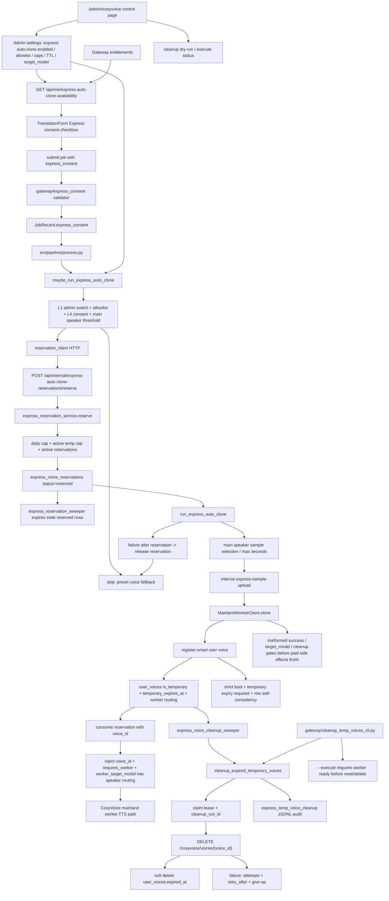

# GitNexus Express CosyVoice Auto-Clone 图

生成时间：`2026-05-29`

## 1. 范围

这张子图聚焦 Express 快捷版里的 CosyVoice 自动克隆：前端同意与可用性展示、Gateway admin settings、原子 reservation、pipeline 内自动克隆、临时音色入库、TTL 预约回收、到期临时音色删除和运维 CLI。

适合先看这张图的任务：

- 修改 Express 自动克隆入口、同意文案、availability gating、提交 payload 或 job schema。
- 排查 Express 任务为什么没有自动克隆、为什么 fallback 到预设音色、为什么 reservation/cap 被占用。
- 修改 `src/services/express/*`、`gateway/express_reservation_*`、`gateway/express_voice_cleanup_*`。
- 排查临时音色到期后没有删除、cleanup attempts/give-up、manual CLI reset、worker delete voice。

## 2. 主图

## 3. 当前核心认知

### 3.1 Express 自动克隆是 consent + admin-controlled 的自动化，不是默认行为

- Admin 主开关 `express_cosyvoice_auto_clone_enabled` 默认关闭；关闭时 `maybe_run_express_auto_clone` 直接 no-op。
- 前端只在 `/api/me/express-auto-clone-availability` 返回可用时展示同意勾选；提交 payload 写入 `express_consent`。
- 无 server-confirmed consent 时不构造 client、不占 reservation、不调用 worker。
- allowlist 由 `express_cosyvoice_auto_clone_allowlist_enabled` 控制；开启时只允许 admin 或 allowlist 用户，关闭时 allowlist 不再限制。

### 3.2 reservation 是真正的成本闸，budget endpoint 只是展示/诊断

- `express_clone_reservations` 负责 reserve / consume / release / expire，防止并发穿透 daily cap 和 active temp cap。
- cap 计算同时包含已存在临时音色和 active reserved reservation。
- 同 `(user, job, speaker)` active reservation 幂等返回，PG 并发场景依赖唯一约束和 `FOR UPDATE SKIP LOCKED` 类测试守卫。
- `express_reservation_sweeper` 只把过期 reserved 行置为 expired，不接触 worker，也不删除音色。

### 3.3 pipeline 自动克隆失败必须非致命，但不能静默成功

- `process.py` 只通过 `maybe_run_express_auto_clone` 进入 Express 自动克隆，真实依赖集中装配在 `src/services/express/pipeline_clients.py`。
- 进入闸不过、样本不够、cap 不足或 clone 失败时，Express 继续走预设音色 fallback。
- 已拿到 reservation 后的失败必须 release；release 失败会写 audit，不伪装成成功。
- clone 成功但 consume 失败时音色可用，但 reservation 状态保持 reserved，等待 TTL sweeper 回收名额。

### 3.4 临时音色必须有 expiry，且 worker routing 是入库事实

- `register-smart` 对 `requires_worker`、`is_temporary` 使用 strict bool，拒绝字符串/数字伪 bool。
- `is_temporary=true` 必须带合法 `temporary_expires_at`，否则会造成 UI 隐藏、cap 长占、cleanup 扫不到。
- 入库行必须保持 `created_from`、`requires_worker`、`target_model`、`clone_worker_request_id`、`temporary_expires_at` 自洽。
- 成功后注入到 speaker routing 的 `voice_id / requires_worker / worker_target_model` 会让 TTS 主干走国内 worker。

### 3.5 cleanup 是两阶段删除和可审计运维流程

- `express_voice_cleanup_service` 先 claim lease 写 `cleanup_claim_until + cleanup_run_id`，再调 worker delete，最后 soft-delete `user_voices`。
- 完成/失败更新都用 `cleanup_run_id` 守卫，避免 lease 过期后 stale runner 改错行。
- 失败增加 `cleanup_attempts` 与 `cleanup_retry_after`；达到上限后进入 give-up，需要显式 `--include-give-up` 或 `--reset-attempts` 运维处理。
- `cleanup_temp_voices_cli.py` 默认 dry-run；`--execute --reset-attempts` 在 worker 不可用时不重置，避免复活后无法删除。

## 4. 关键证据

| 主题 | 证据文件 |
| --- | --- |
| 前端 availability / consent | `frontend-next/src/components/workspace/TranslationForm.tsx`, `frontend-next/src/lib/api/entitlements.ts`, `frontend-next/src/lib/api/jobs.ts`, `frontend-next/src/types/jobs.ts` |
| Admin settings / CosyVoice control | `gateway/admin_settings.py`, `gateway/admin_cosyvoice_control_api.py`, `frontend-next/src/app/(app)/admin/cosyvoice/page.tsx`, `frontend-next/src/app/(app)/admin/settings/page.tsx` |
| Consent / entitlement | `gateway/express_consent.py`, `gateway/entitlements.py`, `src/services/jobs/models.py` |
| Reservation schema / service | `gateway/alembic/versions/032_express_clone_reservations.py`, `gateway/express_reservation_service.py`, `gateway/express_reservation_sweeper.py`, `gateway/user_voice_api.py` |
| Pipeline orchestration | `src/pipeline/process.py`, `src/services/express/auto_clone.py`, `src/services/express/pipeline_clients.py`, `src/services/express/reservation_client.py`, `src/services/express/audit.py` |
| Temporary voice schema / cleanup | `gateway/alembic/versions/033_user_voice_cleanup_tracking.py`, `gateway/express_voice_cleanup_service.py`, `gateway/express_voice_cleanup_sweeper.py`, `gateway/express_voice_cleanup_audit.py`, `gateway/cleanup_temp_voices_cli.py` |
| Worker routing | `gateway/user_voice_api.py`, `gateway/user_voice_service.py`, `src/services/tts/tts_generator.py`, `src/services/mainland_worker/client.py` |
| 回归守卫 | `tests/test_phase43a_*`, `tests/test_phase43b_*`, `tests/test_phase43b_voice_cleanup_pg_concurrent.py` |

## 5. 什么时候优先读这张图

- Express 勾选了“自动克隆”但任务仍走预设音色。
- Admin 开关、allowlist、daily cap、active temp cap 或 reservation TTL 行为不符合预期。
- `express_clone_reservations` 有 reserved 行长期不释放，或临时音色 cap 被占满。
- `user_voices.is_temporary=true` 的音色到期后没有删除，或 cleanup attempts 进入 give-up。
- 需要判断一次改动是否会在 Express 路径里触发付费 worker clone/delete。
