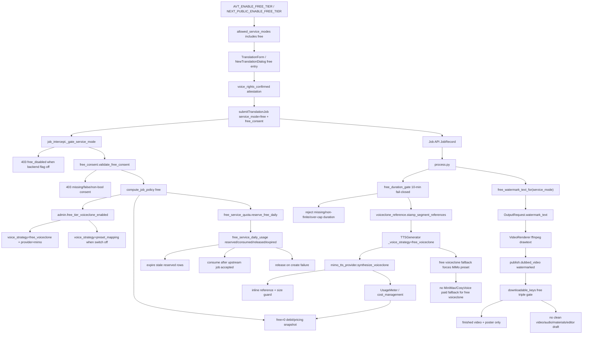

# GitNexus Free Tier 图

生成时间：`2026-06-01`

## 1. 范围

这张子图聚焦 `service_mode="free"` 的免费档：功能开关、前端入口、创建任务硬门禁、免费日配额 ledger、MiMo voiceclone wiring、付费 API guard、10 分钟时长上限、下载/流媒体限制、免费水印与 launch-gate 语音权益确认。

适合先看这张图的任务：

- 修改免费档入口、`AVT_ENABLE_FREE_TIER`、`NEXT_PUBLIC_ENABLE_FREE_TIER`、allowed service modes 或前端文案。
- 排查 free job 为什么被 403、为什么没有 voiceclone、为什么配额被占用或没有释放。
- 修改 MiMo voiceclone、reference extraction、free voice strategy、TTS fallback 或 paid API guard。
- 修改 free 下载范围、免费水印、10 分钟限制或 launch gate consent。

## 2. 主图

## 3. 当前核心认知

### 3.1 Free 是显式 service mode，不是 Express 的隐式降级

- Backend 由 `gateway/config.py::enable_free_tier` 控制；默认关闭时 `service_mode=free` 在 Gateway 创建任务处 fail-closed。
- Entitlements 只有在 `AVT_ENABLE_FREE_TIER` 开启时才把 `free` 加入 `allowed_service_modes`。
- 前端类型、API client、TranslationForm 和 NewTranslationDialog 都把 `free` 作为一等 service mode。
- Docker/Next 构建需要透传前端 flag，避免后端开了但前端入口仍不可见。

结论：free tier 是独立产品档位，不应被实现成 Express 的别名或 silent fallback。

### 3.2 Launch gate 是硬性的语音权益确认

- Free job 必须携带 `free_consent.voice_rights_confirmed === true`。
- Gateway 只转发 server-validated `free_consent`，非 free job 不能夹带伪造 payload。
- 缺失、非 dict、false、字符串/数字伪 bool 都返回 403；这个 gate 在 quota reserve 和 upstream forward 之前执行。
- 该约束来自免费 voiceclone 上线门禁，目的不是 UX 提示，而是硬合规边界。

结论：免费档不会在用户未确认语音权益时触发 MiMo voiceclone。

### 3.3 日配额是专用 ledger，不复用旧 quota

- `free_service_daily_usage` 记录 Asia/Shanghai 自然日、user、job、status、expires_at、reason。
- create flow reserve 成功后才继续转发；upstream job accepted 后 consume；中途失败 release。
- idempotency scope 必须包含 user_id，避免不同用户同 job_id 互相命中。
- active 定义覆盖 `reserved | consumed`，过期 reserved 可被重新认领，不占当天名额。

结论：免费日配额是独立并发控制面，不应靠旧 credits/quota 路径侧面实现。

### 3.4 Free voiceclone 只能走 MiMo 受控路径

- `compute_job_policy("free")` 在 admin `free_tier_voiceclone_enabled=True` 时设置 `voice_strategy=free_voiceclone`，关闭时免费档继续运行但降级到 preset mapping。
- Pipeline 只在 `job_voice_strategy == "free_voiceclone"` 时给 segment stamp `voiceclone_reference_path`。
- `TTSGenerator` 只有在 provider 是 MiMo、`_voice_strategy=free_voiceclone`、segment 有 reference path 时才调用 `synthesize_voiceclone`。
- fallback 必须强制走 base MiMo preset，不能落到 MiniMax、CosyVoice 或其他付费 voice clone provider。

结论：免费档的 paid API guard 是“允许 MiMo voiceclone 的窄路径”，不是开放任意 voice clone fallback。

### 3.5 免费档交付物必须受限且带水印

- `src/utils/free_duration_gate.py` 对 free job 做 10 分钟时长上限，缺失、0、负数、NaN、inf 等不可信输入都 fail-closed。
- `src/utils/free_watermark.py` 是 free -> watermark 的单一策略入口；paid modes 返回 `None`。
- `process.py` 在 publish 阶段把 watermark text 传到 output request，`video_renderer.py` 用 ffmpeg drawtext 生成带水印视频。
- `downloadable_keys.py` 对 free 的 download/stream/eager-push 三处统一限制，只放行水印成片与 poster，不暴露 clean audio、materials pack 或 editor draft。

结论：免费档的商业边界同时在创建、执行、渲染和交付层落地。

## 4. 关键证据

| 主题 | 证据文件 |
| --- | --- |
| Feature flag / entitlement | `gateway/config.py`, `gateway/entitlements.py`, `.env.example`, `docker-compose.yml`, `frontend-next/Dockerfile` |
| 前端入口 / payload | `frontend-next/src/components/workspace/TranslationForm.tsx`, `frontend-next/src/components/workspace/NewTranslationDialog.tsx`, `frontend-next/src/lib/api/jobs.ts`, `frontend-next/src/types/jobs.ts`, `frontend-next/src/types/api.ts` |
| Gateway create policy | `gateway/job_intercept.py`, `gateway/free_consent.py`, `gateway/free_service_quota.py`, `gateway/alembic/versions/034_free_service_daily_usage.py`, `gateway/models.py` |
| Pricing / debit truth | `gateway/pricing_schema.py`, `gateway/credits_service.py`, `gateway/cost_management.py` |
| MiMo voiceclone | `src/services/tts/mimo_tts_provider.py`, `src/services/tts/tts_generator.py`, `src/services/tts/voiceclone_reference.py`, `src/pipeline/process.py` |
| Duration / watermark / delivery | `src/utils/free_duration_gate.py`, `src/utils/free_watermark.py`, `src/modules/output/output_models.py`, `src/modules/output/publish/publish_models.py`, `src/modules/output/publish/video_renderer.py`, `src/services/r2_publisher_lib/downloadable_keys.py` |
| Spike / validation | `scripts/spike/mimo_voiceclone_spike.py`, `tests/test_mimo_voiceclone_provider.py`, `tests/test_mimo_voiceclone_spike.py`, `tests/test_voiceclone_reference.py` |
| 回归守卫 | `tests/test_phase2_free_tier_guards.py`, `tests/test_free_consent.py`, `tests/test_free_service_quota.py`, `tests/test_free_voiceclone_wiring.py`, `tests/test_free_tier_paid_api_guard.py`, `tests/test_free_duration_gate.py`, `tests/test_free_watermark.py`, `tests/test_free_tier_downloadable_keys.py` |

## 5. 什么时候优先读这张图

- free 入口不显示，或后端返回 `free_disabled`。
- free job 创建 403，尤其是 consent、daily quota、service mode gate。
- MiMo voiceclone 没触发、错误触发到非 free job，或 fallback 走错 provider。
- 免费任务被超时长/不可信时长拒绝。
- 免费视频没有水印，或下载页暴露了 clean audio/materials/editor draft。
- 需要判断免费档是否会绕过付费 API 安全边界。
