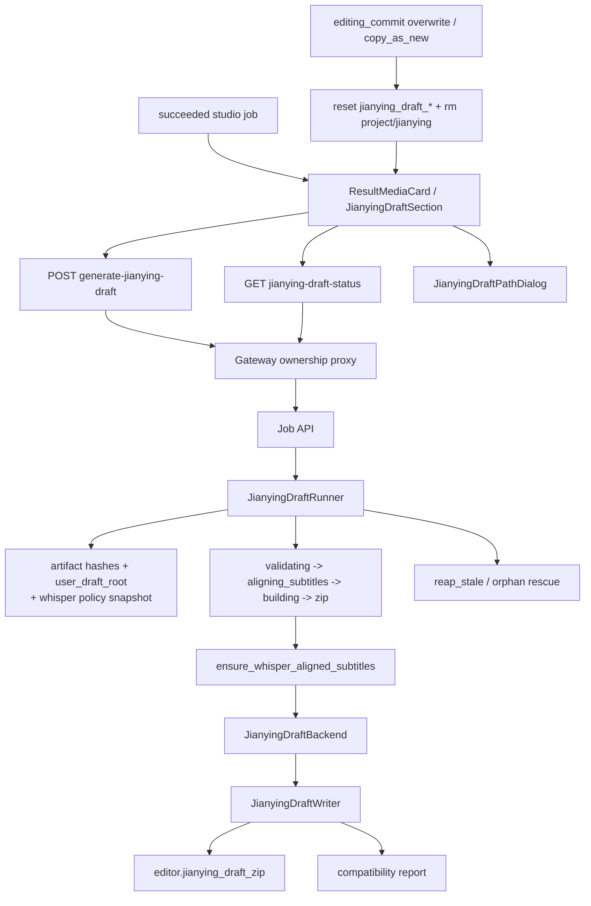

# GitNexus 剪映草稿交付图

关联总图：`docs/graphs/GITNEXUS_PROJECT_GRAPH.md`

## 1. 范围

这张子图只看 `Studio succeeded job -> editor.jianying_draft_zip` 这条交付链，重点是：

- `generate-jianying-draft` 的触发 / 轮询 / ownership proxy
- `JianyingDraftRunner` 的 `fingerprint / substep / orphan rescue`
- deliverable-time whisper ensure 如何进入 runner
- `user_draft_root` 与 zip 命名 / draft path 的边界

## 2. 主图

## 3. runner 语义

### 3.1 `aligning_subtitles` 已经是正式子步骤

- `jianying_draft_runner.py` 定义了 `SUBSTEP_ALIGNING_SUBTITLES`
- 只有当 whisper double-gate 打开时，runner 才会进入这个子步骤；否则直接从 `validating_inputs` 走到 `building_draft`

结论：Jianying draft 现在会把“字幕精对齐是否真的发生”显式暴露给用户和 ops。

### 3.2 fingerprint 已经受 whisper policy 影响

- `artifact hashes`：`source.original_video`、`editor.dubbed_audio_complete`、`editor.subtitles`、`editor.ambient_audio`
- `user_draft_root`
- backend / writer version
- `whisper_alignment_policy`
  - `env_capability_enabled`
  - `admin_enabled`
  - `trigger`
  - `skip_cache`
  - `model`

结论：admin 改了 whisper 策略后，即使原始素材没变，旧 draft zip 也会变成 cache miss。

### 3.3 `skip_cache=true` 不只影响 inner helper

- `ensure_whisper_alignment.py` 在 `skip_cache=true` 时会跳过“已有 whisper cues 且 fingerprint 匹配”的 fast path
- `jianying_draft_runner.py::_whisper_force_fresh_active()` 还会绕过外层 `succeeded` cache-hit

结论：管理员在 UI 上打开“每次重新转录”后，下一次 Jianying trigger 一定会真的进后台执行。

### 3.4 orphan rescue 已经能区分“真失败”和“产物已生成”

- `reap_stale()` 会先比较 stale running 的 zip 与当前 fingerprint
- 匹配则 rescue 成 `succeeded`
- 不匹配才进入 `stale_running_reaped` 或 `orphaned_after_process_restart`

结论：ops 现在能区分“后台真挂了”和“进程重启但产物其实已经可复用”。

### 3.5 `user_draft_root` 改的是 draft 内素材路径，不是外层下载协议

- `jianying_draft_writer.py` 会基于 `user_draft_root` 决定 draft 内 material path 是相对路径还是绝对路径
- 对外暴露给结果页的交付物仍然是 `editor.jianying_draft_zip`
- 同文件还负责友好 zip basename：优先 `project_title`，避免用户直接看到长 UUID

结论：`user_draft_root` 属于“解压后剪映如何找到本地素材”的语义，不属于下载权限或下载路径语义。

## 4. post-edit invalidation

- `editing_commit.py::_invalidate_jianying_draft_on_commit(...)`
  - 重置 `jianying_draft_status / started_at / completed_at / error / zip_path / user_root`
  - 删除 `{project_dir}/jianying/`
- `copy_as_new` 也不会继承父 job 的 Jianying draft 状态

结论：post-edit 后旧 draft 一律视为 stale，必须重新生成。

## 5. 关键证据

- `src/services/jobs/jianying_draft_runner.py`
  - `SUBSTEP_ALIGNING_SUBTITLES`
  - `_whisper_policy_snapshot()`
  - `_whisper_force_fresh_active()`
  - `reap_stale()`
- `src/services/subtitles/ensure_whisper_alignment.py`
  - `skip_cache` fast-path bypass
  - `alignment_model` stamp
- `src/modules/output/jianying/jianying_draft_writer.py`
  - `user_draft_root`
  - friendly zip basename
- `src/services/jobs/editing_commit.py`
  - draft invalidation

## 6. 什么情况下优先读这张图

- 想改 `generate-jianying-draft` 的触发、轮询、状态机
- 想判断某次 trigger 为什么命中旧 zip、为什么没有重跑
- 想改 `skip_cache`、`model`、`user_draft_root` 的行为
- 想排查 stale running、orphan rescue、cache miss/hit 的诊断语义
