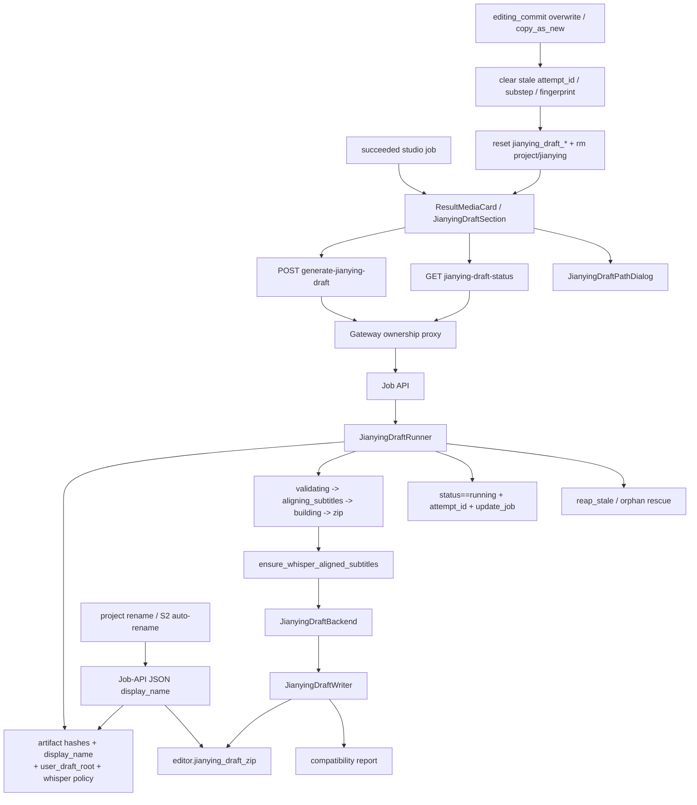

# GitNexus 剪映草稿交付图

关联总图：`docs/graphs/GITNEXUS_PROJECT_GRAPH.md`

## 1. 范围

这张子图只看 `Studio succeeded job -> editor.jianying_draft_zip` 这条交付链，重点是：

- `generate-jianying-draft` 的触发 / 轮询 / ownership proxy
- `JianyingDraftRunner` 的 `fingerprint / substep / orphan rescue / claim guard`
- deliverable-time whisper ensure 如何进入 runner
- `display_name`、`user_draft_root` 与 zip 命名 / draft path 的边界

## 2. 主图

## 3. runner 语义

### 3.1 `aligning_subtitles` 仍然是正式子步骤

- `jianying_draft_runner.py` 定义了 `SUBSTEP_ALIGNING_SUBTITLES`
- 只有当 whisper capability + policy 都打开时，runner 才会进入这个子步骤；否则直接从 `validating_inputs` 走到 `building_draft`

结论：Jianying draft 继续把“字幕精对齐是否真的发生”显式暴露给用户和 ops。

### 3.2 fingerprint 现在不仅受 whisper policy 影响，也受 `display_name` 影响

- `artifact hashes`：`source.original_video`、`editor.dubbed_audio_complete`、`editor.subtitles`、`editor.ambient_audio`
- `display_name`
- `user_draft_root`
- backend / writer version
- `whisper_alignment_policy`
  - `env_capability_enabled`
  - `admin_enabled`
  - `trigger`
  - `skip_cache`
  - `model`

结论：素材不变但项目改名时，旧 draft zip 也会变成 cache miss，避免下载到过时文件名。

### 3.3 runner 的 substep 与 terminal write 现在都带 claim guard

- `jianying_draft_runner.py` 现在明确要求：
  - `jianying_draft_status == "running"`
  - `attempt_id` 仍与当前 worker 相符
- substep 更新与 terminal success / failure 写回都通过 `store.update_job(...)` 做原子 mutator
- 这样 concurrent rename、overwrite invalidation、fresh trigger 都不会被 stale worker 覆盖

结论：Jianying draft 状态机现在已经显式建模“谁还拥有这次生成的 claim”。

### 3.4 final success 会重算 fingerprint，而不是继续沿用 trigger 时快照

- `jianying_draft_runner.py` 在最终成功写回前会根据实际产物重新计算 final fingerprint
- 这是为了避免 ensure helper / subtitle sidecar 改动后，落盘产物与 trigger 时快照不一致

结论：最终存档的 fingerprint 更接近“产物真相”，而不是“触发输入快照”。

### 3.5 overwrite invalidation 现在会退休 stale claim identity

- `editing_commit.py` 的 overwrite 不只是把 `status` 改回 `idle`
- 还会清空：
  - `jianying_draft_attempt_id`
  - `jianying_draft_substep`
  - `jianying_draft_fingerprint`

结论：旧 worker 即使晚到，也更难把 idle 槽位重新污染成运行态或失败态。

### 3.6 `user_draft_root` 改的是 draft 内素材路径，不是外层下载协议

- `jianying_draft_writer.py` 会基于 `user_draft_root` 决定 draft 内 material path 是相对路径还是绝对路径
- 对外暴露给结果页的交付物仍然是 `editor.jianying_draft_zip`
- 同文件继续负责友好 zip basename，并与 `display_name` 对齐

结论：`user_draft_root` 属于“解压后剪映如何找到本地素材”的语义，不属于下载权限或下载路径语义。

## 4. 关键证据

- `src/services/jobs/jianying_draft_runner.py`
  - `SUBSTEP_ALIGNING_SUBTITLES`
  - `_whisper_policy_snapshot()`
  - `_whisper_force_fresh_active()`
  - `reap_stale()`
  - `status==running + attempt_id` claim guard
- `src/services/subtitles/ensure_whisper_alignment.py`
  - `skip_cache` fast-path bypass
  - `alignment_model` stamp
- `src/modules/output/jianying/jianying_draft_writer.py`
  - `user_draft_root`
  - friendly zip basename
- `gateway/job_intercept.py`
  - rename mirror back into Job-API JSON store
- `src/services/jobs/editing_commit.py`
  - draft invalidation
  - stale claim identity retirement

## 5. 什么情况下优先读这张图

- 想改 `generate-jianying-draft` 的触发、轮询、状态机
- 想判断某次 trigger 为什么命中旧 zip、为什么没有重跑
- 想改 `skip_cache`、`model`、`user_draft_root`、`display_name` 的行为
- 想排查 stale running、orphan rescue、claim lost、cache miss/hit 的诊断语义
