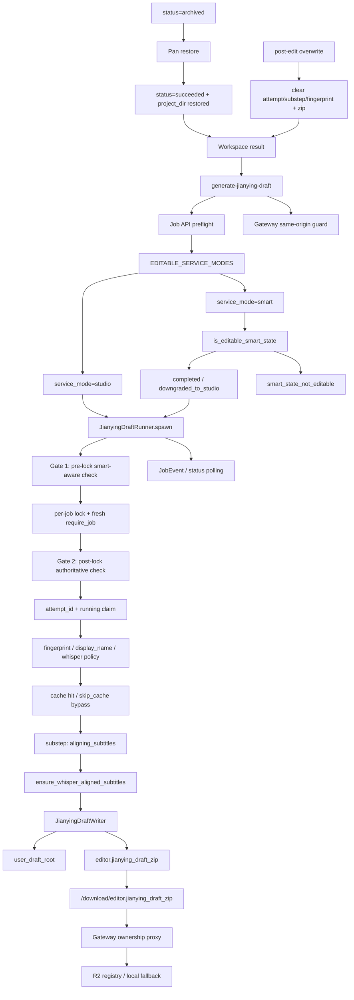

# GitNexus 剪映草稿交付图

关联总图：`docs/graphs/GITNEXUS_PROJECT_GRAPH.md`

## 1. 范围

这张子图只看 Studio / Smart 成功任务如何按需生成剪映草稿，重点是：

- `POST /jobs/{id}/generate-jianying-draft`
- `JianyingDraftRunner`
- `attempt_id / substep / fingerprint`
- `user_draft_root`
- deliverable-time subtitle alignment
- Smart job 的 user-facing Studio gate
- archived job 先通过 Pan restore 回到 `succeeded` 再进入草稿生成
- generate-draft 写请求走 Gateway Job API proxy 的 CSRF guard

## 2. 主图

## 3. 当前核心认知

### 3.1 Jianying draft 是 on-demand 交付物

- 结果页通过 `POST /jobs/{id}/generate-jianying-draft` 触发。
- 产物通过 `/jobs/{id}/download/editor.jianying_draft_zip` 获取。
- 前端不拼磁盘路径，仍走 Job API / Gateway resolve。

结论：剪映草稿 zip 是正式用户交付面，不是调试产物。

### 3.2 Smart job 现在可以进入 Jianying draft，但有二级状态门

- `src/services/smart/state.py` 定义 `EDITABLE_SERVICE_MODES = {"studio", "smart"}`。
- `JianyingDraftRunner.spawn()` 和 Job API preflight 都调用 `is_editable_smart_state(...)`。
- Smart 只有 `completed` 或 `downgraded_to_studio` 可生成 Jianying draft。
- 其它 Smart 状态返回 `smart_state_not_editable`。

结论：Smart 审计身份会保留，但只有已经完成或正式降级给 Studio 的 Smart job 能进入用户可交付路径。

### 3.3 runner 现在有 pre-lock + post-lock 双重 Smart 门禁

- `_check_smart_aware_service_mode_gate(job)` 是统一 helper。
- Gate 1 在拿锁前快速拒绝不合规 Smart job。
- Gate 2 在拿到 per-job lock 后重新读取 JobRecord，再做一次权威检查。
- 这防止 process runner 在两次读取之间把 `smart_state.status` 改回 `running / clone_blocked_waiting_retry`，而旧 runner 仍 claim `jianying_draft_status=running`。

结论：Smart/Jianying gate 的拒绝语义现在覆盖并发状态回写，而不只是静态 preflight。

### 3.4 runner 仍由 claim identity 防止 stale worker 覆盖

- runner 使用 `attempt_id` 区分当前任务与旧 worker。
- status / substep / terminal write 都受 claim guard 保护。
- overwrite commit 会清空旧 `attempt_id / substep / fingerprint`。

结论：旧 runner 不能覆盖新的 idle / editing / overwrite 状态。

### 3.5 HTTP 层透传 runner 的真实拒绝 reason

- Job API 捕获 `JianyingNotAllowedError` 时返回 `{"code": exc.reason, "message": str(exc)}`。
- 不再把所有 runner 拒绝重标成旧的 `service_mode_not_studio`。

结论：前端可以区分 `service_mode_not_studio_or_smart` 与 `smart_state_not_editable`。

### 3.6 fingerprint 继续绑定交付事实

- fingerprint 关注输入、`display_name`、whisper policy 等会影响交付物的因素。
- `skip_cache=true` 会绕过外层 cache-hit。
- final success 后按实际落盘产物重算 fingerprint。

结论：缓存命中不是单纯看“之前成功过”，而是看当前交付事实是否一致。

### 3.7 草稿字幕仍在 deliverable-time 对齐

- runner 的 `aligning_subtitles` 子步骤调用 `ensure_whisper_aligned_subtitles`。
- 这条 sidecar 与 `materials_pack` 共享同一类交付前字幕精对齐语义。

结论：Jianying draft 与 materials pack 的字幕交付路径保持一致。

### 3.8 `user_draft_root` 只影响草稿内部路径

- `jianying_draft_writer.py` 决定 zip 内 `draft_content.json` 的素材路径模式。
- 外层下载协议仍由 Job API / Gateway 管理。

结论：草稿内部路径和外部下载协议是两层，不应混写。

### 3.9 archived job 需要先 restore 再生成草稿

- Pan backup 成功后会清理本地 `project_dir` 与 R2 交付物，并把 `Job.status` 推到 `archived`。
- Jianying draft runner 仍依赖恢复后的本地项目目录、字幕和素材事实，不应直接对 archived 状态生成草稿。
- `restore_executor.py` 成功恢复后把任务推进回 `succeeded`，再进入结果页和草稿生成入口。

结论：网盘归档是交付物生命周期的外层冷存储；剪映草稿生成仍发生在恢复后的热项目目录上。

### 3.10 generate-draft 是 state-changing action

- 前端触发 `POST /jobs/{id}/generate-jianying-draft` 会经 Gateway `/job-api/jobs/{job_id}/{subpath:path}` proxy。
- `gateway/main.py` 现在给该 job subresource proxy 加 `require_same_origin_state_change`。
- CSRF 只保护“生成/变更”动作；最终 zip 下载仍由 ownership、download key 和 storage backend resolution 管理。

结论：剪映草稿生成不是纯读取，排查 403 时要同时看 Smart/Jianying gate 和 CSRF origin。

## 4. 关键证据

- `src/services/jobs/api.py`
  - `generate-jianying-draft`
  - service_mode + smart_state preflight
- `src/services/jobs/jianying_draft_runner.py`
  - `JianyingDraftRunner`
  - `JianyingNotAllowedError`
  - `_check_smart_aware_service_mode_gate(...)`
  - `attempt_id / substep / fingerprint`
  - Smart editable gate
- `src/services/smart/state.py`
  - `EDITABLE_SERVICE_MODES`
  - `is_editable_smart_state(...)`
- `src/modules/output/jianying/jianying_draft_writer.py`
  - user draft root
  - zip writer
- `gateway/main.py`
  - CSRF-protected Job API subresource proxy
- `gateway/pan/backup_executor.py`
  - archive clears local project and R2 artifacts after verified upload
- `gateway/pan/restore_executor.py`
  - restore archived job back to succeeded project state
- `tests/test_smart_studio_gate_acceptance.py`
  - Smart completed/downgraded jobs accepted by Jianying gate
  - non-editable Smart state rejected

## 5. 什么时候优先看这张图

- 想改剪映草稿生成入口
- 想排查 Smart job 为什么能或不能生成剪映草稿
- 想改 runner claim guard、substep、fingerprint、cache hit
- 想改 `user_draft_root` 或 zip 交付路径
- 想改 post-edit overwrite 对旧草稿的失效策略
- 想排查 archived 任务为什么需要先恢复再生成剪映草稿
- 想排查生成草稿请求为什么被 CSRF 拦截
