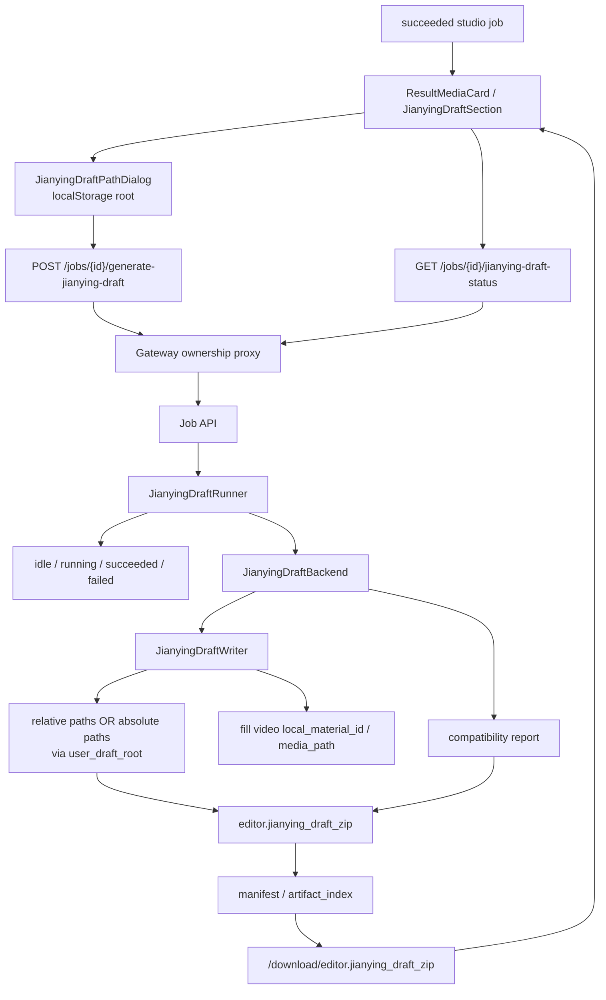

# GitNexus 剪映草稿交付图

关联总图：`docs/graphs/GITNEXUS_PROJECT_GRAPH.md`

## 1. 范围

这张子图只看 `Studio 成功任务 -> 剪映草稿 zip` 这条新交付链，重点是：

- `JobRecord` 的剪映草稿状态字段
- `JianyingDraftRunner` 的异步状态机
- Job API / Gateway 的触发与轮询端点
- `user_draft_root` 对绝对路径模式的影响
- `editor.jianying_draft_zip` 如何进入结果页

## 2. 主图

## 3. 状态机

### 3.1 JobRecord 现在持有剪映草稿状态

- `src/services/jobs/models.py` 新增：
  - `jianying_draft_status`
  - `jianying_draft_started_at`
  - `jianying_draft_completed_at`
  - `jianying_draft_error`
  - `jianying_draft_zip_path`
  - `jianying_draft_user_root`

结论：剪映草稿状态不是前端临时状态，而是 Job API 自己持有的正式 job 字段。

### 3.2 runner 是幂等异步状态机

- `src/services/jobs/jianying_draft_runner.py`
  - `idle -> running`
  - `running -> 返回 running`
  - `succeeded -> 返回已有 zip`
  - `failed -> 清错后重跑`
- 启动时执行 `reap_stale()`，把进程重启后残留的 `running` 状态回收成失败

结论：这是一个后台线程状态机，不是每次点击都无脑重新生成。

## 4. 端点与权限边界

### 4.1 Job API 暴露两条端点

- `POST /jobs/{id}/generate-jianying-draft`
- `GET /jobs/{id}/jianying-draft-status`

`generate` 端点接受 `user_draft_root` body，并在类型不对时直接返回 `invalid_user_draft_root`。

### 4.2 Gateway 只做 ownership + internal proxy

- `gateway/job_intercept.py` 对这两个 subresource 先做 ownership 校验
- 然后注入 internal headers 转发到 Job API
- Studio-only / succeeded-only 的业务 gate 仍在 Job API runner 层

结论：Gateway 负责“你能不能碰这个 job”，Job API 负责“这个 job 当前能不能生成草稿”。

## 5. `user_draft_root` 语义

### 5.1 有 root 和没 root 是两种交付模式

- 无 `user_draft_root`
  - `jianying_draft_writer.py` 把 materials 路径改成相对路径
- 有 `user_draft_root`
  - 把 materials 路径改成用户本地剪映草稿目录下的绝对路径
  - 目录结构形如：
    - `{user_draft_root}/jianying_draft_{draft_name}/materials/...`

结论：这是在决定“解压到本地后，剪映看到的是相对 material 还是已经指向你本机草稿目录的绝对 material”。

### 5.2 writer 还补齐了本地素材字段

- `jianying_draft_writer.py` 会确保 video material 具有：
  - `local_material_id`
  - `media_path`

目的很明确：避免剪映把本地素材当成远端素材去下载，并出现“素材下载失败”提示。

## 6. 前端交付面

### 6.1 结果页上的交互

- `ResultMediaCard.tsx`
  - 初始加载时读 status
  - `running` 时 2.5 秒轮询
  - `succeeded` 时直接提供 zip 下载按钮与 size hint
  - `failed` 时显示错误并允许重试

### 6.2 路径输入对话框

- `JianyingDraftPathDialog.tsx`
  - 把路径保存在 `localStorage`
  - 首次打开显示 Windows / Mac 默认路径提示
  - 再次打开则复用上次输入

结论：前端已经把“告诉系统我的剪映草稿目录在哪”做成一个正式用户流程，而不是文档说明。

## 7. 关键证据

- `src/services/jobs/models.py`
  - 剪映草稿状态字段
- `src/services/jobs/jianying_draft_runner.py`
  - 幂等状态机 + `reap_stale()`
- `src/services/jobs/api.py`
  - `generate-jianying-draft` / `jianying-draft-status` / `user_draft_root`
- `gateway/job_intercept.py`
  - ownership proxy 到 Job API
- `src/modules/output/jianying/jianying_draft_writer.py`
  - relative / absolute 路径改写
  - `local_material_id / media_path` 修补
- `frontend-next/src/components/workspace/ResultMediaCard.tsx`
  - 触发、轮询、下载

## 8. 什么时候优先读这张图

- 想改剪映草稿按钮、轮询、失败重试
- 想改 `user_draft_root` 校验或绝对路径写法
- 想排查为什么 zip 能下但剪映里素材打不开
- 想判断这一层的 gate 应该放在 Gateway 还是 Job API
