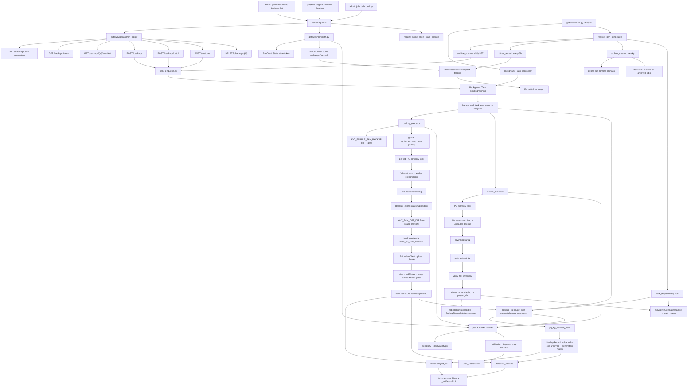

# GitNexus 网盘备份图

关联总图：`docs/graphs/GITNEXUS_PROJECT_GRAPH.md`

## 1. 范围

这张子图看的是“任务工程如何被管理员归档到百度网盘、如何恢复、如何清理残留、如何观测”，重点是：

- admin-only `/api/admin/pan/*`
- Baidu OAuth、token 加密与 refresh
- `BackgroundTask` 调度平面
- `BackupRecord` 与 `Job.status` 双状态机
- tar manifest、安全打包、上传三重校验、恢复安全解包
- HTTP feature gate、全局非阻塞 advisory lock、tar staging tmp dir 与 free-space preflight
- archive scanner、stale reaper、orphan cleanup、residue cleanup
- pan 事件、通知、R2 observability
- Admin dashboard / backups list / 项目列表批量备份
- Pan admin/auth write routes 的 CSRF same-origin guard

## 2. 主图

## 3. 当前核心认知

### 3.1 Pan backup 是 admin-only 的归档能力，不是用户下载面

- 前端入口在 `/admin/pan/dashboard`、`/admin/pan/backups`、任务管理页和项目列表 admin 批量工具栏。
- Gateway surface 统一挂在 `/api/admin/pan/*`，所有入口都要求 admin。
- `gateway/pan/admin_api.py` 和 `gateway/pan/auth.py` 的 APIRouter 都接入 `require_same_origin_state_change`，connect、backup、restore、delete credentials/delete backup 等写操作还必须通过同源校验。
- Admin API 返回备份列表 key 是 `items`，不是 `backups`；前端 `pan.ts` 已按后端 shape 对齐。

结论：网盘备份是管理员运维归档面，不改变普通用户结果页下载语义。

### 3.2 状态真源拆成三层

- `Job.status` 新增 `archiving / archived / restoring`，用于项目生命周期。
- `BackupRecord.status` 管理备份生命周期：`uploading / uploaded / failed / restoring / restored / deleted`。
- `BackgroundTask.status` 只代表调度状态：`pending / running / completed / failed`，不是备份是否真的可恢复的真源。

结论：排查网盘备份不能只看 background task，必须同时看 `jobs` 和 `backup_records`。

### 3.3 备份有明确 commit point

- `backup_executor` 先拿 PG advisory lock，再确认 `Job.status=succeeded`、凭证 active、project dir 安全。
- 进入 `archiving/uploading` 后构建 manifest 和 tar.gz，上传到 `/apps/AIVideoTrans/backups/`。
- 上传成功必须过三重 gate：remote size、md5/etag 兼容校验、tail read-back probe。
- 只有 `BackupRecord.status=uploaded` 写入成功后，才进入删除本地 project dir 和 R2 artifacts 的 post-commit 清理。
- post-commit 清理不完整时，Job 留在 `archiving`，由 `residue_cleanup` 或 `stale_reaper` forward-resolve。

结论：`uploaded` 是“网盘副本可信”的 commit point；本地/R2 删除是后续可重试清理。

### 3.4 恢复也有 hidden commit point

- `restore_executor` 只接受 `Job.status=archived` 且当前 `edit_generation` 存在 `uploaded` 备份。
- tar 内 `manifest.json` 是恢复时的权威文件清单；恢复会 safe extract 到 staging，再校验 inventory。
- 一旦 staging 被 move 到 `project_dir`，即使 DB finalize 失败，也不能回滚成 `archived`；此时保持 `restoring` 给 `stale_reaper` 识别并 forward-resolve。

结论：恢复后的磁盘事实优先于 DB 回滚便利性，避免“数据已恢复但 DB 说 archived”的卡死状态。

### 3.5 调度器与 reconciler 关闭了后台任务空窗

- `pan/_enqueue.py` 负责 create `BackgroundTask` 后立即 launch coroutine。
- `background_task_reconciler.py` 在 Gateway 启动时先于 `recover_stale` 扫描 recent pending rows，补启动因进程崩溃遗漏的 executor。
- Pan scheduler 注册 4 条循环：auto archive scanner、token refresh、orphan cleanup、stale reaper。
- 自动归档默认 dry-run，可通过 `AVT_PAN_AUTO_ARCHIVE_ENABLED` 和 `AVT_PAN_AUTO_ARCHIVE_DRY_RUN` 分阶段放量。

结论：Pan 任务是“PG row + coroutine + startup reconciler + periodic reaper”的补偿式后台系统。

### 3.6 观测与通知已经进正式事件面

- `gateway/storage/event_log.py` 支持 `pan.backup.started/succeeded/failed`、`pan.restore.started/succeeded/failed`、`pan.token_revoked`、`pan.residue_cleanup.completed`。
- `scripts/r2_observability.py` 汇总 pan event group，支持看 started/succeeded/failed/token/recovery 维度。
- `notification_dispatch_map.py` 给 token revoked、backup failed、restore failed 注册用户可见通知 recipe。

结论：Pan 失败不是只留日志，而是进入 JSONL observability 和用户通知投影。

### 3.7 部署面要求显式开关与凭证

- `AVT_ENABLE_PAN_BACKUP=false` 是默认关闭。
- OAuth 需要 `AVT_BAIDU_PAN_APPKEY / APPSECRET / REDIRECT_URI`。
- token at rest 依赖 `AVT_PAN_TOKEN_ENCRYPTION_KEY`。
- 部署 runbook 在 `docs/deployment/PAN_BACKUP_DEPLOY.md`，包含 Baidu 审核、smoke、dry-run、灰度和回滚。

结论：Pan backup 不能在默认本地路径暗中启用，必须经过部署配置和管理员连接网盘。

### 3.8 生产硬化后的并发与磁盘边界

- Pan HTTP API 现在也受 `AVT_ENABLE_PAN_BACKUP` feature gate 保护，不只是 scheduler 被 gate。
- `backup_executor.py` 使用全局 `pg_try_advisory_lock` + per-job lock + backoff polling，避免 blocking `pg_advisory_lock` 在等待期间占住 DB connection。
- lock release 失败会 invalidate connection，避免 session-level advisory lock 泄漏到连接池。
- tar staging 改走 `AVT_PAN_TMP_DIR`，并在打包前用 free-space ratio preflight 拒绝明显放不下的任务。
- `baidu_pan_client.py` 的 remote tail verify 使用 range GET 与 tuple timeout，避免大文件 tail probe 因默认超时失败。

结论：Pan backup 的主风险已经从“能否上传”扩展为“不会拖垮 DB pool、不会写爆 root disk、不会在 post-commit 残留状态上误完成”。

### 3.9 stale reaper 与 residue cleanup 的状态责任已拆清

- post-commit 残留场景中，`stale_reaper.py` 只负责发现并 enqueue `pan_residue_cleanup`。
- `residue_cleanup.py` 才负责确认本地/R2 residue 清完，并最终把 job 从 `archiving` flip 到 `archived`。
- stale reaper 在 enqueue 前必须释放 per-job advisory lock，否则 residue cleanup 会立即拿不到锁并空跑。
- backup executor 在 R2 删除失败或 status flip 失败时保留 `archiving` 与 `r2_artifacts`，让 residue cleanup 还有重试证据。

结论：不要把 `archiving -> archived` 提前放回 stale reaper；那会破坏 residue cleanup 的前置条件。

## 4. 关键证据

- `gateway/pan/admin_api.py`
  - `/api/admin/pan/status`
  - `/backups`
  - `/backups/{id}/manifest`
  - `/backups/batch`
  - `/restores`
  - soft delete / 412 guard
  - CSRF-protected APIRouter
- `gateway/pan/auth.py`
  - OAuth connect/callback
  - state token
  - token refresh
  - CSRF-protected connect route
- `gateway/pan/backup_executor.py`
  - backup state machine
  - global non-blocking advisory lock
  - manifest/tar/upload/3-gate verification
  - `AVT_PAN_TMP_DIR` free-space preflight
  - post-commit cleanup
- `gateway/pan/restore_executor.py`
  - restore state machine
  - safe extract
  - moved=True hidden commit point
- `gateway/pan/residue_cleanup.py`
  - idempotent project_dir + R2 residue cleanup
  - owns final `archiving -> archived` flip
- `gateway/pan/stale_reaper.py`
  - stale uploading/restoring recovery
  - post-commit archiving forward-resolve
  - residue cleanup enqueue contract
- `gateway/pan/_feature_gate.py`
  - HTTP API feature gate
- `gateway/pan/_lock_keys.py`
  - stable advisory lock keys
- `gateway/pan/scheduler.py`
  - auto archive / token refresh / orphan cleanup / stale reaper loops
- `gateway/background_task_reconciler.py`
  - startup pending-task relaunch
- `gateway/models.py`
  - `PanCredentials`
  - `BackupRecord`
  - `PanOauthState`
- `frontend-next/src/lib/api/pan.ts`
  - admin pan API client and response shapes
- `frontend-next/src/app/(app)/admin/pan/dashboard/page.tsx`
  - admin dashboard
- `frontend-next/src/app/(app)/admin/pan/backups/page.tsx`
  - backup list / restore / delete / manifest
- `docs/deployment/PAN_BACKUP_DEPLOY.md`
  - production rollout runbook

## 5. 什么时候优先看这张图

- 想改百度网盘 OAuth、token refresh、凭证加密
- 想改 admin 备份/恢复 API 或前端网盘页面
- 想排查 Pan connect/backup/restore/delete 为什么被 CSRF 拦截
- 想排查 `archiving / archived / restoring` 状态
- 想排查 `BackupRecord.uploading / uploaded / restoring / restored / failed`
- 想改 auto-archive、stale reaper、orphan cleanup、residue cleanup
- 想排查全局锁等待、DB pool 被占、lock 泄漏、tar staging 空间不足或 tail probe 超时
- 想确认 R2 artifacts 和本地 project dir 什么时候会被删除
- 想接入 pan.* observability 或通知
