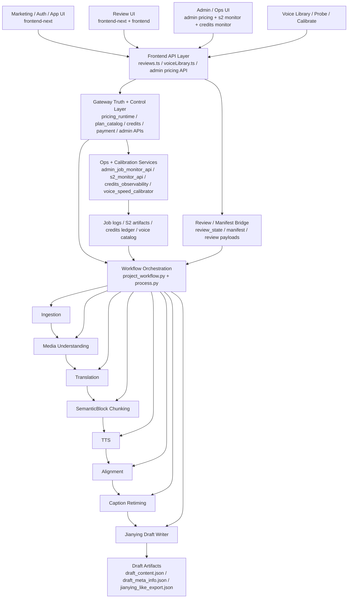

# GitNexus 项目图谱

新会话建议先读本文件，再按任务进入对应子图。

生成时间：2026-04-16
生成方式：基于当前仓库 `.gitnexus/` 最新索引与 GitNexus 本地查询结果整理

## 1. 图谱概览

当前 GitNexus 索引状态：

| 指标 | 数值 |
| --- | ---: |
| 文件数 | 796 |
| 符号节点数 | 13,529 |
| 关系边数 | 32,194 |
| 聚类数 | 513 |
| 执行流程数 | 300 |
| 索引提交 | `490cce8` |
| 索引状态 | `up-to-date` |

当前仓库已经从“单一视频处理脚本集合”演化为一个多层系统：

- 工作流内核：`Ingestion -> Media Understanding -> Translation -> SemanticBlock -> TTS -> Alignment -> Caption Retiming -> Draft`
- 商业化与权限边界：`Gateway pricing/runtime -> catalog/trial/credits/payment -> frontend marketing/auth/app`
- 审核流：`ReviewStateManager -> review pages/panels -> gate/resume`
- 管理与运维面：`admin pricing / S2 monitor / credits observability / job logs / voice speed calibration`

## 2. 主要功能区块

下表选取当前索引中最能代表架构主干的聚类：

| 聚类 | 符号数 | 代表文件/成员 |
| --- | ---: | --- |
| Services | 344 | `src/services/transcript_reviewer.py`、`src/services/review_state.py`、`src/services/tts/voice_speed_catalog.py` |
| Gateway | 248 | `gateway/main.py`、`gateway/plan_catalog.py`、`gateway/pricing_runtime.py`、`gateway/voice_speed_calibrator.py` |
| Api | 161 | `frontend-next/src/lib/api/reviews.ts`、`frontend-next/src/lib/api/voiceLibrary.ts` |
| Workflow | 147 | `src/modules/workflow/project_workflow.py`、`src/modules/workflow/alignment_stage_runner.py` |
| Jobs | 123 | job 生命周期、事件与结果聚合相关逻辑 |
| Web_ui | 98 | review/manifest/web bridge 相关逻辑 |
| Tts | 60 | TTS provider、voice speed、voice selection 相关逻辑 |
| Draft | 57 | `src/modules/draft/draft_writer.py`、`src/modules/draft/caption_retiming.py` |
| Billing | 51 | credits、pricing、billing UI 与 runtime 连接 |
| Translation | 49 | 翻译与译后结果整理 |
| Alignment | 30 | DSP 对齐与 rewrite fallback |
| Pipeline | 27 | `src/pipeline/process.py` 阶段衔接与 payload 处理 |
| Ingestion | 19 | subtitle/provider normalization |
| Review | 19 | review pages、review panel、review API |
| Marketing | 14 | 定价、营销页、会话入口 |
| Admin | 11 | 管理端 pricing surface |
| S2-monitor | 9 | S2 审核效果监控 |
| Credits-monitor | 8 | shadow credits 观测与核对 |

## 3. 子图入口

- 图谱索引：`docs/graphs/README.md`
- 工作流内核图：`docs/graphs/GITNEXUS_WORKFLOW_CORE_GRAPH.md`
- 商业化图：`docs/graphs/GITNEXUS_COMMERCIALIZATION_GRAPH.md`
- 审核流图：`docs/graphs/GITNEXUS_REVIEW_GRAPH.md`
- Admin / Ops / Calibration 图：`docs/graphs/GITNEXUS_ADMIN_OPS_CALIBRATION_GRAPH.md`

## 4. 仓库结构图

## 5. 核心证据链

### 5.1 工作流主链不是按字幕行直接 TTS

- `src/modules/workflow/project_workflow.py` 的 `run_build()` 顺序明确是：
  `ingestion -> audio preparation -> media understanding -> translation -> chunking -> alignment -> draft`
- `chunking` 阶段产出的是 `SemanticBlock`，随后才进入 `_run_alignment_stage(blocks)`。
- `src/modules/draft/caption_retiming.py` 的 `CaptionRetimer` 负责“按块内原始时间比例线性缩放”，说明字幕 retiming 仍是确定性数学逻辑，不是 LLM 驱动。

### 5.2 Gateway 仍然是商业事实真源

- `gateway/main.py:lifespan` 启动时调用 `get_runtime_pricing(force_reload=True)`。
- `gateway/pricing_runtime.py` 将 runtime pricing 读成 `PricingPayload`，缺省时回退到 `build_default_pricing_payload()`。
- `gateway/plan_catalog.py` 再从 `get_runtime_pricing()` 读取 plan/trial，这条链说明 plan catalog 不是前端本地拼装。
- GitNexus process 也给出直接链路：
  `Lifespan -> PricingPayload`
  `Shadow_capture -> PlanConfig`
  `Intercept_list_jobs -> PlanConfig`

### 5.3 审核流是显式 gate/resume，不是隐式穿透

- `src/services/review_state.py` 当前显式定义了：
  `speaker_review`
  `translation_config_review`
  `translation_review`
  `voice_review`
  `voice_selection_review`
  `audio_alignment_review`
- `frontend-next/src/lib/api/reviews.ts` 对 `speaker_review / translation_review / voice_review / voice_selection_review` 进行 active stage 与 gate stage 判定。
- GitNexus process 识别出前端审核页到请求序列化的链：
  `TranslationConfigReviewPage -> BuildBackendUrl`
  `TranslationReviewPanel -> SerializeBody`
  `SpeakerReviewPage -> SerializeBody`
  `VoiceReviewPage -> SerializeBody`

### 5.4 新增了一条 Admin / Ops / Calibration 轴

- `frontend-next/src/app/(app)/admin/pricing/page.tsx` 对接 `getAdminPricing()`、`publishPricing()`。
- `frontend-next/src/app/(app)/admin/s2-monitor/page.tsx` 对接 `fetchS2Stats()`、`fetchJobDetail()`。
- `frontend-next/src/app/(app)/admin/credits-monitor/page.tsx` 通过 `adminFetch()` 访问 `/api/admin/credits/*`。
- `frontend-next/src/lib/api/voiceLibrary.ts` 暴露 `probeVoice()` 与 `calibrateVoiceSpeed()`。
- `gateway/voice_speed_calibrator.py` 被抽成可复用单声线校准模块，既服务批量脚本，也服务 `POST /gateway/user-voices/{id}/calibrate-speed`。
- `src/services/tts/voice_speed_catalog.py` 在 pipeline 端优先读取已校准 cps，缺失时才 fallback 到 probe-TTS。

## 6. 按任务选图

- 要看主流程、阶段顺序、Jianying draft 输出：读 `GITNEXUS_WORKFLOW_CORE_GRAPH.md`
- 要看 plan、trial、credits、payment、settings、pricing truth：读 `GITNEXUS_COMMERCIALIZATION_GRAPH.md`
- 要看 review gate、前端审核页、暂停恢复：读 `GITNEXUS_REVIEW_GRAPH.md`
- 要看 admin 定价、S2 监控、credits 观测、log 分析、voice calibration：读 `GITNEXUS_ADMIN_OPS_CALIBRATION_GRAPH.md`
