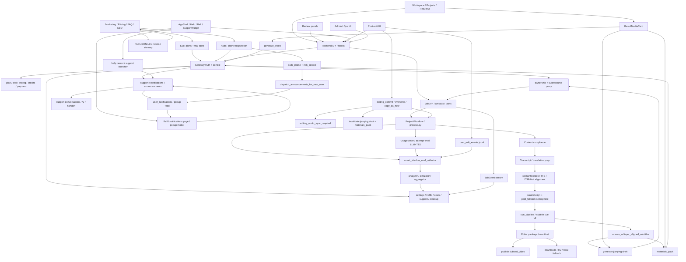

# GitNexus 项目图谱

新会话建议先读本文件，再按任务进入对应子图。
生成时间：2026-05-09
生成方式：基于当前仓库 `.gitnexus/` 最新索引与源码核对整理

## 1. 图谱概览

| 指标 | 数值 |
| --- | ---: |
| 文件数 | 1185 |
| 节点数 | 21,209 |
| 关系数 | 51,229 |
| 聚类数 | 942 |
| 流程数 | 300 |
| 索引提交 | `78eea96` |
| 索引状态 | `up-to-date` |

这轮最需要反映的结构变化有六条：

- `support / notifications / announcements` 已从零长成完整产品平面：帮助中心、客服浮窗、通知中心、管理员客服后台、系统公告 live audience、新注册用户自动分发都已落地
- workflow 对齐内核已经不只是“单线程 DSP-first”：`ThreadPoolExecutor + paid_fallback semaphore`、`force_dsp_alignment`、`capped_dsp_underflow -> high severity` 都已经进入正式语义
- 手机号 auth 前门已经重写成统一流：直接 captcha 校验、`verify-code -> registration_token -> complete-registration`、trusted-proxy IP 边界、wrong-code attempt 限制
- `AppShell` 已经把 `NotificationBell`、popup modal、帮助中心入口、`SupportWidget` 和管理员在线状态切进主应用壳层
- Jianying draft 与 post-edit 状态机继续加固：runner 的 substep / terminal write 走 `update_job` claim guard，overwrite 会清空 stale `attempt_id / substep / fingerprint`
- 原有的 offline evaluation、voice clone 成本、whisper deliverable sidecar 仍然成立，但现在不再是唯一新增轴；support / auth / alignment control 已经并列成为核心结构面

## 2. 关键基座

| 基座 | 当前主轴 | 代表文件 |
| --- | --- | --- |
| Workflow | `SemanticBlock -> TTS -> DSP-first + parallel alignment -> cue_pipeline -> editor outputs` | `src/pipeline/process.py`、`src/services/alignment/aligner.py` |
| Subtitles | `SRT window` timing、deliverable-time whisper sidecar、sync guard | `src/modules/subtitles/cue_pipeline.py`、`src/services/subtitles/ensure_whisper_alignment.py` |
| Jianying | on-demand draft runner、rename-aware fingerprint、claim guard、orphan rescue | `src/services/jobs/jianying_draft_runner.py`、`src/modules/output/jianying/jianying_draft_writer.py` |
| Editing | `overwrite / copy_as_new`、audio-sync hard gate、preview-source cache、deliverable invalidation | `src/services/jobs/editing_commit.py`、`src/services/jobs/editing_segments.py` |
| Delivery | `materials_pack`、`generate_video`、download keys、R2 / local fallback | `gateway/background_task_executors.py`、`src/services/jobs/api.py`、`src/services/web_ui/output_entries.py` |
| Auth & Lifecycle | phone verify / registration_token / trial grant / live onboarding announcements | `gateway/auth_phone.py`、`gateway/risk_control.py`、`gateway/system_announcements_service.py` |
| Support & Notifications | support API、AI/template/handoff、notification center、popup feed、announcements | `gateway/support_api.py`、`gateway/support_service.py`、`gateway/notifications_api.py` |
| Gateway | ownership、plan truth、admin settings、support admin、traffic analytics、cost management | `gateway/job_intercept.py`、`gateway/main.py`、`gateway/admin_settings.py`、`gateway/admin_support_api.py` |
| Metering & Audit | `UsageMeter`、`JobEvent`、`user_edit_events.jsonl` 三条 sidecar | `src/services/usage_meter.py`、`src/services/jobs/user_edit_audit.py` |
| Offline Evaluation | `smart_shadow_eval`、`smart_shadow_sim`、aggregate reports、P2 readiness | `scripts/smart_shadow_eval_collector.py`、`scripts/smart_shadow_sim_aggregator.py` |

## 3. 子图入口

- 图谱索引：`docs/graphs/README.md`
- 工作流内核图：`docs/graphs/GITNEXUS_WORKFLOW_CORE_GRAPH.md`
- 剪映草稿交付图：`docs/graphs/GITNEXUS_JIANYING_DRAFT_DELIVERY_GRAPH.md`
- 审核流图：`docs/graphs/GITNEXUS_REVIEW_GRAPH.md`
- 编辑 / 后处理图：`docs/graphs/GITNEXUS_EDITING_POST_EDIT_GRAPH.md`
- 存储与交付图：`docs/graphs/GITNEXUS_STORAGE_DELIVERY_R2_GRAPH.md`
- 商业化图：`docs/graphs/GITNEXUS_COMMERCIALIZATION_GRAPH.md`
- 支持 / 通知图：`docs/graphs/GITNEXUS_SUPPORT_NOTIFICATIONS_GRAPH.md`
- Admin / Ops / Calibration 图：`docs/graphs/GITNEXUS_ADMIN_OPS_CALIBRATION_GRAPH.md`
- Benchmark / Quality / Cost 图：`docs/graphs/GITNEXUS_BENCHMARK_QUALITY_COST_GRAPH.md`

## 4. 仓库结构图

## 5. 核心证据链

### 5.1 `support / notifications / announcements` 已经是完整产品平面

- `gateway/support_api.py` 现在公开承载 `/api/support/config`、会话创建、消息发送、显式 handoff、`/online-status`、WeChat QR、以及“我的未关闭会话”
- `gateway/support_service.py` 明确规定：它是唯一决定“这一条消息走 template / FAQ / LLM / handoff 哪条路”的编排层，并始终记录 `support_messages` 与 `support_ai_usage`
- `gateway/notifications_api.py` 提供 bell unread count、通知列表、mark read、archive、popup modal feed
- `gateway/system_announcements_service.py` 承担 audience resolution、send fan-out、recall、以及 `for_new_registrations` live dispatch

结论：这条链路已经不是附属工具，而是正式用户面和运营面。

### 5.2 workflow 对齐内核已经进入“并行 + review 语义”阶段

- `src/services/alignment/aligner.py` 已经显式使用 `ThreadPoolExecutor`
- 同文件把 `paid_fallback` 受控在 alignment-level semaphore 下，而不是随线程数无上限扩张
- `force_dsp_alignment` 可由 admin settings 打开
- `capped_dsp_underflow` 会统一分类为 `high severity`
- `src/pipeline/process.py` 会产出 `force_dsp_severity_distribution`、`force_dsp_review_suppressed_count` 等分布指标

结论：主路径仍是 DSP-first，但现在对并发、fallback 成本、review 严重度都有正式可观测语义。

### 5.3 手机号 auth 前门已经是统一生命周期入口

- `gateway/auth_phone.py` 现在的公开流是：
  - `send-code`
  - `verify-code`
  - `complete-registration`
  - `reset-password`
- 同文件明确规定“验证码通过 != 注册成功”，trial 只在 `complete-registration` 成功后发放
- 同文件还修复了 trusted-proxy IP 边界、wrong-code attempt 限额、以及删除旧的 captcha pre-verify pass-token 死路径
- `complete-registration` 成功后会调用 `dispatch_announcements_for_new_user(...)`

结论：auth、trial、以及 onboarding announcement 现在已经连成一条前门生命周期。

### 5.4 `AppShell` 已经变成支持与通知的统一入口壳层

- `frontend-next/src/components/app-shell.tsx` 现在直接挂载：
  - `NotificationBell`
  - `NotificationPopupModal`
  - `SupportWidget`
  - `AdminPresenceSwitcher`
- 同文件导航也新增了“通知”“帮助中心”“客服管理”“系统公告”等入口
- `frontend-next/src/app/(app)/help/page.tsx` 已经从占位页升级为真实帮助中心落地页

结论：支持与通知不再是离散页面，而是已经进入主应用导航与壳层常驻入口。

### 5.5 Jianying 与 post-edit 状态机继续加固

- `src/services/jobs/jianying_draft_runner.py` 的 substep / terminal writes 现在强调 `status == "running"` 与 `attempt_id` 双重 claim guard
- 同文件 final success 会在最终产物生成后重算 fingerprint，避免“trigger 时的输入 fingerprint”与“落盘产物 fingerprint”漂移
- `src/services/jobs/editing_commit.py` 的 overwrite 路径会清空 stale `jianying_draft_attempt_id / substep / fingerprint`

结论：stale worker、rename、overwrite invalidation 之间的竞态已经被显式建模，而不再靠“最好别撞上”。

## 6. 按任务选图

- 要看 alignment、`force_dsp`、parallel fallback、whisper 交付侧路，读 `GITNEXUS_WORKFLOW_CORE_GRAPH.md`
- 要看 `display_name`、claim guard、orphan rescue、`user_draft_root`，读 `GITNEXUS_JIANYING_DRAFT_DELIVERY_GRAPH.md`
- 要看 `editing_audio_sync_required`、preview-source cache、overwrite / copy_as_new，读 `GITNEXUS_EDITING_POST_EDIT_GRAPH.md`
- 要看 pricing truth、phone auth、trial grant、new-user onboarding，读 `GITNEXUS_COMMERCIALIZATION_GRAPH.md`
- 要看帮助中心、客服浮窗、通知中心、系统公告 fan-out、人工接管，读 `GITNEXUS_SUPPORT_NOTIFICATIONS_GRAPH.md`
- 要看 alignment / whisper settings、客服后台、traffic analytics、成本控制、cleanup，读 `GITNEXUS_ADMIN_OPS_CALIBRATION_GRAPH.md`
- 要看 `smart_shadow_eval / sim`、attempt-level metering、行为审计与 P2 readiness，读 `GITNEXUS_BENCHMARK_QUALITY_COST_GRAPH.md`
