# GitNexus 项目图谱

新会话建议先读本文件，再按任务进入对应子图。生成时间：`2026-06-01`

生成方式：基于 GitNexus 最新索引、Git 历史 diff 与源代码交叉整理。

## 1. 图谱概览

| 指标 | 数值 |
| --- | ---: |
| 文件数 | 1579 |
| 节点数 | 29,044 |
| 关系数 | 65,983 |
| 聚类数 | 1114 |
| 流程数 | 300 |
| 索引提交 | `0a1f2278` |
| 索引状态 | `up-to-date` |

本轮最需要反映的结构变化：

- Free tier 成为独立 service mode：`AVT_ENABLE_FREE_TIER` 控制 Gateway，Next build/runtime flag 控制入口，entitlements 将 `free` 加入 allowed service modes。
- 免费档 launch gate 已硬化：`free_consent.voice_rights_confirmed=true` 必须在 Gateway server-side 校验通过，失败在 quota reserve 与 upstream forward 前 403。
- 免费日配额进入专用 ledger：`free_service_daily_usage` 支持 reserve / consume / release / expire，按 Asia/Shanghai 自然日和 user 维度防并发穿透。
- MiMo voiceclone 进入 free TTS 窄路径：reference extraction/stamp 写入 segment，`TTSGenerator` 只在 `free_voiceclone` 策略下调用 MiMo `synthesize_voiceclone`，fallback 强制回 MiMo preset。
- 免费档交付边界补齐：10 分钟时长 fail-closed，free download/stream/eager-push 只放行水印视频与 poster，publish 通过 ffmpeg drawtext 加水印。
- 商业/成本面同步：free=0 debit truth、admin `free_tier_voiceclone_enabled` kill switch、MiMo voiceclone spike 与 paid API guard 进入图谱。

## 2. 关键基座

| 基座 | 当前主轴 | 代表文件 |
| --- | --- | --- |
| Workflow | `SemanticBlock -> TTS -> DSP-first alignment -> cue_pipeline -> editor outputs`，Smart inline branch、Express auto-clone gate 与 Free duration/voiceclone/watermark gate 都挂在主流程中 | `src/pipeline/process.py`, `src/services/alignment/aligner.py`, `src/services/express/pipeline_clients.py`, `src/utils/free_duration_gate.py` |
| Smart | deterministic auto-review, consent gate, admin policy, candidate-first reuse/clone/preset, sidecar audit, Studio handoff | `src/services/smart/*`, `src/services/smart_wiring.py`, `gateway/smart_consent.py`, `src/pipeline/process.py` |
| Smart Reports | user quality report、admin cost summary、Smart analytics、Phase 1a/1b report analysis 分离 | `src/services/smart/sidecar_emitter.py`, `src/services/smart/quality_report_synthesizer.py`, `gateway/admin_cost_api.py`, `gateway/admin_smart_analytics_api.py` |
| Review | `waiting_for_review -> WorkspacePage panels -> resume`，Smart handoff 复用 Studio gate，voice selection 支持 candidate-first clone/reuse | `src/services/review_state.py`, `src/services/jobs/review_actions.py`, `gateway/voice_selection_api.py` |
| Editing | Smart/Studio `enter-edit -> editing speakers -> split-many / suggest-split -> regenerate -> batch -> commit` | `src/services/jobs/editing_segments.py`, `src/services/jobs/editing_split_suggest.py`, `src/services/jobs/editing_batch.py`, `src/services/jobs/editing_commit.py` |
| Delivery | `materials_pack / generate_video / editor.jianying_draft_zip / R2 registry / parity`，free 只暴露水印视频与 poster | `gateway/storage/backend_router.py`, `gateway/r2_artifact_sweeper.py`, `src/services/r2_publisher_lib/r2_parity.py`, `src/services/r2_publisher_lib/downloadable_keys.py` |
| Commercialization | Gateway owns plan, trial, pricing, entitlement, Smart/Express/Free availability, consent, fixed price/free=0, payment provider policy and production safety | `gateway/plan_catalog.py`, `gateway/entitlements.py`, `gateway/credits_service.py`, `gateway/job_intercept.py`, `gateway/payment_providers.py`, `gateway/express_consent.py`, `gateway/free_consent.py` |
| Auth | phone + email registration, reset, session | `gateway/auth_phone.py`, `gateway/auth_email.py`, `frontend-next/src/components/auth/*` |
| Security | CSRF same-origin guard, production env validation, fake payment production gate | `gateway/csrf.py`, `gateway/main.py`, `gateway/startup_checks.py`, `gateway/payment_providers.py` |
| Calibration | manual / clone-after / review-preflight / Smart clone mirror / candidate matching / source metadata | `gateway/user_voice_api.py`, `gateway/user_voice_service.py`, `gateway/voice_calibration_hook.py`, `gateway/voice_calibration_review_preflight.py` |
| CosyVoice Worker | explicit user clone, Express consented auto-clone, clone-gate, sample/source_segments, OSS/R2 uploader, HMAC mainland worker, worker-routed TTS, temporary cleanup | `gateway/cosyvoice_clone/api.py`, `gateway/mainland_voice_worker.py`, `src/services/mainland_worker/*`, `src/services/express/*`, `gateway/express_voice_cleanup_service.py`, `src/services/tts/tts_generator.py` |
| Express Auto Clone | availability, consent, atomic reservation, pipeline auto-clone, temporary user_voices, reservation TTL and worker delete cleanup | `gateway/entitlements.py`, `gateway/express_reservation_service.py`, `gateway/express_reservation_sweeper.py`, `gateway/express_voice_cleanup_service.py`, `src/services/express/auto_clone.py`, `src/services/express/pipeline_clients.py` |
| Free Tier | service_mode free, voice-rights consent, daily quota ledger, MiMo voiceclone, paid API guard, duration cap, watermark, restricted downloads | `gateway/free_consent.py`, `gateway/free_service_quota.py`, `src/services/tts/voiceclone_reference.py`, `src/services/tts/mimo_tts_provider.py`, `src/utils/free_duration_gate.py`, `src/utils/free_watermark.py` |
| Admin/Ops | settings, Smart LLM defaults, Smart voice policy, Smart analytics, report analysis, Phase 1b flags, traffic, support, cost, disk cleanup/resize, R2 sweeper, Express CosyVoice control/cleanup, free voiceclone kill switch | `gateway/admin_settings.py`, `src/services/llm_registry.py`, `gateway/admin_smart_analytics_api.py`, `gateway/admin_cosyvoice_control_api.py`, `gateway/admin_disk_api.py`, `gateway/disk_resize_helper.py`, `gateway/admin_cost_api.py`, `gateway/main.py` |
| Metering & Settlement | `UsageMeter`, voice reuse/clone/rejection meter, MiMo v2.5/voiceclone provider usage, RMB-direct/promotional/free pricing, Smart credits policy, terminal settle, cost backfill | `src/services/usage_meter.py`, `gateway/cost_management.py`, `gateway/credits_service.py`, `gateway/job_terminal_mirror.py`, `gateway/cost_summary_backfill.py`, `src/services/gemini/translator.py`, `src/services/transcript_reviewer.py`, `src/services/tts/mimo_tts_provider.py` |
| Pan Backup | admin-only Baidu Pan archive/restore, BackupRecord state machine, schedulers, residue cleanup, observability | `gateway/pan/*`, `gateway/background_task_reconciler.py`, `frontend-next/src/lib/api/pan.ts`, `scripts/r2_observability.py` |
| Offline Evaluation | `smart_shadow_eval / sim`, Phase 1a baseline, Phase 1b report summaries, quality/cost reports | `scripts/smart_shadow_eval_collector.py`, `scripts/smart_shadow_sim_aggregator.py`, `src/services/phase1b_report_summary.py` |

## 3. 子图入口

- 图谱索引：`docs/graphs/README.md`
- 工作流内核图：`docs/graphs/GITNEXUS_WORKFLOW_CORE_GRAPH.md`
- CosyVoice / Mainland Worker 图：`docs/graphs/GITNEXUS_COSYVOICE_MAINLAND_WORKER_GRAPH.md`
- Express CosyVoice Auto-Clone 图：`docs/graphs/GITNEXUS_EXPRESS_COSYVOICE_AUTO_CLONE_GRAPH.md`
- Free Tier 图：`docs/graphs/GITNEXUS_FREE_TIER_GRAPH.md`
- Smart 自动审核图：`docs/graphs/GITNEXUS_SMART_AUTO_REVIEW_GRAPH.md`
- 剪映草稿交付图：`docs/graphs/GITNEXUS_JIANYING_DRAFT_DELIVERY_GRAPH.md`
- 审核流图：`docs/graphs/GITNEXUS_REVIEW_GRAPH.md`
- 编辑 / 后处理图：`docs/graphs/GITNEXUS_EDITING_POST_EDIT_GRAPH.md`
- 存储与交付图：`docs/graphs/GITNEXUS_STORAGE_DELIVERY_R2_GRAPH.md`
- 商业化图：`docs/graphs/GITNEXUS_COMMERCIALIZATION_GRAPH.md`
- 支持 / 通知图：`docs/graphs/GITNEXUS_SUPPORT_NOTIFICATIONS_GRAPH.md`
- Admin / Ops / Calibration 图：`docs/graphs/GITNEXUS_ADMIN_OPS_CALIBRATION_GRAPH.md`
- Benchmark / Quality / Cost 图：`docs/graphs/GITNEXUS_BENCHMARK_QUALITY_COST_GRAPH.md`
- 网盘备份图：`docs/graphs/GITNEXUS_PAN_BACKUP_GRAPH.md`

## 4. 仓库结构图

```mermaid
graph TD
    Marketing["Marketing / Pricing / FAQ / SEO"] --> PlansSSR["SSR plans + trial facts"]
    Marketing --> AuthFront["Phone + Email auth"]

    Workspace["Workspace / Projects / Result UI"] --> FrontApi["Frontend API / hooks"]
    TranslationForm["TranslationForm service_mode selector"] --> FrontApi
    TranslationForm --> ExpressConsentUI["Express auto-clone availability + consent checkbox"]
    TranslationForm --> FreeTierUI["Free tier entry + voice-rights consent"]
    ReviewUI["Review panels + SmartAutoDecisionPanel"] --> FrontApi
    EditUI["Post-edit UI"] --> FrontApi
    VoiceCloneUI["CosyVoice clone modal + source segment picker"] --> FrontApi
    AppShell["Bell / popup / support / admin entry"] --> FrontApi
    AdminUI["Admin / Ops UI"] --> FrontApi
    PanUI["Admin Pan dashboard / backups / bulk backup"] --> FrontApi
    SmartAnalyticsUI["Admin smart-analytics / report-analysis"] --> FrontApi

    PlansSSR --> Gateway["Gateway truth + control"]
    AuthFront --> Gateway
    FrontApi --> Gateway
    FrontApi --> JobApi["Job API / artifacts / tasks"]

    Gateway --> Billing["plan / trial / credits / payment"]
    Gateway --> Entitlements["entitlements / allowed service modes"]
    Gateway --> SmartConsent["smart_consent validator"]
    Gateway --> FreeConsent["free_consent validator"]
    Gateway --> FreeQuota["free_service_daily_usage quota ledger"]
    Gateway --> SupportPlane["support / notifications / announcements"]
    Gateway --> Ops["settings / Smart voice policy / LLM models / costs / disk cleanup + resize"]
    Gateway --> CalibrationPlane["voice calibration + user voice quota + candidates + source metadata"]
    Gateway --> PanPlane["Pan backup admin API + OAuth"]
    Gateway --> SecurityPlane["CSRF same-origin + production safety"]
    Gateway --> SmartAnalyticsApi["admin_smart_analytics_api"]
    Gateway --> CosyVoiceCloneApi["CosyVoice clone API + clone-gate"]
    Gateway --> ExpressAvailabilityApi["Express auto-clone availability"]
    Gateway --> ExpressReservationApi["Express reservation internal API"]
    Gateway --> ExpressTempCleanup["Express temporary voice cleanup"]
    Gateway --> MainlandWorkerAdmin["mainland worker admin status/healthz"]
    Gateway --> Proxy["ownership + subresource proxy"]

    JobApi --> Workflow["process.py / ProjectWorkflow"]
    Workflow --> EffectiveMode["derive_effective_pipeline_mode"]
    EffectiveMode --> SmartPlane["Smart auto review"]
    EffectiveMode --> StudioFlow["Studio review flow"]
    EffectiveMode --> ExpressAutoGate["Express auto-clone maybe_run_express_auto_clone"]
    EffectiveMode --> FreeFlow["Free tier duration/voiceclone/watermark gates"]
    ExpressConsentUI --> ExpressAvailabilityApi
    ExpressConsentUI --> JobApi
    FreeTierUI --> FreeConsent
    FreeTierUI --> JobApi
    FreeConsent --> FreeQuota
    FreeQuota --> JobApi
    FreeFlow --> FreeDurationGate["10-min fail-closed duration gate"]
    FreeFlow --> FreeReferenceStamp["voiceclone_reference stamp"]
    FreeReferenceStamp --> FreeMimoVoiceClone["MiMo synthesize_voiceclone"]
    FreeMimoVoiceClone --> UsageMeter
    FreeFlow --> FreeWatermark["free watermark policy"]
    FreeWatermark --> VideoTask
    ExpressAutoGate --> ExpressReservationApi
    ExpressReservationApi --> ExpressReservationRows["express_clone_reservations reserved/consumed/released/expired"]
    ExpressReservationRows --> ExpressAutoCloneCore["services.express.auto_clone"]
    ExpressAutoCloneCore --> ExpressSampleUpload["internal express-sample-upload"]
    ExpressSampleUpload --> MainlandWorkerClient
    ExpressAutoCloneCore --> ExpressTempVoiceRow["temporary user_voices + worker routing"]
    ExpressTempVoiceRow --> TTSWorkerRouting

    SmartConsent --> SmartPlane
    SmartPlane --> Eligibility["eligibility_gate"]
    Eligibility --> AutoVoice["auto_voice_review"]
    Eligibility --> AutoTranslation["auto_translation_review"]
    AutoVoice --> SmartPolicy["admin smart_auto_clone / reuse / auto_reuse_possible / pause policy"]
    AutoVoice --> Quota["Gateway user voice quota"]
    AutoVoice --> VoiceCandidates["UserVoice candidates API"]
    VoiceCandidates --> VoiceReuse["strong auto-reuse"]
    VoiceCandidates --> StrongNamed["strong_named cross-source unique-name"]
    VoiceCandidates --> WeakPause["weak/medium/cross-source confirmation pause"]
    VoiceCandidates --> PossibleAutoReuse["P5 auto-reuse top possible-match"]
    AutoVoice --> CloneProvider["smart_wiring MiniMax clone provider"]
    VoiceReuse --> UserVoiceMirror["UserVoice source metadata"]
    StrongNamed --> VoiceReuse
    PossibleAutoReuse --> VoiceReuse
    WeakPause --> Handoff
    CloneProvider --> UserVoiceMirror["register-smart user voice mirror"]
    CloneProvider --> ProviderExhaust["quota/balance exhaustion status_code=1008"]
    ProviderExhaust --> Handoff
    AutoVoice --> MinorPreset["minor speaker preset auto-match"]
    MinorPreset --> VoiceIdProp["voice_id_a / voice_id_b propagation"]
    AutoTranslation --> SmartSidecar["smart_decisions / quality / cost"]
    AutoVoice --> SmartSidecar
    SmartPlane --> Handoff["handoff markers"]
    Handoff --> ReviewGate["waiting_for_review"]

    SmartSidecar --> QualityApi["Job API smart-quality-report"]
    QualityApi --> ReviewUI
    SmartSidecar --> CostApi["Admin cost API"]
    CostApi --> AdminUI
    SmartSidecar --> SmartAnalyticsApi
    ReportSidecars["reports: translation/subtitle/speaker/sample"] --> SmartAnalyticsApi
    SmartAnalyticsApi --> SmartAnalyticsUI
    SmartAnalyticsApi --> Phase1BFlags["phase1b flags admin overrides"]
    Phase1BFlags --> Ops

    Workflow --> ReviewGate
    ReviewGate --> ReviewUI
    ReviewUI --> ReviewApprove["review actions / voice selection approve"]
    ReviewApprove --> CalibrationPlane
    ReviewApprove --> Workflow
    ReviewUI --> CandidateUI["candidate-first voice selection"]
    CandidateUI --> CloneModal["voice clone/reuse modal"]
    CandidateUI --> CandidateAudit["voice_candidate_rejected / voice_reuse audit"]
    CloneModal --> CalibrationPlane
    CloneModal --> CosyVoiceCloneApi
    CosyVoiceCloneApi --> CloneGate["allowlist/GA + runtime_ready + max voices"]
    CosyVoiceCloneApi --> SampleGate["sample upload OR source_segments"]
    SampleGate --> SampleUploader["OSS/R2 sample uploader"]
    SampleUploader --> MainlandWorkerClient["HMAC MainlandWorkerClient.clone"]
    MainlandWorkerAdmin --> MainlandWorkerClient
    MainlandWorkerClient --> WorkerApp["mainland worker app /cosyvoice/*"]
    WorkerApp --> UserVoiceWorkerRow["user_voices requires_worker + target_model + worker_request_id"]
    UserVoiceWorkerRow --> VoiceCandidates

    EditUI --> EditingPlane["Smart/Studio edit / speakers / split / regenerate / batch / commit"]
    EditingPlane --> CloneModal
    EditingPlane --> SplitMany["SplitSegmentDialog + split-many journal"]
    EditingPlane --> SuggestSplit["LLM suggest-split explicit button"]
    EditingPlane --> Workflow
    EditingPlane --> DeliveryReset["invalidate stale deliverables"]
    EditingPlane --> WorkerRouting["editing voice-map preserves worker routing"]
    WorkerRouting --> Workflow

    Workflow --> EditOutputs["editor package / publish outputs"]
    Workflow --> TTSWorkerRouting["requires_worker segment -> CosyVoice mainland worker TTS"]
    TTSWorkerRouting --> MainlandWorkerClient
    EditOutputs --> WhisperEnsure["ensure_whisper_aligned_subtitles"]
    WhisperEnsure --> PackTask["materials_pack"]
    WhisperEnsure --> JDraftTask["generate-jianying-draft"]
    EditOutputs --> VideoTask["generate_video"]

    PackTask --> Delivery["downloads / R2 / local fallback"]
    JDraftTask --> Delivery
    VideoTask --> Delivery
    Delivery --> FreeDownloadGate["free download/stream/eager-push restricted keys"]

    MainLife["gateway/main.py lifespan"] --> Sweeper["r2_artifact_sweeper"]
    MainLife --> ExpressReservationSweeper["express_reservation_sweeper"]
    MainLife --> ExpressVoiceCleanupSweeper["express_voice_cleanup_sweeper"]
    ExpressReservationSweeper --> ExpressReservationRows
    ExpressVoiceCleanupSweeper --> ExpressTempCleanup
    ExpressTempCleanup --> MainlandWorkerClient
    ExpressTempCleanup --> ExpressCleanupAudit["express_temp_voice_cleanup audit"]
    Sweeper --> Mirror["job_terminal_mirror"]
    Mirror --> Registry["r2_artifacts + terminal PG mirror"]
    Mirror --> Settlement["settle_job_credit_ledger"]
    Settlement --> CostBackfill["cost_summary_backfill"]
    CostBackfill --> CostApi
    Sweeper --> Publisher["r2_publisher"]
    Publisher --> Registry
    Registry --> Delivery

    PanPlane --> PanAuth["Baidu OAuth + encrypted credentials"]
    PanPlane --> PanAdminApi["/api/admin/pan/*"]
    PanAdminApi --> PanQueue["BackgroundTask pan_backup / pan_restore / pan_residue_cleanup"]
    PanQueue --> PanBackup["backup_executor"]
    PanQueue --> PanRestore["restore_executor"]
    PanQueue --> PanResidue["residue_cleanup"]
    PanBackup --> PanRecord["BackupRecord upload/uploaded state"]
    PanBackup --> ArchivedStatus["Job.status archiving -> archived"]
    PanBackup --> PanDeleteLocal["delete project_dir"]
    PanBackup --> PanDeleteR2["delete r2_artifacts"]
    PanRestore --> RestoredStatus["archived -> restoring -> succeeded"]
    PanResidue --> ArchivedStatus
    PanSchedulers["pan schedulers + startup reconciler"] --> PanQueue
    PanSchedulers --> PanAuth
    PanEvents["pan.* event_log"] --> R2Obs["r2_observability pan group"]
    PanEvents --> UserNotifications["pan failure / token notifications"]

    Cleanup["project_cleanup"] --> Parity["r2_parity_ok"]
    AdminDisk["admin_disk_api"] --> Cleanup
    AdminDisk --> ResizeHint["resize_hint"]
    ResizeHint --> ResizeHelper["disk_resize_helper loopback resize2fs"]
    AdminDisk --> DiskUI["/admin/disk"]
    Parity --> Registry

    Workflow --> UsageMeter["UsageMeter / attempt-level + clone/reuse/rejection usage"]
    UsageMeter --> CostCatalog["RMB-direct cost catalog"]
    JobApi --> JobEvents["JobEvent stream"]
    EditUI --> UserEditAudit["user_edit_events.jsonl"]
    SmartSidecar --> Shadow["smart_shadow_eval / sim"]
    UsageMeter --> Shadow
    UserEditAudit --> Shadow
    JobEvents --> Ops
    Shadow --> Ops

    Settlement --> Billing
    Entitlements --> TranslationForm
    SupportPlane --> AppShell
    Ops --> AdminUI
    CalibrationPlane --> AdminUI
    SecurityPlane --> CSRF["require_same_origin_state_change"]
    SecurityPlane --> ProdSafety["AVT_ENV production + fake payment gate"]
    SecurityPlane --> AdminUI
    PollingGov["usePollingTask / useBackgroundTask visibility-aware"] --> FrontApi
```

## 5. 核心证据链

### 5.1 Smart 已经从“审核骨架”进入“入口、策略、报告”的闭环

- `frontend-next/src/components/workspace/TranslationForm.tsx` 暴露 `serviceMode = "smart"`，读取 entitlements 判断是否可用，并用 credits estimate 获取智能版单价。
- `gateway/smart_consent.py` 强制 Smart 提交携带完整 6 字段 consent，并暂时拒绝未实现的 `fail_and_refund` 结算策略。
- `gateway/job_intercept.py::compute_job_policy(...)` 对 Smart 固定 MiniMax、`speech-2.8-hd`、`requires_review=True` 和 `voice_strategy=smart_auto`。
- `src/pipeline/process.py` 在 Smart effective mode 下执行 eligibility、voice review、translation audit metrics、handoff、quality report、cost summary。
- `src/pipeline/process.py` 通过 `services.admin_settings.read_admin_setting` 读取 Smart voice policy，避免 Gateway-only settings loader 在 app runtime 中失效。
- `frontend-next/src/components/workspace/SmartAutoDecisionPanel.tsx` 用户侧只渲染 quality report，不包含任何内部成本字段。

结论：Smart 不是只存在于后端策略层，而是从提交入口、pipeline 决策、用户解释面到 admin 成本面都有显式结构。

### 5.2 Voice candidate-first 成为 Studio / Post-edit / Smart 的共用音色入口

- `gateway/alembic/versions/028_user_voice_source_metadata.py` 为 `user_voices` 增加 source hash、source speaker、source job、sample seconds 等溯源字段和索引。
- `gateway/user_voice_service.py::match_user_voices(...)` 输出 `same_source_strong / same_source_named / same_source_speaker_id_changed / cross_source_named_person`，并过滤 generic speaker name，避免“Speaker A”误匹配。
- 2026-05-21 后，跨源唯一同名候选可提升为 `strong_named / cross_source_named_unique`，`auto_reuse_allowed=True`，服务 Smart P5 和 Studio/Post-edit 预选。
- `gateway/user_voice_api.py` 暴露 internal `/api/internal/user-voices/candidates`，`gateway/voice_selection_api.py` 暴露 public `/job-api/jobs/{job_id}/voice-candidates`。
- `VoiceSelectionPanel.tsx` 和 `VoiceModifyTab.tsx` 都按“强匹配 / 可能匹配 / 其他个人音色”顺序展示候选。
- `src/services/usage_meter.py::record_voice_reuse(...)` 与 `record_voice_candidate_rejected(...)` 都是非计费审计事件。

结论：个人音色不再只是 clone 成功后的库记录，而是进入创建、审核、后编辑、Smart 暂停决策的候选层。

### 5.3 Smart voice clone 的生产边界现在更严格

- `_fetch_smart_user_voice_quota_remaining(...)` 通过 Gateway internal API 查询用户音色库剩余额度。
- Gateway create path 只有在 consent 和 admin clone policy 都允许新克隆时，才对非 admin Smart job 做提交前 quota safety water mark 检查。
- `smart_auto_clone_enabled=False` 只禁止新 clone，不禁止强匹配复用；`smart_reuse_user_voice_enabled=False` 才会跳过候选查询。
- `smart_auto_reuse_on_possible_user_voice_match=True` 是 P5 默认策略：非强 possible match 会自动提升 top candidate 为 reuse，不发起 paid clone；它优先于旧的 `smart_pause_on_possible_user_voice_match`。
- 只有关闭 P5 auto-reuse 且开启 `smart_pause_on_possible_user_voice_match=True` 时，非强匹配候选才触发 `possible_user_voice_match_requires_confirmation` 并写入 review payload。
- MiniMax `status_code=1008 / insufficient balance / 余额不足` 被 `_looks_like_quota_error(...)` 归类为 provider exhaustion，Smart clone 进入 quota/balance pause 而不是普通 provider retry。
- `build_smart_clone_provider()` 仍集中在 `src/services/smart_wiring.py`，Smart 核心包不直接导入真实 provider。
- `_register_smart_clone_in_user_voices(...)` 将 clone 成功结果镜像回 Gateway UserVoice，否则 fail-closed handoff。
- `_resolve_smart_minor_speaker_voices(...)` 为非主说话人解析 preset voice，避免 Smart approved payload 留下空 voice_id。
- Smart auto-approve 分支会把 `_speaker_voices` 回灌到 `voice_id_a / voice_id_b`，确保 2-speaker translate path 真正使用 cloned/reused voice。
- Smart auto-clone 成功现在会记录 `UsageMeter.record_voice_clone(...)`，避免 admin cost view 漏掉 MiniMax clone 成本。

结论：Smart clone 不再是单点调用 provider，而是 consent、quota snapshot、reuse match、provider composition、UserVoice mirror、preset fallback 的组合边界。

### 5.4 quality report 和 cost summary 是两条不同安全域

- `smart_quality_report.json` 是用户可见解释层，Job API 只对 Smart job 暴露。
- `quality_report_synthesizer.py` 会从 `smart_decisions.jsonl` 合成 handoff 摘要，避免用户看到误导性的“处理中”。
- `smart_cost_summary.json` 由 admin-only `GET /api/admin/jobs/{job_id}/cost` 读取。
- `cost_summary_backfill.py` 在 settlement 后回填实际扣点和 MiniMax quota 使用量。
- `admin_smart_analytics_api.py` 汇总 Smart job、alignment report、handoff reason、edit events、quality/cost sidecar，并导出 JSON summary 与 CSV。
- `phase1b_report_summary.py` 汇总 `reports/translation_quality_report.json`、`reports/subtitle_width_report.json`、`reports/speaker_evidence.jsonl` 和 voice sample scoring shadow manifest，供 `/admin/report-analysis` 判断哪些 shadow flag 可以继续推进。

结论：质量解释给用户，成本审计给管理员，不能把内部成本字段泄漏到 Workspace。

### 5.5 Smart 完成后进入 post-edit 的入口已打开

- `frontend-next/src/app/(app)/projects/page.tsx` 的 `EDITABLE_SERVICE_MODES` 包含 `smart`。
- `src/services/jobs/api.py` 和 `src/services/smart/state.py` 仍是后端真源，只有 `completed / downgraded_to_studio` 可编辑。
- `VoiceModifyTab.tsx` 复用主流程的 `VoiceCloneModal` 和 `SpeakerAudioAuditModal`，克隆仍必须由用户显式点击触发。
- `VoiceModifyTab.tsx` 也接入 `voice-candidates`，后编辑里同样能复用强匹配/可能匹配/其他个人音色。

结论：产品路径从“Smart 自动交付”补齐到“必要时进入 Studio post-edit 精修”。

### 5.6 Editing 分割从单切点升级到 multi-cut + LLM 建议

- `SegmentRow.tsx` 承接右侧段落行，`CurrentSegmentOpsPanel.tsx` 承接左侧当前段操作，`SplitSegmentDialog.tsx` 承接分割弹窗。
- `split_editing_segment_many(...)` 一次把一个 segment 替换成 N+1 段，并用 write-ahead journal 恢复 `segments.json / segment_status.json / voice_map.json` 的中间失败。
- `editing_split_suggest.py` 只在用户点击“智能识别说话人切点”时调用 LLM，每段最多一次、每任务有 cap，不做自动兜底或批量调用。
- 前端拖动中文切点时冻结 `source_index`，英文切点会 snap 到 word boundary，避免音频锚点被中文调整带偏。

结论：后编辑分割已经是正式编辑模型，不再是行内临时 UI。

### 5.7 Admin/Ops 已经有正式磁盘、模型、Smart voice policy 管理平面

- `gateway/admin_disk_api.py` 暴露 overview、cleanup-orphans、cleanup-expired。
- 清理入口接收 job id，不接收任意路径，并复用 `project_cleanup.py` 的 safe root 检查。
- `frontend-next/src/app/(app)/admin/disk/page.tsx` 提供容量、孤儿目录、过期目录、protected/admin 目录的 UI。
- `gateway/admin_disk_api.py` 现在还输出 `resize_hint`，并通过 `POST /api/admin/disk/resize-filesystem` 代理到 loopback helper。
- `gateway/disk_resize_helper.py` 独立持有 raw block device，要求 bearer token、`confirm=true`、ext4、`resize2fs/tune2fs` 可用，并有进程内 resize lock。
- `src/services/llm_registry.py` 为 Smart mode 定义 Gemini 3.1 Pro per-mode defaults，admin settings 的 mode-aware prompt_models 可覆盖。
- `frontend-next/src/app/(app)/admin/settings/page.tsx` 暴露 Smart 自动克隆、复用个人音色、possible-match 自动复用、弱匹配确认四个策略开关。
- `frontend-next/src/app/(app)/admin/smart-analytics/page.tsx` 与 `/admin/report-analysis/page.tsx` 进入 admin shell，分别服务 Smart 总览与 Phase 1a/1b 报告分析。
- `gateway/csrf.py` 的 same-origin guard 已接入 admin、Pan、support、billing、user voice、voice catalog 等写路由；运维面排查 403 需要先看 `Origin/Referer/Host/SITE_URL/AVT_CORS_ORIGINS`。
- `usePollingTask` / `useBackgroundTask` / support heartbeat 现在具备 visibility-aware pause/resume，前端运维问题需要区分主动停轮询和接口失败。

结论：项目目录清理、受控扩容、Smart LLM 模型选择和 Smart voice policy 都进入 Gateway admin 控制平面。

### 5.8 Pan backup 是独立 admin 归档系统

- `gateway/pan/auth.py` 负责 Baidu OAuth connect/callback、state token、token refresh，token 通过 Fernet 加密落到 `PanCredentials`。
- `gateway/pan/admin_api.py` 暴露 status、backup list、manifest、single/batch backup、restore、delete credentials、delete backup。
- `gateway/pan/backup_executor.py` 将 `succeeded` job 打包为带 manifest 的 tar.gz，上传百度网盘并通过 size/md5/tail probe 三重 gate 后写 `BackupRecord.status=uploaded`。
- `gateway/pan/restore_executor.py` 从 `archived + uploaded backup` 恢复到本地 project dir，move 完成后的 DB finalize 失败由 `stale_reaper` 处理，不能盲目回滚。
- `gateway/pan/scheduler.py` 和 `background_task_reconciler.py` 共同处理自动归档、token refresh、orphan cleanup、stale reaper 与启动时 pending task 补启动。
- `gateway/storage/event_log.py`、`scripts/r2_observability.py`、`notification_dispatch_map.py` 已接入 pan.* 事件。

结论：网盘备份不是 R2 的另一个 backend，而是 admin-only 归档/恢复控制平面。

### 5.9 Gateway 继续是商业事实真源

- `gateway/plan_catalog.py`、`gateway/entitlements.py`、`gateway/credits_service.py` 管理 plan、allowed service modes、fixed price、credit estimate。
- 前端只消费 Gateway facts，不能把智能版可用性或价格固化成第二套真源。
- `gateway/payment_providers.py::is_fake_payment_enabled()` 默认只允许 dev/test，生产必须显式 opt-in；`billing.py` 的 fake-pay 端点被禁用时返回 403 或带 error redirect。
- `gateway/startup_checks.py::validate_production_safety(...)` 要求生产环境启用 auth；Compose 默认 `AVT_ENV=production`，避免生产环境因漏配而走 dev fallback。

结论：Smart 入口上线后，商业化约束仍是 Gateway-source-of-truth。

### 5.10 CSRF 与生产安全成为横切控制面

- `gateway/main.py` 对 auth/account、gateway upload、job create/delete、voice clone/match/candidates、job subresources 与 job-api catch-all 写路由加 same-origin dependency。
- 多个 APIRouter 级别也接入 `require_same_origin_state_change`：admin support、notifications、billing、Pan、pricing admin、materials、user voice、voice catalog 等。
- `gateway/csrf.py` 支持 `SITE_URL / AVT_CORS_ORIGINS / AVT_CSRF_TRUST_FORWARDED_HOST` 组合，默认不信任 forwarded host。
- `.gitattributes` 固定 shell scripts LF，Next healthcheck 改为静态 `/healthz.txt`，降低生产容器运行时依赖漂移。

结论：安全防线不再只靠 auth；会改变状态的浏览器请求还必须满足同源/可信 origin。

### 5.11 Phase 1a/1b 报告是 shadow-first 质量推进面

- `src/services/translation_quality.py` 只在 shadow flag 开启时写 `reports/translation_quality_report.json`，当前仍是 detect-only，不改变翻译行为。
- `src/modules/output/output_dispatcher.py` 写 `subtitle_width_report.json` 与 `subtitle_quality_report.json`，其中 `subtitle_width_report` 进入 Phase 1b dashboard 汇总。
- `src/services/speaker_evidence.py` 与 `transcript_reviewer.py` 写 speaker evidence JSONL，帮助判断 speaker 修正是否稳定。
- `src/services/voice/sample_extractor.py` 可写 voice sample scoring shadow manifest，明确 `shadow_only=True` 且不改变 clone sample 选择。
- `src/services/runtime_flags.py` 允许 env flag 与 admin settings Phase 1b flags 共同控制 shadow/behavior 开关。

结论：质量改进先通过 sidecar 和 admin report-analysis 看数据，再决定是否打开行为 gate。

### 5.12 CosyVoice 国内 worker 是新的付费语音边界

- `gateway/cosyvoice_clone/api.py` 把 clone-gate、用户显式 clone、`source_segments` 样本拼接、uploader gate、worker config gate 和 UserVoice 写入集中在一个 Gateway 原生 API。
- `gateway/mainland_voice_worker.py` 只暴露 admin status/healthz 和 client factory，普通用户不能直接访问 worker。
- `src/services/mainland_worker/worker/app.py` 的业务路由全部 HMAC 验签，provider 层可在 mock/real CosyVoice 间切换。
- migration 030/031 把 `requires_worker`、`target_model`、`clone_worker_request_id`、`temporary_expires_at` 写进 `user_voices`，让 worker routing 成为数据库事实。
- `src/services/tts/tts_generator.py` 在 `requires_worker=True` 时强制走 `_generate_one_cosyvoice_via_worker`，不允许静默 fallback 到海外 endpoint 或默认音色。
- `src/services/jobs/editing_voice_map.py`、`editing_commit.py`、`copy_service.py` 负责在后编辑与 copy-as-new 中保留或清除 worker routing，避免 stale routing 漂移。

结论：CosyVoice clone 不是普通 voice catalog 扩展，而是由用户显式授权、Gateway 前置 gate、国内 worker RPC、UserVoice 路由事实和 TTS fail-closed 共同组成的付费语音边界。

### 5.13 Express auto-clone 是受控自动化，不是无门槛付费 fallback

- `frontend-next/src/components/workspace/TranslationForm.tsx` 通过 `/api/me/express-auto-clone-availability` 展示 Express 自动克隆同意项，并把 `express_consent` 传入 job payload。
- `gateway/admin_settings.py` 的 Express 9 字段控制 admin 主开关、allowlist、主说话人阈值、样本秒数、target model、daily cap、active temp cap 和 reservation TTL。
- `src/pipeline/process.py` 只通过 `src/services/express/pipeline_clients.py::maybe_run_express_auto_clone(...)` 进入自动克隆；任一 gate 不通过就 no-op 回预设音色。
- `gateway/express_reservation_service.py` 让 reservation 成为并发安全成本闸，`express_reservation_sweeper.py` 只回收过期 reserved 名额。
- `src/services/express/auto_clone.py` 固定顺序：准备样本、reserve、上传样本、worker clone、register-smart、consume；失败后 release，异常整体非致命。
- `gateway/user_voice_api.py` 要求临时音色必须有 `temporary_expires_at`，否则拒绝注册，避免隐藏音色永久占 cap。
- `gateway/express_voice_cleanup_service.py` 和 `gateway/express_voice_cleanup_sweeper.py` 用 claim lease + `cleanup_run_id` 删除到期临时音色，`cleanup_temp_voices_cli.py` 默认 dry-run 并在 execute 前检查 worker ready。

结论：Express 自动克隆现在是一条完整的 consent/admin/cap/reservation/cleanup 流，而不是在快捷版里静默调用付费 clone 的 fallback。

### 5.14 Free tier 是独立低价/拉新产品面，不能绕开付费 API 边界

- `gateway/config.py` 的 `enable_free_tier` 默认关闭；`gateway/entitlements.py` 只有在开关开启时才把 `free` 加入 allowed service modes。
- `frontend-next/src/components/workspace/TranslationForm.tsx`、`NewTranslationDialog.tsx`、`frontend-next/src/lib/api/jobs.ts` 把 free 作为一等入口，并提交 `free_consent`。
- `gateway/free_consent.py` 要求 `voice_rights_confirmed` 为严格 bool true，`gateway/job_intercept.py` 只转发 server-validated payload。
- `gateway/free_service_quota.py` 和 `free_service_daily_usage` 表承担 free 日配额 reserve / consume / release / expire，不复用旧 credits quota。
- `src/services/tts/voiceclone_reference.py` 为 free voiceclone stamp reference，`src/services/tts/tts_generator.py` 只在 `voice_strategy=free_voiceclone` 下进入 MiMo voiceclone。
- `src/utils/free_duration_gate.py` 对 free job 做 10 分钟 fail-closed 时长门禁；`src/utils/free_watermark.py` 和 `video_renderer.py` 确保免费成片带水印。
- `src/services/r2_publisher_lib/downloadable_keys.py` 限制 free 只下载水印视频与 poster，不暴露 clean audio、materials pack 或剪映草稿。

结论：Free tier 是可售漏斗的一部分，但其合规确认、日配额、MiMo voiceclone、时长、水印和交付限制都必须保留硬边界。

## 6. 按任务选图

- 要看 CosyVoice clone、clone-gate、source_segments、mainland worker、HMAC、worker routing、`requires_worker` TTS dispatch，读 `GITNEXUS_COSYVOICE_MAINLAND_WORKER_GRAPH.md`
- 要看 Express 自动克隆、availability、consent、reservation、临时音色 cleanup、manual cleanup CLI，读 `GITNEXUS_EXPRESS_COSYVOICE_AUTO_CLONE_GRAPH.md`
- 要看 Free tier、voice-rights consent、daily quota、MiMo voiceclone、duration cap、watermark、restricted downloads，读 `GITNEXUS_FREE_TIER_GRAPH.md`
- 要看 Smart 自动审核、consent、P5 possible-match auto-reuse、voice reuse/clone quota、handoff、quality report、cost summary，读 `GITNEXUS_SMART_AUTO_REVIEW_GRAPH.md`
- 要看 phone/email auth、trial、pricing truth、Smart/Express/Free entry/entitlement/consent/weak-match warning、payment production gate、CSRF，读 `GITNEXUS_COMMERCIALIZATION_GRAPH.md`
- 要看 Smart/Studio post-edit 修改入口、multi-cut、智能切点和编辑态克隆/复用音色，读 `GITNEXUS_EDITING_POST_EDIT_GRAPH.md`
- 要看 admin disk cleanup/resize、Smart voice policy、Smart analytics、report analysis、Phase 1b flags、Smart LLM model config、Express CosyVoice control/cleanup、free voiceclone kill switch、cost summary admin page、settlement backfill、CSRF/polling/生产安全运维面，读 `GITNEXUS_ADMIN_OPS_CALIBRATION_GRAPH.md`
- 要看 Smart sidecar、UsageMeter、MiMo v2.5/voiceclone usage/cost、voice reuse/clone/rejection metering、RMB-direct/promotional/free pricing、Phase 1a/1b reports、shadow eval、质量与成本，读 `GITNEXUS_BENCHMARK_QUALITY_COST_GRAPH.md`
- 要看 review UI、candidate-first voice selection、Smart 弱匹配暂停与决策摘要，读 `GITNEXUS_REVIEW_GRAPH.md`
- 要看 workflow 内核、DSP-first 对齐、voice_id 传播与 cue pipeline，读 `GITNEXUS_WORKFLOW_CORE_GRAPH.md`
- 要看百度网盘归档/恢复、Pan OAuth、BackupRecord 状态机、调度器、stale/residue/orphan cleanup，读 `GITNEXUS_PAN_BACKUP_GRAPH.md`
