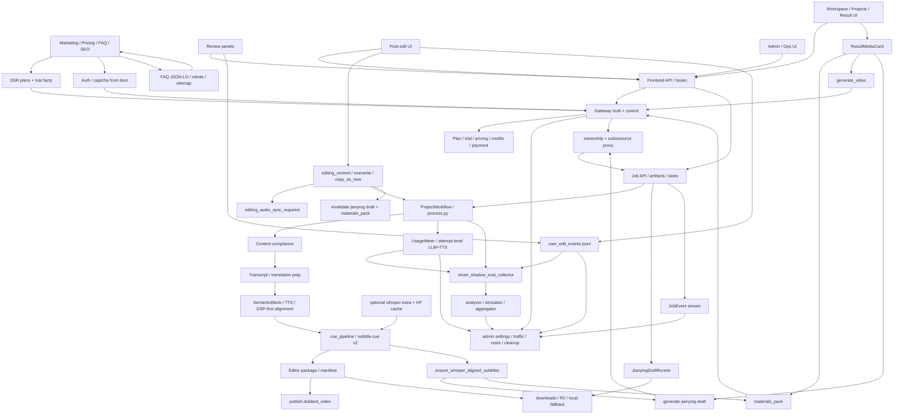

# GitNexus 项目图谱

新会话建议先读本文件，再按任务进入对应子图。
生成时间：2026-05-07
生成方式：基于当前仓库 `.gitnexus/` 最新索引与源码核对整理

## 1. 图谱概览

| 指标 | 数值 |
| --- | ---: |
| 文件数 | 1080 |
| 节点数 | 19,481 |
| 关系数 | 47,352 |
| 聚类数 | 838 |
| 流程数 | 300 |
| 索引提交 | `5c88213` |
| 索引状态 | `up-to-date` |

这轮最需要反映的结构变化有六条：

- `smart_shadow_eval` 与 `smart_shadow_sim` 已从临时脚本长成正式离线评估平面，collector / analyzer / simulator / aggregator 会共同消费项目工件、`UsageMeter`、`user_edit_events.jsonl`
- post-edit commit 现在存在真实的 text/audio sync hard gate；`editing_commit.py` 会对未重生成 TTS 的文本编辑直接抛 `editing_audio_sync_required`
- `effective_marker.marked_event_ids` 已成为行为 sidecar 的核心 join 键，负责表达“哪些用户意图最终存活到提交结果”
- `JianyingDraftRunner` fingerprint 现在显式纳入 `display_name`；改名不再复用旧 zip
- admin 成本面已经扩成 `LLM / TTS / voice_clone / margin` 读侧，不再只是 credits observability
- whisper 运行能力现在要同时满足“部署层 capability”与“运行时 policy”；`INSTALL_WHISPER + HF_HOME` 与 `enabled / trigger / skip_cache / model` 成为两层控制

## 2. 关键基座

| 基座 | 当前主轴 | 代表文件 |
| --- | --- | --- |
| Workflow | `SemanticBlock -> TTS -> DSP-first alignment -> cue_pipeline -> editor outputs` | `src/pipeline/process.py`、`src/modules/output/output_dispatcher.py` |
| Subtitles | `SRT window` timing、deliverable-time whisper sidecar、sync guard | `src/modules/subtitles/cue_pipeline.py`、`src/services/subtitles/ensure_whisper_alignment.py` |
| Jianying | on-demand draft runner、rename-aware fingerprint、substeps、orphan rescue | `src/services/jobs/jianying_draft_runner.py`、`src/modules/output/jianying/jianying_draft_writer.py` |
| Editing | `overwrite / copy_as_new`、audio-sync hard gate、deliverable invalidation | `src/services/jobs/editing_commit.py`、`src/services/jobs/copy_service.py` |
| Delivery | `materials_pack`、`generate_video`、download keys、R2 / local fallback | `gateway/background_task_executors.py`、`src/services/jobs/api.py`、`src/services/web_ui/output_entries.py` |
| Gateway | ownership、auth/captcha、plan truth、admin settings、traffic analytics、cost management | `gateway/job_intercept.py`、`gateway/main.py`、`gateway/admin_settings.py`、`gateway/cost_management.py` |
| Metering & Audit | `UsageMeter`、`JobEvent`、`user_edit_events.jsonl` 三条 sidecar | `src/services/usage_meter.py`、`src/services/jobs/user_edit_audit.py` |
| Offline Evaluation | `smart_shadow_eval`、`smart_shadow_sim`、aggregate reports、P2 readiness | `scripts/smart_shadow_eval_collector.py`、`scripts/smart_shadow_sim_aggregator.py` |
| Whisper Deployment | optional extra、Docker build arg、persistent HF cache | `pyproject.toml`、`Dockerfile`、`docker-compose.yml` |

## 3. 子图入口

- 图谱索引：`docs/graphs/README.md`
- 工作流内核图：`docs/graphs/GITNEXUS_WORKFLOW_CORE_GRAPH.md`
- 剪映草稿交付图：`docs/graphs/GITNEXUS_JIANYING_DRAFT_DELIVERY_GRAPH.md`
- 审核流图：`docs/graphs/GITNEXUS_REVIEW_GRAPH.md`
- 编辑 / 后处理图：`docs/graphs/GITNEXUS_EDITING_POST_EDIT_GRAPH.md`
- 存储与交付图：`docs/graphs/GITNEXUS_STORAGE_DELIVERY_R2_GRAPH.md`
- 商业化图：`docs/graphs/GITNEXUS_COMMERCIALIZATION_GRAPH.md`
- Admin / Ops / Calibration 图：`docs/graphs/GITNEXUS_ADMIN_OPS_CALIBRATION_GRAPH.md`
- Benchmark / Quality / Cost 图：`docs/graphs/GITNEXUS_BENCHMARK_QUALITY_COST_GRAPH.md`

## 4. 仓库结构图

## 5. 核心证据链

### 5.1 `smart_shadow_eval / sim` 已经是正式离线评估平面

- `scripts/smart_shadow_eval_collector.py` 是 stdlib-only read-only scanner，会扫描 `projects_root`、`jobs_root`，收集 `project_state`、`review_state`、`editor_segments`、`subtitle_cues`、`usage_events.jsonl`、`user_edit_events.jsonl`
- `scripts/smart_shadow_eval_analyzer.py` 会基于 `facts.jsonl` 与 pricing snapshot 生成 `report.md`，其中 whisper coverage 明确以 `subtitle_cues.json::cues[].source` 为准
- `scripts/smart_shadow_sim_simulator.py` 会对 `eligibility_gate`、`voice_sample_selection`、`translation_review_auto_approval`、`subtitle_sync_policy` 等阶段做离线决策
- `scripts/smart_shadow_sim_aggregator.py` 会汇总 stage diff、retry estimation、P2 readiness、user edit observations

结论：这条链路已经不是临时脚本集合，而是稳定的质量 / 成本 / 行为分析面。

### 5.2 post-edit commit 现在真的存在 text/audio sync hard gate

- `src/services/jobs/editing_commit.py` 新增 `EditingAudioSyncRequiredError`
- 同文件会在 `_find_text_edits_without_tts(project_dir)` 命中时抛出 `editing_audio_sync_required`
- promoted draft wav 仍会把 `tts_input_cn_text` 重打成当前 `cn_text`

结论：系统现在不仅能看出 drift，还会阻止“文本改了但音频没重做”的提交越过 commit 边界。

### 5.3 `effective_marker.marked_event_ids` 已成为行为归因主键

- `src/services/jobs/user_edit_audit.py` 仍然采用 append-only JSONL，`effective` 通过追加 `effective_marker` 表示
- `src/services/jobs/service.py` 在 post-edit commit 成功后会计算 `compute_post_edit_marked_event_ids(...)`，把最终存活的 prior intent event ids 写进 marker
- 最近修复已经围绕 “collector two-pass reads marked_event_ids from effective_marker events” 与 “survivor logic” 展开

结论：离线分析现在可以精确回答“哪些用户意图真的进入了最终交付结果”。

### 5.4 Jianying draft 的 cache 语义已经感知项目命名

- `src/services/jobs/jianying_draft_runner.py` fingerprint schema 已升级到 `4`
- fingerprint payload 现在包含 `display_name`
- `gateway/job_intercept.py` 还会把 rename 镜像回 Job-API JSON store，保证 zip basename 与 downstream filename derivation 读到的是同一个名字

结论：项目改名后旧 draft zip 不会被错误复用，交付文件名与显示名也更一致。

### 5.5 admin 成本面已经扩成 `voice_clone` 与毛利读侧

- `gateway/cost_management.py` 的 `DEFAULT_PRICE_CATALOG` 新增 `minimax:voice_clone`，`rmb_per_clone = 9.9`
- 同文件 dataclass 已包含 `VoiceCloneRow`
- `frontend-next/src/app/(app)/admin/costs/page.tsx` 现在展示 `voice_clone_cost_rmb`、`server_overhead_cost_rmb`、`margin_cost_rmb`、`gross_margin_pct`

结论：admin 成本控制面不再只是 credits ledger，而是开始直接承载 job-level 成本与毛利视图。

### 5.6 whisper 运行能力已经分成部署 capability 与 runtime policy 两层

- `pyproject.toml` 把 `faster-whisper` 放进 `.[whisper]` optional dependency
- `Dockerfile` 新增 `ARG INSTALL_WHISPER=0`，并在开启时安装 `.[whisper]`
- `docker-compose.yml` 会把 `${AIVIDEOTRANS_ROOT}/data/model_cache` 挂到 `/opt/aivideotrans/model_cache`，并设置 `HF_HOME`
- `gateway/admin_settings.py` 仍负责 `enabled / trigger / skip_cache / model`

结论：能不能跑 whisper，已经不只是管理员开关，而是“部署能力 + 管理策略”共同决定。

## 6. 按任务选图

- 要看 whisper 对齐到底在哪一层发生、主路是否改变，读 `GITNEXUS_WORKFLOW_CORE_GRAPH.md`
- 要看 `display_name`、`skip_cache`、fingerprint、orphan rescue、`user_draft_root`，读 `GITNEXUS_JIANYING_DRAFT_DELIVERY_GRAPH.md`
- 要看 `editing_audio_sync_required`、`tts_input_cn_text` commit stamp、`marked_event_ids`、overwrite / copy_as_new，读 `GITNEXUS_EDITING_POST_EDIT_GRAPH.md`
- 要看 `materials_pack` 预对齐、下载白名单、cleanup，读 `GITNEXUS_STORAGE_DELIVERY_R2_GRAPH.md`
- 要看 auth/captcha 前门、FAQ/SEO、套餐真源，读 `GITNEXUS_COMMERCIALIZATION_GRAPH.md`
- 要看 whisper capability、traffic analytics、voice clone 成本、cleanup，读 `GITNEXUS_ADMIN_OPS_CALIBRATION_GRAPH.md`
- 要看 `smart_shadow_eval / sim`、attempt-level metering、行为审计与 P2 readiness，读 `GITNEXUS_BENCHMARK_QUALITY_COST_GRAPH.md`
